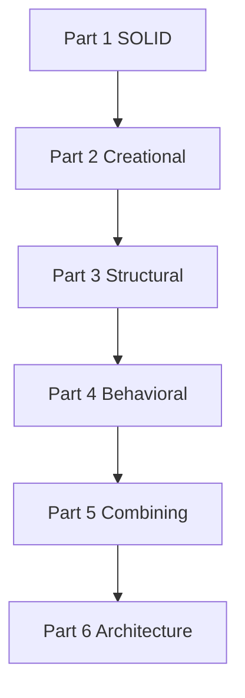

# Design Patterns & SOLID in Practice

This ebook teaches **SOLID principles** and **GoF design patterns** through real code from seven open-source projects — not toy examples, but production architecture you can study, extend, and ship.

## Who This Book Is For

- Developers who know pattern names but struggle to apply them in real systems
- C# and C++ engineers building libraries, engines, and application frameworks
- Anyone maintaining or extending the projects referenced in this book

## Prerequisites

- Comfortable reading C# and C++ (examples use both)
- Basic OOP: interfaces, inheritance, polymorphism, dependency injection
- Familiarity with at least one of the reference projects helps, but is not required

## Reference Projects

Every chapter draws examples from these repositories (local paths under `~/Desktop/Kwan/Source/Projects`):

| Project | Language | Role in This Book |
|---------|----------|-------------------|
| **[MDWeb](https://github.com/hoihky/MDWeb)** | C# | Static site generator — pipeline, Composite, Builder, Strategy |
| **[Spark](https://github.com/hoihky/spark)** | C++ | Game engine — Abstract Factory, State, Facade, Memento |
| **[SkyUI](https://github.com/hoihky/skyui)** | C# | Avalonia UI toolkit — Visitor, Composite, Adapter |
| **[RainDB](https://github.com/hoihky/RainDB)** | C# | Columnar query engine — SRP compile/execute, Prototype |
| **[ImgKit](https://github.com/hoihky/imgkit)** | C# | Image processing API — Command, Strategy, Template Method |
| **[LightMediator](https://github.com/hoihky/lightmediator)** | C# | In-process mediator — Mediator, Command, Chain of Responsibility |
| **[LightMapper](https://github.com/hoihky/lightmapper)** | C# | Source-generated object mapper — DIP, Facade, Adapter |

## Six Parts

| Part | Chapters | Topics |
|------|----------|--------|
| **Part 1 — SOLID Principles** | 7 | SRP, OCP, LSP, ISP, DIP, pitfalls, project survey |
| **Part 2 — Creational Patterns** | 6 | Singleton, Factory Method, Abstract Factory, Builder, Prototype |
| **Part 3 — Structural Patterns** | 8 | Adapter, Bridge, Composite, Decorator, Facade, Flyweight, Proxy |
| **Part 4 — Behavioral Patterns** | 11 | Chain, Command, Iterator, Mediator, Memento, Observer, State, Strategy, Template Method, Visitor |
| **Part 5 — Combining Patterns** | 7 | MDWeb pipeline, Spark layering, ImgKit stack, SkyUI filter editor, RainDB engine, cross-library integration |
| **Part 6 — Application Architecture** | 10 | MVVM, Clean Architecture, CQRS, and how they combine in real projects |

## Learning Path

### Part 1 — SOLID Principles

1. [Introduction to SOLID](part01-solid/01-introduction.md)
2. [Single Responsibility Principle](part01-solid/02-single-responsibility.md)
3. [Open/Closed Principle](part01-solid/03-open-closed.md)
4. [Liskov Substitution Principle](part01-solid/04-liskov-substitution.md)
5. [Interface Segregation Principle](part01-solid/05-interface-segregation.md)
6. [Dependency Inversion Principle](part01-solid/06-dependency-inversion.md)
7. [SOLID in Practice — Pitfalls and Project Survey](part01-solid/07-solid-in-practice.md)

### Part 2 — Creational Patterns

1. [Introduction to Creational Patterns](part02-creational/01-introduction.md)
2. [Singleton](part02-creational/02-singleton.md)
3. [Factory Method](part02-creational/03-factory-method.md)
4. [Abstract Factory](part02-creational/04-abstract-factory.md)
5. [Builder](part02-creational/05-builder.md)
6. [Prototype](part02-creational/06-prototype.md)

### Part 3 — Structural Patterns

1. [Introduction to Structural Patterns](part03-structural/01-introduction.md)
2. [Adapter](part03-structural/02-adapter.md)
3. [Bridge](part03-structural/03-bridge.md)
4. [Composite](part03-structural/04-composite.md)
5. [Decorator](part03-structural/05-decorator.md)
6. [Facade](part03-structural/06-facade.md)
7. [Flyweight](part03-structural/07-flyweight.md)
8. [Proxy](part03-structural/08-proxy.md)

### Part 4 — Behavioral Patterns

1. [Introduction to Behavioral Patterns](part04-behavioral/01-introduction.md)
2. [Chain of Responsibility](part04-behavioral/02-chain-of-responsibility.md)
3. [Command](part04-behavioral/03-command.md)
4. [Iterator](part04-behavioral/04-iterator.md)
5. [Mediator](part04-behavioral/05-mediator.md)
6. [Memento](part04-behavioral/06-memento.md)
7. [Observer](part04-behavioral/07-observer.md)
8. [State](part04-behavioral/08-state.md)
9. [Strategy](part04-behavioral/09-strategy.md)
10. [Template Method](part04-behavioral/10-template-method.md)
11. [Visitor](part04-behavioral/11-visitor.md)

### Part 5 — Combining Patterns in Real Systems

1. [Introduction to Pattern Composition](part05-combining/01-introduction.md)
2. [MDWeb — Pipeline Architecture](part05-combining/02-mdweb-pipeline.md)
3. [Spark — Game Engine Layering](part05-combining/03-spark-engine.md)
4. [ImgKit — Full-Stack CQRS](part05-combining/04-imgkit-stack.md)
5. [SkyUI — Filter Editor (Composite + Visitor)](part05-combining/05-skyui-filter-editor.md)
6. [RainDB — Query Engine Composition](part05-combining/06-raindb-engine.md)
7. [Choosing Patterns for Real Problems](part05-combining/07-choosing-patterns.md)

### Part 6 — Application Architecture

1. [Introduction to Application Architecture](part06-architecture/01-introduction.md)
2. [MVVM Fundamentals](part06-architecture/02-mvvm-fundamentals.md)
3. [MVVM in SkyUI](part06-architecture/03-mvvm-skyui.md)
4. [MVVM at Application Scale — Spark Studio](part06-architecture/04-mvvm-spark-studio.md)
5. [Clean Architecture Fundamentals](part06-architecture/05-clean-architecture.md)
6. [Clean Architecture in Practice](part06-architecture/06-clean-architecture-projects.md)
7. [CQRS Fundamentals](part06-architecture/07-cqrs-fundamentals.md)
8. [CQRS with LightMediator and ImgKit](part06-architecture/08-cqrs-practice.md)
9. [Storage-Layer CQRS in RainDB](part06-architecture/09-cqrs-raindb.md)
10. [Combining MVVM, Clean Architecture, and CQRS](part06-architecture/10-combining-architecture.md)

## Building This Book

This book is written in Markdown and rendered with **MDWeb** (one of the reference projects). See [README.md](README.md) for build commands.
