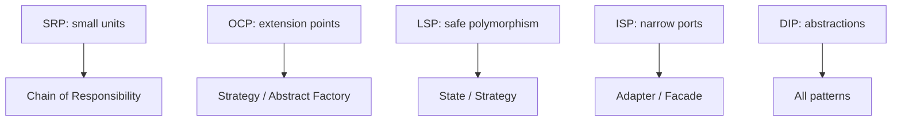

# SOLID in Practice — Pitfalls and Project Survey

This chapter consolidates how SOLID appears across all seven reference projects and lists common mistakes when applying the principles in production code. It ties together the individual principle chapters with cross-project patterns, concrete walkthroughs, and failure modes you can recognize in code review.

## Cross-Project SOLID Map

| Project | S | O | L | I | D |
|---------|---|---|---|---|---|
| MDWeb | Pipeline steps | `IHtmlPostProcessor` | Renderer substitutability | Per-step narrow deps | Core ↔ Infrastructure |
| RainDB | Compile/execute split | Physical plan operators | Result type hierarchy | Table/buffer interfaces | `IExecutionContext` |
| Spark | Editor panels, subsystems | Snapshot handlers, bake strategies | Physics shapes | UI control interfaces | `IEngineContext`, `IUiBackend` |
| LightMediator | Per-handler | Middleware chain | Publisher substitutability | Small handler interfaces | `IMediator` + DI |
| LightMapper | Generator vs runtime | New map pairs via codegen | Mapper contract | `ILightMapper<T,T>` | Generated DI registration |
| ImgKit | Handler per command | Filter/enhance/ops strategies | Strategy substitutability | Separate factories | Handlers → abstractions |
| SkyUI | Validator per rule | `CompositeSkyValidator` | Validator substitutability | `ISkyValidator` | MVVM + services |

The table is a map, not a scorecard. No project "implements all five perfectly" — each optimizes for its domain. MDWeb prioritizes pipeline SRP and DIP; Spark prioritizes ISP for UI and LSP for physics; LightMapper pushes OCP through codegen.

## Project Deep Dives

### MDWeb — SOLID as a static site pipeline

**Architecture:** `MDWeb.Core` (abstractions + models) ← `MDWeb.Application` (pipeline, building) ← `MDWeb.Infrastructure` (Markdig, Scriban, Puppeteer, filesystem).

**Problem → Solution → Walkthrough (full generation):**

1. **Problem:** Static site generation spans content I/O, rendering, templating, and export — one class would be unmaintainable.
2. **Solution:** Chain of Responsibility via `IGenerationStep`; DIP via Core abstractions; OCP via `IHtmlPostProcessor`.
3. **Walkthrough:**
   - CLI builds `SiteContext` from theme directory and content path.
   - `SiteGenerationPipeline` runs steps in DI order: read → normalize links → render → rewrite links → post-process → load theme → generate pages → copy assets → export PDF.
   - Each step mutates `SiteContext`; none imports Infrastructure types from Application layer.
   - Composition root selects `IMarkdownRenderer` and registers all `IHtmlPostProcessor` implementations.

**What would break without SOLID?** Watch-mode rebuilds would re-run Puppeteer on every markdown typo. WeChat experiments would fork the entire generator. PDF export bugs would block markdown rendering merges.

**Key files to study:** `MDWeb.Application/Pipeline/SiteGenerationPipeline.cs`, `MDWeb.Infrastructure/DependencyInjection.cs`, `WeChatHtmlPostProcessor.cs`.

---

### RainDB — SOLID as a query engine

**Architecture:** `RainDB.Abstractions` ← `RainDB.Sql` + `RainDB.Linq` (compilers) ← `RainDB.Query` (executor, engines) ← `RainDB.Core` (columnar, catalog, persistence).

**SRP boundary:** `ISqlCompiler` ends at `IPhysicalPlan`; `IQueryExecutor` begins there. Parsing never allocates scan buffers; execution never tokenizes SQL.

**ISP boundary:** `ITableSource` for metadata; `IColumnarTableSource` for scans. `IBufferPool` vs `IAlignedBufferPool` for spill vs SIMD.

**DIP boundary:** `IExecutionContext` bundles catalog, pools, spill writer — operators receive context, never `new RainDbFileDatabase()`.

**Problem → Solution → Walkthrough (SQL query):**

1. Client: `engine.ExecuteAsync("SELECT id, name FROM users WHERE age > 18")`.
2. `DefaultSqlCompiler` parses, binds tables, emits `VectorizedScanPhysicalPlan`.
3. `DefaultQueryExecutor` matches plan type, resolves `IColumnarTableSource`, calls `VectorizedScanEngine`.
4. Engine reads batches via `SelectionEvaluator`, returns `IColumnarQueryResult`.
5. Client disposes result; buffers return to pools via context.

**What would break without SOLID?** Vectorized kernel tuning would require SQL parser changes. Tests could not inject plans directly. Metadata APIs would drag in columnar batch types.

**Key files:** `RainDB.Abstractions/Execution/IQueryExecutor.cs`, `RainDB.Query/Execution/DefaultQueryExecutor.cs`, `RainDB.Abstractions/Catalog/ITableSource.cs`.

---

### Spark — SOLID in a C++ game engine

**SRP:** `IEditorPanel` per dock region; physics subsystems separate from rendering subsystems; scene serialization split across handler files.

**OCP:** `IComponentSnapshotHandler` + registry — new ECS components extend serialization without editing `SceneSerializer`. Collider bake strategies follow the same pattern in `ColliderBakeStrategies2D.cpp`.

**LSP:** `IShape2D` — every shape implements full collision contract. `NarrowPhase2D` never handles "unsupported shape."

**ISP:** `IUiButton`, `ISlider`, `ILabel` segregate widget APIs; layout code uses `IUiElement` base only.

**DIP:** `IEngineContext` facade for demos; `IUiBackend` for toolkit; games never include Vulkan/GLFW headers.

**Problem → Solution → Walkthrough (scene save):**

1. Editor triggers scene save on active `GameWorld`.
2. `SceneSerializer` iterates entities and components.
3. For each component, `ComponentSnapshotRegistry` finds handler by `ComponentKind`.
4. Handler `TryCapture` writes `ComponentRecord` with kind tag and payload fields.
5. Document written to disk; load reverses via `TryRestore` with `SceneApplyContext` for asset resolution.

**What would break without SOLID?** New tilemap components would edit a monolithic serializer. Physics demos would link Vulkan. UI demos would recompile when unrelated widget APIs change.

**Key files:** `include/spark/scene/serialization/IComponentSnapshotHandler.hpp`, `include/spark/physics/shapes/IShape2D.hpp`, `include/spark/engine/IEngineContext.hpp`.

---

### LightMediator — SOLID as request/notification dispatch

**SRP:** One class per `IRequestHandler<TRequest,TResponse>` — `CreateOrderHandler`, `GetOrderSummaryHandler`, each handles one command.

**OCP:** `IRequestMiddleware<TRequest,TResponse>` chain wraps handlers without editing handler bodies. New middleware = new class + DI registration.

**LSP:** `SequentialNotificationPublisher` vs `ParallelNotificationPublisher` — swappable fan-out semantics.

**DIP:** `Mediator` depends on `IServiceProvider` and `INotificationPublisher`, not concrete handlers. Handlers registered by assembly scanning.

**Problem → Solution → Walkthrough (command):**

1. API controller sends `CreateOrder` command via `IMediator.SendAsync`.
2. `Mediator` resolves `IRequestHandler<CreateOrder, OrderId>` from DI.
3. Middleware pipeline wraps handler (validation, logging, transactions).
4. Handler executes, returns response.
5. Optional: `PublishAsync(OrderCreated)` notifies subscribers via configured publisher.

**What would break without SOLID?** Cross-cutting concerns would duplicate in every handler. Parallel vs sequential notification would require `if` in `Mediator`. Handlers would `new` repository implementations.

**Key files:** `LightMediator/Mediator.cs`, `INotificationPublisher.cs`, sample handlers in `LightMediator.Samples.Application/Handlers.cs`.

---

### LightMapper — SOLID via source generation

**SRP:** Runtime library (`ILightMapper`, attributes) separate from compile-time generator (`LightMapperIncrementalGenerator`, emitters).

**OCP:** New `[LightMapFrom]` pair generates new mapper + DI line — runtime infrastructure unchanged.

**DIP:** Handlers inject `ILightMapper<TSource,TDestination>`; generator emits `AddLightMapperMappers()` for composition root.

**Problem → Solution → Walkthrough:**

1. Developer annotates source type with mapping attribute pointing to destination DTO.
2. Generator collects declarations, emits mapper class with property assignments.
3. `DependencyInjectionEmitter` adds singleton registration for the interface pair.
4. Application calls `services.AddLightMapperMappers()` at startup.
5. Handler receives mapper via constructor, calls `Map` or `MapTo`.

**What would break without SOLID?** Mapping changes would edit generated and hand-written code in the same files. Tests would reference concrete mapper types. Adding a DTO pair would require manual DI wiring.

**Key files:** `LightMapper/ILightMapper.cs`, `LightMapper.SourceGenerators/DependencyInjectionEmitter.cs`.

---

### ImgKit — SOLID as image processing API

**SRP:** Separate handlers per command (`ResizeImageHandler`, `ApplyFilterHandler`, …). Shared base `ImageProcessingHandlerBase` handles temp file lifecycle — one cohesive helper, not a god handler.

**OCP:** Three strategy families (filter, enhancement, ops) with factory registries. New blur variant = new strategy class.

**ISP:** Handlers inject only the factory they need — filter handler never sees ops factory.

**DIP:** Handlers depend on `ITempImageFileStore`, `IPillowNetProcessingGate`, strategy factories — not PillowNet static APIs directly in controllers.

**Problem → Solution → Walkthrough (filter request):**

1. `ImagesController` accepts multipart form with filter name and parameters.
2. Maps to `ApplyFilterCommand`, sends via LightMediator.
3. `ApplyFilterHandler` validates, loads image through processing gate.
4. `IImageFilterStrategyFactory.GetStrategy(name)` resolves implementation.
5. Strategy applies PillowNet filter; handler saves temp output, returns result contract.

**What would break without SOLID?** Controllers would call PillowNet directly — untestable, no gate for concurrency limits. New filters would edit controller switch statements.

**Key files:** `ImgKit.Application/Processing/ImageProcessingStrategies.cs`, `ImgKit.Application/Handlers/ImageHandlers.cs`.

---

### SkyUI — SOLID in Avalonia form controls

**SRP:** One validator class per rule (`RequiredValidator` via factory, `EmailValidator`, …).

**OCP:** `CompositeSkyValidator` adds rules by composition — new validator type, append to composite, no edit to existing validators.

**ISP:** `ISkyValidator` single method — form fields never depend on a validation service with unrelated rule methods.

**LSP:** Any `ISkyValidator` returns consistent `SkyValidationResult` — composite, delegate-backed, or concrete validators substitute cleanly.

**Problem → Solution → Walkthrough (form field validation):**

1. ViewModel defines `CompositeSkyValidator` with `Required()` + `Email()`.
2. `SkyFormField` binds to input control and validator.
3. On value change or focus loss, field calls `validator.Validate(value)`.
4. First failure sets error message on field; success clears error.
5. Form submit checks all fields — each uses its own composed validator.

**What would break without SOLID?** New validation rules would edit `SkyFormField` internals. Fields would couple to email regex logic when they only need required check.

**Key files:** `SkyUI/Controls/Forms/Validation/ISkyValidator.cs`, `CompositeSkyValidator.cs`, `SkyValidators.cs`.

---

## Pitfall 1: SOLID as Dogma

Applying every principle to every class produces:

- 200-interface solutions for 200-line programs
- Abstract factories with one product family
- "Repository" wrappers over `List<T>`

**Guidance:** refactor toward SOLID when you feel **pain** — duplicate conditionals, untestable god classes, merge conflicts on hot files.

**Concrete signal in the reference projects:** MDWeb did not start with nine pipeline steps — the pipeline grew as publish modes and export features accumulated. ImgKit's three strategy factories appeared when filter/enhancement/ops counts made a single switch unmaintainable. Premature abstraction in LightMapper would mean generating mappers for one DTO pair — the generator pays off at scale.

## Pitfall 2: Confusing DI Lifetime with Singleton Pattern

```csharp
services.AddSingleton<IMarkdownRenderer, MarkdigMarkdownRenderer>();
```

This is **one instance per container** for performance — not the GoF Singleton pattern (Part 2). The difference:

| DI Singleton | GoF Singleton |
|--------------|---------------|
| Scoped to application/container | Global process-wide access |
| Resolved via constructor | `Instance` static property |
| Testable (replace registration) | Hard to mock without seams |

Teach Singleton from Spark's static subsystems or RainDB's `NoOpSpillWriter.Instance` — explicit single-instance types with documented test purpose — not from `AddSingleton`.

**What would break if confused?** Developers avoid `AddSingleton` thinking it is an anti-pattern, then create static globals that are harder to test than container-managed singletons.

## Pitfall 3: LSP Ignored in "Read-Only" Implementations

Implementing full `IList<T>` but throwing on mutators breaks substitutability. Prefer `IReadOnlyList<T>` at API boundaries.

RainDB's interface layering (`ITableSource` vs `IColumnarTableSource`) avoids this by not forcing columnar concepts on metadata-only clients. SkyUI's `ISkyValidator` has one method — no throw-on-unused-method problem.

**What would break?** Callers pass read-only list to code that calls `.Add()`, expecting `IList` contract to hold. Runtime `NotSupportedException` in production.

## Pitfall 4: ISP Fragmentation

Splitting `IUserService` into `IUserReader`, `IUserWriter`, `IUserDeleter`, `IUserSearcher` when every handler needs all four creates injection fatigue.

**Rule:** segregate when **different modules** need **different subsets**. If one service class implements everything and every client uses everything, keep one interface.

ImgKit segregates because **filter handlers genuinely never call ops factories**. RainDB segregates because **catalog metadata clients genuinely never read batches**. Fragmentation without distinct client roles adds registration noise only.

## Pitfall 5: DIP Without a Composition Root

Scattering `new MarkdigMarkdownRenderer()` inside steps defeats inversion even if an interface exists somewhere. **All** concretion choice belongs in `Program.cs` / `DependencyInjection.cs` / `RainDbEngine.CreateDefault()`.

**Smell:** Application project references Infrastructure. **Fix:** Move `new` to composition root; Application references Core abstractions only.

**MDWeb enforces this:** `MDWeb.Application` has zero Markdig usings. `MDWeb.Infrastructure/DependencyInjection.cs` owns all concrete bindings including publish-mode renderer selection.

## Pitfall 6: OCP Without SRP

Adding new strategy classes to a god class that still owns unrelated logic does not achieve OCP in practice. The class remains a change magnet; you merely moved one switch into a factory while leaving other switches inline.

**Fix SRP first:** extract the variation axis into its own class, then apply OCP to that axis. MDWeb's `PostProcessHtmlStep` is small *and* delegates variation to `IHtmlPostProcessor` — both principles apply.

## How SOLID Enables Patterns in Later Parts



| Principle | Pattern enabled | Project example |
|-----------|----------------|-----------------|
| SRP | Chain of Responsibility | MDWeb `IGenerationStep` pipeline |
| OCP | Strategy | ImgKit filter strategies, MDWeb post-processors |
| OCP | Abstract Factory | Spark `IUiControlsFactory` |
| LSP | Strategy (safe swap) | Spark `IShape2D`, LightMediator publishers |
| ISP | Adapter | Spark segregated UI controls |
| ISP | Composite | SkyUI `CompositeSkyValidator` |
| DIP | All patterns | Every project's Core/Abstractions layer |

Patterns are not alternatives to SOLID — they are **implementations** of SOLID constraints in recurring situations.

## Code Review SOLID Pass

For any PR, five quick questions:

1. **S:** Can I name two unrelated reasons this class might change?
2. **O:** Am I editing a switch that should be a new type?
3. **L:** Would a fake implementation break caller assumptions?
4. **I:** Does this interface force unused methods on implementers?
5. **D:** Does this class `new` a concrete infrastructure type?

Expand with walkthrough when any answer is "yes":

- **S yes:** Identify the two change axes; propose split boundary.
- **O yes:** Name the variation axis; sketch interface + registration.
- **L yes:** Document contract gap or narrow interface.
- **I yes:** List client roles; propose segregation.
- **D yes:** Move instantiation to composition root.

## Suggested Reading Order with Patterns

| After SOLID chapter | Read pattern chapter | Connect via |
|--------------------|----------------------|-------------|
| OCP | Strategy, Abstract Factory | ImgKit strategies, Spark UI factory |
| SRP + DIP | Chain of Responsibility, Facade | MDWeb pipeline, Spark `IEngineContext` |
| ISP | Adapter, Composite | Spark UI controls, SkyUI validators |
| LSP | State, Strategy | Spark shapes, LightMediator publishers |
| All | Part 5 — Combining Patterns | Cross-project composition |

## Part 1 Summary

SOLID is the **grammar** of maintainable OOP. The seven projects use it consistently:

- **Abstractions in core**, implementations at the edge
- **Extension via new types**, not edited conditionals
- **Narrow interfaces** aligned with client roles
- **Substitutable** implementations for testing and deployment variants

Each principle addresses a different failure mode: SRP prevents change magnets; OCP prevents regression cascades; LSP prevents polymorphism lies; ISP prevents mock bloat; DIP prevents framework lock-in. Together they make the design patterns in later parts worth learning — because the abstractions those patterns use are already shaped correctly.

Part 2 begins **creational patterns** — how objects are born, and how SOLID shapes factories and builders.

## Next

[Part 2: Introduction to Creational Patterns →](../part02-creational/01-introduction.md)
