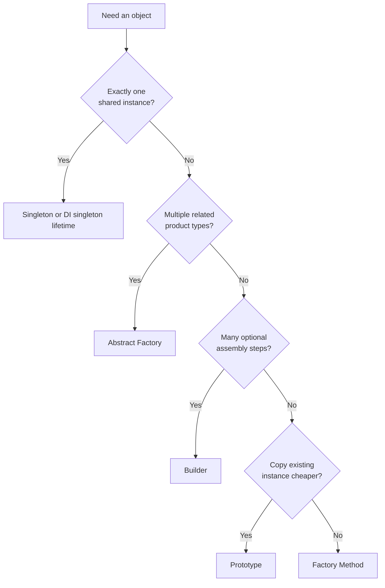

# Introduction to Creational Patterns

Every program eventually asks: **how do I make this object?** That question sounds trivial until construction becomes the hard part — when a type has dozens of optional parameters, when the concrete class depends on a platform or backend, when you need exactly one coordinator for a subsystem, or when copying an existing configuration is safer than rebuilding it from scratch.

Creational patterns address **object creation** — how instances are constructed, configured, and wired so that client code stays decoupled from concrete types. They do not replace good design elsewhere; they concentrate creation logic in predictable places so the rest of the codebase can depend on abstractions.

## The Core Problem Creational Patterns Solve

Without deliberate creation boundaries, applications accumulate scattered `new` calls. Each call site must know:

- Which concrete class to instantiate
- Which constructor overload applies
- Which optional dependencies are valid together
- Whether the object should be shared, cloned, or rebuilt

That coupling makes change expensive. Swapping Spark's native UI for Dear ImGui would require editing every panel if buttons and panels were constructed independently at each call site. Building a documentation site would require a 12-parameter constructor if PDF export, footer HTML, and link-fix flags were all required up front.

Creational patterns answer: **who decides the type, who assembles the parts, and who owns the lifetime?**

## The Five GoF Creational Patterns

| Pattern | Intent | Key question | What gets decoupled |
|---------|--------|--------------|---------------------|
| **Singleton** | One shared instance | Who owns the global access point? | *Existence* — ensuring a single coordinator |
| **Factory Method** | Subclass or module decides which product to create | Which type should I construct? | *Concrete product type* — callers depend on interfaces |
| **Abstract Factory** | Create families of related products | Which *family* of objects? | *Product families* — related objects stay consistent |
| **Builder** | Step-by-step construction of complex objects | How do I assemble many optional parts? | *Construction steps* — assembly vs. use |
| **Prototype** | Clone existing instances | Can I copy instead of rebuild? | *Construction cost* — duplication vs. re-derivation |

Each pattern trades a small amount of indirection for flexibility at the point where change actually happens: object birth.

## Creational Patterns and SOLID

Creational patterns are not separate from SOLID — they are how SOLID shows up at construction time.

### Dependency Inversion (DIP)

Factories return interfaces (`IShape2D`, `IUiButton`, `ISpillWriter`), not concretions. Callers in Spark's physics pipeline depend on `IShape2D`; they never include `BoxShape2D.hpp`. RainDB's hash-aggregate operators depend on `ISpillWriter`; tests inject the same interface with a no-op implementation.

### Open/Closed (OCP)

New products arrive as new factory types or new factory methods, not edited `new` calls scattered through business logic. Adding a `CreateCapsule()` to `ShapeFactory2D` does not require changing narrow-phase collision code. Adding `DearImguiControlsFactory` does not require rewriting editor panels — only the composition root selects the backend.

### Single Responsibility (SRP)

Builders separate *construction* from *use*. `SiteBuilder` accumulates CLI flags and validates them; `SiteGenerator` consumes an immutable `SiteConfiguration`. The generator never parses command-line arguments; the builder never renders HTML.

### Interface Segregation and Liskov

Less central to creational patterns, but relevant when factories return fat interfaces. Spark's `IUiControlsFactory` exposes one method per control type rather than one mega-factory per control — the family stays cohesive without forcing unrelated creation APIs together.

## How to Read the Pattern Chapters

Each pattern chapter in Part 2 follows a consistent structure:

1. **Intent and structure** — UML-level roles (Creator, Product, ConcreteFactory, Builder, Prototype)
2. **The problem in context** — why `new` alone fails for the example
3. **Class responsibilities** — what each type does and how it relates to neighbors
4. **Object creation flow** — step-by-step from client call to finished instance
5. **Participant mapping** — GoF names mapped to real classes in this corpus
6. **When you see this in the wild** — production signals that the pattern fits
7. **Common mistakes** — anti-patterns and mislabeling traps
8. **Project examples** from MDWeb, Spark, RainDB, SkyUI, ImgKit, LightMapper, LightMediator

## Project Coverage Summary

| Pattern | Best examples in this corpus | Why they are canonical |
|---------|------------------------------|------------------------|
| Singleton | Spark `UiSystem`, RainDB `NoOpSpillWriter` | Process-wide coordinators and null-object services |
| Factory Method | Spark `ShapeFactory2D`, `Mesh::CreateUnitCube` | Interface-returning creators with non-trivial construction |
| Abstract Factory | Spark `IUiControlsFactory` | Backend-scoped families of UI controls |
| Builder | MDWeb `SiteBuilder` | Fluent assembly + validation gate at `Build()` |
| Prototype | RainDB `CompositeJoinKey.DeepClone`, SkyUI `CloneProto` | Independent copies for hash keys and clipboard state |

These examples were chosen because the source code documents the intent (`/// Builder pattern`, `/** Factory Method */`, `/** Abstract Factory */`) or because the structure makes the pattern unmistakable in review.

## Choosing Among Creational Patterns

Use this decision flow when more than one pattern seems applicable:



Patterns compose. Spark's `UiSystem` (Singleton) selects an `IUiBackend`, which exposes an `IUiControlsFactory` (Abstract Factory). RainDB's `RainDbEngine.CreateDefault()` (Factory Method) wires `NoOpSpillWriter.Instance` (Singleton) into the engine graph.

## Anti-Pattern: Service Locator Disguised as Factory

```csharp
var renderer = ServiceLocator.Get<IMarkdownRenderer>(); // hides dependencies
```

A service locator looks like a factory but inverts the dependency direction: the client reaches into a global registry instead of declaring what it needs. That hides dependencies from constructors, breaks testability, and makes call graphs impossible to trace statically.

**Prefer constructor injection.** Factories belong at the composition root (`RainDbEngine.CreateDefault`, MDWeb DI registration, Spark's `Engine.cpp` bootstrap) or behind interfaces the client explicitly depends on (`IDiagramNodePresenterFactory` on `DiagramSurface`).

MDWeb uses DI singleton *lifetime* for services like `IMarkdownRenderer` — that is **not** GoF Singleton. The container owns one instance per scope; access is through constructor parameters, not `Class.Instance`. Teach the distinction explicitly when reviewing code.

## Anti-Pattern: Omnibus `new` in Business Logic

```csharp
// scattered through handlers
var pipeline = new MarkdownPipelineBuilder().UseAdvancedExtensions()...Build();
var shape = new BoxShape2D(ComputeAabb(owner, collider));
```

When construction requires domain knowledge (world-space AABB from a collider, Markdig extension sets per output channel), that knowledge belongs in a factory or builder — not duplicated at every call site.

## When You See This in the Wild

- **Startup / composition root** — `Program.cs`, `Engine.cpp`, `RainDbEngine.CreateDefault()`: where graphs are wired
- **Plugin or backend switches** — UI toolkit selection, markdown renderer selection, spill writer injection
- **Test doubles** — `NoOpSpillWriter.Instance`, fake `IDiagramNodePresenterFactory`, headless `DearImguiControlsFactory`
- **Generated code** — LightMapper emits singleton mappers; the generator *is* the factory
- **Static convenience APIs** — `Mesh::CreateUnitCube()`, `SkyValidators.Email()`: acceptable when construction is stable and returns abstractions

## Common Mistakes

| Mistake | Why it hurts | Better approach |
|---------|--------------|-----------------|
| Labeling every static method a "factory" | Dilutes vocabulary; misses structural intent | Reserve "Factory Method" for interface-returning creators that encapsulate non-trivial construction |
| Calling every fluent API a "Builder" | `NavigationBuilder` may traverse, not assemble | Look for complex product + `Build()` validation gate |
| Using Singleton for convenience | Hidden global state, untestable order dependencies | DI singleton lifetime + explicit injection |
| Mixing product families | Spark button + ImGui panel | Abstract Factory boundary at backend |
| Shallow clone where deep clone is required | Shared mutable arrays in hash tables | RainDB's explicit `DeepClone()` on composite keys |

## Modern Alternatives Worth Knowing

| Approach | When it replaces creational patterns |
|----------|--------------------------------------|
| **DI containers** (`AddSingleton`, `AddTransient`) | Lifetime management without static `Get()` |
| **Source generators** (LightMapper) | Compile-time factory/registry emission |
| **Primary constructors + records** | Simple immutable products after builder assembly |
| **Functional factories** (`Func<T>`) | Deferred creation in DI; not a pattern name, but a mechanism |

These are not replacements for the *ideas* — they are implementations of the same decoupling goals.

## Next

[Singleton →](02-singleton.md)
