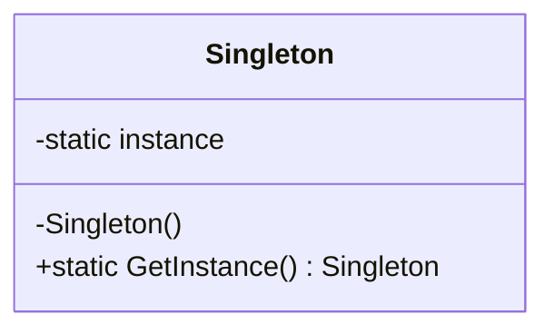

# Singleton

**Intent:** Ensure a class has only one instance and provide a global point of access to it.

The Singleton pattern solves a **coordination problem**: some subsystems must have exactly one owner of shared state or behavior across the process. Without a enforced single instance, you get duplicate registries, conflicting UI routing, or redundant no-op services allocated on every code path.

Singleton is also one of the most misapplied patterns in the industry. Before reaching for it, ask whether you need *one instance* or merely *one instance per application scope* — the latter is usually DI singleton lifetime without static global access.

## Structure



### GoF Participants

| Role | Responsibility |
|------|----------------|
| **Singleton** | Defines `GetInstance()` (or `Instance`), hides constructors, holds the sole instance |

In this corpus, Singleton often combines with other patterns: `NoOpSpillWriter` is also a **Null Object**; theme palettes are **Flyweights** (Part 3).

## When to Use

- Exactly one instance must coordinate a resource (UI root, layer registry, null-object spill writer)
- Lazy initialization is acceptable
- Global access is intentional, documented, and limited to true process-wide concerns
- The instance is stateless or carefully synchronized

## When to Avoid

- Testability suffers when everything reaches for `Instance` or `Get()`
- Distributed systems (multiple processes) need real singletons via external stores, not static fields
- **Prefer DI singleton lifetime** when the "single instance" is per-application, not per-process-global with static access
- The object is just a cache — a scoped service or lazy DI registration may suffice

---

## Example 1: Spark — UiSystem (Meyers Singleton)

### The Problem

Spark supports two retained UI backends: native Spark controls and Dear ImGui wrappers. Game code, editor panels, and demos all need to route input, schedule paint, and obtain the active control factory — but they cannot each construct their own UI root. Two `UiSystem` instances would mean two active backends, duplicated input routing, and inconsistent frame lifecycle hooks.

### Classes and Responsibilities

| Class | Role | Responsibility |
|-------|------|----------------|
| **`UiSystem`** | Singleton | Owns registered backends, tracks active backend, forwards input/paint/engine hooks |
| **`SparkUiBackend`** | Concrete backend | Spark-native input, paint, and `SparkUiControlsFactory` |
| **`DearImguiUiBackend`** | Concrete backend | ImGui input, paint, and `DearImguiControlsFactory` |
| **`IUiBackend`** | Strategy interface | Backend contract: factory access, frame lifecycle |
| **`IImGuiLayer`** | External dependency | Vulkan ImGui layer bound once at engine startup |

**Relationships:** `UiSystem` holds `UniquePtr` to both backends and a pointer to `activeBackend`. Clients call `UiSystem::Get()`; they never construct `UiSystem` directly (private constructor).

### Object Creation Flow

1. First call to `UiSystem::Get()` runs in any thread after C++11 static init rules apply
2. Function-local `static UiSystem instance{}` is zero-initialized once (Meyers singleton)
3. Engine startup (`Engine.cpp`) calls `RegisterSparkNativeBackend()` and `RegisterDearImguiBackend()`
4. `RegisterSparkNativeBackend()` allocates `SparkUiBackend` and sets it active if none is set
5. `SetActiveBackend(UiBackendKind::DearImGui)` swaps `activeBackend` to the ImGui backend
6. Panel code calls `Get().GetActiveBackendPtr()->GetControlsFactory()` — always the same `UiSystem`, possibly different backend

```cpp
UiSystem& UiSystem::Get() noexcept {
    static UiSystem instance{};
    return instance;
}
```

```cpp
class UiSystem {
public:
    static UiSystem& Get();
    void SetActiveBackend(UiBackendKind kind);
    IUiBackend* GetActiveBackendPtr();
    // ProcessInput, Paint, OnEnginePreRender, ...
private:
    UiSystem() = default;
    UniquePtr<SparkUiBackend> sparkNativeBackend;
    UniquePtr<DearImguiUiBackend> dearImguiBackend;
    IUiBackend* activeBackend = nullptr;
};
```

### Participant Mapping

| GoF | Spark class |
|-----|-------------|
| Singleton | `UiSystem` |
| (Related) Strategy | `IUiBackend` / `SparkUiBackend` / `DearImguiUiBackend` |

### When You See This in the Wild

Engine subsystems with a single coordinator: audio device manager, input stack, render device facade. Meyers singleton in C++ is the idiomatic thread-safe lazy form since C++11.

### Common Mistakes

- Calling `Get()` from static initializers of other translation units (initialization order fiasco) — Meyers avoids this by lazy init inside `Get()`
- Storing mutable test state in the singleton without reset hooks — prefer `SetActiveBackend` for backend swaps in tests rather than replacing the whole singleton

---

## Example 2: Spark — RenderLayerRegistry

### The Problem

Drawables must sort by a global layer order (`Background`, `Default`, `UI`, custom script-registered layers). If every `SpriteRenderer` kept its own layer name table, layer IDs would not compare consistently across the scene graph, serialization, and scripting interop.

### Classes and Responsibilities

| Class | Role | Responsibility |
|-------|------|----------------|
| **`RenderLayerRegistry`** | Singleton registry | Registers built-in and custom layers; assigns stable `RenderLayerId` |
| **`RenderLayerId`** | Handle | Index into the registry's layer table |
| **`DrawableSortResolver`** | Client | Reads sort order from `RenderLayerRegistry::Instance()` |

### Object Creation Flow

1. First `RenderLayerRegistry::Instance()` creates the static registry
2. Constructor calls `RegisterBuiltInLayers()` — populates default layer names and sort keys
3. Scripts call `RegisterLayer(name, sortingOrder)` via interop — mutates the same registry
4. Serialization handlers read/write layer names through `Instance()` to preserve stable IDs

### Participant Mapping

| GoF | Spark class |
|-----|-------------|
| Singleton | `RenderLayerRegistry` |
| (Related) Registry | Layer name → `RenderLayerId` map inside the singleton |

### When You See This in the Wild

Global registries: MIME types, shader profile tables, animation state name hashes. One table, one lookup — classic registry singleton.

### Common Mistakes

- Registering layers after drawables already cached IDs — registration must happen at startup or before first use
- Treating the registry as a general-purpose service locator — it owns one concern (render layers)

---

## Example 3: RainDB — NoOpSpillWriter

### The Problem

Hash aggregation and future join operators accept an `ISpillWriter` for overflow-to-disk when partial state exceeds memory thresholds. Most deployments and all unit tests run fully in-memory. Every operator would need `if (spillEnabled)` branches if null were passed, or tests would allocate throwaway writers on every session.

### Classes and Responsibilities

| Class | Role | Responsibility |
|-------|------|----------------|
| **`ISpillWriter`** | Product interface | `IsEnabled`, `SpillChunkAsync` contract |
| **`NoOpSpillWriter`** | Singleton + Null Object | Single shared instance; `IsEnabled == false`; spill calls complete immediately |
| **`RainDbEngine`** | Client / composition root | Defaults `SpillWriter` to `NoOpSpillWriter.Instance` when none injected |
| **`RainDbExecutionContext`** | Session client | Receives the same spill writer from the engine |

### Object Creation Flow

1. `NoOpSpillWriter` static property initializer runs once: `Instance { get; } = new()`
2. Private constructor prevents `new NoOpSpillWriter()` elsewhere
3. `RainDbEngine.CreateDefault()` passes `NoOpSpillWriter.Instance` into the constructor
4. Constructor: `SpillWriter = spillWriter ?? NoOpSpillWriter.Instance`
5. `CreateSession()` builds `RainDbExecutionContext` with that shared reference
6. Operators check `context.SpillWriter.IsEnabled` — false for the singleton — and skip spill branches

```csharp
public sealed class NoOpSpillWriter : ISpillWriter
{
    public static NoOpSpillWriter Instance { get; } = new();
    private NoOpSpillWriter() { }
    public bool IsEnabled => false;
    public ValueTask SpillChunkAsync(...) => ValueTask.CompletedTask;
}
```

### Participant Mapping

| GoF | RainDB class |
|-----|--------------|
| Singleton | `NoOpSpillWriter` |
| Product / Interface | `ISpillWriter` |

### When You See This in the Wild

Null-object singletons: `Stream.Null`, no-op loggers, `CancellationToken.None`-style sentinels. One allocation for the entire process; semantics are "do nothing correctly."

### Common Mistakes

- Making `NoOpSpillWriter` mutable "for tests" — inject a test double implementing `ISpillWriter` instead
- Assuming Singleton implies thread-safe *mutation* — this instance is immutable; safe everywhere

---

## Example 4: LightMapper — Generated Mapper Singletons

### The Problem

LightMapper generates one mapper class per source/destination type pair. Dispatch happens millions of times in hot paths. Allocating a new mapper per `Map()` call would add GC pressure for stateless objects.

### Classes and Responsibilities

| Class | Role | Responsibility |
|-------|------|----------------|
| **`LightMapper__Order__OrderDto`** (generated) | Concrete mapper | Implements `ILightMapper<Order, OrderDto>` |
| **`Instance`** (generated static field) | Singleton access point | Single readonly mapper per pair |
| **`MapperRegistry`** (generated) | Registry / dispatcher | Returns `(ILightMapper<TSource,TDest>)(object)ConcreteMapper.Instance` |
| **`MappingCodeEmitter`** | Generator | Emits singleton field and registry dispatch at compile time |

### Object Creation Flow

1. Roslyn source generator analyzes `[LightMapper]` mappings at compile time
2. Generator emits sealed mapper class with `internal static readonly ... Instance = new();`
3. `MapperRegistry.Get<Order, OrderDto>()` returns the singleton via typeof dispatch
4. DI registration (`AddLightMapperMappers`) registers each mapper as singleton pointing at `Instance`
5. Client calls `mapper.Map(source)` — no per-call allocation

```csharp
internal sealed class LightMapper__Order__OrderDto : ILightMapper<Order, OrderDto>
{
    internal static readonly LightMapper__Order__OrderDto Instance = new();
    // Map / MapTo implementation...
}
```

### Participant Mapping

| GoF | LightMapper artifact |
|-----|---------------------|
| Singleton | Generated `Instance` field on each mapper class |
| Factory (generated) | `MapperRegistry.Get<TSource, TDestination>()` |

### When You See This in the Wild

Source-generated singletons for stateless adapters: serializers, comparers, expression compilers cached per type pair.

### Common Mistakes

- Putting mutable mapping configuration on the singleton mapper — mappers should remain stateless
- Using Singleton here when mapping context varies per call — pass context as method parameters instead

---

## Example 5: SkyUI — Immutable Palette Singletons

### The Problem

Avalonia themes need shared brush and color tokens referenced from hundreds of XAML `{StaticResource}` and code-behind lookups. Allocating a new palette per control would waste memory; mutating a shared palette would cause cross-control bleed.

### Classes and Responsibilities

| Class | Role | Responsibility |
|-------|------|----------------|
| **`SkyDarkColorPalette`** | Singleton flyweight | Immutable color tokens; `Instance` property |
| **`ISkyColorPalette`** | Interface | Palette contract for theme switching |
| **Theme XAML** | Client | References palette resources |

```csharp
public sealed class SkyDarkColorPalette : ISkyColorPalette
{
    public static SkyDarkColorPalette Instance { get; } = new();
    // read-only color properties...
}
```

### Object Creation Flow

1. CLR initializes static properties before first access
2. `Instance` creates one palette object per theme variant (Dark, Light, HighContrast)
3. Controls read brushes from the shared instance — no per-control allocation
4. Theme switch replaces which singleton palette is *selected*, not mutating instances

### Participant Mapping

| GoF | SkyUI class |
|-----|-------------|
| Singleton | `SkyDarkColorPalette.Instance` |
| Flyweight (Part 3) | Shared immutable theme tokens |

---

## Singleton vs DI `AddSingleton`

| Aspect | GoF Singleton | DI Singleton |
|--------|---------------|--------------|
| Access | `Class.Instance` / `Get()` | Constructor injection |
| Lifetime | Process-wide static | Container-scoped |
| Testing | Harder — static hidden dependency | Replace registration in test host |
| Example | `UiSystem::Get()` | MDWeb `AddSingleton<IMarkdownRenderer, ...>()` |

MDWeb uses DI singleton lifetime for services — **not** GoF Singleton. Teach the distinction explicitly in code review.

## Thread Safety

- **Meyers singleton** in C++11+ is thread-safe for initialization
- C# `static readonly` initialized before first access is safe for immutable singletons
- Lazy `double-checked locking` is rarely needed in modern C#/C++
- Mutable singletons require synchronization or confinement to one thread — prefer immutability

## When You See This in the Wild (Summary)

- Process-wide coordinators (UI, audio, input)
- Null-object and no-op services shared by reference
- Immutable flyweight registries (theme tokens, interned strings)
- Generated stateless adapters (LightMapper)

## Common Mistakes (Summary)

| Mistake | Fix |
|---------|-----|
| Singleton for "I only need one in my app" | DI `AddSingleton` + constructor injection |
| Singleton with heavy mutable state | Split coordinator (singleton) from data (scoped services) |
| Testing without reset | Provide seam (`SetActiveBackend`, inject `ISpillWriter`) |
| Eager static initialization order bugs | Meyers / lazy static in C++; avoid cross-TU static init chains |

## Review Checklist

- [ ] Is global access truly required?
- [ ] Is the instance stateless or carefully synchronized?
- [ ] Can tests substitute or reset state?
- [ ] Would DI singleton lifetime suffice without static `Get()`?

## Next

[Factory Method →](03-factory-method.md)
