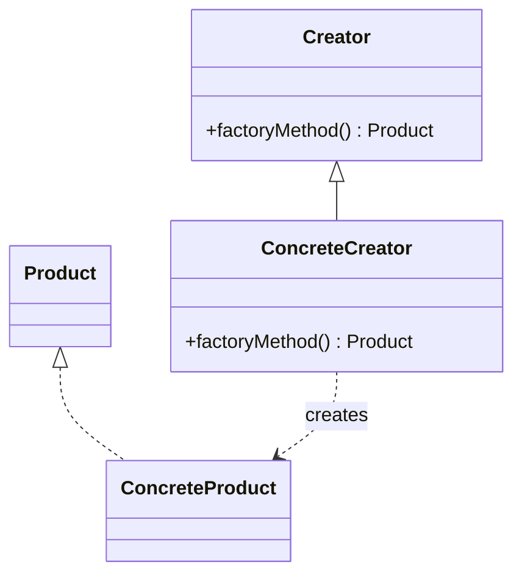

# Factory Method

**Intent:** Define an interface for creating an object, but let subclasses (or dedicated factory types) decide which class to instantiate.

Factory Method solves the **"which concrete type?"** problem. Client code needs a product but should not embed the rules that pick `BoxShape2D` vs `CircleShape2D`, `DiagramNodePresenter` vs a custom presenter, or a full Markdig pipeline vs a WeChat-restricted one. Those rules live in one factory; callers depend on the product interface.

## Structure



### GoF Participants

| Role | Responsibility |
|------|----------------|
| **Product** | Interface or base type the client uses (`IShape2D`, `IDiagramNodePresenter`) |
| **ConcreteProduct** | Class actually constructed (`BoxShape2D`, `DiagramNodePresenter`) |
| **Creator** | Declares the factory method; may provide default implementation |
| **ConcreteCreator** | Overrides factory method to return a specific concrete product |

Modern code often collapses Creator and ConcreteCreator into a single static class (`ShapeFactory2D`) or interface implementation (`DefaultDiagramNodePresenterFactory`).

## Variants in Modern Code

1. **Virtual factory method** — override in subclass (classic GoF)
2. **Static factory method** — `Mesh::CreateUnitCube()` on the product's companion type
3. **Interface factory** — `IDiagramNodePresenterFactory.CreatePresenter()`
4. **Template factory** — `GameObject::AddComponent<T>()` (Spark ECS)
5. **Composition-root factory** — `RainDbEngine.CreateDefault()` wires a full object graph

---

## Example 1: Spark — ShapeFactory2D

### The Problem

Spark's 2D physics narrow phase operates on `IShape2D` — axis-aligned boxes, circles, convex polygons. Shapes are built from many sources: raw AABBs, baked tilemap colliders, ECS `BoxCollider2DComponent` on live `GameObject`s. Each source requires different math (world-space transform, polygon bake). If every callsite did `new BoxShape2D(...)`, collider conversion logic would duplicate across `DynamicCollider2D`, `ColliderBakeStrategies2D`, and tests.

### Classes and Responsibilities

| Class | Role | Responsibility |
|-------|------|----------------|
| **`ShapeFactory2D`** | Creator (static) | Named factory methods; picks concrete shape type |
| **`IShape2D`** | Product | Collision query interface for narrow phase |
| **`BoxShape2D`** | ConcreteProduct | AABB-backed shape |
| **`CircleShape2D`** | ConcreteProduct | Circle with center + radius |
| **`ConvexPolygonShape2D`** | ConcreteProduct | Baked polygon vertices |
| **`BoxCollider2DComponent`** | Input data | ECS component; not a shape — factory reads it |
| **`GameObject`** | Context | Supplies transform for world-space conversion |

**Relationships:** Factory methods return `UniquePtr<IShape2D>` — exclusive ownership transfers to the physics pipeline. Collider components never implement `IShape2D`; the factory bridges ECS and physics.

### Object Creation Flow

**Path A — direct geometry:**

1. Client calls `ShapeFactory2D::CreateBox(aabb)`
2. Factory executes `return UniquePtr<IShape2D>(new BoxShape2D(aabb))`
3. Caller receives abstract pointer; narrow phase calls virtual methods on `IShape2D`

**Path B — from live collider:**

1. Client calls `CreateFromBoxCollider(owner, collider)`
2. Factory calls `ComputeBoxCollider2WorldAabb(owner, collider, aabb)` — domain logic centralized here
3. Factory delegates to `CreateBox(aabb)` → `BoxShape2D`
4. `DynamicCollider2D` stores the `UniquePtr<IShape2D>` on the collider snapshot

**Path C — dispatch from baked static collider:**

1. `CreateFromStaticCollider(collider)` inspects `collider.shape` enum
2. Circle → `CreateCircle(...)`; ConvexPolygon → `CreateConvexPolygon(...)`; else → `CreateBox(...)`

```cpp
/** Factory for ECS-free 2D shapes (Factory Method). */
class ShapeFactory2D {
public:
    static UniquePtr<IShape2D> CreateBox(CollisionAabb2 aabb);
    static UniquePtr<IShape2D> CreateCircle(float centerX, float centerY, float radius);
    static UniquePtr<IShape2D> CreateFromBoxCollider(GameObject& owner, const BoxCollider2DComponent& collider);
    // ...
};
```

### Participant Mapping

| GoF | Spark |
|-----|-------|
| Creator | `ShapeFactory2D` |
| Product | `IShape2D` |
| ConcreteProduct | `BoxShape2D`, `CircleShape2D`, `ConvexPolygonShape2D` |

### When You See This in the Wild

Platform-specific object creation, enum-to-type dispatch, "convert DTO/component to domain model" helpers that return interfaces.

### Common Mistakes

- Returning concrete types from factory methods — defeats the purpose; callers re-couple to `BoxShape2D`
- Putting business logic unrelated to creation in the factory — keep conversion/bake rules; don't add simulation steps

---

## Example 2: Spark — Mesh Static Creators

### The Problem

Demos and the Vulkan renderer need procedural meshes (unit cube, ground plane, sky sphere) with correct vertex layouts, normals, and index topology. Hand-building vertex buffers at every demo duplicates error-prone geometry code.

### Classes and Responsibilities

| Class | Role | Responsibility |
|-------|------|----------------|
| **`Mesh`** | Product + Creator | Holds vertex/index data; static methods build canonical meshes |
| **`CreateUnitCube()`** | Factory method | Emits 24-vertex cube with per-face normals |
| **`CreateGroundPlane()`** | Factory method | Large horizontal quad for shadows/reflections |
| **`CreateSkySphere()`** | Factory method | Inverted sphere for skydome rendering |

### Object Creation Flow

1. Demo calls `Mesh::CreateUnitCube()` during asset initialization
2. Factory method fills `std::vector<Vertex>` and index buffer with known topology
3. Returns `Mesh` by value (move-elided) or stored in `SharedPtr<Mesh>` via `MakeShared`
4. `ComponentSnapshotRegistry` deserializes mesh placeholders by calling the same factory — consistent geometry on load

```cpp
static Mesh CreateUnitCube();
static Mesh CreateGroundPlane(float size);
static Mesh CreateSkySphere(float radius);
```

### Participant Mapping

| GoF | Spark |
|-----|-------|
| Creator | `Mesh` (static methods) |
| Product | `Mesh` |
| ConcreteProduct | Same class — variant selected by method name, not subtype |

This is the **Simple Factory** / static factory method variant: one product class, multiple construction recipes.

### When You See This in the Wild

`File.OpenRead`, `Task.Run`, `TimeSpan.FromMinutes` — named construction methods on the product type.

### Common Mistakes

- One mega-method with enum parameter (`CreateMesh(MeshKind kind)`) when named methods are clearer and type-safe

---

## Example 3: Spark — ImGuiLayerFactory

### The Problem

The engine bootstrap needs an `IImGuiLayer` for Vulkan-backed Dear ImGui, but the concrete class ties to renderer internals. Bootstrap code should call one function, not include backend headers.

### Classes and Responsibilities

| Class | Role | Responsibility |
|-------|------|----------------|
| **`CreateImGuiLayer()`** | Free-function Creator | Returns `UniquePtr<IImGuiLayer>` |
| **`IImGuiLayer`** | Product | ImGui frame interface |
| **Concrete ImGui layer** | ConcreteProduct | Vulkan-specific implementation (hidden) |

### Object Creation Flow

1. `Engine.cpp` calls `CreateImGuiLayer()` during renderer setup
2. Factory allocates concrete layer with backend dependencies
3. `UiSystem::BindImGuiLayer(layer.get())` connects UI system to renderer
4. Engine never references the concrete class name

### When You See This in the Wild

Free-function factories in C++ to avoid exposing implementation types in public headers.

---

## Example 4: SkyUI — DiagramNodePresenterFactory

### The Problem

`DiagramSurface` renders graph nodes. Default nodes use standard chrome; host applications may need custom presenters for domain-specific nodes (ER diagrams, state machines). The surface must not hardcode `new DiagramNodePresenter(...)` for every node added.

### Classes and Responsibilities

| Class | Role | Responsibility |
|-------|------|----------------|
| **`IDiagramNodePresenterFactory`** | Creator interface | `CreatePresenter(host, node)` |
| **`DefaultDiagramNodePresenterFactory`** | ConcreteCreator | Returns standard `DiagramNodePresenter` |
| **`DiagramSurface`** | Client | Holds `NodeFactory` styled property; calls factory when syncing nodes |
| **`DiagramNode`** | Input | Model data driving presenter choice |
| **`Control`** | Product (Avalonia) | Visual root returned to the diagram |

### Object Creation Flow

1. `DiagramSurface` constructor sets `NodeFactory = new DefaultDiagramNodePresenterFactory()`
2. When a node is added to the model, surface calls `NodeFactory.CreatePresenter(this, node)`
3. Factory returns `Control` (presenter) parented into the diagram canvas
4. Tests assign a fake factory via `NodeFactory` property before loading nodes
5. Custom apps subclass or implement `IDiagramNodePresenterFactory` for alternate visuals

```csharp
public interface IDiagramNodePresenterFactory
{
    Control CreatePresenter(DiagramSurface host, DiagramNode node);
}
```

### Participant Mapping

| GoF | SkyUI |
|-----|-------|
| Creator | `IDiagramNodePresenterFactory` |
| ConcreteCreator | `DefaultDiagramNodePresenterFactory` |
| Product | `Control` (presenter implementation) |
| Client | `DiagramSurface` |

### When You See This in the Wild

Pluggable UI cell/item templates, ASP.NET `IControllerActivator`, view-model factories in MVVM frameworks.

### Common Mistakes

- Factory that takes 15 parameters — pass a context object (`DiagramSurface`, `DiagramNode`)
- Creating presenters in the model layer — keep creation at the view boundary

---

## Example 5: SkyUI — SkyValidators Factory Methods

### The Problem

Form fields need validators (`Required`, `Email`, `Range`) composed at declaration time. Callers should depend on `ISkyValidator`, not concrete validator classes, so validation rules stay swappable and composable.

### Classes and Responsibilities

| Class | Role | Responsibility |
|-------|------|----------------|
| **`SkyValidators`** | Creator (static) | Named factory methods per rule type |
| **`ISkyValidator`** | Product | `Validate(value)` contract |
| **`RequiredValidator`, `EmailValidator`, ...** | ConcreteProduct | Rule implementations |

### Object Creation Flow

1. ViewModel declares: `SkyValidators.Required("Email is required.")`, `SkyValidators.Email()`
2. Each static method allocates concrete validator, returns `ISkyValidator`
3. `SkyFormField` runs validators on value change — depends only on interface
4. `CompositeSkyValidator` combines multiple `ISkyValidator` instances (related composite pattern)

### When You See This in the Wild

`Enum.Parse<T>`, logging `Log.ForContext<T>()`, FluentValidation `RuleFor` builders that return configured validators.

---

## Example 6: MDWeb — MarkdownPipelineFactory

### The Problem

MDWeb renders markdown for two channels: full documentation sites (diagrams, Bootstrap, auto-IDs) and WeChat export (restricted extensions, no diagram support). Embedding pipeline construction inside each renderer duplicates Markdig configuration and risks drift between channels.

### Classes and Responsibilities

| Class | Role | Responsibility |
|-------|------|----------------|
| **`MarkdownPipelineFactory`** | Creator (static) | `CreateSitePipeline()`, `CreateWeChatPipeline()` |
| **`MarkdownPipeline`** | Product (Markdig) | Immutable configured parser/renderer |
| **`MarkdigMarkdownRenderer`** | Client | Holds site pipeline from factory |
| **`WeChatMarkdownRenderer`** | Client | Holds WeChat pipeline from factory |

### Object Creation Flow

1. Renderer field initializer: `MarkdownPipelineFactory.CreateSitePipeline()`
2. Factory builds `MarkdownPipelineBuilder`, enables extensions per channel, calls `.Build()`
3. Renderer passes pipeline to Markdig on each `Render()` call
4. Adding a channel = new factory method — renderers unchanged

```csharp
public static MarkdownPipeline CreateSitePipeline() =>
    new MarkdownPipelineBuilder()
        .UseAdvancedExtensions()
        .UseDiagrams()
        .UseAutoIdentifiers(AutoIdentifierOptions.GitHub)
        // ...
        .Build();
```

### Participant Mapping

| GoF | MDWeb |
|-----|-------|
| Creator | `MarkdownPipelineFactory` |
| Product | `MarkdownPipeline` |

This is a **Simple Factory** (two products, one creator class) — not Abstract Factory, because products are not a family of related controls.

---

## Example 7: RainDB — RainDbEngine.CreateDefault

### The Problem

Opening RainDB requires wiring catalog, buffer pools, SQL/LINQ compilers, executor, and spill writer into a coherent engine. Application code should call one entry point, not construct eight collaborators in the correct order.

### Classes and Responsibilities

| Class | Role | Responsibility |
|-------|------|----------------|
| **`RainDbEngine.CreateDefault()`** | Factory method | Builds default in-memory engine graph |
| **`RainDbEngine.OpenPersistent()`** | Factory method | Same graph + file-backed catalog |
| **`RainDbEngine`** | Product (facade) | Hosts catalog, pools, compilers, executor |
| **`HybridBufferPool`** | Collaborator | Created inside factory |
| **`NoOpSpillWriter.Instance`** | Collaborator | Injected by default |

### Object Creation Flow

1. Client calls `RainDbEngine.CreateDefault()` or `OpenPersistent(path)`
2. Factory allocates `HybridBufferPool`, `DefaultQueryExecutor`, compilers
3. Factory passes `NoOpSpillWriter.Instance` as spill writer
4. Returns fully wired `RainDbEngine`
5. Client calls `ExecuteSqlAsync` — never touched individual collaborators' constructors

```csharp
public static RainDbEngine CreateDefault(ICatalog catalog)
{
    var buffers = new HybridBufferPool();
    var executor = new DefaultQueryExecutor();
    var sql = new DefaultSqlCompiler();
    var linq = new DefaultLinqCompiler();
    return new RainDbEngine(catalog, buffers, buffers, executor, sql, linq, NoOpSpillWriter.Instance);
}
```

### When You See This in the Wild

`DbContext` options builders, `Host.CreateDefaultBuilder`, SDK `Client.Create()` methods.

---

## Example 8: LightMediator — CreateSendInvoker

### The Problem

MediatR-style dispatch must invoke `Send<TRequest,TResponse>` for arbitrary request/response type pairs discovered at runtime from handler registration. A generic open delegate cannot be invoked without closing generic type parameters first.

### Classes and Responsibilities

| Class | Role | Responsibility |
|-------|------|----------------|
| **`Mediator`** | Client + cache | `ConcurrentDictionary` keyed by (Request, Response) types |
| **`CreateSendInvoker`** | Factory method | Builds closed generic method via reflection |
| **`SendInvoker`** | Product | Typed delegate wrapper for dispatch |

### Object Creation Flow

1. First `Send` for a `(RequestType, ResponseType)` pair hits cache miss
2. `CreateSendInvoker(requestType, responseType)` calls `MakeGenericMethod` on open `SendCore`
3. Returns `new SendInvoker(closedMethod)` stored in dictionary
4. Subsequent sends reuse cached invoker — factory runs once per type pair

### When You See This in the Wild

Reflection-based serializers, ORM materializers, expression-tree compilers — runtime type closure with caching.

---

## Factory Method vs Simple `new`

Use a factory when:

- Construction is non-trivial or platform-specific
- Return type should be an interface
- Creation point may vary (DI, tests, backends)
- Enum or schema drives concrete type selection

Use `new` when:

- Type is concrete, stable, and construction is one line with no domain rules

## When You See This in the Wild (Summary)

- Static `Create*` methods returning interfaces
- Interface factories injected into clients (`IDiagramNodePresenterFactory`)
- Composition-root `CreateDefault()` wiring object graphs
- Cached reflection factories (LightMediator)

## Common Mistakes (Summary)

| Mistake | Fix |
|---------|-----|
| God factory with 50 methods | Split by domain (`ShapeFactory2D` vs `ShapeFactory3D`) |
| Factory returning `void` side effects | Factory creates; client uses product |
| Confusing Simple Factory with Abstract Factory | One product vs coordinated family |
| No interface on product | Callers re-couple to concretes |

## Next

[Abstract Factory →](04-abstract-factory.md)
