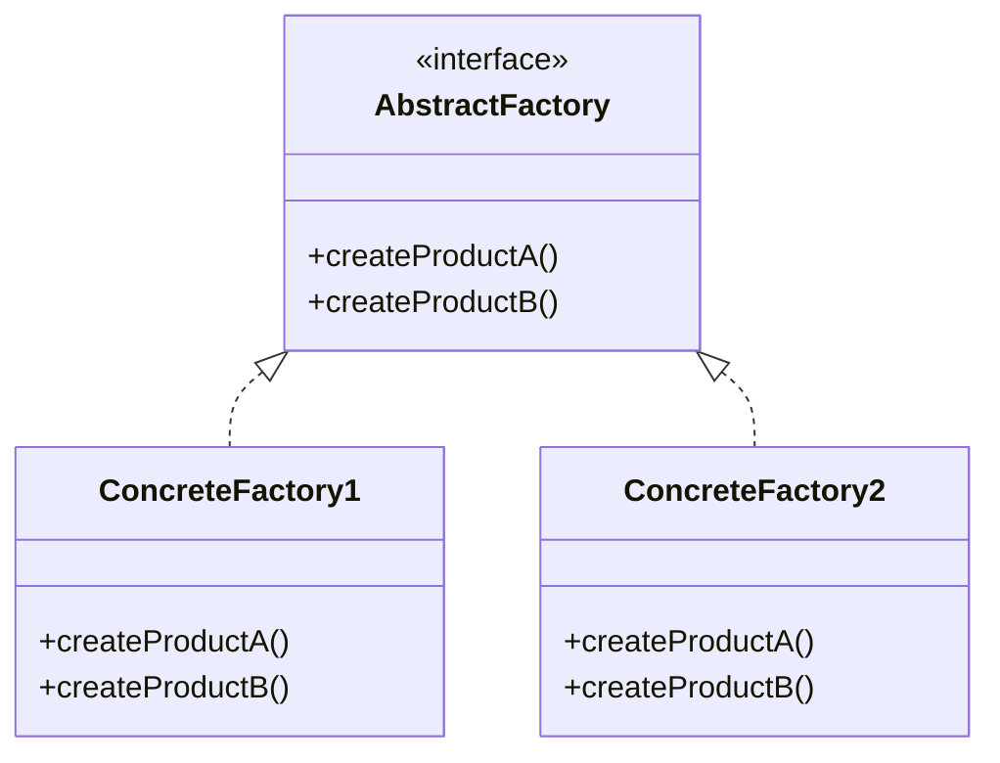
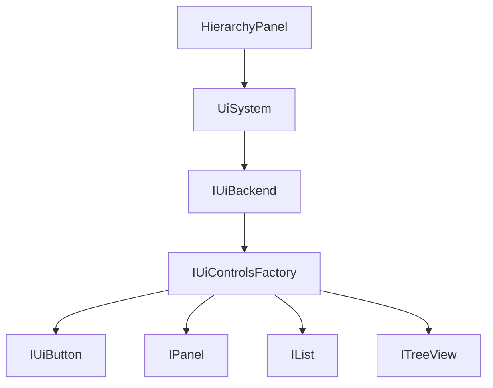

# Abstract Factory

**Intent:** Provide an interface for creating **families** of related or dependent objects without specifying their concrete classes.

Abstract Factory solves the **consistency problem** across related products. A UI panel, its buttons, and its list view must share layout assumptions, styling hooks, and input behavior. Creating each control through an independent factory method would allow accidental mixing — Spark buttons inside ImGui panel wrappers — that breaks rendering and hit-testing.

The key distinction from Factory Method: **multiple product types** that must stay consistent within a family.

## Structure



### GoF Participants

| Role | Responsibility |
|------|----------------|
| **AbstractFactory** | Declares creation methods for each product in the family |
| **ConcreteFactory** | Implements all creation methods for one family |
| **AbstractProduct** | Interface for each product kind (`IUiButton`, `IPanel`) |
| **ConcreteProduct** | Family-specific implementation (`SparkButton`, `ImGuiButton`) |
| **Client** | Uses only AbstractFactory + AbstractProduct interfaces |

---

## Example 1: Spark — IUiControlsFactory (Canonical)

### The Problem

Spark ships two retained UI stacks: **Spark native** (themed HUD, editor chrome) and **Dear ImGui retained** (docking tools, rapid internal panels). Editor panels build trees of buttons, sliders, panels, lists, tree views, and dock workspaces. Each control type has a Spark implementation and an ImGui-wrapped implementation.

If `HierarchyPanel` called `new SparkButton(...)` directly, switching to ImGui would require rewriting every panel. If buttons and panels were created from unrelated factories, a developer could mix backends — Spark layout metrics with ImGui input routing — producing subtle bugs.

### Classes and Responsibilities

| Class | Role | Responsibility |
|-------|------|----------------|
| **`IUiControlsFactory`** | AbstractFactory | One `Create*` method per control type; pure virtual |
| **`SparkUiControlsFactory`** | ConcreteFactory | Returns `SparkButton`, `SparkPanel`, `SparkList`, … |
| **`DearImguiControlsFactory`** | ConcreteFactory | Returns ImGui-wrapped equivalents |
| **`IUiButton`, `IPanel`, `IList`, …** | AbstractProduct | Control interfaces in `IUiControls.hpp` |
| **`SparkButton`, `ImGuiButton`, …** | ConcreteProduct | Backend-specific implementations |
| **`IUiBackend`** | Family context | Exposes `GetControlsFactory()` for the active stack |
| **`SparkUiBackend` / `DearImguiUiBackend`** | ConcreteFactory owner | Holds the matching factory instance |
| **`UiSystem`** | Client coordinator | Selects active backend; panels reach factory through it |
| **`*Desc` structs** | Creation parameters | `ButtonDesc`, `PanelDesc` — backend-neutral configuration |

**Relationships:**



Each `IUiBackend` owns exactly one `IUiControlsFactory`. The family boundary matches the **backend** boundary.

### Object Creation Flow

1. Engine startup registers backends on `UiSystem::Get()`
2. `SetActiveBackend(UiBackendKind::SparkNative)` sets `activeBackend` to `SparkUiBackend`
3. `HierarchyPanel` obtains factory:
   `UiSystem::Get().GetActiveBackendPtr()->GetControlsFactory()`
4. Panel builds UI:
   ```cpp
   auto& factory = /* step 3 */;
   auto panel = factory.CreatePanel({ .title = "Hierarchy" });
   auto tree = factory.CreateTreeView({ .rootLabel = "Scene" });
   panel->AddChild(tree.get());
   ```
5. `SparkUiControlsFactory::CreateTreeView` returns `UniquePtr<ITreeView>` owning `SparkTreeView`
6. User switches backend via `UiToolkitSettings` → `SetActiveBackend(DearImGui)`
7. Same panel code runs; step 3 now returns `DearImguiControlsFactory`; step 5 creates ImGui wrappers instead

```cpp
/**
 * Abstract Factory: creates families of UI controls for a single backend
 * (Spark native or Dear ImGui).
 */
class IUiControlsFactory {
public:
    virtual UniquePtr<IUiButton> CreateButton(const ButtonDesc& desc) = 0;
    virtual UniquePtr<ISlider> CreateSlider(const SliderDesc& desc) = 0;
    virtual UniquePtr<IPanel> CreatePanel(const PanelDesc& desc) = 0;
    virtual UniquePtr<ILabel> CreateLabel(const LabelDesc& desc) = 0;
    virtual UniquePtr<IList> CreateList(const ListDesc& desc) = 0;
    virtual UniquePtr<ITreeView> CreateTreeView(const TreeViewDesc& desc) = 0;
    // ... full control family
};
```

```cpp
class IUiBackend {
public:
    virtual IUiControlsFactory& GetControlsFactory() noexcept = 0;
    virtual void ProcessInput(...) = 0;
    virtual void Paint(...) = 0;
};
```

### Participant Mapping

| GoF | Spark |
|-----|-------|
| AbstractFactory | `IUiControlsFactory` |
| ConcreteFactory | `SparkUiControlsFactory`, `DearImguiControlsFactory` |
| AbstractProduct | `IUiButton`, `IPanel`, `IList`, … |
| ConcreteProduct | `SparkButton`, ImGui-wrapped controls |
| Client | Editor panels, demos (`HierarchyPanel`, `InspectorPanel`) |

### When You See This in the Wild

- **UI toolkit abstraction** — Qt vs native, Skia vs CPU renderer families
- **Cross-platform SDKs** — iOS vs Android widget sets created from one `PlatformWidgetFactory`
- **Theme systems** — light vs dark control skins that must not mix

### Common Mistakes

- One factory method per control type spread across unrelated classes — use Abstract Factory when products are **used together**
- Passing backend-specific types into `*Desc` structs — descriptors must stay backend-neutral
- Creating some controls via factory and others via raw `ImGui::` — breaks family consistency (Spark docs allow raw ImGui for debug overlays *alongside* retained family, but not mixed within one retained tree)

---

## Why Not Factory Method Per Control?

You *could* have `IButtonFactory`, `IPanelFactory`, etc. Abstract Factory groups them because:

- Spark buttons assume Spark panels for layout metrics and child attachment
- ImGui buttons assume ImGui panel wrappers for scroll and dock behavior
- Mixing Spark buttons with ImGui panels breaks hit-testing and layout
- Backend switch must swap **all** control creators atomically — one `IUiControlsFactory` reference

Factory Method answers "which button type?"; Abstract Factory answers "which **consistent set** of control types?"

---

## Example 2: ImgKit — Strategy Factories (Abstract Factory–like)

### The Problem

ImgKit's processing studio exposes filters, enhancements, and image operations. Each category has multiple strategies (blur, sharpen, grayscale, …). Web request builders must resolve a strategy by user-selected name without knowing every concrete PillowNet wrapper class.

### Classes and Responsibilities

| Class | Role | Responsibility |
|-------|------|----------------|
| **`IImageFilterStrategyFactory`** | AbstractFactory (one product line) | `GetStrategy(filterName)` |
| **`ImageFilterStrategyFactory`** | ConcreteFactory | DI-injected dictionary of strategies |
| **`IImageFilterStrategy`** | AbstractProduct | `Name`, `Apply(image, options)` |
| **Concrete strategies** | ConcreteProduct | `BlurFilterStrategy`, etc. |
| **Parallel factories** | Sibling families | `IImageEnhancementStrategyFactory`, `IImageOpsStrategyFactory` |

Each factory covers **one category** (filters vs enhancements vs ops) — structurally similar to abstract factory families keyed by operation name rather than by platform backend.

### Object Creation Flow

1. ASP.NET DI registers all `IImageFilterStrategy` implementations
2. `ImageFilterStrategyFactory` constructor builds `Dictionary<string, IImageFilterStrategy>` keyed by `Name`
3. API handler receives filter name from multipart request
4. Calls `_filterFactory.GetStrategy("GaussianBlur")`
5. Returns singleton-scoped strategy instance; `Apply` mutates PillowNet image

```csharp
public interface IImageFilterStrategyFactory
{
    IImageFilterStrategy GetStrategy(string filterName);
}
```

### Participant Mapping

| GoF | ImgKit |
|-----|--------|
| AbstractFactory | `IImageFilterStrategyFactory` (per category) |
| ConcreteFactory | `ImageFilterStrategyFactory` |
| AbstractProduct | `IImageFilterStrategy` |

Documented primarily as **Strategy** (Part 4) in ImgKit — the factory shape is how strategies are **selected**, not how they vary at runtime.

### When You See This in the Wild

Plugin registries: `IFilterFactory`, codec factories, payment provider factories where each provider supplies a coherent set of services (authorize, capture, refund).

### Common Mistakes

- One giant factory returning unrelated types (filters + exporters + mailers) — split families by domain
- Throwing generic `Exception` on unknown name — return typed not-found for API errors

---

## Example 3: LightMapper — MapperRegistry

### The Problem

Applications define dozens of source/destination mapping pairs. Hand-writing an abstract factory class per assembly does not scale. LightMapper generates mappers and a registry at compile time.

### Classes and Responsibilities

| Class | Role | Responsibility |
|-------|------|----------------|
| **`MapperRegistry`** (generated) | AbstractFactory substitute | `Get<TSource, TDestination>()` |
| **`LightMapper__*__*`** (generated) | ConcreteProduct + Singleton | Per-pair mapper |
| **`ILightMapper<TSource,TDest>`** | AbstractProduct | `Map`, `MapTo` |
| **`MappingCodeEmitter`** | Generator | Emits registry + mappers |

### Object Creation Flow

1. Developer annotates types with `[LightMapper]`
2. Generator emits `MapperRegistry` with typeof dispatch table
3. Client calls `MapperRegistry.Get<Order, OrderDto>()`
4. Registry returns existing singleton mapper for that pair
5. No hand-written `OrderMapperFactory : IMapperFactory` required

### When You See This in the Wild

Source generators replacing hand-written abstract factories: DI auto-registration, RPC client stubs, ORM provider factories.

---

## Abstract Factory vs Factory Method

| | Factory Method | Abstract Factory |
|---|----------------|------------------|
| Products | One per creator method | Many related per factory |
| Extension | New creator subclass or new static method | New factory implementation |
| Client knows | One product interface | Whole family via one factory reference |
| Spark example | `ShapeFactory2D::CreateBox` | `IUiControlsFactory::CreateButton` + `CreatePanel` + … |
| Switch cost | Usually local | Swaps entire product line |

## Abstract Factory vs Builder

- **Abstract Factory** creates **related products** immediately — each `Create*` returns a finished control
- **Builder** assembles **one complex product** step by step (`SiteBuilder`, next chapter) — optional parts, validation at end

Do not confuse `MarkdownPipelineFactory` (two independent pipelines — Factory Method / Simple Factory) with `IUiControlsFactory` (coordinated control set).

## Testing

Inject or select `DearImguiControlsFactory` in headless tests; use `SparkUiControlsFactory` in editor builds. Same panel source code, different family:

1. Test host calls `UiSystem::Get().SetActiveBackend(UiBackendKind::DearImGui)`
2. Panel builds tree through factory
3. Assert on `IUiTreeView` behavior without GPU-native Spark chrome

## When You See This in the Wild (Summary)

- Platform or theme backends with multiple widget/control types
- Plugin SDKs returning coherent capability bundles
- Generated registries (LightMapper) replacing handwritten factory hierarchies

## Common Mistakes (Summary)

| Mistake | Fix |
|---------|-----|
| Leaking concrete products from factory | Return `UniquePtr<IUiButton>`, not `SparkButton*` |
| Partial family swap | Swap `IUiBackend`, not individual controls |
| Over-using Abstract Factory for one product | Use Factory Method |
| Fat factory interface violating ISP | Group by real family boundaries (Spark's control set is genuinely co-used) |

## Next

[Builder →](05-builder.md)
