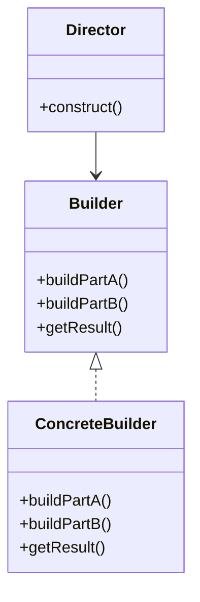

# Builder

**Intent:** Separate the construction of a complex object from its representation so the same construction process can create different representations.

Builder solves the **stepwise assembly problem**. Some objects have many optional parts, validation rules that only make sense when the full picture is known, and defaults that differ per call site. A constructor with fourteen parameters — or a chain of overloaded constructors — pushes configuration errors to runtime scattered across callers. Builder concentrates accumulation in one object and exposes a single validation gate at `Build()`.

## Structure



### GoF Participants

| Role | Responsibility |
|------|----------------|
| **Builder** | Abstract step interface (`WithSource`, `WithTheme`, …) |
| **ConcreteBuilder** | Implements steps; holds mutable accumulation |
| **Product** | Immutable (or effectively immutable) result (`SiteConfiguration`) |
| **Director** | Optional — encodes a fixed build sequence; often omitted in modern code |

Modern usage often **omits Director** — the client chains fluent methods and calls `Build()`. MDWeb's CLI *is* the director: it knows the order of `With*` calls.

---

## Example 1: MDWeb — SiteBuilder (Canonical)

### The Problem

Generating a documentation site requires binding source directory, output path, theme directory, title, description, optional PDF export, footer HTML (inline or from file), and a link-fix flag. These values arrive from CLI flags with different combinations per invocation. Passing them through a single constructor creates **constructor telescoping**:

```csharp
// anti-pattern — which null means "default" vs "absent"?
new SiteConfiguration(source, output, theme, title, desc, pdf: null, fixLinks: true, footer: null, ...);
```

Worse, some fields need cross-field validation: theme directory must exist and load a manifest; footer can come from HTML string *or* file path. That logic should not live in every caller.

### Classes and Responsibilities

| Class | Role | Responsibility |
|-------|------|----------------|
| **`SiteBuilder`** | ConcreteBuilder | Accumulates optional settings; validates; produces `SiteConfiguration` |
| **`ISiteBuilder`** | Builder interface | Fluent return type for chaining |
| **`SiteConfiguration`** | Product | Immutable snapshot consumed by `SiteGenerator` |
| **`IThemeManifestLoader`** | Collaborator | Loads theme manifest during `Build()` — injected dependency |
| **`SiteFooterResolver`** | Collaborator | Resolves footer from HTML and/or file path at build time |
| **`PdfExportOptions`** | Value object | Nested product fragment (enabled, pdfOnly, output path) |

**Relationships:** `SiteBuilder` is created per CLI invocation. It does **not** generate the site — it only produces configuration. `SiteGenerator` depends on `SiteConfiguration`, never on `SiteBuilder`.

### Object Creation Flow

1. CLI parses arguments: `source`, `output`, `theme`, `title`, …
2. CLI constructs `new SiteBuilder(themeManifestLoader)`
3. Fluent chain:
   ```csharp
   var config = new SiteBuilder(themeManifestLoader)
       .WithSource(source)
       .WithOutput(output)
       .WithTheme(theme)
       .WithTitle(title)
       .WithDescription(description)
       .WithPdfExport(pdfPath, pdfOnly: false)
       .Build();
   ```
4. Each `With*` assigns a private field and returns `this` (as `ISiteBuilder`)
5. `Build()` runs validation:
   - Throws if `source`, `output`, or `theme` is whitespace
   - Normalizes paths via `Path.GetFullPath`
   - Calls `themeManifestLoader.Load(themeDirectory)` — I/O happens here, not in `WithTheme`
   - Calls `SiteFooterResolver.Resolve(_footerHtml, _footerFilePath)`
6. Returns `new SiteConfiguration { ... }` with all fields populated
7. `SiteGenerator` receives `config` and runs the pipeline — builder discarded

```csharp
/// <summary>
/// Builder pattern: fluent API for configuring site generation.
/// </summary>
public sealed class SiteBuilder(IThemeManifestLoader themeManifestLoader) : ISiteBuilder
{
    private string _sourceDirectory = string.Empty;
    private string _outputDirectory = string.Empty;
    // ... defaults for title, description, pdf, footer

    public ISiteBuilder WithSource(string sourceDirectory) { ... return this; }
    public ISiteBuilder WithOutput(string outputDirectory) { ... return this; }
    public ISiteBuilder WithTheme(string themeDirectory) { ... return this; }
    // ... other With* methods

    public SiteConfiguration Build()
    {
        if (string.IsNullOrWhiteSpace(_sourceDirectory))
            throw new InvalidOperationException("Source directory is required.");
        // validate output, theme...
        var themeManifest = themeManifestLoader.Load(themeDirectory);
        return new SiteConfiguration { /* immutable result */ };
    }
}
```

### Participant Mapping

| GoF | MDWeb |
|-----|-------|
| Builder | `ISiteBuilder` / `SiteBuilder` |
| Product | `SiteConfiguration` |
| Director | MDWeb CLI (`Program.cs`) — orchestrates call order |
| Collaborators | `IThemeManifestLoader`, `SiteFooterResolver` |

### When You See This in the Wild

- CLI and configuration objects (`HostBuilder`, `DbContextOptionsBuilder`, `UriBuilder`)
- HTTP request builders, query builders, test data builders
- Any "required fields + many optionals + validate at end" scenario

### Common Mistakes

- **`Build()` without validation** — partial configs leak into production
- **Reusing one builder across threads** — builders are mutable; create per operation
- **Builder that also runs the pipeline** — violates SRP; MDWeb correctly stops at `SiteConfiguration`

---

## Builder vs Constructor Telescoping

| Approach | Problem |
|----------|---------|
| Many constructors | Combinatorial explosion; unclear defaults |
| Nullable optional parameters | Ambiguous `null` meaning |
| Property bag + validate later | Partial invalid states exist in the wild |
| **Builder** | Only valid products exit `Build()`; call site reads fluently |

Builder scales when parameters grow and defaults differ per call site. It shines when **validation requires multiple fields together** (footer resolution, theme manifest load).

---

## Example 2: ImgKit — Request Builders

### The Problem

ImgKit's web API accepts multipart form requests where each image operation (resize, crop, filter, …) appends different form fields and metadata. A single mega-method with switches would couple HTTP formatting to every operation's parameter shape.

### Classes and Responsibilities

| Class | Role | Responsibility |
|-------|------|----------------|
| **`ImageOperationRequestBuilderBase`** | Abstract Builder | Defines `Descriptor` and `AppendParameters` contract |
| **`ResizeRequestBuilder`, `CropRequestBuilder`, …** | ConcreteBuilder | One builder per operation type |
| **`IImageOperationRequestBuilder`** | Builder interface | Polymorphic append hook |
| **`ImageOperationDescriptor`** | Metadata | Operation name, route, validation rules |
| **`MultipartFormDataContent`** | Assembly target | HTTP body under construction |
| **Processing studio service** | Client / Director | Selects builder matching user's operation |

### Object Creation Flow

1. User selects "Apply filter" in UI
2. Service resolves `ApplyFilterRequestBuilder` from DI
3. Service creates `MultipartFormDataContent`
4. Calls `builder.AppendParameters(content, request)` — builder adds filter name, radius, image bytes
5. HTTP client posts assembled content
6. Different operation → different builder class; same assembly protocol

```csharp
public abstract class ImageOperationRequestBuilderBase : IImageOperationRequestBuilder
{
    public abstract ImageOperationDescriptor Descriptor { get; }
    public abstract void AppendParameters(MultipartFormDataContent content, ImageOperationRequest request);
}
```

### Participant Mapping

| GoF | ImgKit |
|-----|--------|
| Builder | `IImageOperationRequestBuilder` hierarchy |
| Product | Completed `MultipartFormDataContent` (HTTP payload) |
| Director | Processing studio service |

**Variant:** Builder-like, but **one builder per operation type** rather than one mega-builder for all operations. Still valid — each builder assembles one representation (multipart body) step by step through `AppendParameters`.

### When You See This in the Wild

- Serializer builders (JSON, protobuf)
- SQL query builders with dialect-specific subclasses
- Test object mothers with fluent setup

### Common Mistakes

- Builder that mutates global state while appending parameters
- Missing operation in factory/registry — runtime failure when user selects unsupported op

---

## What Is NOT Builder in This Corpus

Not every fluent API is Builder. Look for **complex product assembly + validation gate at `Build()`**.

| Name | Actual pattern | Why it is not Builder |
|------|----------------|----------------------|
| RainDB `CompositeJoinKeyBuilder` | Static construction helper | Builds a value in one shot; no fluent accumulation or `Build()` gate |
| MDWeb `NavigationBuilder` | Tree traversal / data assembly | Walks content graph; does not produce one immutable config object via steps |
| Markdig `MarkdownPipelineBuilder` | Third-party fluent API | External library; similar shape but not MDWeb's domain builder |

Calling these "Builder" dilutes the pattern name and hides the real intent (key extraction, navigation graph, Markdig config).

---

## Builder and Immutability

The builder holds **mutable** accumulation (`_sourceDirectory`, `_pdfExport`, …). The product after `Build()` should be **immutable** (or treated as such):

- `SiteConfiguration` is a record-like snapshot — generators must not mutate it mid-render
- Sharing the builder between threads is unsafe; sharing `SiteConfiguration` is safe

This separation lets you pass configuration through the pipeline without defensive copying at every layer.

## Thread Safety

Builders are typically **not** thread-safe — one builder per configuration thread. `SiteBuilder` is created per CLI invocation. ImgKit request builders are scoped per HTTP request in ASP.NET Core.

If you need concurrent configuration, either synchronize the builder or give each thread its own builder instance merging into a shared immutable product at the end.

## Builder vs Abstract Factory

| Builder | Abstract Factory |
|---------|------------------|
| One complex product | Many related products |
| Steps are optional parts of same object | Each `Create*` is a finished control |
| Validation at `Build()` | Products valid per factory method |
| MDWeb `SiteBuilder` | Spark `IUiControlsFactory` |

## When You See This in the Wild (Summary)

- CLI/config with required + optional fields
- HTTP/multipart assembly per operation type
- Test data builders with sensible defaults
- `StringBuilder`, `UriBuilder`, EF `ModelBuilder` — built-in library examples

## Common Mistakes (Summary)

| Mistake | Fix |
|---------|-----|
| No `Build()` — mutable product escapes | Always transition to immutable product |
| Builder does I/O on every `With*` | Defer I/O to `Build()` (MDWeb loads theme manifest once at end) |
| `With*` returns void | Return `this` / interface for fluency |
| Director logic in builder | Keep builder generic; CLI/service is director |

## Review Checklist

- [ ] Does `Build()` validate required fields?
- [ ] Can I add optional parameters without breaking existing call sites?
- [ ] Is the built product distinct from the builder (no shared mutable state)?
- [ ] Is the builder free of "run the whole pipeline" responsibilities?

## Next

[Prototype →](06-prototype.md)
