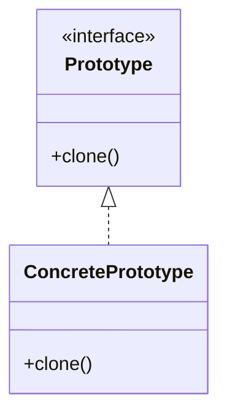

# Prototype

**Intent:** Create new objects by **copying** an existing instance (prototype) rather than constructing from scratch.

Prototype solves the **re-derivation cost problem**. Sometimes building an object from first principles is expensive, error-prone, or requires private knowledge embedded in an existing instance. Copying — shallow or deep — preserves invariants already established. Other times, the runtime needs a duplicate for isolation: hash table keys must not share mutable backing arrays with batch memory that will be reused.

## Structure



### GoF Participants

| Role | Responsibility |
|------|----------------|
| **Prototype** | Declares `Clone()` / `DeepClone()` |
| **ConcretePrototype** | Implements copy logic; may register in a prototype registry |
| **Client** | Asks prototype to clone instead of calling `new` with full constructor args |

Classic Prototype adds a **registry** mapping names to prototype instances. This corpus uses **ad hoc clone methods** instead — same intent, lighter structure.

## When to Use

- Object creation is expensive and copies are cheaper
- Configuration is complex and cloning preserves invariants
- Runtime doesn't know concrete types until execution (registry of prototypes)
- Stored keys or clipboard entries must be **isolated copies** of live data

## When to Avoid

- Types are trivially constructible from public fields
- Deep copy cost exceeds reconstruction
- Copy semantics are ambiguous (shared handles, non-cloneable resources)

## When Cloning Is NOT Prototype

Defensive copies in constructors (`plan.Nodes.ToArray()`) protect internal state — not the Prototype pattern unless cloning is the **primary creation mechanism** for new domain objects.

---

## Example 1: RainDB — CompositeJoinKey.DeepClone

### The Problem

RainDB's hash aggregation and hash join operators group rows by **composite keys** that may include fixed-width numeric parts and UTF-8 string payloads extracted from columnar batches. During parallel aggregation, each worker thread accumulates partial dictionaries. When partials merge into a global dictionary, keys from batch memory cannot be stored by reference — the underlying byte arrays may be reused when the next batch arrives.

Using keys directly from `CompositeJoinKeyBuilder.Build(...)` without copying would mean two dictionary entries share the same `byte[]` backing store; mutating or recycling batch memory corrupts hash lookups silently.

### Classes and Responsibilities

| Class | Role | Responsibility |
|-------|------|----------------|
| **`CompositeJoinKey`** | ConcretePrototype | Holds `NullMask`, `NumericParts`, `Utf8Payloads`; implements `DeepClone()` |
| **`CompositeJoinKeyBuilder`** | Factory (related) | Builds keys from batch rows — **not** prototype; creates fresh keys from column data |
| **`CompositeJoinKeyComparer`** | Client helper | Sorts/compares keys; does not clone |
| **`HashAggregateEngine`** | Client | Merges partial dictionaries; calls `DeepClone()` when inserting into global map |
| **`JoinExecutionEngine`** | Client | Uses keys in build/probe hash tables |

**Relationships:** Keys are built by the builder from live batch data. Only when a key becomes **owned dictionary state** does the engine clone. Equality/hash use the key's parts; clone produces a new key with identical logical value but independent arrays.

### Object Creation Flow

**Building a key (Factory, not Prototype):**

1. Operator scans row `r` in columnar batch
2. `CompositeJoinKeyBuilder.Build(schema, batch, r, keyIndices)` allocates `numeric[]`, `utf8Payloads[]`
3. For UTF-8 columns, `CopyUtf8Payload` copies span from chunk into new `byte[]`
4. Returns new `CompositeJoinKey(mask, numeric, utf8Payloads)`

**Cloning for stable dictionary ownership (Prototype):**

1. `MergePartialsComposite` iterates partial dictionary entries
2. On first sight of a key not in global map:
   ```csharp
   global[kv.Key.DeepClone()] = merged;
   ```
3. `DeepClone()` copies `NumericParts` array and each non-null UTF-8 payload array
4. Global dictionary keys are independent of batch lifetime
5. On key collision, accumulators merge in place — no second clone needed

```csharp
public CompositeJoinKey DeepClone()
{
    var nums = (ulong[])NumericParts.Clone();
    byte[]?[] utf = new byte[Utf8Payloads.Length][];
    for (var i = 0; i < Utf8Payloads.Length; i++)
        utf[i] = Utf8Payloads[i] is { } u ? (byte[])u.Clone() : null;
    return new CompositeJoinKey(NullMask, nums, utf);
}
```

### Participant Mapping

| GoF | RainDB |
|-----|--------|
| ConcretePrototype | `CompositeJoinKey` |
| Client | `HashAggregateEngine.MergePartialsComposite` |
| Clone operation | `DeepClone()` |

Note: `CompositeJoinKeyBuilder` is a **Simple Factory**, not part of Prototype. The pattern boundary is the **`DeepClone()` copy** used as the creation mechanism for stable keys.

### When You See This in the Wild

- Dictionary keys wrapping mutable byte buffers
- Copy-on-write structures in databases and game engines
- Graph node duplication where adjacency lists must not alias

### Common Mistakes

- **Shallow clone** of keys with nested arrays — two dictionary slots share UTF-8 bytes; batch recycle causes corruption
- Cloning on every comparison — clone only when **taking ownership** in long-lived structures
- Confusing builder with prototype — builder creates from columns; prototype copies from existing key

---

## Example 2: SkyUI — VideoTimeline.CloneProto

### The Problem

`VideoTimeline` supports cut/copy/paste on clip items. Copy must place independent clips on the internal clipboard; paste must not mutate originals when the user edits pasted clips. Re-entering clip data manually would duplicate field mapping and miss new properties when the model evolves.

### Classes and Responsibilities

| Class | Role | Responsibility |
|-------|------|----------------|
| **`VideoTimeline`** | Client | Owns tracks, clips, selection, clipboard |
| **`TimelineClipItem`** | ConcretePrototype | Clip model: `TrackId`, `StartTime`, `Duration`, `Label`, `Tag` |
| **`CloneProto`** | Clone method | Static helper producing new clip with copied fields |
| **`_clipboard`** | Storage | List of cloned clips awaiting paste |

**Relationships:** `TimelineClipItem` is a plain model object. `CloneProto` is not on the interface — it's a private static on the control (acceptable for UI-local prototype). New clip gets a new `Id` when pasted (downstream paste logic), not during clone.

### Object Creation Flow

1. User selects clips and triggers copy (`CopyInternal`)
2. For each selected clip id, timeline finds `TimelineClipItem` in `Clips`
3. `_clipboard.Add(CloneProto(c))`
4. `CloneProto` allocates new `TimelineClipItem` with copied scalar fields:
   ```csharp
   private static TimelineClipItem CloneProto(TimelineClipItem c) =>
       new()
       {
           TrackId = c.TrackId,
           StartTime = c.StartTime,
           Duration = c.Duration,
           Label = c.Label,
           Tag = c.Tag,
       };
   ```
5. Cut calls `CopyInternal()` then `DeleteSelectedClips()` — clipboard holds prototypes of removed clips
6. Paste duplicates from clipboard (may offset time/track) without touching originals

### Participant Mapping

| GoF | SkyUI |
|-----|-------|
| ConcretePrototype | `TimelineClipItem` |
| Client | `VideoTimeline` |
| Clone operation | `CloneProto` (private static) |

This is a **shallow prototype** — clips hold value types and strings; no nested mutable collections to deep-copy.

### When You See This in the Wild

- Clipboard in editors (text, timeline, diagram nodes)
- "Duplicate slide/page/layer" in creative tools
- Branching undo snapshots where copy is cheaper than replay

### Common Mistakes

- Shallow copy when `Tag` holds mutable reference types — aliasing if tag objects are shared and mutated
- Cloning UI controls instead of models — clone data (`TimelineClipItem`), rebuild visuals separately

---

## Example 3: LightMapper — Map vs MapTo

### The Problem

High-throughput mapping paths want to avoid allocating a new DTO on every `Map()` call when a buffer already exists in an object pool or on the stack.

### Classes and Responsibilities

| Class | Role | Responsibility |
|-------|------|----------------|
| **`ILightMapper<TSource,TDest>`** | Prototype / Factory hybrid | `Map` creates new; `MapTo` fills existing |
| **Generated mappers** | ConcretePrototype behavior | Copy fields from source into destination instance |

### Object Creation Flow

**Factory-like path:**

1. Client calls `mapper.Map(order)` 
2. Mapper allocates new `OrderDto`, copies fields, returns it

**Prototype-variant path (reuse destination):**

1. Client rents `OrderDto` from pool
2. Calls `mapper.MapTo(order, dto)` — overwrites dto fields in place
3. Client returns dto to pool after use

```csharp
TDestination Map(TSource source);           // creates new destination
void MapTo(TSource source, TDestination destination);  // fills existing
```

`Map` is factory-like; `MapTo` enables **reuse** of pre-allocated destination objects — a performance-oriented prototype variant in hot paths.

### When You See This in the Wild

- Object pools with `CopyTo` / `ParseInto` APIs
- Game engines updating component data in place
- Serialization into pre-sized buffers

---

## Spark — Scene Snapshots (Related, Not Pure Prototype)

### The Problem

Save/load and undo need captured scene state.

### Why It Is Memento, Not Prototype

`SceneSerializer` captures ECS state into `SceneDocument` and `SceneDeserializer` restores it. This is closer to **Memento** (Part 4) — externalized state for undo/save — than runtime `Clone()` on live `GameObject`s. Creation happens through deserialization, not copying an in-memory prototype instance.

Use Prototype when the live instance **is** the template; use Memento when state is **extracted** to an external representation.

---

## Prototype Registry (Not in Corpus)

Classic Prototype adds a registry:

```csharp
prototypes["circle"] = new CirclePrototype();
var shape = prototypes["circle"].Clone();
```

Spark's `ShapeFactory2D` uses **Factory Method** instead — explicit creation from parameters, not clone-from-template. Choose Prototype when:

- Instances vary at runtime and are already configured
- Copying preserves invariants better than reconstructing
- Type set is open-ended (plugin shapes cloned from defaults)

Choose Factory Method when construction rules are static and parameterized.

---

## Deep vs Shallow Clone

| Clone | Behavior | Risk | Corpus example |
|-------|----------|------|----------------|
| Shallow | Copy top-level fields; share nested references | Shared mutable state | `CloneProto` — safe when fields are scalars/strings |
| Deep | Copy nested data recursively | Higher cost; correct isolation | `CompositeJoinKey.DeepClone` — copies all byte arrays |

RainDB's `DeepClone` is explicit about depth — teaching point for aggregate keys with UTF-8 payloads stored as `byte[]`.

### C# and C++ Notes

- **C#:** `ICloneable` is discouraged (returns `object`, no depth contract); prefer typed `DeepClone()` or copy constructors with clear semantics
- **C++:** copy ctor / virtual `Clone()` on polymorphic types; watch **slicing** when copying through base pointer — return `UniquePtr<Base>` from virtual `Clone()`
- **Records:** C# records provide value-based equality but not automatic deep clone for nested mutable collections

## Prototype vs Other Creational Patterns

| Question | Pattern |
|----------|---------|
| Need exactly one shared instance? | Singleton |
| Need which type from parameters? | Factory Method |
| Need consistent family of types? | Abstract Factory |
| Need stepwise assembly + validation? | Builder |
| Need copy of existing configured instance? | **Prototype** |

## When You See This in the Wild (Summary)

- Clipboard and duplicate operations in editors
- Defensive copying of composite keys into long-lived indexes
- `MapTo` / in-place fill for pooled DTOs
- `MemberwiseClone` in frameworks (know whether shallow is safe)

## Common Mistakes (Summary)

| Mistake | Fix |
|---------|-----|
| Shallow clone with mutable nested state | Explicit deep clone (RainDB) |
| Prototype registry without clear clone contract | Document depth; prefer typed methods over `ICloneable` |
| Cloning instead of immutability | Immutable keys need no clone — RainDB keys are mutable arrays requiring copy |
| Labeling defensive ctor copies as Prototype | Reserve for primary creation-by-copy |

## Part 2 Summary

| Pattern | Top example | Core decoupling |
|---------|-------------|-----------------|
| Singleton | `UiSystem::Get()`, `NoOpSpillWriter.Instance` | Single process-wide coordinator |
| Factory Method | `ShapeFactory2D`, `Mesh::CreateUnitCube` | Concrete type selection |
| Abstract Factory | `IUiControlsFactory` + backends | Related product families |
| Builder | `SiteBuilder` | Stepwise assembly + validation |
| Prototype | `CompositeJoinKey.DeepClone`, `CloneProto` | Copy instead of rebuild |

Creational patterns converge on one goal: **keep object birth out of business logic**. The next part applies the same discipline to how objects are composed after they exist.

## Next

[Part 3: Introduction to Structural Patterns →](../part03-structural/01-introduction.md)
