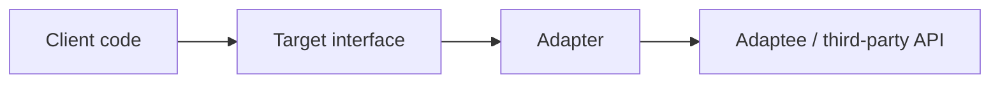

# Adapter

**Intent:** Convert the interface of a class into another interface clients expect. Adapter lets classes work together that couldn't otherwise because of incompatible interfaces.

## The Structural Problem: Interface Mismatch

Libraries, legacy modules, and third-party APIs rarely match the abstractions your application already depends on. Without adaptation, you face bad choices:

- **Fork or patch the library** — high maintenance cost.
- **Leak foreign types into every caller** — `MarkdownPipeline`, `Markdig.Syntax.HeadingBlock`, and native `Game` vtables spread through business logic.
- **Duplicate logic** — every consumer re-implements the same translation.

The Adapter pattern inserts a **translation layer**: one object implements the interface your client knows (`IMarkdownRenderer`, `ICheckedListItemAdapter`) and **delegates** to the foreign API internally. The client never imports the adaptee's types.



## Class Adapter vs Object Adapter

| | Class adapter | Object adapter |
|---|---------------|----------------|
| Mechanism | Multiple inheritance (C++), inherit adaptee + target | Composition: hold adaptee as field |
| Flexibility | Fixed at compile time | Can swap adaptee at runtime |
| C# / modern C++ | Not available (single inheritance) | **Preferred everywhere** |

This book's examples are **object adapters** — a class implements the target interface and wraps the adaptee.

## UML Roles → Project Names

| GoF role | Responsibility | Example in corpus |
|----------|----------------|-------------------|
| **Client** | Depends only on target interface | `CheckedListBox`, `RenderMarkdownStep`, C# game host |
| **Target** | Interface the client expects | `ICheckedListItemAdapter`, `IMarkdownRenderer`, `Game` (native) |
| **Adapter** | Implements Target; translates calls | `DefaultCheckedListItemAdapter`, `MarkdigMarkdownRenderer`, `ManagedGameBridge` |
| **Adaptee** | Existing class with incompatible API | Domain view-models, Markdig, managed script callbacks |

---

## Example 1: SkyUI — ICheckedListItemAdapter (Excellent)

### The mismatch

`CheckedListBox` is a hierarchical checklist control. It must display check state, expand/collapse state, and parent/child relationships for **arbitrary** model objects bound via `ItemsSource`. The control cannot hard-code every domain type (file nodes, permission trees, filter presets).

### Class roles

| Class | Pattern role | What it wraps / contains | Why this design |
|-------|--------------|--------------------------|-----------------|
| **`ICheckedListItemAdapter`** | Target | — | Stable contract: `GetIsChecked`, `SetIsChecked`, `GetIsExpanded`, `GetChildren`, `HasChildren`. `CheckedListBox` depends on this, not on your view-models. |
| **`DefaultCheckedListItemAdapter`** | Adapter | `ICheckedListBoxItem` instances | Default translation for SkyUI's own item interface. Maps `item.IsChecked` ↔ adapter calls. |
| **`CheckedListBox`** | Client | Holds `ItemAdapter` property (defaults to `DefaultCheckedListItemAdapter`) | Renders rows, handles tri-state cascade via `CheckedListCheckCoordinator`; never inspects concrete item types. |
| **Your domain model** | Adaptee (via custom adapter) | e.g. `FileTreeNode`, `FilterPreset` | Stays free of checklist APIs; you supply a custom `ICheckedListItemAdapter` that reads/writes your properties. |

### Step-by-step: client uses the pattern

1. A view-model builds a tree of custom objects (not implementing `ICheckedListBoxItem`).
2. The view creates a **custom adapter** implementing `ICheckedListItemAdapter` — e.g. `GetIsChecked` reads `node.IsSelected`, `GetChildren` returns `node.SubFolders`.
3. The view sets `CheckedListBox.ItemAdapter = myAdapter` and `ItemsSource = rootNodes`.
4. User toggles a checkbox → control calls `adapter.SetIsChecked(item, true)` → adapter updates the domain object.
5. User expands a row → control calls `GetChildren` → adapter returns the domain's child collection → control rebuilds flat `Rows` for virtualization.

The control's source comment states the intent explicitly: *"DIP: CheckedListBox depends on this, not concrete VMs."*

```csharp
public interface ICheckedListItemAdapter
{
    bool? GetIsChecked(object? item);
    void SetIsChecked(object? item, bool? value);
    bool GetIsExpanded(object? item);
    void SetIsExpanded(object? item, bool value);
    IEnumerable<object?> GetChildren(object? item);
    bool HasChildren(object? item);
}
```

`DefaultCheckedListItemAdapter` is the **reference adapter** — it shows the translation pattern for `ICheckedListBoxItem`:

```csharp
public bool? GetIsChecked(object? item) =>
    item is ICheckedListBoxItem i ? i.IsChecked : false;
```

Replace the adapter, not the control, when integrating new model shapes.

---

## Example 2: MDWeb — Markdig to IMarkdownRenderer

### The mismatch

MDWeb's pipeline steps (`RenderMarkdownStep`, navigation builders, PDF export) need **HTML plus heading metadata** from markdown source. Markdig exposes `MarkdownPipeline`, `Markdown.Parse`, `Markdown.ToHtml`, and AST types like `HeadingBlock`. Pipeline code should not reference any of that — publish modes may swap renderers (standard site vs WeChat-specific pipeline).

### Class roles

| Class | Pattern role | What it wraps | Why |
|-------|--------------|---------------|-----|
| **`IMarkdownRenderer`** | Target | `Render(string) → MarkdownRenderResult` | Application-facing contract in `MDWeb.Core.Abstractions`. |
| **`MarkdigMarkdownRenderer`** | Adapter | Private `MarkdownPipeline _pipeline` from `MarkdownPipelineFactory.CreateSitePipeline()` | Encapsulates parse → HTML → post-fixes → heading extraction. |
| **`WeChatMarkdownRenderer`** | Alternate adapter | Different Markdig pipeline tuned for WeChat | Same target interface; swapped via DI. |
| **`RenderMarkdownStep`** | Client | Injects `IMarkdownRenderer`; loops `context.AllPages` | Never imports `Markdig` namespace. |

### Step-by-step: rendering a page

1. `SiteGenerationPipeline` reaches `RenderMarkdownStep`.
2. Step obtains `IMarkdownRenderer` from DI (typically `MarkdigMarkdownRenderer`).
3. For each `MarkdownPage`, step calls `renderer.Render(page.RawMarkdown)`.
4. Inside the adapter: `Markdown.Parse` → `Markdown.ToHtml` → `CodeBlockIndentFixer.Fix` → `ExtractHeadings` from AST.
5. Step assigns `result.Html` and `result.Headings` back onto the page model.

The adapter **hides** slug generation, syntax-highlight pipeline configuration, and Markdig inline traversal. Adding a new markdown engine means a new adapter class, not pipeline surgery.

---

## Example 3: Spark — ManagedGameBridge

### The mismatch

Spark's native engine drives games through the `Game` base class: virtual methods `OnAttach`, `OnUpdate`, `OnRender`, etc. C# scripts cannot inherit from C++ vtables directly. The engine needs a **native `Game` instance** that forwards lifecycle events to **managed function pointers** registered at startup.

### Class roles

| Class | Pattern role | What it wraps | Why |
|-------|--------------|---------------|-----|
| **`Game`** | Target (native interface) | Abstract lifecycle the engine invokes | Engine loop calls `OnUpdate` without knowing about C# |
| **`ManagedGameBridge`** | Adapter | `SparkManagedGameCallbacks callbacks` struct | Implements `Game`; each override forwards to the matching C callback |
| **C# script / host** | Adaptee | Registers callbacks via `SparkHostApi` | Managed code never subclasses C++ `Game` |

```cpp
class ManagedGameBridge final : public Game {
public:
    void SetCallbacks(SparkManagedGameCallbacks callbacks);
    void OnAttach(IEngineContext& context) override;
    void OnUpdate(const FrameTiming& timing, IEngineContext& context) override;
    void OnRender(IRenderFrame& frame, IEngineContext& context) override;
private:
    SparkManagedGameCallbacks callbacks{};
};
```

**Note on naming:** Spark source files sometimes say "bridge" in filenames (`ManagedGameBridge`). That reflects the **cross-language boundary**, not necessarily the GoF Bridge pattern. Here the fix is **retrofit compatibility** (managed API → native `Game`), which is classic **Adapter**. See the Bridge chapter for intentional abstraction/implementation separation (`IUiBackend`).

---

## Example 4: LightMapper — ILightMapper

Generated mapping code adapts DTO property layouts to domain entity shapes:

```csharp
public interface ILightMapper<TSource, TDestination>
{
    TDestination Map(TSource source);
    void MapTo(TSource source, TDestination destination);
}
```

| Role | Type |
|------|------|
| Target | `ILightMapper<TSource, TDestination>` |
| Adapter | Generated mapper class per type pair |
| Adaptee | Reflection / expression-tree copy logic |
| Client | Application services calling `Maps.Map(dto)` |

Thin adapter layer: the "adaptee" is mechanical property copying; the value is a **uniform Map API** over heterogeneous type pairs.

---

## Example 5: SkyUI — ListVirtualGridDataSource

Virtual grids speak `IVirtualGridDataSource`: `RowCount`, `GetRow(long index)`, `StructureChanged`. Application code often already holds an `IList`.

| Class | Role |
|-------|------|
| **`IVirtualGridDataSource`** | Target — grid virtualization protocol |
| **`ListVirtualGridDataSource`** | Adapter — holds `IList _list`, forwards row access |
| **`IList` / `ObservableCollection`** | Adaptee |
| **Virtual grid control** | Client |

Source comment: *"Bridges an in-memory IList to IVirtualGridDataSource."* The adapter also subscribes to `INotifyCollectionChanged` on the list and raises `StructureChanged` so the grid refreshes when rows are added or removed — translation includes **event semantics**, not just method signatures.

---

## Adapter vs Facade vs Bridge

| | Adapter | Facade | Bridge |
|---|---------|--------|--------|
| **Problem** | One incompatible interface | Many classes, one front door | Two dimensions must vary independently |
| **Scope** | Usually one adaptee | Whole subsystem | Parallel hierarchies |
| **Timing** | Retrofit | Often planned | Planned upfront |
| **Example** | `MarkdigMarkdownRenderer` | `SiteGenerator` | `IUiBackend` |

`MarkdigMarkdownRenderer` converts Markdig → `IMarkdownRenderer` (**Adapter**). `SiteGenerator` orchestrates pipeline + output writer without exposing step types (**Facade**). Do not confuse `ManagedGameBridge`'s filename with GoF Bridge.

---

## When to Reach for Adapter

- Integrating third-party libraries without polluting domain layers.
- Wrapping legacy APIs behind interfaces your tests can mock.
- Presenting hierarchical domain models to generic UI controls (`ICheckedListItemAdapter`).
- Cross-language boundaries (native ↔ managed, C++ ↔ C#).

Prefer **object adapter via composition** in C# and C++. Register adapters in DI so clients receive the target interface only.

## Next

[Bridge →](03-bridge.md)
