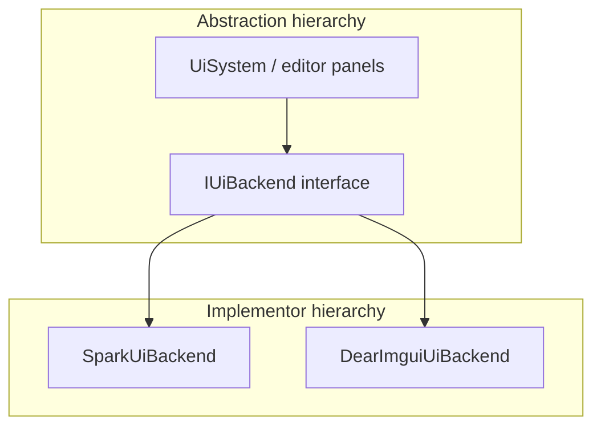

# Bridge

**Intent:** Decouple an abstraction from its implementation so the two can vary independently.

## The Structural Problem: Abstraction Locked to Implementation

When a high-level module directly includes concrete low-level types, every change ripples upward:

- Swap Dear ImGui for a retained widget tree → rewrite every editor panel.
- Change Vulkan recording strategy → touch ImGui integration and the main renderer.
- Test UI logic without GPU → impossible without heavy mocking.

**Bridge** splits the design into two hierarchies:

1. **Abstraction** — what clients program against (UI system, document editor API).
2. **Implementor** — how that API is realized (native widgets vs immediate-mode ImGui).

The abstraction holds a reference to the implementor and **delegates** platform-specific work. Both sides can evolve on separate timelines.



## Adapter vs Bridge

| | Adapter | Bridge |
|---|---------|--------|
| **Purpose** | Fix incompatibility *after* the fact | Plan separation *upfront* |
| **Typical trigger** | "This library doesn't match our interface" | "We know we'll ship multiple backends" |
| **Structure** | One adaptee wrapped by one adapter | Abstraction + implementor **hierarchies** |
| **Example here** | `MarkdigMarkdownRenderer` | `IUiBackend` + `SparkUiBackend` / `DearImguiUiBackend` |

`ManagedGameBridge` in Spark is an **Adapter** (managed callbacks → native `Game`), despite the word "bridge" in its name.

## UML Roles → Spark UI

| GoF role | Spark type | Responsibility |
|----------|------------|----------------|
| **Abstraction** | `UiSystem`, editor code using `IUiControlsFactory` | Frame loop, panel layout, input routing policy |
| **Implementor** | `IUiBackend` | Backend-specific input, paint, factory access |
| **ConcreteImplementor A** | `SparkUiBackend` | Retained-mode native control tree + `SparkUiControlsFactory` |
| **ConcreteImplementor B** | `DearImguiUiBackend` | Immediate-mode ImGui + `DearImguiControlsFactory` |
| **RefinedAbstraction** | (Optional) specialized editors | Could extend UI behavior without new backends |

---

## Example 1: Spark — IUiBackend (Excellent)

### Why Bridge fits

Spark ships two UI stacks:

- **Spark native** — retained widget tree, `SparkUiControlsFactory`, `UiInputRouter`.
- **Dear ImGui** — immediate-mode panels, `DearImguiControlsFactory`, bound to `IImGuiLayer`.

Editor demos and tools should compile against **one** set of panel APIs regardless of which stack is active. That is intentional dual hierarchy design — Bridge, not a one-off wrapper.

### Class roles

| Class | Pattern role | What it contains | Why |
|-------|--------------|------------------|-----|
| **`IUiBackend`** | Implementor interface | Pure virtual: `GetKind`, `GetControlsFactory`, `ProcessInput`, `Paint`, capture flags | Stable seam between UI policy and backend mechanics. Header comment says "Strategy" — both patterns share delegation; **parallel hierarchies** make Bridge the clearer label. |
| **`SparkUiBackend`** | ConcreteImplementor | `SparkUiControlsFactory controlsFactory`, `UiInputRouter inputRouter` | Native retained UI: routes input through `UiInputRouter`, paints via Spark's widget tree. |
| **`DearImguiUiBackend`** | ConcreteImplementor | `DearImguiControlsFactory`, `ImguiUiRenderer`, pointer to `IImGuiLayer*` | Immediate-mode path: `ProcessInput` feeds ImGui; `Paint` records draw lists into scene params. |
| **`UiSystem`** | Abstraction / context | Active `IUiBackend*` (via `SetActiveBackend`) | Client code asks `GetActiveBackend().GetControlsFactory()` — never `#ifdef IMGUI` in every panel. |
| **`IUiControlsFactory`** | Related Abstract Factory | Button, label, panel constructors per backend | Each implementor returns a **matching control family** — Bridge + Factory work together. |

### IUiBackend surface

```cpp
class IUiBackend {
public:
    virtual UiBackendKind GetKind() const noexcept = 0;
    virtual IUiControlsFactory& GetControlsFactory() noexcept = 0;
    virtual void ProcessInput(GameWorld& world, IInput& input, ...) = 0;
    virtual void Paint(const GameWorld& world, SceneRenderParams& params, ...) = 0;
    virtual bool WantsCaptureMouse() const noexcept = 0;
    virtual bool WantsCaptureKeyboard() const noexcept = 0;
};
```

`SparkUiBackend` returns `UiBackendKind::SparkNative`; `DearImguiUiBackend` returns `UiBackendKind::DearImGui`. Kind queries let diagnostics and settings UI show which stack is active without `dynamic_cast`.

### Step-by-step: one frame with Bridge

1. Engine calls `UiSystem::Get().GetActiveBackend()` — returns `SparkUiBackend` or `DearImguiUiBackend`.
2. **Input phase:** engine passes `GameWorld`, `IInput`, framebuffer dimensions to `ProcessInput`.
   - Native backend: `UiInputRouter` hit-tests retained widgets.
   - ImGui backend: translates input into ImGui IO, updates focus/hover.
3. Game simulation runs.
4. **Paint phase:** `Paint(world, sceneRenderParams, ...)` runs.
   - Native backend: walks widget tree into draw commands.
   - ImGui backend: builds ImGui draw lists; renderer consumes them later.
5. Panel code that created buttons via `GetControlsFactory()` never branched on backend — the factory came from the active implementor.

Switching backends at runtime (`SetActiveBackend(UiBackendKind::DearImGui)`) changes implementation **without recompiling** panel sources, as long as they use the shared factory interface.

---

## Example 2: Spark — Rendering / ImGui Integration

A second Bridge appears at the GPU boundary: `IImGuiVulkanBackend` (and `ImGuiVulkanLayer`) keep the Vulkan renderer's core headers free of ImGui types while still recording ImGui draw data each frame.

| Role | Type |
|------|------|
| Abstraction | Main renderer / frame presenter |
| Implementor | `IImGuiVulkanBackend` |
| Concrete implementors | Vulkan-specific ImGui layer implementations |

**Bridge benefit:** the rendering engine and ImGui version/integration can ship on different cadences. Upgrading ImGui should not require rewriting scene graph rendering.

---

## Example 3: SkyUI — ListVirtualGridDataSource (Lightweight Bridge)

`ListVirtualGridDataSource` adapts `IList` to `IVirtualGridDataSource`. It is simpler than Spark's full dual hierarchy — one adapter class, no deep implementor tree — but the **decoupling intent** matches Bridge:

- **Abstraction side:** virtual grid expects row count + random row access + structure change events.
- **Implementor side:** arbitrary in-memory lists, including `ObservableCollection`.

Grid controls depend on `IVirtualGridDataSource`; view-models keep using `IList`. The bridge class is the only place that knows both protocols.

---

## Bridge and Strategy — When Labels Collide

Spark's `IUiBackend` header says "Strategy." Both patterns use **composition and delegation**:

| | Bridge | Strategy |
|---|--------|----------|
| **Emphasis** | Two hierarchies that evolve together | One algorithm slot swapped at runtime |
| **Typical shape** | Abstraction + Implementor interfaces | Context + Strategy interface |
| **Question to ask** | "Do we have *families* on both sides?" | "Is it just one swappable algorithm?" |

For UI: abstraction = "editor UI API + frame integration"; implementor = "native vs ImGui stack" — **Bridge**. For markdown rendering (`IMarkdownRenderer`), a single swappable renderer with no parallel hierarchy — **Strategy**.

---

## SceneSerializer — Facade, Not Bridge

`SceneSerializer` captures ECS worlds into `SceneDocument` text files; `SceneDeserializer` restores them. It **orchestrates** registry lookups, entity iteration, and file I/O — a **Facade** over serialization subsystems (see Facade chapter). It does not separate abstraction from implementor hierarchies; do not classify it as Bridge.

---

## Design Checklist

Use Bridge when:

- You can name **two independent dimensions** that will change (UI API vs rendering backend; document model vs storage format).
- Multiple concrete implementors are **planned**, not accidental.
- Clients should compile against the abstraction indefinitely.

Avoid forcing Bridge when a single Strategy interface (`IMarkdownRenderer`) suffices — extra hierarchy adds noise without flexibility gain.

## Next

[Composite →](04-composite.md)
