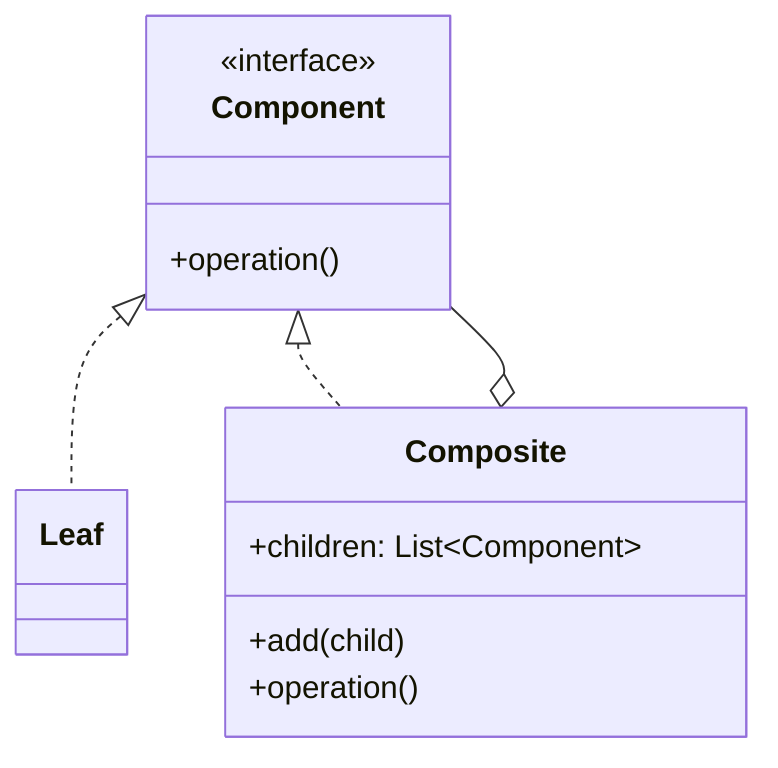

# Composite

**Intent:** Compose objects into tree structures to represent part-whole hierarchies. Clients treat individual objects and compositions uniformly.

## The Structural Problem: Part-Whole Hierarchies

Real domains are often trees:

- A documentation site has folders containing pages and sub-folders.
- A filter editor has AND/OR groups containing conditions and nested groups.
- A form may run several validators as one logical rule.

Without Composite, client code accumulates type switches:

```csharp
if (node is Folder f) { foreach (var c in f.Children) ... }
else if (node is Page p) { ... }
```

Every new operation (navigation, PDF export, SQL generation, validation) duplicates traversal logic. Composite introduces a **shared component interface** so one algorithm walks leaves and containers the same way.



## UML Roles — General Mapping

| GoF role | Responsibility |
|----------|----------------|
| **Component** | Common interface for leaf and composite |
| **Leaf** | No children; terminal node |
| **Composite** | Stores children; delegates operations recursively |
| **Client** | Manipulates `Component` references without `is` checks |

---

## Example 1: MDWeb — Content Tree (Excellent)

### The problem

MDWeb builds static sites from a filesystem content tree. The generator must:

- Walk all markdown pages for rendering.
- Build nested sidebar navigation.
- Preserve folder ordering and titles.

Folders and pages share metadata (`Name`, `RelativePath`, `Title`, `Order`) but differ in behavior: folders **contain** nodes; pages **hold markdown source**.

### Class roles

| Class | Pattern role | What it contains | Why |
|-------|--------------|------------------|-----|
| **`ContentNode`** | Component (abstract) | Shared: `Name`, `RelativePath`, `Title`, `Order` | Uniform base type for all traversal entry points. Source documents: *"Composite pattern: base node in the content tree."* |
| **`ContentFolder`** | Composite | `List<ContentNode> Children` | Can hold `MarkdownPage` and nested `ContentFolder`. Adding a child does not change folder's type. |
| **`MarkdownPage`** | Leaf | `RawMarkdown`, `HtmlContent`, `FrontMatter`, `TableOfContents`, paths | Terminal node — no child list. Represents one renderable page. |
| **`NavigationBuilder`** | Client | Static methods on `ContentNode` | Recurses tree without caring whether current node is folder or page. |
| **`SiteGenerator` / pipeline steps** | Client | `CollectPages`, render steps | Operate on `ContentFolder` root uniformly. |

```csharp
public abstract class ContentNode
{
    public required string Name { get; init; }
    public required string RelativePath { get; init; }
    public string? Title { get; set; }
    public int Order { get; set; }
}

public sealed class ContentFolder : ContentNode
{
    public List<ContentNode> Children { get; } = [];
}

public sealed class MarkdownPage : ContentNode
{
    public required string SourceFilePath { get; init; }
    public string RawMarkdown { get; set; } = string.Empty;
    public string HtmlContent { get; set; } = string.Empty;
    // ...
}
```

### Step-by-step: building navigation

1. `FileSystemContentReader` constructs a `ContentFolder` root with nested folders and `MarkdownPage` leaves.
2. CLI or pipeline calls `NavigationBuilder.Build(rootFolder, activePagePath)`.
3. `BuildNode` receives a `ContentNode`:
   - If **`MarkdownPage`**: returns a `NavigationItem` with `Url = page.OutputRelativePath`, `IsActive` set from active path.
   - If **`ContentFolder`**: creates a group `NavigationItem` (`Url = null`), loops `folder.Children`, recursively calls `BuildNode` for each child, adds results to `item.Children`.
4. Template renders nested `<ul>` from the resulting `NavigationItem` tree.
5. `NavigationBuilder.Flatten` performs a second uniform walk for flat sidebar layouts — same composite, different visitor-like operation.

### Step-by-step: collecting all pages

1. Pipeline step calls `NavigationBuilder.CollectPages(rootNode, pagesList)`.
2. For a **leaf** (`MarkdownPage`): append to list, return.
3. For a **composite** (`ContentFolder`): foreach child, recurse.

No separate "folder walker" and "page walker" — one method, two cases on the shared `ContentNode` type.

### Composite vs inheritance trap

Do **not** model `ContentFolder : MarkdownPage` or "a folder is a special page." MDWeb models **"folder HAS children"** — containment, not subtype polymorphism of behavior. Folders never render as HTML pages themselves.

---

## Example 2: SkyUI — CompositeSkyValidator

### The problem

Form fields need multiple validation rules (required, email format, min length). The field control should call **one** validator and receive **one** result — without knowing how many rules exist.

### Class roles

| Class | Pattern role | What it wraps | Why |
|-------|--------------|---------------|-----|
| **`ISkyValidator`** | Component | `Validate(object?) → SkyValidationResult` | Leaf and composite share this interface. |
| **`RequiredValidator`, `EmailValidator`, …** | Leaf | Single rule logic | Each validates independently. |
| **`CompositeSkyValidator`** | Composite | `IReadOnlyList<ISkyValidator> _validators` | Runs children in order; returns **first failure** or valid. |
| **`SkyFormField`** | Client | Holds an `ISkyValidator` (often a composite) | Calls `Validate` once on blur/submit. |

```csharp
public sealed class CompositeSkyValidator : ISkyValidator
{
    private readonly IReadOnlyList<ISkyValidator> _validators;

    public SkyValidationResult Validate(object? value)
    {
        foreach (var validator in _validators)
        {
            var result = validator.Validate(value);
            if (!result.IsValid) return result;
        }
        return SkyValidationResult.Valid;
    }
}
```

### Step-by-step: validating an email field

1. View-model constructs `new CompositeSkyValidator(new RequiredValidator(), new EmailValidator())`.
2. Assigns to `SkyFormField.Validator`.
3. User leaves the field empty → `RequiredValidator` fails → composite returns immediately (short-circuit).
4. User enters `"not-an-email"` → required passes, email fails.
5. User enters valid email → all leaves pass → `SkyValidationResult.Valid`.

The field never loops validators itself — the composite encapsulates child ordering and aggregation policy.

**Note:** This composite is a **linear list**, not a deep tree. GoF Composite allows both; the uniform `ISkyValidator` interface is the key teaching point.

---

## Example 3: SkyUI — Filter Expression Tree

### The problem

The filter editor builds visual query trees: groups with AND/OR logic containing field conditions and nested groups. Operations needed:

- Bind tree to hierarchical UI (`ObservableCollection` children).
- Export to SQL without scattering `if (group) … else if (condition) …` across the codebase.

### Class roles

| Class | Pattern role | Children | Why |
|-------|--------------|----------|-----|
| **`FilterNodeBase`** | Component (abstract) | `abstract ObservableCollection<FilterNodeBase> Children` | Uniform node with `Parent`, `Depth`, `Accept(visitor)`. |
| **`FilterGroupNode`** | Composite | Mutable `_children` collection; `LogicalKind` (And/Or) | `AddCondition`, `AddGroup` factory methods; wires `Parent` on collection changes. |
| **`FilterConditionNode`** | Leaf | Returns **empty** `_emptyChildren` collection | Field path, operator, value — terminal predicate. |
| **`BasicFilterSqlExporter.Visitor`** | Client (Visitor pattern) | — | `VisitGroup` recurses via `child.Accept(this)`; `VisitCondition` emits SQL fragment. |

```csharp
public sealed class FilterGroupNode : FilterNodeBase
{
    private readonly ObservableCollection<FilterNodeBase> _children = new();
    public FilterLogicalKind LogicalKind { get; set; }  // And / Or

    public FilterConditionNode AddCondition(string fieldPath, FilterCompareOperator op, ...)
    public FilterGroupNode AddGroup(FilterLogicalKind kind = FilterLogicalKind.And)
}
```

### Step-by-step: SQL export walk

1. User builds tree in UI: root AND group → condition `"Name" Contains "foo"` + nested OR group with two conditions.
2. User clicks Export → `BasicFilterSqlExporter.ToSql(document)`.
3. Exporter calls `document.Root.Accept(new Visitor())`.
4. **At a group:** visitor loops `node.Children`, each `child.Accept(this)`, joins with `" AND "` or `" OR "`, wraps in parentheses.
5. **At a condition:** visitor emits `"\"FieldPath\" LIKE '%' || 'value' || '%'"` (or appropriate operator).
6. Client receives one SQL string — never inspected node concrete types.

Composite gives **structure**; Visitor (Part 4) gives **operations** without modifying node classes. Together they replace duplicated traversal switches.

---

## Composite Operations Summary

| Operation | MDWeb | SkyUI Filter | SkyUI Validation |
|-----------|-------|--------------|------------------|
| **Traverse** | `NavigationBuilder.BuildNode` | `Accept(visitor)` | `CompositeSkyValidator.Validate` |
| **Add child** | `folder.Children.Add(page)` | `group.AddCondition(...)` | `new CompositeSkyValidator(a, b, c)` |
| **Uniform treat** | Folder or page in nav | Group or condition in export | Single or composite validator |

---

## When Composite Fits

- Tree-structured domain models (filesystem, org charts, scene graphs, filter ASTs).
- Multiple algorithms over the same tree (nav, search, export, validate).
- UI binding where containers and leaves appear in one control (tree view, filter designer).

**Safety:** define whether composites propagate operations to all children (validation: fail-fast) or aggregate results (filter SQL: combine all). Document the policy on the composite class.

## Next

[Decorator →](05-decorator.md)
