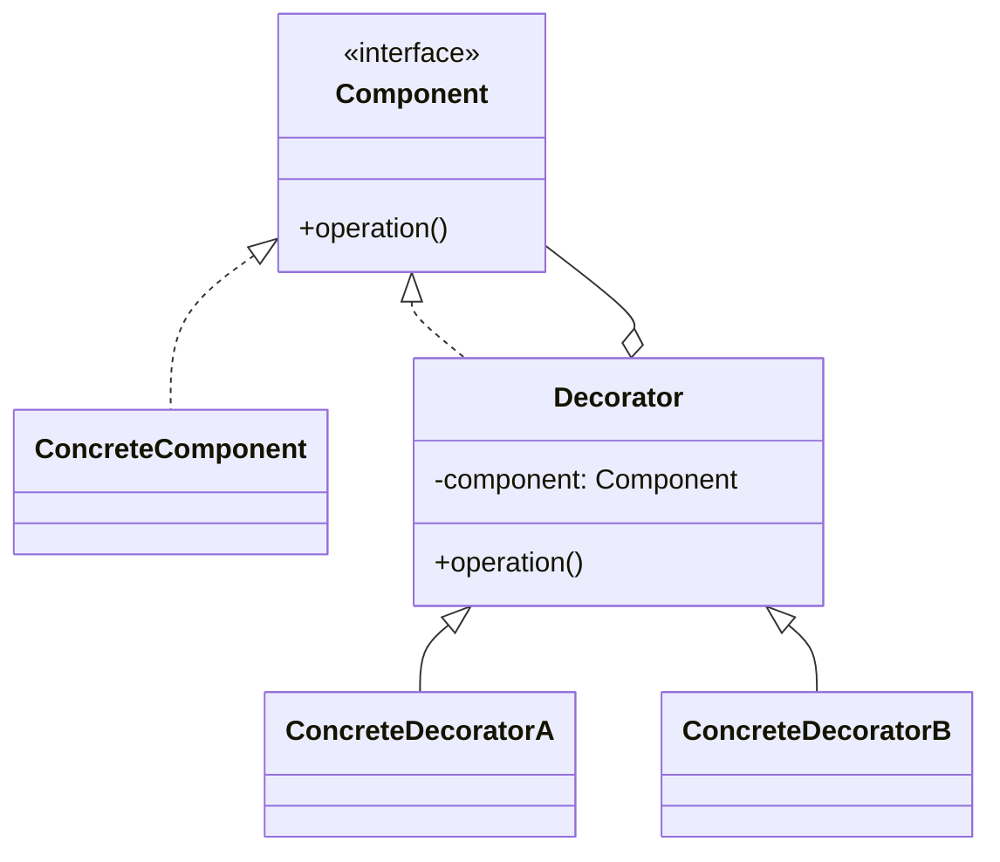

# Decorator

**Intent:** Attach additional responsibilities to an object dynamically. Decorators provide a flexible alternative to subclassing for extending functionality.

## The Structural Problem: Exploding Subclasses for Features

Suppose an image processor can optionally log, cache, compress, and watermark. Subclassing yields combinatorial explosion:

```
ImageProcessor
LoggingImageProcessor
CachingImageProcessor
LoggingCachingImageProcessor
LoggingCachingWatermarkImageProcessor
…
```

**Decorator** wraps a shared **Component** interface: each decorator implements the same interface, holds an inner component, and adds behavior before/after delegating. Clients build stacks at runtime:

```
new LoggingDecorator(new CachingDecorator(new CoreProcessor()))
```

Every layer looks like the core type — callers cannot tell how many wrappers exist.



## UML Roles — Textbook Mapping

| GoF role | Responsibility |
|----------|----------------|
| **Component** | Interface for core and wrappers |
| **ConcreteComponent** | Base behavior |
| **Decorator** | Implements Component; forwards to held Component |
| **ConcreteDecorator** | Adds specific responsibility (logging, caching) |
| **Client** | Builds chain; depends on Component interface only |

---

## Honest Assessment: No Classic Stackable Decorators in the Corpus

After searching all seven projects, **none** implement the textbook pattern: multiple classes implementing the **same narrow interface**, each wrapping an inner instance, composable in arbitrary order at runtime.

That absence is **informative**, not a failure. Similar goals appear through other structures:

| Goal | Pattern used instead | Where | Why alternative won |
|------|---------------------|-------|---------------------|
| Cross-cutting request behavior | Chain of Responsibility / Middleware | LightMediator `IRequestMiddleware` | Ordered pipeline with shared `RequestHandlerDelegate`; not every layer shares one `Handle()` signature |
| HTML transformation per publish target | Strategy (single processor) | MDWeb `IHtmlPostProcessor` | Modes are **mutually exclusive** (Site vs WeChat), not stacked |
| Pipeline orchestration | Named steps | MDWeb `PostProcessHtmlStep` | Steps share `SiteContext`, not one `Render()` interface |
| HTTP image operations | Command + handler | ImgKit `ImageHandlers` | API boundary maps 1:1 to operations, not decorator stacks |

Understanding Decorator still matters: when you **do** need arbitrary runtime stacking on one interface, recognize it — and when you don't, pick a simpler pattern deliberately.

---

## Closest Case: MDWeb HTML Post-Processing

### What exists

After markdown renders to HTML, publish profiles may transform output. `IHtmlPostProcessor` defines:

```csharp
public interface IHtmlPostProcessor
{
    PublishMode Mode { get; }
    string Process(string html);
}
```

Implementations:

| Class | Role | What it does |
|-------|------|--------------|
| **`PassThroughHtmlPostProcessor`** | No-op strategy | Returns HTML unchanged for `PublishMode.Site` |
| **`WeChatHtmlPostProcessor`** | WeChat strategy | Parses HTML with AngleSharp; strips scripts/classes; inlines preset styles; replaces Mermaid blocks with placeholders |

`PostProcessHtmlStep` selects **one** processor matching the configured mode:

```csharp
var processor = postProcessors.FirstOrDefault(p => p.Mode == mode);
foreach (var page in context.AllPages)
    page.HtmlContent = processor.Process(page.HtmlContent);
```

### Why this is Strategy, not Decorator

- **One active processor** per generation run — you never stack `SanitizeDecorator(WatermarkDecorator(html))`.
- Processors are registered in DI as a **collection**; selection is by `PublishMode`, not by nesting.
- The interface is tied to publish profiles, not to a reusable "HTML stream" abstraction.

### What Decorator would look like (hypothetical)

If WeChat export needed **composable** transforms applied to the standard site HTML in sequence:

```csharp
IHtmlPostProcessor pipeline = new InlineStylesDecorator(
    new StripScriptsDecorator(
        new MermaidPlaceholderDecorator(coreProcessor)));
html = pipeline.Process(html);
```

Each decorator would implement `Process(string)` by calling `_inner.Process(html)` then mutating the result. MDWeb did not need this — WeChat mode is a **single cohesive transformation** (`WeChatHtmlPostProcessor` is 180+ lines of DOM work). One class is easier to test and reason about than five thin decorators.

**Teaching point:** Decorator shines when features are **independent** and **combinable** (logging ∧ caching ∧ encryption). When transformations form one **coherent profile**, Strategy or a single service class is clearer.

---

## Middleware as Decorator Cousin

LightMediator builds a request pipeline by wrapping delegates:

```csharp
RequestHandlerDelegate<TResponse> next = ct => handler.HandleAsync(request, ct);
for (var i = middlewares.Length - 1; i >= 0; i--)
{
    var middleware = middlewares[i];
    var inner = next;
    next = ct => middleware.HandleAsync(request, inner, ct);
}
```

### Decorator-like behavior

Each middleware **wraps** the next delegate — outer code runs before/after inner code. Conceptually:

```
LoggingMiddleware → AuthMiddleware → ValidationMiddleware → Handler
```

### Why GoF labels it Chain of Responsibility (Part 4)

- Middleware types implement `IRequestMiddleware`, not a shared `IRequestHandler` component interface.
- The wrapped type is a **delegate**, not the same interface as the core handler.
- Ordering is explicit in the array; decorators typically nest at construction time.

**Mental model:** middleware is **Decorator semantics on a pipeline**, structured as **Chain of Responsibility** for ASP.NET-style composition. Both beat subclassing for cross-cutting concerns.

---

## ImgKit — Explicit Handlers vs Decorator Chain

ImgKit processes images through command handlers (`ImageHandlers`, `ImageProcessingHandlerBase`). Optional steps (resize, filter, format conversion) are **discrete API operations**, not wrappers around a shared `IImageProcessor.Process(Image)`.

If every upload needed arbitrary combinations of EXIF strip + watermark + filter at runtime, a decorator chain on `IImageProcessor` would fit. Current HTTP API design favors **explicit endpoints and commands** — clearer OpenAPI docs, simpler authorization per operation.

---

## Recognizing Decorator in the Wild

Look for:

- Same interface on wrapper and wrappee.
- Constructor taking `IComponent inner` (or similar).
- `operation()` calls `_inner.operation()` plus extra work.
- Client code (or DI) assembling chains.

Modern .NET sometimes uses **`DispatchProxy`** or source generators for interception — decorator intent without manual wrapper classes.

## When to Choose Decorator

Choose Decorator when:

- Multiple **independent** enhancements combine arbitrarily.
- Enhancements attach at **runtime** (per-request, per-tenant config).
- The **same interface** must hold through the entire stack (transparent to callers).

Choose **Strategy** when:

- Exactly **one** algorithm is active (publish mode, sort order, renderer choice).

Choose **Pipeline steps** when:

- Stages share rich context (`SiteContext`, `IServiceProvider`).
- Stages have **different method signatures** or responsibilities (read disk → render → write output).

Choose **Middleware** when:

- Cross-cutting concerns wrap **request handling** with delegate chaining.

## Implementing Decorator Deliberately

If you add decorator stacks to your own code:

1. Keep the **Component interface minimal** — one or two methods.
2. Make decorators **pure wrappers** — no hidden singletons.
3. Document **order sensitivity** (encrypt-before-compress vs compress-before-encrypt).
4. Prefer DI factory methods that assemble chains from configuration.

The corpus chose simpler patterns because its domains rarely needed arbitrary feature stacking — that is a valid engineering outcome worth studying alongside the textbook pattern.

## Next

[Facade →](06-facade.md)
