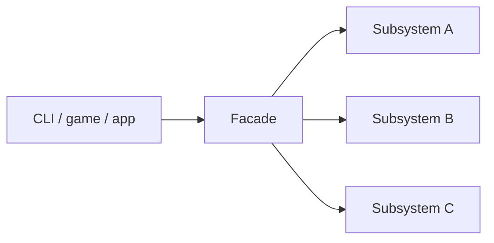

# Facade

**Intent:** Provide a unified, higher-level interface to a set of interfaces in a subsystem. Facade defines no new functionality — it simplifies access.

## The Structural Problem: Subsystem Complexity

Subsystems grow many moving parts:

- Catalog, buffer pools, SQL compiler, query executor, spill writer (database).
- Nine ordered pipeline steps, output cleaning, timing, error aggregation (static site generator).
- Window, input, audio, scene, ImGui layer (game engine).

Clients that reach directly into every class:

- Must learn correct **call order** (compile before execute; clean output before write).
- Break when internal wiring changes.
- Duplicate bootstrap code in CLI, tests, and samples.

**Facade** offers one **entry point** that delegates inward. It does not replace subsystem classes — it **coordinates** them behind a stable surface.



## UML Roles → Project Mapping

| GoF role | Responsibility | Examples |
|----------|----------------|----------|
| **Facade** | Simple API; delegates to subsystem | `SiteGenerator`, `RainDbEngine`, `IEngineContext` |
| **Subsystem classes** | Do real work | Pipeline steps, compilers, executors, engine internals |
| **Client** | Uses facade only | MDWeb CLI, RainDB samples, Spark game `OnAttach` |

A facade **must delegate**. If it reimplements parsing, compilation, or rendering logic, it becomes a **God object** and violates Single Responsibility.

---

## Example 1: MDWeb — SiteGenerator (Excellent)

### The problem

Generating a static site involves:

1. Set and optionally clean output directory.
2. Build `SiteContext` from configuration.
3. Execute `SiteGenerationPipeline` (read content → render markdown → apply templates → post-process → write files → optional PDF).
4. Aggregate timing, page counts, errors.

CLI, watch service, and integration tests should call **one method**, not construct and order steps manually.

### Class roles

| Class | Pattern role | What it wraps / uses | Why |
|-------|--------------|----------------------|-----|
| **`SiteGenerator`** | Facade | `SiteGenerationPipeline`, `IOutputWriter`, `ILogger` | Documented: *"Facade: coordinates the full site generation process."* Implements `ISiteGenerator`. |
| **`SiteGenerationPipeline`** | Subsystem | Ordered `IGenerationStep` list | Knows step sequence; not exposed to CLI. |
| **`IOutputWriter`** | Subsystem | Directory clean/create, file writes | Facade sets output path before pipeline runs. |
| **`SiteContext`** | Shared state bag | Pages, config, PDF path | Passed through pipeline steps — facade creates it, pipeline mutates it. |
| **`Program` / tests** | Client | `await generator.GenerateAsync(config)` | Single call surface. |

```csharp
public sealed class SiteGenerator(
    SiteGenerationPipeline pipeline,
    IOutputWriter outputWriter,
    ILogger<SiteGenerator> logger) : ISiteGenerator
{
    public async Task<GenerationResult> GenerateAsync(
        SiteConfiguration configuration, CancellationToken cancellationToken = default)
    {
        outputWriter.SetOutputDirectory(configuration.OutputDirectory);
        // clean or create output directory based on PDF/site flags
        var context = new SiteContext { Configuration = configuration };
        await pipeline.ExecuteAsync(context, cancellationToken);
        return GenerationResult.Ok(...);
    }
}
```

### Step-by-step: CLI generates a site

1. CLI parses arguments into `SiteConfiguration` (content root, output dir, theme, publish mode).
2. DI resolves `ISiteGenerator` → concrete `SiteGenerator` with pipeline and writer injected.
3. CLI calls `GenerateAsync(config, cancellationToken)`.
4. Facade configures output writer and cleans directory when full site generation is requested.
5. Facade creates empty `SiteContext`, hands it to `pipeline.ExecuteAsync`.
6. Pipeline runs steps (read filesystem → build `ContentFolder` tree → render each `MarkdownPage` → layout → post-process → write HTML).
7. Facade logs page count and duration, returns `GenerationResult` with success/failure and paths.
8. CLI prints result — never referenced `RenderMarkdownStep` or `PostProcessHtmlStep` by name.

### Facade vs pipeline

The **pipeline** is subsystem internals. The **facade** is the product API. Tests can mock `ISiteGenerator`; integration tests hit the real facade to exercise the full subsystem.

---

## Example 2: Spark — IEngineContext

### The problem

Games and demos need window dimensions, input, scene access, audio, and optional ImGui — without including half of `Engine.hpp` or linking every subsystem header.

### Class roles

| Class | Pattern role | What it exposes | Why |
|-------|--------------|-----------------|-----|
| **`IEngineContext`** | Facade interface | `GetWindow`, `GetInput`, `GetFramebufferSize`, `TryGetScene`, `TryGetSoundEngine`, `TryGetImGuiLayer`, scene render params | Documented: *"Facade passed to game code — stable surface that hides Engine internals."* |
| **`EngineContext`** | Concrete facade | Holds references into live `Engine` subsystems | Implements `IEngineContext`; constructed per game instance. |
| **`Game::OnAttach(IEngineContext&)`** | Client entry | Receives facade, not `Engine*` | Game code uses narrow surface. |
| **`Engine` internals** | Subsystems | Rendering, audio, scene graph, UI | Hidden behind context methods. |

```cpp
class IEngineContext {
public:
    virtual Window& GetWindow() = 0;
    virtual IInput& GetInput() = 0;
    virtual void GetFramebufferSize(int& outWidth, int& outHeight) const = 0;
    virtual SoundEngine* TryGetSoundEngine() noexcept = 0;
    virtual Scene* TryGetScene() noexcept = 0;
    virtual IImGuiLayer* TryGetImGuiLayer() noexcept = 0;
};
```

### Step-by-step: game startup

1. Engine creates `EngineContext` wrapping running engine subsystems.
2. Engine calls `game->OnAttach(context)`.
3. Game stores `context` reference or pulls `GetWindow()` for title/size.
4. Each frame: `OnUpdate(timing, context)` reads input via `context.GetInput()`.
5. `OnRender(frame, context)` optionally calls `TryGetScene()` — nullptr if no scene-bound game.
6. Game never allocates `SoundEngine` directly; uses `TryGetSoundEngine()` if audio needed.

`TryGet*` methods expose optional subsystems without throwing — facade simplifies **capability discovery**, not just hiding names.

### Other Spark facades

| Facade | Subsystem hidden |
|--------|------------------|
| **`SoundEngine`** | Device init, mixing, clip playback |
| **`PhysicsSubsystem`** | 2D/3D worlds, raycasts |
| **`UiSystem`** | Active `IUiBackend`, paint/input routing |
| **`SceneSerializer`** | ECS capture, component registry, file format — one class to "save scene to file" |

`SceneSerializer::Capture` walks `GameWorld` entities, uses `ComponentSnapshotRegistry` for per-component serialization, produces `SceneDocument`. Clients call `WriteToFile` — not iterate component kinds manually.

---

## Example 3: RainDB — RainDbEngine

### The problem

Embedded analytics engine assembly requires:

- `ICatalog` for table metadata
- `IBufferPool` / `IAlignedBufferPool` for vectorized memory
- `ISqlCompiler` and `ILinqCompiler` for query text → plan
- `IQueryExecutor` for plan → results
- Optional `ISpillWriter`, `RainDbFileDatabase` for persistence

Sample apps and tests should not duplicate this wiring.

### Class roles

| Class | Role | Contains / exposes |
|-------|------|-------------------|
| **`RainDbEngine`** | Facade + composition root | Properties: `Catalog`, `BufferPool`, `Executor`, `SqlCompiler`, `LinqCompiler`, `SpillWriter`, `FileDatabase` |
| **`CreateDefault()`** | Factory on facade | Wires `InMemoryCatalog`, `HybridBufferPool`, `DefaultQueryExecutor`, compilers |
| **`OpenPersistent(path)`** | Factory on facade | Opens file-backed catalog, same executor/compiler wiring |
| **`ExecuteSqlAsync`** | Convenience delegate | `CreateSession` → compile → execute — hides session object lifecycle for simple callers |
| **Analytics demo / tests** | Client | `RainDbEngine.CreateDefault()` then `ExecuteSqlAsync("SELECT ...")` |

```csharp
public sealed class RainDbEngine
{
    public ICatalog Catalog { get; }
    public IQueryExecutor Executor { get; }
    public ISqlCompiler SqlCompiler { get; }
    // ...

    public static RainDbEngine CreateDefault() => CreateDefault(new InMemoryCatalog());

    public async ValueTask<IQueryResult> ExecuteSqlAsync(string sql, CancellationToken ct = default)
    {
        var ctx = CreateSession(ct);
        var plan = await SqlCompiler.CompileAsync(sql, Catalog, ct);
        return await Executor.ExecuteAsync(plan, ctx);
    }
}
```

### Step-by-step: run a SQL query

1. Client calls `RainDbEngine.CreateDefault()` or `OpenPersistent("./data")`.
2. Facade constructor stores shared collaborators (one buffer pool, one executor).
3. Client optionally uses `engine.Catalog` to create tables via public catalog API.
4. Client calls `await engine.ExecuteSqlAsync("SELECT * FROM t")`.
5. Facade creates `RainDbExecutionContext` (session) with catalog + pools + spill writer.
6. Facade delegates compile to `SqlCompiler`, execute to `Executor`.
7. Client reads `IQueryResult` — never instantiated `DefaultSqlCompiler` directly.

Advanced tests still access `SqlCompiler` and `Executor` separately for unit isolation — facade does not **prevent** deep access, it **defaults** to simple paths.

---

## Example 4: LightMapper — Maps Facade

Generated `LightMapper.Generated.Maps` exposes:

```csharp
public static TDestination Map<TSource, TDestination>(TSource source);
public static void MapTo<TSource, TDestination>(TSource source, TDestination destination);
```

Behind the facade: dispatch tables, generated mapper singletons, reflection metadata. Application code maps DTOs with static methods — subsystem complexity stays in generated assembly.

---

## Example 5: ImgKit — IProcessingStudioService

Web UI for image experiments orchestrates upload, operation picker, and API calls through one service — hides HTTP client construction, route URLs, and command payload shapes from Razor components.

---

## Facade vs Mediator vs Adapter

| | Facade | Mediator | Adapter |
|---|--------|----------|---------|
| **Goal** | Simplify subsystem for **client** | Route **colleague** messages | Convert **one** interface |
| **Direction** | Client → subsystem (mostly) | Colleagues ↔ mediator ↔ colleagues | Client → target ← adaptee |
| **Example** | `SiteGenerator` | `LightMediator.Mediator` | `MarkdigMarkdownRenderer` |

## Facade vs God Object — Red Flags

| Healthy facade | God object |
|----------------|------------|
| Methods are one-liners or thin orchestration | Methods contain business algorithms |
| Subsystem classes remain testable in isolation | All logic migrated into facade |
| New features add subsystem classes + one facade call | Every feature edits the same 2000-line class |

If `SiteGenerator` started parsing markdown internally, extract back to pipeline steps.

---

## When to Introduce a Facade

- CLI, public SDK, or sample code must bootstrap a complex subsystem.
- You want freedom to reorder internal steps without breaking callers.
- Multiple entry styles (SQL string vs LINQ vs physical plan) share one engine instance.

Register facades in DI as the **default client-facing type**; keep subsystem interfaces public for advanced extension and testing.

## Next

[Flyweight →](07-flyweight.md)
