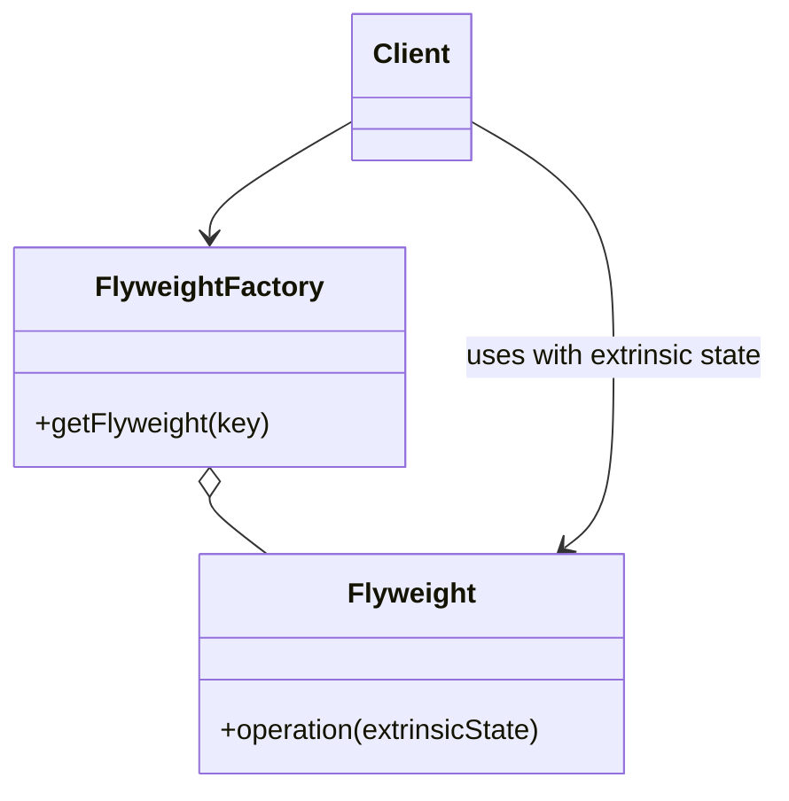

# Flyweight

**Intent:** Use sharing to support large numbers of fine-grained objects efficiently by separating **intrinsic** (shared, immutable) state from **extrinsic** (context-specific) state.

## The Structural Problem: Memory at Scale

Imagine a tile map with 50,000 tile **instances** on screen, but only 200 unique tile **definitions** (texture, UV rect, collision flags). Storing full definition data on every instance wastes memory and cache lines.

**Flyweight** stores each unique definition **once** in a factory-managed pool. Instances hold only:

- **Intrinsic state** — shared, immutable (glyph shape, texture handle, color token).
- **Extrinsic state** — passed in per use (x/y position, parent control, current theme variant).

Operations become `flyweight.Draw(extrinsicContext)` rather than `instance.Draw()` carrying duplicate intrinsic fields.



## UML Roles — Textbook Mapping

| GoF role | Responsibility |
|----------|----------------|
| **Flyweight** | Stores intrinsic state; accepts extrinsic state in methods |
| **FlyweightFactory** | Returns shared instance for key; creates on first miss |
| **Client** | Supplies extrinsic state; never duplicates intrinsic data |
| **Context** | Extrinsic state holder (sometimes explicit struct) |

---

## Honest Assessment: No Classic Flyweight Factory in the Corpus

None of the seven projects implement the full GoF structure:

- No `FlyweightFactory.Get(key)` returning shared objects.
- No operation signature of the form `Render(extrinsicState)` on a shared glyph/tile type.
- No documentation claiming Flyweight intent (unlike MDWeb's explicit Composite comments).

Related **memory and sharing techniques** appear — and conflating them with Flyweight is a common study mistake:

| Technique | Project | What it does | Flyweight? |
|-----------|---------|--------------|------------|
| Immutable palette singletons | SkyUI `SkyDarkColorPalette.Instance` | One shared color resource URI per theme | **Flyweight-like** — shared intrinsic theme data |
| Asset deduplication | Spark rendering | Same texture ID referenced many times | **Cache / interning** — no extrinsic/intrinsic API split |
| Buffer pools | RainDB `IBufferPool`, `HybridBufferPool` | Reuse byte buffers across queries | **Object pool** — mutable reuse, not immutable sharing |
| Generated mapper singletons | LightMapper | Stateless `Map()` services | **Singleton** — one instance, not many logical objects sharing state |

Teaching Flyweight honestly includes explaining **why** these projects chose pools and caches instead.

---

## Flyweight vs Object Pool vs Cache vs Singleton

| | Flyweight | Object pool | Cache | Singleton |
|---|-----------|-------------|-------|-----------|
| **Goal** | Many logical objects, few shared instances | Reduce allocation churn | Avoid recomputation / reload | One coordinator |
| **Object mutability** | Flyweight is immutable | Pooled object reset between uses | Cached value may mutate | Varies |
| **State split** | Intrinsic in flyweight; extrinsic per call | State lives in pooled object | Key → value | N/A |
| **Example** | Font glyph shared by 10k characters | `ArrayPool<byte>.Shared` | Texture loaded once by path | `SkyDarkColorPalette.Instance` |

RainDB's `PooledFixedWidthColumnChunk` and `HybridBufferPool` recycle **mutable buffers** for vectorized query execution. After checkout, operators write row batches into the buffer; after use, memory returns to the pool. That is **pooling for allocation performance**, not sharing immutable tile definitions across coordinates.

---

## SkyUI Palettes — Informal Flyweight Teaching Example

### What exists

Theme palettes expose a **single shared instance** per variant:

```csharp
public sealed class SkyDarkColorPalette : ISkyColorPalette
{
    public static SkyDarkColorPalette Instance { get; } = new();
    public string ResourceUri => SkyPaletteUris.Dark;
}
```

Parallel types: `SkyLightColorPalette.Instance`, `SkyHighContrastColorPalette.Instance`.

### Mapping to Flyweight vocabulary

| Concept | SkyUI realization |
|---------|-------------------|
| **Intrinsic state** | Avalonia resource URI pointing at shared XAML color dictionary (`SkyPalette.Dark.axaml`) |
| **Extrinsic state** | Which control references the palette; active `ThemeVariant`; which brush property is being resolved |
| **Factory** | Not explicit — static `Instance` property acts as **fixed flyweight registry** (one entry per theme) |
| **Clients** | Thousands of controls across windows — all resolve colors through the same palette instance |

Controls do not each embed a copy of the dark-theme color table. They hold a reference to shared theme infrastructure; **per-control position and state** remain extrinsic.

### Why this is "informal" Flyweight

GoF Flyweight usually involves:

- **Many keys** in a factory (character 'A' in font X, tile ID 42).
- **Dynamic lookup** at runtime.

SkyUI has **three** palette flyweights (dark/light/high-contrast) — essentially enum-sized sharing. The pattern idea applies; the factory machinery would be over-engineering.

---

## RainDB — Buffer Pools (Not Flyweight)

`RainDbEngine` wires `HybridBufferPool` as both `IBufferPool` and `IAlignedBufferPool`:

```csharp
var buffers = new HybridBufferPool();
return new RainDbEngine(catalog, buffers, buffers, executor, sql, linq, ...);
```

| Role | Type |
|------|------|
| Pool | `HybridBufferPool` |
| Client | Query operators via `IExecutionContext` |
| Checkout | Operator requests buffer, fills with column data, returns |

**Why pooling fits databases:** query batches are **short-lived mutable scratch space**. Flyweight would imply immutable shared column chunks — wrong semantics when each scan produces different rows.

**Teaching point:** when profiling shows allocation pressure, reach for **pools** first. Reach for **Flyweight** when profiling shows **duplicate immutable identity data** (glyphs, tiles, icon definitions, repeated AST nodes).

---

## Spark — Asset IDs and Batching (Cache, Not Flyweight API)

Spark likely references textures and sprites by **asset ID** with deduplication in asset management. Many `Sprite` components may reference the same texture handle — shared intrinsic GPU resource, extrinsic transform per entity.

The engine does not necessarily expose a `TileFlyweightFactory`. Modern engines achieve the same memory profile through:

- **Interned asset paths → ID**
- **GPU instancing / batching** (extrinsic transforms in instance buffer)
- **Shared mesh/material assets**

Valid engineering — Flyweight is the **conceptual label** for what's happening, not a class you must name `FlyweightFactory`.

---

## Hypothetical: Flyweight in Spark Tilemaps

If Spark needed explicit teaching example:

```cpp
struct TileFlyweight {
    TextureId texture;
    Rect uv;
    uint32_t collisionFlags;
};

class TileFlyweightFactory {
public:
    TileFlyweight& Get(TileDefinitionId id);
};

void DrawTile(const TileFlyweight& fw, int worldX, int worldY);  // extrinsic position
```

50,000 drawn tiles might reference 200 flyweights. **Current engine** likely uses asset IDs + renderer batching instead — fewer types, same memory story.

---

## When to Add Explicit Flyweight

Add Flyweight when profiling shows:

- Huge count of **small objects** differing only by a few shared fields.
- Intrinsic data is **immutable** after load.
- Extrinsic context is cheap to pass per operation (coordinates, parent ID, style key).

**Do not** use Flyweight for:

- Mutable workspace buffers (use pools).
- Objects whose "shared" state changes per tenant (use normal instances).
- Cases with only 2–3 shared variants (static singletons suffice).

---

## Client Walkthrough — Textbook Flyweight (Reference)

For contrast with the corpus, here is how a **full** Flyweight client behaves:

1. Client requests `factory.Get("icon-warning")` — factory returns shared `IconFlyweight` (intrinsic SVG path data).
2. Client loops 1,000 list rows.
3. For each row, calls `flyweight.Paint(canvas, x, y, color)` — **extrinsic** position and tint passed per call.
4. Memory: one flyweight + 1,000 lightweight row models — not 1,000 copies of SVG path strings.

No project in this book implements that loop verbatim; SkyUI palettes approximate step 1 with static instances; RainDB and Spark use other optimizations.

---

## Summary

| Project | Mechanism | Closest pattern label |
|---------|-----------|----------------------|
| SkyUI themes | `SkyDarkColorPalette.Instance` | Informal Flyweight (shared intrinsic theme) |
| RainDB | `HybridBufferPool` | Object pool |
| Spark | Asset ID + GPU batching | Cache / sharing without Flyweight API |
| LightMapper | Generated mapper singletons | Singleton service |

Recognizing Flyweight **conceptually** helps you spot duplicate immutable data. Recognizing its **absence** helps you pick pools, caches, and singletons without forcing a factory you do not need.

## Next

[Proxy →](08-proxy.md)
