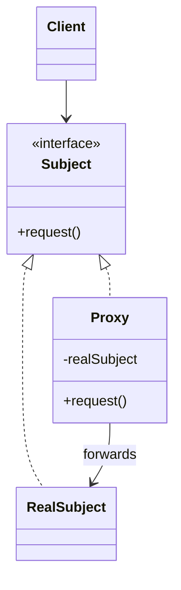

# Proxy

**Intent:** Provide a surrogate or placeholder for another object to control access, lazy initialization, logging, or remote delegation.

## The Structural Problem: Uncontrolled Access to Expensive or Sensitive Resources

Some objects are costly or risky to use directly:

- Loading a multi-gigabyte texture on construction slows startup.
- Unrestricted database or image-processor access allows abuse.
- Remote services live behind network latency and failure modes.

**Proxy** implements the **same interface** as the real subject. Clients call the proxy; the proxy decides **when** and **whether** to forward to the real object.



## Proxy Variants

| Type | Purpose | Mechanism |
|------|---------|-----------|
| **Virtual** | Defer expensive creation | Create `RealSubject` on first use |
| **Protection** | Access control | Check permissions before forward |
| **Remote** | Network transparency | Local stub serializes calls |
| **Logging / auditing** | Observability | Log, then forward |

---

## Honest Assessment: No Classic GoF Proxy in the Corpus

No project defines `IImageProcessor` with `ImageProcessorProxy` that implements every method, holds a lazy `RealImageProcessor`, and forwards calls while adding access checks.

That gap reflects **modern platform idioms** that solve the same problems without surrogate classes:

| Need | Classic proxy | What this corpus uses instead |
|------|---------------|------------------------------|
| Lazy initialization | Virtual proxy wrapping service | `Lazy<T>`, deferred construction in DI, `TryGet*` returning nullptr until ready |
| Access control | Protection proxy | ASP.NET authorization middleware, handler-level checks |
| Concurrency limits | Proxy serializing access | **Resource gate** — `IPillowNetProcessingGate` (ImgKit) |
| Caching | Proxy memoizing results | `ConcurrentDictionary` in LightMediator send invokers |
| Remote API | Remote proxy | Typed HTTP client interfaces — no generated stub wrapper class |

Understanding Proxy remains essential for ORMs, RPC, and interception frameworks even when your app uses gates and middleware instead.

---

## UML Roles — Where They Would Map

| GoF role | Would be | In corpus |
|----------|----------|-----------|
| **Subject** | Service interface client depends on | `IImageProcessor`, `IRealService` — **not wrapped** |
| **RealSubject** | Heavy implementation | `PillowNetProcessor`, engine subsystems |
| **Proxy** | Surrogate implementing Subject | **Absent** as named pattern |
| **Client** | Code using Subject | Handlers call services directly after gate acquire |

---

## ImgKit — IPillowNetProcessingGate (Gate, Not Proxy)

### The problem

Native PillowNet image processing is **not re-entrant** safely at unlimited parallelism. Multiple HTTP requests must not corrupt shared native state.

### What exists — a concurrency gate

```csharp
internal sealed class PillowNetProcessingGate : IPillowNetProcessingGate
{
    private readonly SemaphoreSlim _semaphore = new(1, 1);

    public async Task<IDisposable> AcquireAsync(CancellationToken cancellationToken = default)
    {
        await _semaphore.WaitAsync(cancellationToken);
        return new ReleaseHandle(_semaphore);
    }
}
```

Handlers use:

```csharp
await using (await processingGate.AcquireAsync(cancellationToken))
{
    // call PillowNet directly
}
```

### Class roles

| Class | Role | Why not Proxy |
|-------|------|---------------|
| **`IPillowNetProcessingGate`** | Concurrency contract | Acquire/release — **not** `ProcessImage()` forwarding |
| **`PillowNetProcessingGate`** | Semaphore wrapper | Serializes access; does **not** implement image API |
| **`ImageProcessingHandlerBase`** | Client | Calls gate, then real processor — two separate types |

### Proxy vs gate — conceptual distinction

| | Proxy | Gate |
|---|-------|------|
| **Interface** | Same as real subject | Different (`Acquire` / `IDisposable`) |
| **Caller sees** | One service object | Service + explicit lock scope |
| **Purpose** | Transparent control | Explicit resource serialization |

A **protection proxy** would look like:

```csharp
class PillowNetProcessorProxy : IImageProcessor {
    public ImageResult Process(ImageRequest req) {
        _gate.Wait();
        try { return _inner.Process(req); }
        finally { _gate.Release(); }
    }
}
```

ImgKit chose **visible gate** over **transparent proxy** — callers see the critical section, which aids code review and avoids pretending the proxy is the full processor interface.

### Step-by-step: handler processes an image

1. HTTP request hits `ResizeImageHandler`.
2. Handler validates command DTO (authorization may run in ASP.NET pipeline — another non-proxy control).
3. Handler `await using (await gate.AcquireAsync(ct))` — waits if another native call is in flight.
4. Handler invokes PillowNet resize on buffer — **direct call**, not through proxy.
5. `ReleaseHandle.Dispose()` releases semaphore on exit.
6. Handler returns HTTP response.

Concurrency control achieved; Proxy pattern not used.

---

## Spark — TryGet Pattern (Optional Access, Not Proxy)

`IEngineContext` exposes optional subsystems:

```cpp
virtual SoundEngine* TryGetSoundEngine() noexcept = 0;
virtual Scene* TryGetScene() noexcept = 0;
virtual IImGuiLayer* TryGetImGuiLayer() noexcept = 0;
```

### What this is

- **Null object / optional capability** — nullptr when subsystem absent (game without scene binding, host without audio).
- **Not lazy proxy** — does not implement `SoundEngine`'s interface and forward calls after lazy init.

A **virtual proxy** for audio would expose `PlaySound` methods on a lightweight stub that loads `SoundEngine` on first play. Spark instead constructs subsystems during engine boot and exposes raw pointers when available.

**Teaching point:** `TryGet*` simplifies **capability queries** on a facade — different problem from surrogate forwarding.

---

## Modern Replacements — Deeper Look

### Lazy initialization (`Lazy<T>`, DI deferred init)

DI containers construct services on first resolve. No hand-written proxy class — the container or factory holds the lazy logic. Same **virtual proxy intent**, framework-provided.

### Middleware and filters

Authorization and logging wrap HTTP pipelines — similar to **decorator/proxy** semantics on `HttpContext`, but structured as middleware chains (see Decorator chapter). ASP.NET does not generate `ControllerProxy` per endpoint.

### HTTP clients

`HttpClient` + typed interfaces (`IImgKitApi`) call remote services. Remote proxy pattern from CORBA/RMI era maps to **generated clients or Refit interfaces** — the "proxy" is often source-generated, not a visible application class.

### DispatchProxy (.NET)

Runtime-generated proxies for interface interception — used in mocking and some AOP libraries. None of the seven projects use `DispatchProxy` for production services in the reviewed code.

---

## When Classic Proxy Still Makes Sense

| Scenario | Why proxy fits |
|----------|----------------|
| ORM lazy-loading navigation properties | Property access triggers DB fetch — transparent to caller |
| gRPC / CORBA stubs | Generated local surrogate matches service IDL |
| .NET `DispatchProxy` | Cross-cutting logging on interface without manual wrappers |
| Large file / texture handles | Virtual proxy delays IO until first read |

If you need **transparent** lazy load or access control on a **wide interface**, Proxy (or generated equivalent) beats scattering `if (!_loaded) Load()` in every method of the real subject — extract that into one surrogate class.

---

## Structural Part Summary

| Pattern | Best corpus example | UML → real mapping |
|---------|---------------------|-------------------|
| **Adapter** | SkyUI `ICheckedListItemAdapter` | Target → adapter → domain model / Markdig |
| **Bridge** | Spark `IUiBackend` | Abstraction (`UiSystem`) → implementor (`SparkUiBackend`, `DearImguiUiBackend`) |
| **Composite** | MDWeb `ContentNode` | Component → `ContentFolder` (composite) / `MarkdownPage` (leaf) |
| **Decorator** | Not explicit — use middleware (Part 4) or Strategy | Wrapping intent without shared component stack |
| **Facade** | MDWeb `SiteGenerator`, RainDB `RainDbEngine` | Client → facade → pipeline / compilers / executors |
| **Flyweight** | SkyUI palettes (informal) | Shared `Instance` + extrinsic control context |
| **Proxy** | Modern DI, gates, `TryGet*` replace classic surrogates | Gate ≠ Proxy; know the difference |

---

## Cross-Part Connections

- **Composite + Visitor** — SkyUI filter SQL export (Part 4).
- **Facade + Pipeline** — MDWeb generation steps share `SiteContext`.
- **Bridge + Abstract Factory** — Spark UI backends and control factories.
- **Adapter vs Facade** — `MarkdigMarkdownRenderer` converts one API; `SiteGenerator` simplifies many.

Structural patterns shape **object graphs**. Behavioral patterns (Part 4) shape **communication** over those graphs. The dividing line is not always crisp — middleware wraps delegates (behavioral) with decorator-like structure — but the vocabulary helps you name what you build and spot what you deliberately omitted.

---

## Part 3 Closing Thought

The strongest examples in this book — Adapter, Bridge, Composite, Facade — are **explicit in source comments and type structure**. Weaker examples — Decorator, Flyweight, Proxy — teach equally by showing **modern alternatives**: Strategy over decorator stacks, pools over flyweights, gates and DI over surrogate classes. Naming the pattern you are *not* using is as valuable as naming the one you are.

## Next

[Part 4: Introduction to Behavioral Patterns →](../part04-behavioral/01-introduction.md)
