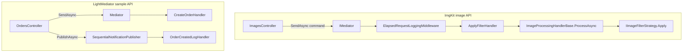

# Introduction to Behavioral Patterns

Structural patterns (Part 3) answer **how classes are wired together**. Creational patterns (Part 2) answer **how objects are born**. Behavioral patterns answer a different question: **what happens when objects talk to each other at runtime** — who decides the algorithm, who notifies whom, and how control flows through a workflow without turning every class into a tightly coupled knot.

Behavioral patterns concern **algorithms and assignment of responsibilities** between objects. They do not usually introduce new types of relationships (like Composite or Adapter). Instead, they reorganize *communication*: decoupling senders from receivers, encapsulating variation in interchangeable policies, centralizing coordination, or making state-driven behavior explicit.

## The Core Behavioral Problems

Most behavioral patterns address one or more of these recurring tensions:

| Problem | Symptom without a pattern | Pattern family |
|---------|---------------------------|----------------|
| **Coupling** | Class A directly calls B, C, D; every new feature edits A | Mediator, Command |
| **Algorithm variation** | Giant `switch` or `if/else` for rendering, filtering, exporting | Strategy, Template Method |
| **Notification** | Subject maintains a hand-rolled subscriber list; leaks and ordering bugs | Observer |
| **State transitions** | Enum + switch grows unbounded; enter/exit logic scattered | State |
| **Request routing** | One object must try several handlers; or a pipeline must run in order | Chain of Responsibility |
| **Traversal vs operations** | Exposing internal collections breaks encapsulation; or adding operations edits every node type | Iterator, Visitor |
| **Undo / snapshots** | Caller reaches into private fields to save state | Memento |

The chapters that follow map each GoF pattern to **real code** from this monorepo. The goal is not to memorize UML boxes but to recognize *when* a behavioral problem appears and *which* collaboration shape resolves it cleanly.

## Patterns in Part 4

| Pattern | Focus | Primary question it answers |
|---------|-------|----------------------------|
| Chain of Responsibility | Pass a request along a handler chain | "Who gets a chance to handle this — and in what order?" |
| Command | Encapsulate a request as an object | "How do I represent an action as data I can queue, log, or route?" |
| Iterator | Sequential access without exposing structure | "How do I walk a collection without knowing if it is a list, tree, or batch?" |
| Mediator | Centralize complex communications | "How do N objects coordinate without N² direct references?" |
| Memento | Capture and restore state | "How do I snapshot internal state without breaking encapsulation?" |
| Observer | One-to-many dependency notification | "How do dependents react when something changes?" |
| State | Alter behavior when internal state changes | "How do I replace enum switches with polymorphic lifecycle hooks?" |
| Strategy | Interchangeable algorithms | "How do I swap algorithms at runtime without editing the client?" |
| Template Method | Skeleton algorithm with subclass hooks | "Which steps are fixed workflow and which steps vary?" |
| Visitor | Operations on a structure without changing node classes | "How do I add a new operation over a stable tree without editing every node?" |

## How Behavioral Patterns Compose in Real Systems

Production code rarely uses one pattern in isolation. The richest examples in this repository **stack** behavioral patterns:

**ImgKit** on a single resize request: **Command** (the HTTP body becomes a `ResizeImageCommand`), **Mediator** (routes to exactly one handler), **Chain of Responsibility** (logging middleware wraps the handler), **Template Method** (`ProcessAsync` owns I/O and threading), and optionally **Strategy** (filter/enhancement families inside the transform hook).

**LightMediator samples** on order creation: **Command** (`CreateOrderCommand`), **Mediator** (`SendAsync`), then **Observer** via **Mediator notifications** (`PublishAsync` + `OrderCreatedLogHandler`), with notification fan-out itself swappable via **Strategy** (`SequentialNotificationPublisher` vs `ParallelNotificationPublisher`).

Understanding behavioral patterns means recognizing these **layers**: transport (HTTP/UI) → message object (command/notification) → coordinator (mediator/pipeline) → algorithm (strategy/state/template hook).

## Richest Projects for Behavioral Patterns

These repositories appear repeatedly because they exercise multiple patterns with clear boundaries:

1. **LightMediator** — Mediator, Command, Chain (middleware), Observer (notifications). The library *is* a behavioral-pattern toolkit: `IRequest`/`IRequestHandler`, `IRequestMiddleware`, `INotification`/`INotificationHandler`, and `Mediator.SendCore` building the middleware onion.

2. **MDWeb** — Chain (site generation pipeline), Strategy (markdown renderers, template engines, exporters). Every build step is an `IGenerationStep` mutating shared `SiteContext`; renderer choice is injected strategy.

3. **Spark** — State (`FsmStateMachine`), Strategy (collider bake, component snapshot handlers), Memento (`SceneSerializer` / `SceneDocument`), Observer (ECS `EmitSignal` / `OnSignal`). Gameplay and tooling share the same behavioral vocabulary.

4. **ImgKit** — Command, Strategy, Template Method, Chain (middleware). End-to-end from multipart upload to PillowNet transform, with cross-cutting concerns in the base handler.

5. **SkyUI** — Visitor (`IFilterNodeVisitor`), Command (MVVM `ICommand`), Observer (`INotifyPropertyChanged` on filter nodes). Filter tree is Composite + Visitor + data binding.

## GoF Vocabulary vs Modern Frameworks

The Gang of Four catalog predates ASP.NET Core, MVVM, and ECS game engines. Modern names differ; collaborations often match:

| GoF term | Modern analogue in this repo |
|----------|------------------------------|
| Command | `IRequest<TResponse>`, UI `ICommand`, ImgKit `*Command` records |
| Invoker | `IMediator.SendAsync`, Avalonia button binding |
| Receiver | `IRequestHandler`, `ApplyFilterHandler`, ViewModel actions |
| ConcreteMediator | `LightMediator.Mediator` |
| Colleague | Handlers and middleware — they never reference each other directly |
| Subject / Observer | `INotification` + handlers; `INotifyPropertyChanged`; `GameObject::EmitSignal` |
| Context (State) | `FsmStateMachine` holding `current` state id |
| Strategy | `IMarkdownRenderer`, `IImageFilterStrategy`, `IComponentSnapshotHandler` |

When reading source, map **roles** (who initiates, who executes, what state is shared) before matching class names to pattern labels.

## Reading Order

Part 4 follows a practical arc:

1. **Chain of Responsibility** and **Command** — routing and encapsulating work (pipelines, middleware, requests).
2. **Iterator** and **Mediator** — traversal and centralized coordination.
3. **Memento** and **Observer** — snapshots and reactive updates.
4. **State** and **Strategy** — behavior that changes over time vs algorithms selected at a point in time.
5. **Template Method** and **Visitor** — fixed skeletons with hooks vs new operations over stable structures.

Each chapter includes sequence walkthroughs, participant tables, and trade-offs grounded in the projects above.

## Next

[Chain of Responsibility →](02-chain-of-responsibility.md)
