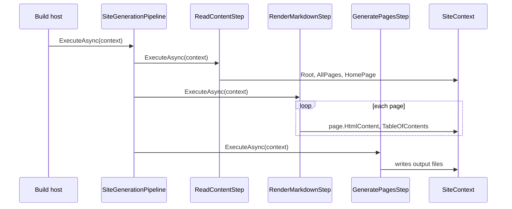
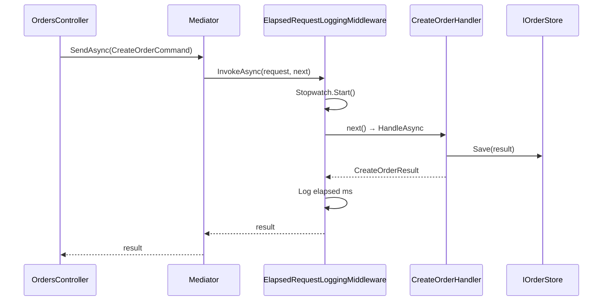

# Chain of Responsibility

**Intent:** Avoid coupling the sender of a request to its receiver by giving more than one object a chance to handle the request. Chain the receiving objects and pass the request along the chain until an object handles it.

## The Behavioral Problem: Who Handles This Request?

Without Chain of Responsibility, a coordinator often becomes a **god method**: one function knows every handler, every order, and every cross-cutting concern (logging, validation, auth). Adding a feature means editing that coordinator. Worse, the *sender* (HTTP controller, CLI entry point) may need to know which downstream object should run — tight coupling from the edge of the system to the core.

Chain of Responsibility solves this by giving each handler a uniform interface and a way to **delegate forward**. The sender talks to the head of the chain (or pipeline) only. Each link decides whether to handle, pass on, wrap, or augment the request. The pattern appears in two flavors in this repo:

- **Classic CoR** — first handler that accepts the work stops the chain (optional pass).
- **Pipeline CoR** — every stage runs in order, mutating shared context (MDWeb) or wrapping a terminal handler (LightMediator middleware).

Both avoid central switch statements and keep senders ignorant of the full handler graph.

## GoF Participants → Real Classes

| GoF role | Responsibility | MDWeb mapping | LightMediator mapping |
|----------|----------------|---------------|----------------------|
| **Handler** | Defines successor interface; optional default pass | `IGenerationStep` | `IRequestMiddleware<TRequest,TResponse>` |
| **ConcreteHandler** | Handles or forwards | `ReadContentStep`, `RenderMarkdownStep`, … | `ElapsedRequestLoggingMiddleware<,>` |
| **Client** | Initiates request on chain | Host app calling `SiteGenerationPipeline.ExecuteAsync` | `OrdersController` / `ImagesController` calling `IMediator.SendAsync` |
| **Receiver** (often implicit) | Terminal handler | Last pipeline step | `IRequestHandler<TRequest,TResponse>` at chain center |

LightMediator's middleware chain is CoR where **every** middleware runs; the innermost link is always the request handler. MDWeb's pipeline is CoR where **every** step runs; there is no "first handler wins" early exit unless a step throws.

---

## Example 1: MDWeb — Site Generation Pipeline

MDWeb builds static sites from markdown. Generation is not one monolithic function — it is a **sequence of stages**, each responsible for one transformation, all sharing one `SiteContext`.

### Conceptual flow

Each page starts as raw markdown on disk. Over the pipeline it becomes normalized links, HTML, rewritten URLs, post-processed HTML, generated files, copied assets, and optionally PDF export. Stages depend on earlier stages having populated `SiteContext` (content tree, rendered HTML, theme paths). The behavioral win: **adding a stage does not edit existing stages**.

### Key classes and collaboration

| Class | Role | State held | Called by / calls |
|-------|------|------------|-------------------|
| `IGenerationStep` | Handler contract: `Name`, `ExecuteAsync(context)` | None (behavior only) | Implemented by each step |
| `SiteGenerationPipeline` | Client-facing orchestrator | `IEnumerable<IGenerationStep>`, `ILogger` | Called by app host; iterates steps in DI registration order |
| `SiteContext` | Shared mutable context passed along chain | `Root`, `AllPages`, `HomePage`, configuration, theme, output paths | Every step reads/writes |
| `ReadContentStep` | First stage: load files, build tree | `IContentReader`, logger | Reads config from context; writes `Root`, `AllPages`, `HomePage` |
| `RenderMarkdownStep` | Converts markdown → HTML per page | `IMarkdownRenderer` (Strategy) | Reads `AllPages[].RawMarkdown`; writes `HtmlContent`, `TableOfContents` |
| `GeneratePagesStep`, `CopyAssetsStep`, … | Later stages | Step-specific services | Mutate context or filesystem |

`IGenerationStep` is documented in source as Chain of Responsibility:

```csharp
/// Chain of Responsibility: a single step in the site generation pipeline.
public interface IGenerationStep
{
    string Name { get; }
    Task ExecuteAsync(SiteContext context, CancellationToken cancellationToken = default);
}
```

`SiteGenerationPipeline` is the **client** that walks the chain:

```csharp
public async Task ExecuteAsync(SiteContext context, CancellationToken cancellationToken = default)
{
    foreach (var step in steps)
    {
        logger.LogInformation("Running step: {StepName}", step.Name);
        await step.ExecuteAsync(context, cancellationToken);
    }
}
```

There is no `next` delegate — order is **extrinsic** (DI registration order) rather than each handler holding a successor pointer. That is a valid CoR variant: the chain is assembled at composition root, not linked at runtime.

### Sequence walkthrough: one build



1. Host constructs `SiteContext` from configuration and invokes the pipeline.
2. `ReadContentStep` calls `IContentReader.ReadAsync`, assigns `context.Root`, collects pages via `NavigationBuilder.CollectPages`, picks a home page.
3. `RenderMarkdownStep` loops `context.AllPages`, calls `IMarkdownRenderer.Render` (Strategy — see chapter 9), stores HTML and headings on each page.
4. Subsequent steps (normalize links, rewrite, post-process, generate, copy assets, export PDF) each assume prior fields exist. A missing step surfaces as a null reference or empty output, not as a compile error — pipeline contracts are **implicit** and documented by step order.

### Adding a step (Open/Closed)

To add `ValidateFrontMatterStep`, implement `IGenerationStep`, register it in DI **before** render if validation must see raw markdown, or after read if it only inspects front matter. No edit to `RenderMarkdownStep` or `SiteGenerationPipeline` loop body.

### Trade-offs

| Benefit | Cost |
|---------|------|
| Stages are small, testable units | Step order is convention + DI — wrong order fails at runtime |
| Shared `SiteContext` avoids copying large trees | Context becomes a "god bag" if discipline slips |
| Easy to add/remove stages | No built-in "skip if handled" — all steps run |

**Alternatives:** A single `BuildSite()` method (simplest for tiny sites); workflow engines with explicit DAGs (better when steps have complex dependencies); Mediator-style dispatch (overkill when order is strictly linear).

---

## Example 2: LightMediator — Request Middleware Chain

LightMediator implements CoR for **cross-cutting request processing**. Business logic lives in `IRequestHandler`; logging, validation, caching, and auth live in `IRequestMiddleware` wrappers.

### The behavioral problem

Controllers should not open-code timing logs around every handler. Handlers should not depend on logging abstractions if the concern is universal. Middleware chains let **orthogonal concerns** wrap the terminal handler without subclassing every handler.

### Key classes

| Class | Role | State held | Called by / calls |
|-------|------|------------|-------------------|
| `IMediator` | Client API | — | `SendAsync` → `Mediator` |
| `Mediator` | Builds chain per request type | `IServiceProvider`, `INotificationPublisher` | Resolves handler + middlewares; invokes composed delegate |
| `IRequestHandler<TRequest,TResponse>` | Terminal receiver | Handler dependencies (stores, loggers) | `HandleAsync` — never called by client directly |
| `IRequestMiddleware<TRequest,TResponse>` | CoR link | Middleware dependencies | `InvokeAsync(request, next, ct)` — must call `next` to continue |
| `RequestHandlerDelegate<TResponse>` | Continuation | Closure over inner chain | Passed to each middleware |

Core chain construction in `Mediator.SendCore`:

```csharp
var handler = serviceProvider.GetService<IRequestHandler<TRequest, TResponse>>();
var middlewares = serviceProvider.GetServices<IRequestMiddleware<TRequest, TResponse>>().ToArray();

RequestHandlerDelegate<TResponse> next = cancellationToken => handler.HandleAsync(request, cancellationToken);
for (var i = middlewares.Length - 1; i >= 0; i--)
{
    var middleware = middlewares[i];
    var inner = next;
    next = cancellationToken => middleware.InvokeAsync(request, inner, cancellationToken);
}
return await next(cancellationToken);
```

The loop runs **backward** so the **first registered middleware is outermost** — it executes first on the way in and last on the way out (classic ASP.NET Core onion).

### Sequence walkthrough: CreateOrder with logging middleware



1. `OrdersController` builds `CreateOrderCommand` and calls `mediator.SendAsync` — it knows nothing about middleware.
2. `Mediator` resolves `CreateOrderHandler` and any `IRequestMiddleware<CreateOrderCommand, CreateOrderResult>`.
3. Outer middleware starts a stopwatch, awaits `next`.
4. `CreateOrderHandler` persists via `IOrderStore`, returns `CreateOrderResult`.
5. Middleware `finally` block logs request type and duration, returns response upstream.

Sample middleware (`LightMediator.Samples.Application.ElapsedRequestLoggingMiddleware`) and ImgKit's copy (`ImgKit.Application.Middleware.ElapsedRequestLoggingMiddleware`) are identical in structure — open generic `TRequest,TResponse` so one registration covers all commands.

### GoF mapping

- **Handler:** `IRequestMiddleware`
- **ConcreteHandler:** `ElapsedRequestLoggingMiddleware<,>`
- **Receiver:** `CreateOrderHandler`, `ApplyFilterHandler`, …
- **Client:** `IMediator` caller

### Trade-offs

| Benefit | Cost |
|---------|------|
| Cross-cutting logic in one place | Middleware order matters; debugging deep stacks |
| Handlers stay focused on domain | Too many middleware layers obscure flow |
| Type-safe per request/response | Open generics can confuse DI registration |

**Alternatives:** Decorator on each handler (N decorators); AOP/weaving; inline `try/finally` in Mediator (loses extensibility). For HTTP-only concerns, ASP.NET middleware pipeline duplicates this at transport layer — LightMediator duplicates it at **application message** layer, which is why ImgKit uses both.

---

## Example 3: ImgKit — Logging Middleware on Image Commands

ImgKit registers LightMediator with open middleware:

```csharp
services.AddLightMediator(typeof(ImgKit.Application.AssemblyMarker).Assembly);
services.AddOpenRequestMiddleware(typeof(ElapsedRequestLoggingMiddleware<,>));
```

Every image command (`ResizeImageCommand`, `ApplyFilterCommand`, …) passes through elapsed-time logging before reaching handlers in `ImageHandlers.cs`. The **sender** is `ImagesController`; it only builds commands and calls `SendAsync`. It never references `ElapsedRequestLoggingMiddleware`.

Behaviorally, ImgKit's chain is:

```
ImagesController → IMediator → [LoggingMiddleware → … → ImageHandler] → ProcessedImageResult
```

The handler then delegates to `ImageProcessingHandlerBase.ProcessAsync` (Template Method — chapter 10). CoR ends at handler entry; pixel work is not a middleware chain.

---

## Chain vs Pipeline — Decision Guide

| Aspect | Classic CoR | MDWeb / LightMediator pipeline |
|--------|-------------|--------------------------------|
| Typical outcome | One handler processes | All links run |
| Stopping | Handler omits `next` or returns | Exception aborts pipeline |
| Shared state | Often per-request message object | `SiteContext` or wrapped delegate |
| Composition | Linked list or builder | DI-ordered enumerable / reversed delegate stack |
| Best when | Optional handlers (auth, caching hit) | Fixed multi-stage transforms or universal wrappers |

Both patterns **decouple the sender from receiver topology**. Choose classic CoR when stages are optional or competitive; choose pipeline CoR when every stage must run or when wrapping a single terminal handler.

## Pitfalls

- **Silent order bugs** — MDWeb steps depend on implicit context fields; document registration order in DI module.
- **Forgotten `next`** — Middleware that never calls `next` short-circuits the handler (sometimes intentional, usually a bug).
- **Heavy context** — `SiteContext` growth invites steps that read unrelated fields; keep steps cohesive.

## Next

[Command →](03-command.md)
