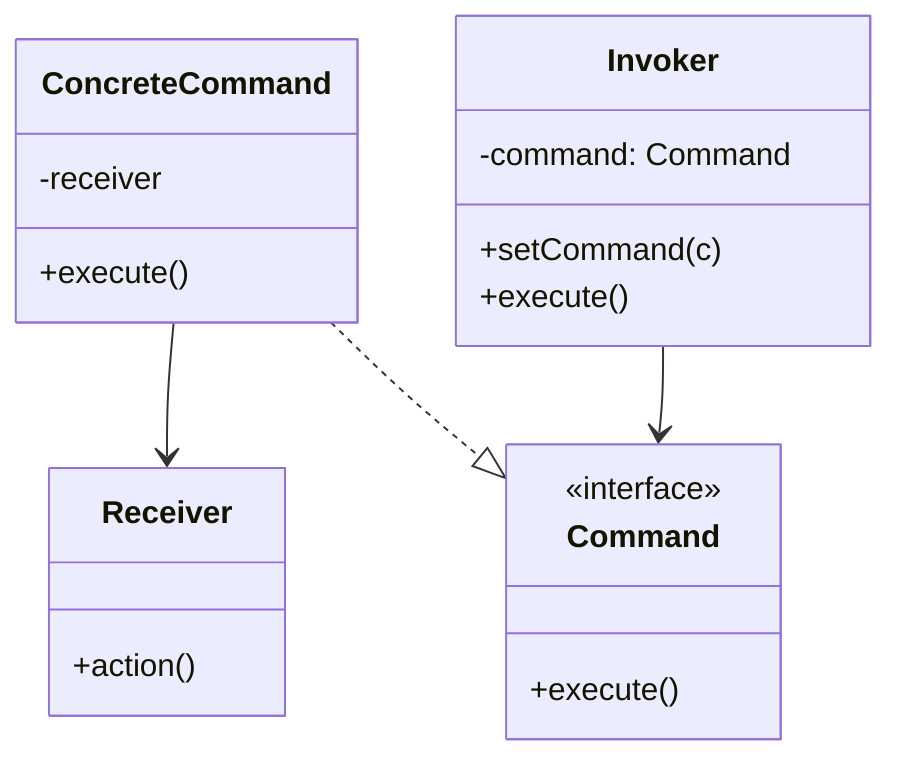
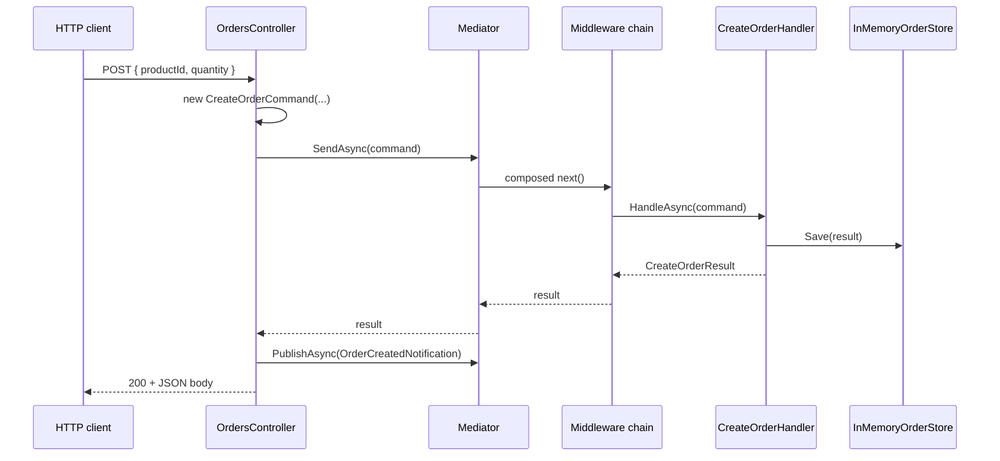
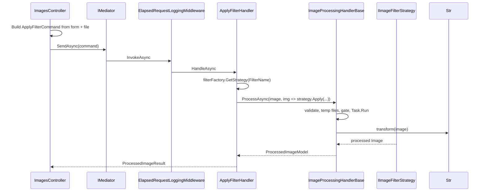

# Command

**Intent:** Encapsulate a request as an object, thereby letting you parameterize clients with different requests, queue or log operations, and support undo.

## The Behavioral Problem: Actions as Procedures vs Actions as Objects

The naive design exposes **methods** everywhere: `orderService.Create(...)`, `imageService.Resize(...)`, `filterEditor.AddGroup()`. Callers depend on service interfaces that grow without bound. Testing requires heavy mocks. Cross-cutting behavior (logging, transactions, validation) wraps each call site differently. You cannot easily **record**, **replay**, or **route** an action because the action is not data — it is a function invocation frozen in source code.

Command inverts this: the request **is an object**. The object carries parameters (the DTO payload). Something else — an invoker — decides when and where to execute. Handlers become single-purpose collaborators registered against request types. That separation is the heart of behavioral decoupling for "do something" workflows.

This repository uses Command in three distinct flavors:

1. **LightMediator / ImgKit** — `IRequest<TResponse>` + `IRequestHandler` (application commands with typed responses).
2. **SkyUI** — `System.Windows.Input.ICommand` (UI actions bound to buttons).
3. **GoF textbook** — invoker holds command reference; command holds receiver reference (ImgKit handlers combine receiver + execution via inheritance from `ImageProcessingHandlerBase`).

## GoF Structure (Reference)



In LightMediator, the **ConcreteCommand** is the request record; **execute** is `HandleAsync`; **Invoker** is `IMediator`; **Receiver** is the handler (often with injected services).

---

## Example 1: LightMediator — IRequest as Command (Primary)

LightMediator is intentionally a **Command + Mediator** library. Every application message that expects one handler implements `IRequest<TResponse>`.

### Interfaces and roles

| Type | GoF role | State | Who calls whom |
|------|----------|-------|----------------|
| `IRequest<TResponse>` | Command (marker + response type param) | Immutable record fields on concrete types | Created by client; passed to `IMediator.SendAsync` |
| `IRequest` | Command with `Unit` response | Same | Void-style commands |
| `IRequestHandler<TRequest,TResponse>` | Receiver + execute logic | `IOrderStore`, loggers, etc. | Resolved by `Mediator`; never referenced by controller |
| `IMediator` | Invoker interface | — | Controllers, other handlers call `SendAsync` |
| `Mediator` | Concrete invoker | `IServiceProvider`, `INotificationPublisher` | Builds middleware chain, dispatches to handler |
| `IRequestMiddleware<,>` | Optional CoR wrapper (chapter 2) | Logger, etc. | Wraps handler invocation |

```csharp
public interface IRequest<out TResponse> { }

public interface IRequestHandler<in TRequest, TResponse>
    where TRequest : IRequest<TResponse>
{
    Task<TResponse> HandleAsync(TRequest request, CancellationToken cancellationToken);
}
```

### Sample command definitions

Contracts live in a thin assembly (`LightMediator.Samples.Contracts`):

```csharp
public sealed record CreateOrderCommand(string ProductId, int Quantity) : IRequest<CreateOrderResult>;

public sealed record CreateOrderResult(int OrderId, string ProductId, int Quantity);

public sealed record OrderCreatedNotification(int OrderId, string ProductId, int Quantity) : INotification;
```

The command is a **pure DTO**: no behavior, easy to serialize, validate, and log. Response type is encoded in the interface (`IRequest<CreateOrderResult>`), so `SendAsync` returns `CreateOrderResult` without casting.

### Handler (receiver)

`CreateOrderHandler` holds **`IOrderStore`** (persistent state for orders) and **`ILogger`**. It is the only class that knows how to create an order from the command payload:

```csharp
public sealed class CreateOrderHandler(IOrderStore orders, ILogger<CreateOrderHandler> logger)
    : IRequestHandler<CreateOrderCommand, CreateOrderResult>
{
    public Task<CreateOrderResult> HandleAsync(CreateOrderCommand request, CancellationToken cancellationToken)
    {
        var id = 1; // sample assigns fixed id
        var result = new CreateOrderResult(id, request.ProductId, request.Quantity);
        orders.Save(result);
        logger.LogInformation("Created order {OrderId} for {ProductId}", id, request.ProductId);
        return Task.FromResult(result);
    }
}
```

**Who calls whom:** `OrdersController` never calls `CreateOrderHandler` directly. `Mediator.SendAsync` resolves the handler from DI by closed generic `IRequestHandler<CreateOrderCommand, CreateOrderResult>`.

### Invoker path: controller → mediator → handler

```csharp
[HttpPost]
public async Task<ActionResult<CreateOrderResult>> Create([FromBody] CreateOrderRequest body, CancellationToken cancellationToken)
{
    var command = new CreateOrderCommand(body.ProductId, body.Quantity);
    var result = await mediator.SendAsync(command, cancellationToken);

    await mediator.PublishAsync(
        new OrderCreatedNotification(result.OrderId, result.ProductId, result.Quantity),
        cancellationToken);

    return Ok(result);
}
```

Note the **separation of command vs notification**: creating the order is a Command (exactly one handler, typed result). Announcing success is Observer/Mediator publish (zero or many handlers) — covered in chapters 5 and 7.

### Sequence walkthrough: POST /api/orders



### Void commands

`DeleteOrderCommand` implements `IRequest<Unit>`. `Unit` is a stand-in for "no meaningful return" while keeping `SendAsync` generic. Handler returns `Task.FromResult(Unit.Value)` after side effect.

### Why this is Command (not just DI)

- **Parameterization:** Controller depends on `IMediator` only — one injection for all operations.
- **Single responsibility:** Each handler is one use case; no fat `IOrderService` with twelve methods.
- **Extensibility:** New command = new record + new handler + DI registration; no controller edits except new endpoint if exposed.
- **Pipeline:** Middleware treats all requests uniformly (logging, validation).
- **Future undo:** Command objects could be pushed to a history stack; handler logic is already isolated in `HandleAsync`.

### Trade-offs

| Benefit | Cost |
|---------|------|
| Thin controllers, testable handlers | More types (command + handler per use case) |
| Type-safe dispatch | Reflection in `Mediator` for closed generic dispatch |
| Uniform cross-cutting middleware | Indirection when debugging |

**Alternatives:** Direct service injection (simpler for CRUD apps); domain events only (no request/response); CQRS with separate buses (heavier). LightMediator targets in-process application layers where Mediator + Command is the sweet spot.

---

## Example 2: ImgKit — Image Commands End-to-End

ImgKit applies the same LightMediator Command model to **binary image operations**. Each HTTP endpoint maps to one command type and one handler.

### Command layer

Commands live in `ImgKit.Contracts.Images` and implement `IRequest<ProcessedImageResult>` (or `IRequest<ImageInfoResult>` for queries):

```csharp
public sealed partial class ResizeImageCommand : IRequest<ProcessedImageResult>
{
    public ImageInput Image { get; init; } = null!;
    public int Width { get; init; }
    public int Height { get; init; }
    public string Resampling { get; init; } = "Bicubic";
}

public sealed partial class ApplyFilterCommand : IRequest<ProcessedImageResult>
{
    public ImageInput Image { get; init; } = null!;
    public string FilterName { get; init; } = string.Empty;
    public double? Radius { get; init; }
    // ...
}
```

Commands are **partial** with LightMapper attributes — mapping to internal specifications without exposing domain types on the API boundary. `ImageInput` holds uploaded bytes and filename; it travels with the command object.

### Handler layer (receiver + template method)

`ResizeImageHandler` **is** the receiver. It inherits `ImageProcessingHandlerBase` (Template Method) and implements `IRequestHandler<ResizeImageCommand, ProcessedImageResult>`:

```csharp
public sealed class ResizeImageHandler(...) 
    : ImageProcessingHandlerBase(tempFiles, processingGate),
      IRequestHandler<ResizeImageCommand, ProcessedImageResult>
{
    public async Task<ProcessedImageResult> HandleAsync(ResizeImageCommand request, CancellationToken cancellationToken)
    {
        var specification = CommandModelMapper.ToSpecification<...>(request);
        ImageOperationValidator.ValidateDimensions(specification.Width, specification.Height);

        var model = await ProcessAsync(
            request.Image,
            image => image.Resize((specification.Width, specification.Height), resampling),
            cancellationToken: cancellationToken);

        return CommandModelMapper.ToContract(model);
    }
}
```

**State in handler:** `ITempImageFileStore`, `IPillowNetProcessingGate` (via base), plus strategy factories on filter/enhancement handlers.

**Collaboration:** `ApplyFilterHandler` resolves `IImageFilterStrategy` from `IImageFilterStrategyFactory` (Strategy — chapter 9) and passes `strategy.Apply` as the `transform` hook to `ProcessAsync`.

### Controller (client / invoker caller)

`ImagesController` depends only on `IMediator`:

```csharp
public sealed class ImagesController(IMediator mediator) : ControllerBase
{
    [HttpPost("resize")]
    public async Task<IActionResult> Resize(IFormFile image, [FromForm] ResizeImageRequest request, ...)
    {
        var input = await image.ToImageInputAsync(cancellationToken);
        var command = new ResizeImageCommand { Image = input, Width = request.Width, ... };
        var result = await mediator.SendAsync(command, cancellationToken);
        return ToFileResult(result);
    }
}
```

The controller **constructs** the command from HTTP primitives; it does not resize images.

### Full stack sequence: POST /api/images/apply-filter



### Command catalog (ImgKit)

| Command | Handler | Varying hook |
|---------|---------|--------------|
| `ResizeImageCommand` | `ResizeImageHandler` | `image.Resize(...)` |
| `CropImageCommand` | `CropImageHandler` | `image.Crop(...)` |
| `ApplyFilterCommand` | `ApplyFilterHandler` | `IImageFilterStrategy.Apply` |
| `EnhanceImageCommand` | `EnhanceImageHandler` | `IImageEnhancementStrategy.Apply` |
| `GetImageInfoQuery` | `GetImageInfoHandler` | `InspectAsync` (query, still Command-shaped) |

Queries as `IRequest<T>` are still Command pattern — "get info" is an encapsulated request with one handler.

### Trade-offs

ImgKit stacks **Command + Mediator + Chain + Template Method + Strategy**. The Command layer buys stable HTTP-to-domain boundaries; without it, controllers would call PillowNet directly and duplicate temp-file and timeout logic.

---

## Example 3: SkyUI — MVVM ICommand

Desktop UI uses a different Command interface — **`System.Windows.Input.ICommand`** — but the behavioral idea matches: **encapsulate a user action** so views bind declaratively without code-behind calling ViewModel methods by name.

### FilterEditorRelayCommand

```csharp
internal sealed class FilterEditorRelayCommand : ICommand
{
    private readonly Action _execute;
    private readonly Func<bool>? _canExecute;

    public bool CanExecute(object? parameter) => _canExecute?.Invoke() ?? true;
    public void Execute(object? parameter) => _execute();
}
```

| Role | Mapping |
|------|---------|
| Command | `FilterEditorRelayCommand` holds `_execute` closure |
| Invoker | Avalonia/WPF button/link when user clicks |
| Receiver | Lambda targets ViewModel methods (add group, export SQL) |

`FilterEditorNodeCommand` parameterizes with `FilterNodeBase?` — Execute only runs when parameter is a node, supporting context menus on tree items.

**State:** Delegates only; no payload object beyond the optional `parameter`. This is lighter than LightMediator records but less serializable.

**CanExecute:** Enables/disables UI without separate bindings; `CanExecuteChanged` would refresh buttons (not wired in minimal relay — production apps often use `RelayCommand` from CommunityToolkit with automatic requery).

### UI sequence

1. User clicks "Add condition" on filter editor.
2. Button's `Command` binding invokes `FilterEditorRelayCommand.Execute`.
3. Command runs ViewModel lambda that mutates `FilterDocument` tree (`FilterGroupNode.AddCondition`).
4. `INotifyPropertyChanged` on nodes (Observer — chapter 7) refreshes bound UI.

### Undo

None of these examples implement undo stacks. Command **enables** undo: push `(command, inverseCommand)` or memento snapshots onto a stack on each Execute. Spark scene editor could push `SceneDocument` mementos (chapter 6) when filter editor commands mutate the tree.

---

## Command vs Event / Notification

| Aspect | Command (`SendAsync`) | Notification (`PublishAsync`) |
|--------|----------------------|-------------------------------|
| Handlers | Exactly one expected | Zero or many |
| Return value | `TResponse` | `Task` (void aggregate) |
| Semantics | "Do this" | "This happened" |
| Failure | Handler missing throws | No handlers is OK |
| Example | `CreateOrderCommand` | `OrderCreatedNotification` |

Using Command for side effects and Notification for reactions keeps **write path** deterministic while allowing optional email, analytics, and logging subscribers.

---

## When to Use Command

Use Command when:

- Many operations share one entry point (mediator, message bus, undo stack).
- You want requests as data (API contracts, audit logs, validation pipelines).
- Handlers should stay small and testable in isolation.

Skip Command when:

- A two-method service suffices and will not grow.
- Operations are inherently multicast (prefer Observer/Notification).
- Latency-sensitive hot paths cannot afford allocation per request (rare in app layers).

---

## Next

[Iterator →](04-iterator.md)
