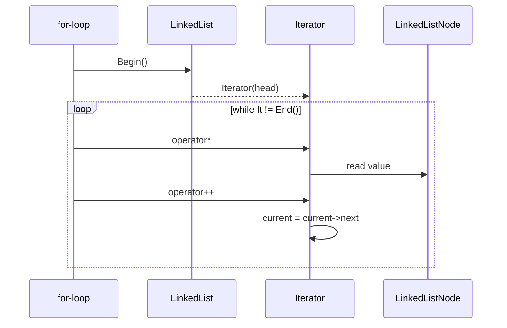

# Iterator

**Intent:** Provide a way to access the elements of an aggregate object sequentially without exposing its underlying representation.

## The Behavioral Problem: Traversal vs Structure

Collections hide **storage** (array, linked list, tree, columnar batch) behind an API. Callers often need **sequential access** — process every page, every node, every row — without knowing whether the backing store is contiguous memory, pointer chains, or lazy file I/O.

Two failure modes without Iterator:

1. **Leaky abstraction** — expose `Node*`, internal arrays, or `Children` lists; callers couple to structure and break when storage changes.
2. **Duplicated traversal** — every algorithm reimplements walk logic (recursive tree descent, UTF-8 decoding, batch paging).

Iterator separates **traversal protocol** from **container implementation**. The client asks for `Begin`/`End` or `foreach`; the aggregate supplies an iterator that knows how to advance. Multiple iterators can traverse the same structure concurrently (with defined invalidation rules).

This is fundamentally a **behavioral** pattern: it assigns responsibility for "how to walk" to a collaborator rather than to every consumer.

## GoF Participants → Real Classes

| GoF role | Spark `LinkedList` | C# `foreach` / LINQ | MDWeb navigation |
|----------|-------------------|----------------------|------------------|
| **Iterator** | `LinkedList<T>::Iterator` | `IEnumerator<T>` | (implicit recursion in `NavigationBuilder`) |
| **ConcreteIterator** | Holds `LinkedListNode<T>* current` | Enumerator over collection | — |
| **Aggregate** | `LinkedList<T>` | `IEnumerable<T>` | `ContentFolder` / content tree |
| **Client** | Range-for loop body | Pipeline code | `NavigationBuilder.CollectPages` |

---

## Example 1: Spark — LinkedList::Iterator (Classic External Iterator)

Spark's standard library includes a doubly linked list used where `std::list` might appear, with explicit iterators for C++ range-for compatibility.

### Aggregate state

`LinkedList<T>` holds:

- `head`, `tail` — pointers to first/last `LinkedListNode<T>`
- `num` — element count

Nodes store `value`, `prev`, `next`. The list **does not** expose node pointers publicly except through iterators.

### Iterator state and behavior

```cpp
class Iterator {
    LinkedListNode<T>* current = nullptr;
public:
    explicit Iterator(LinkedListNode<T>* node) : current(node) {}
    T& operator*() const { return current->value; }
    Iterator& operator++() { current = current->next; return *this; }
    bool operator==(Iterator other) const { return current == other.current; }
};
```

| Method | Role |
|--------|------|
| `Begin()` | Returns iterator at `head` |
| `End()` | Returns iterator at `nullptr` (sentinel) |
| `operator++` | Advances `current` along `next` |
| `operator*` | Dereferences **value**, not node |

**Who calls whom:** Client code (or range-for desugaring) compares iterator to `End()`, increments, reads `*it`. `LinkedList` never runs the loop body — it only factory-builds iterators.

### Sequence walkthrough



### Invalidation rules (documented in source)

Stable iterators across `PushBack` **unless** the node referenced is erased. This contract matches typical linked-list iterator semantics — callers must not hold iterators across mutating operations they do not control.

### ConstIterator

Parallel `ConstIterator` and `Begin() const` allow read-only traversal without mutable `T&` — same pattern as `const_iterator` in STL.

### Trade-offs

| Benefit | Cost |
|---------|------|
| O(1) insert at ends | No random access by index |
| Range-for ergonomics | Pointer chasing vs array cache locality |
| Encapsulation | External iterator verbose vs internal |

**Alternatives:** Index-based `for (i < size)` if random access container; internal iterator (coroutines in C++20); callback `ForEach(fn)` (no multiple concurrent traversals).

---

## Example 2: Spark — Utf8String::ConstIterator (Traversal Logic as Iterator)

UTF-8 strings are **not** one codepoint per byte. Naive `for (i = 0; i < length; i++)` breaks on multibyte sequences.

`Utf8String::ConstIterator` (referenced in engine docs) advances by **decoded codepoint width** via `NextCodepoint()`. The iterator encapsulates:

- Current byte offset in the string
- Decode rules for UTF-8 leading/trailing bytes

**Behavioral point:** The **aggregate** still looks like a byte buffer; the **iterator** owns the algorithm for "what is one element." Clients iterate **characters** without calling decode helpers in every loop.

Same pattern appears in RainDB when scanning columnar batches: logical "row" iteration may skip internal column layout — language-level `foreach` over abstractions hides physical storage.

---

## Example 3: MDWeb — Tree Traversal (Implicit Iterator)

MDWeb's content model is a **tree** of folders and markdown pages. `ReadContentStep` loads the tree into `SiteContext.Root`. `NavigationBuilder.CollectPages` walks the tree recursively to flatten pages into `context.AllPages`:

```csharp
// Conceptual: recursive descent over ContentFolder.Children
private static NavigationNode BuildNode(ContentNode node) { ... }
```

There is no named `IEnumerator<ContentNode>`, but the behavior matches Iterator:

- **Sequential access** over a composite structure
- **Without** exposing internal child storage details to every pipeline step
- Each page eventually appears in `AllPages` for `RenderMarkdownStep` to foreach

### Could be explicit

Refactoring to `IEnumerable<ContentPage> EnumeratePages(ContentNode root)` would:

- Centralize walk order (depth-first vs breadth-first)
- Enable lazy evaluation if the tree grows huge
- Give pipeline steps a uniform `foreach (var page in ...)` 

Today, **flatten-then-loop** in `RenderMarkdownStep` is Iterator at the collection level:

```csharp
foreach (var page in context.AllPages)
{
    var result = markdownRenderer.Render(page.RawMarkdown);
    page.HtmlContent = result.Html;
}
```

The iterator is C# compiler-generated over `List<T>` — still Iterator pattern via `IEnumerable`.

---

## Example 4: C# foreach and IEnumerable

.NET mainstreams Iterator via:

- `IEnumerable<T>` — aggregate exposes `GetEnumerator()`
- `IEnumerator<T>` — `MoveNext()`, `Current`, `Dispose()`
- `foreach` — syntactic sugar

SkyUI's `FilterGroupNode.Children` is `ObservableCollection<FilterNodeBase>`. UI and visitors iterate children with `foreach` — each child may be `FilterConditionNode` or nested `FilterGroupNode` (Composite + traversal).

RainDB execution engines iterate `IColumnarBatch` rows without exposing column buffers — same decoupling at data-plane scale.

---

## External vs Internal Iterator

| External (Spark C++) | Internal (C# foreach) |
|---------------------|------------------------|
| Client drives `++` | Enumerator drives `MoveNext` |
| Multiple traversal strategies possible | Single protocol per `GetEnumerator` |
| Explicit end sentinel | `MoveNext` returns false |
| Spark `LinkedList::Iterator` | MDWeb `foreach (var page in ...)` |

GoF catalog emphasizes external iterators; modern C# favors internal. Both satisfy "traverse without exposing representation."

---

## Iterator vs Visitor

Both walk structures; responsibilities differ:

| Iterator | Visitor |
|----------|---------|
| **Question:** "What is the next element?" | **Question:** "What operation applies to each element type?" |
| One traversal mechanism | Many operations (`VisitGroup`, `VisitCondition`) |
| Spark list walk | SkyUI filter tree → SQL |
| Client supplies loop body | Visitor supplies per-type methods |

SkyUI filter editor uses **Visitor** for SQL export and could use Iterator for "list all conditions" — complementary.

---

## Pitfalls

- **Concurrent modification** — mutating collection while iterating invalidates enumerators (`InvalidOperationException` in .NET).
- **Exposing raw indices** on linked structures — defeats purpose of iterator abstraction.
- **Giant lazy sequences** — without iterator, eager `ToList()` on huge trees wastes memory.

---

## Trade-offs Summary

| Use Iterator when | Consider alternatives when |
|-------------------|---------------------------|
| Many algorithms share same walk order | Single `ForEach` callback suffices |
| Representation may change | Public read-only index access is stable forever |
| Need lazy/paged access | LINQ already expresses query, not walk |

---

## Next

[Mediator →](05-mediator.md)
