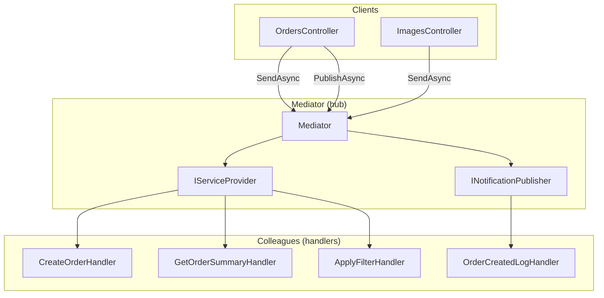
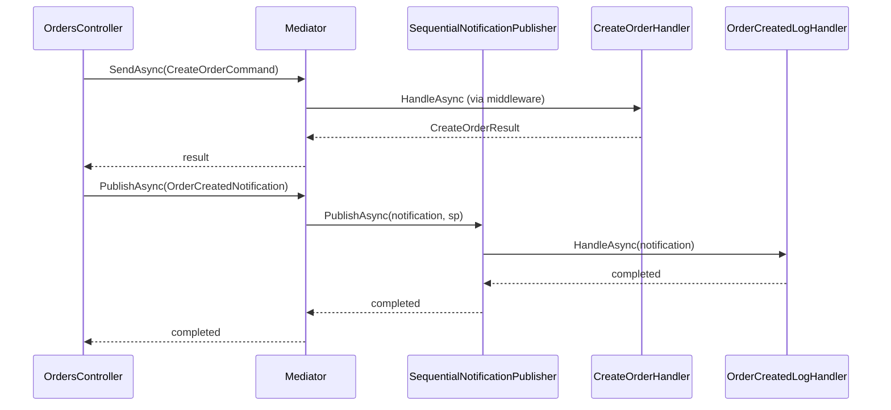

# Mediator

**Intent:** Define an object that encapsulates how a set of objects interact. Mediator promotes loose coupling by keeping objects from referring to each other explicitly, and it lets you vary their interaction independently.

## The Behavioral Problem: N² Colleague References

Imagine an order flow where the controller calls the order handler, which calls the email service, which calls analytics, and the controller *also* calls analytics on success. Every new reaction (SMS, inventory sync) adds imports and method calls across layers. Handlers start knowing about each other "just for this one notification." The web of dependencies grows as **O(N²)** potential edges among N participants.

**Mediator** introduces a hub: colleagues talk to the mediator; the mediator routes messages. Colleagues do not hold references to sibling handlers. Adding `OrderCreatedSmsHandler` means registering `INotificationHandler<OrderCreatedNotification>` — no edit to `CreateOrderHandler` or `OrdersController` beyond optional publish call.

This is behavioral **coordination** — not Facade (simplify API for one client) and not Observer alone (mediator often *implements* observer dispatch plus command routing).

## GoF Participants → LightMediator

| GoF role | LightMediator class | State | Collaboration |
|----------|---------------------|-------|---------------|
| **Mediator** | `IMediator`, `Mediator` | `IServiceProvider`, `INotificationPublisher` | Receives all Send/Publish; never contains business rules |
| **Colleague** | `IRequestHandler`, `INotificationHandler`, `IRequestMiddleware` | Domain dependencies | Registered in DI; resolved by type |
| **ConcreteColleague** | `CreateOrderHandler`, `OrderCreatedLogHandler`, … | Stores, loggers | Handle one message type |
| **Client** | `OrdersController`, `ImagesController` | `IMediator` only | Sends commands; may publish notifications |

Colleagues **never reference each other**. The only shared knowledge is message type names in contracts assembly.

---

## Example 1: LightMediator — Mediator Class

### Mediator responsibilities

`Mediator` is stateless aside from service provider and notification publisher strategy:

```csharp
public sealed class Mediator : IMediator
{
    private readonly IServiceProvider _serviceProvider;
    private readonly INotificationPublisher _notificationPublisher;

    public Task<TResponse> SendAsync<TResponse>(IRequest<TResponse> request, ...)
    {
        // Resolve cached invoker per (requestType, responseType)
        // Delegate to SendCore → handler + middleware chain
    }

    public Task PublishAsync<TNotification>(TNotification notification, ...)
        where TNotification : INotification
    {
        return _notificationPublisher.PublishAsync(notification, _serviceProvider, cancellationToken);
    }
}
```

**SendAsync** path (Command + Chain — chapters 3 and 2):

1. Look up or build closed-generic invoker for runtime request type.
2. `SendCore` resolves `IRequestHandler<TRequest,TResponse>`.
3. Wrap handler with all `IRequestMiddleware<TRequest,TResponse>` instances.
4. Await composed delegate.

**PublishAsync** path (Observer dispatch):

1. Delegate to `INotificationPublisher` implementation.
2. Publisher resolves all `INotificationHandler<TNotification>` from DI.
3. Invoke sequentially or in parallel per publisher strategy.

### Architecture diagram



### Sequence: create order + notify



Controller orchestrates **two mediator operations** — command then notification — but still knows no handler types.

---

## Send vs Publish — Two Mediator Channels

| | **Send** (Command) | **Publish** (Notification) |
|--|-------------------|---------------------------|
| Contract | `IRequest<TResponse>` | `INotification` |
| Handlers | One `IRequestHandler<,>` | Many `INotificationHandler<>` |
| Return | `TResponse` to caller | `Task` only |
| Missing handler | `HandlerNotFoundException` | Silent no-op |
| Use when | Request/response workflow | "Something happened" fan-out |

Behaviorally, **Send** is deterministic routing; **Publish** is Observer mediated through the hub. Keeping both on `IMediator` gives clients one dependency while preserving semantic distinction.

---

## Notification Publisher Strategy

Fan-out policy is itself pluggable (**Strategy** — chapter 9):

```csharp
public interface INotificationPublisher
{
    Task PublishAsync<TNotification>(TNotification notification, IServiceProvider sp, CancellationToken ct);
}
```

### SequentialNotificationPublisher

- Resolves handlers via `GetServices<INotificationHandler<TNotification>>()`.
- `foreach` — `await handler.HandleAsync` one after another.
- **State:** none (stateless).
- **Guarantee:** registration order defines invocation order — useful when logs must precede side effects.

### ParallelNotificationPublisher

- Copies handlers to array.
- Starts all `HandleAsync` tasks, `await Task.WhenAll`.
- **Trade-off:** faster when handlers are I/O bound; handlers must not assume order; shared mutable state requires synchronization.

**Mediator does not change** when swapping publishers — only DI registration of `INotificationPublisher` implementation. That is Liskov substitution on a behavioral strategy.

---

## Example 2: ImgKit Integration

ImgKit registers the mediator over the application assembly:

```csharp
services.AddLightMediator(typeof(ImgKit.Application.AssemblyMarker).Assembly);
services.AddOpenRequestMiddleware(typeof(ElapsedRequestLoggingMiddleware<,>));
```

All image handlers (`ResizeImageHandler`, `ApplyFilterHandler`, …) become **colleagues** discovered by assembly scan. `ImagesController` is the sole HTTP entry point to the hub.

**Behavioral win:** Adding `CompositeImageCommand` adds handler + command record; controller adds endpoint; no changes to existing handlers or middleware.

---

## Mediator vs Facade

| Mediator | Facade |
|----------|--------|
| Colleagues know mediator exists (handlers implement mediator interfaces) | Subsystem classes often unaware of facade |
| Routes many-to-many messages | Typically simplifies client → subsystem |
| Handlers peer through hub | Facade wraps complex API for one caller |
| LightMediator | Hypothetical `ImageProcessingFacade` with `Resize()`, `Crop()` methods |

A Facade could hide ImgKit handlers behind one class — but each new operation still edits the facade. Mediator + Command avoids that central class.

---

## Mediator vs Event Bus

| LightMediator | Distributed event bus |
|---------------|----------------------|
| In-process, same `IServiceProvider` scope | Cross-process, serialization |
| Type-safe `IRequest<T>` / `INotification` | String topic names, schema versioning |
| Middleware on commands only | Broker-level retries, DLQ |
| ImgKit / sample API | Kafka, RabbitMQ, Azure Service Bus |

Do not use LightMediator as a network bus — different failure modes and consistency models.

---

## Mediator vs Observer (Raw)

Raw Observer: subject maintains `List<IObserver>` and calls `Update()`. Colleagues may still reference subject.

Mediator + Notification: subject (publisher) is **`IMediator.PublishAsync`**; mediator resolves subscribers from DI. Handlers do not subscribe at runtime — registration is composition root. Better for ASP.NET scoped lifetimes and test doubles.

---

## Trade-offs

| Benefit | Cost |
|---------|------|
| Colleagues decoupled | Mediator can become "god hub" if abused for business logic |
| Uniform dispatch | Indirection and reflection for generic Send |
| Middleware + notifications in one package | Team must discipline Send vs Publish semantics |
| Easy to add handlers | Harder to trace full flow without tooling |

**Alternatives:** Direct DI of many handlers into controller (simple apps); source-generated dispatch (compile-time routing); message queues for cross-service workflows.

**When Mediator fits:** Application layer with many use cases, cross-cutting middleware, and multiple reactions to domain events — exactly LightMediator and ImgKit.

---

## Next

[Memento →](06-memento.md)
