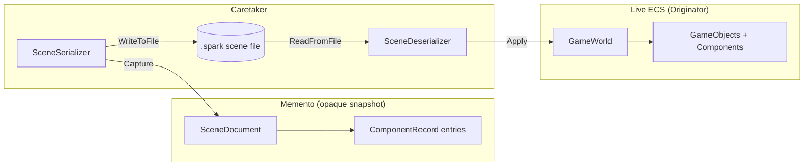
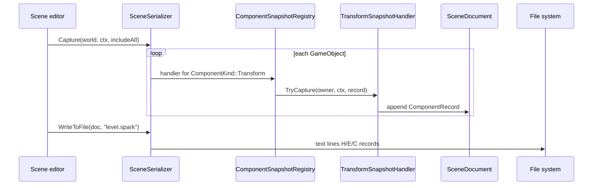
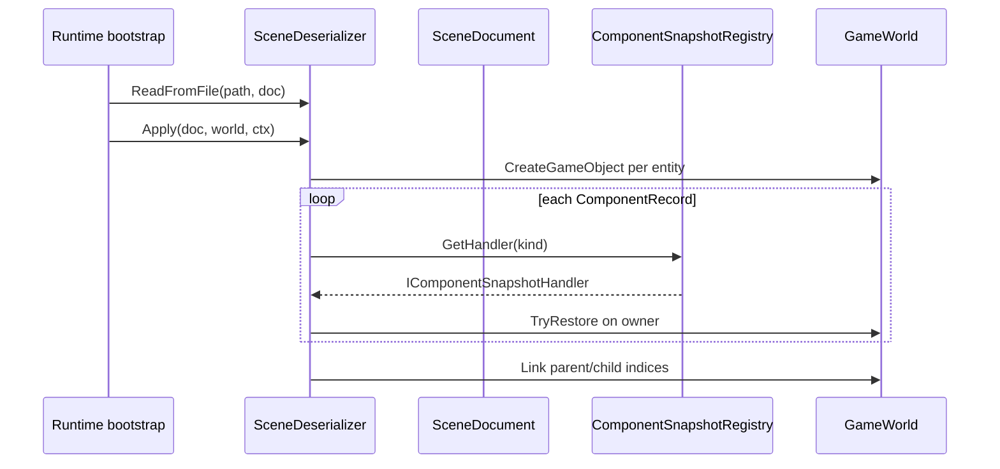

# Memento

**Intent:** Without violating encapsulation, capture and externalize an object's internal state so that the object can be restored to this state later.

## The Behavioral Problem: Saving State Without Breaking Encapsulation

Undo, save files, checkpoints, and crash recovery all need **snapshots** of complex object graphs. The naive approach exposes internals: public getters for every private field, JSON serialization on live entities, or friend classes that reach into components. That couples persistence format to runtime types and makes refactoring dangerous — any field rename breaks saves.

**Memento** splits roles:

- **Originator** knows how to produce and consume a snapshot (capture/restore hooks).
- **Memento** holds the snapshot data — ideally opaque to outsiders.
- **Caretaker** stores mementos and decides when to save/restore — without inspecting memento contents.

The caretaker can stack mementos for undo; the originator remains the only class that interprets snapshot bytes/records.

---

## GoF Participants → Spark Scene Serialization

| GoF role | Spark class | State held | Who calls whom |
|----------|-------------|------------|----------------|
| **Originator** | Live `GameObject` + attached `GameComponent`s in `GameWorld` | Runtime transforms, meshes, physics, health, … | Queried by serializer during capture; mutated during restore |
| **Memento** | `SceneDocument`, `ComponentRecord`, entity headers | Serialized text/binary structure — no live pointers | Produced by `SceneSerializer`; consumed by `SceneDeserializer` |
| **Caretaker** | `SceneSerializer`, `SceneDeserializer`, editor save/load, file I/O | Path strings, optional filters | Orchestrates capture/write/read/apply; does not parse component payloads |
| **Strategy helpers** | `IComponentSnapshotHandler` per `ComponentKind` | Stateless handlers | Registry dispatches capture/restore per component type |



---

## Example 1: Spark — Scene Serialization

Spark's editor and runtime load scenes from text **scene documents** while simulation uses ECS entities. Serialization is Memento at engine scale: the live world is originator; the document is memento; serializer/deserializer are caretakers.

### SceneSerializer (caretaker — capture side)

Public API:

```cpp
class SceneSerializer {
public:
    explicit SceneSerializer(const ComponentSnapshotRegistry& registry = ...);

    SceneDocument Capture(
        const GameWorld& world,
        const SceneCaptureContext& ctx,
        const std::function<bool(const GameObject*)>& includeEntity) const;

    bool WriteToFile(const SceneDocument& document, const char* path) const;
    bool WriteToString(const SceneDocument& document, Utf8String& out) const;
private:
    const ComponentSnapshotRegistry& registry;
};
```

**State:** reference to `ComponentSnapshotRegistry` (strategy registry — not snapshot data).

**Behavior:**

1. Iterate entities in `GameWorld` matching `includeEntity` predicate.
2. For each `GameObject`, walk registered component kinds in deterministic capture order (`kCaptureOrder` array in implementation — Transform before Mesh before Material, etc.).
3. For each present component, ask registry for `IComponentSnapshotHandler`; call `TryCapture`.
4. Append `ComponentRecord` entries into `SceneDocument`.
5. Write header lines (name, assets root, scene UID) and entity blocks to file or string.

The caretaker **never** reads mesh vertices or collider radii directly — handlers encode domain knowledge.

### SceneDeserializer (caretaker — restore side)

```cpp
class SceneDeserializer {
public:
    bool ReadFromFile(const char* path, SceneDocument& out) const;
    bool Apply(const SceneDocument& document, GameWorld& world, const SceneApplyContext& ctx, ...) const;
};
```

**Apply sequence:**

1. Parse document into memento structure in memory.
2. Create `GameObject` instances for each entity record.
3. For each `ComponentRecord`, registry finds handler → `TryRestore` attaches component state.
4. Link parent/child hierarchy after components exist (transform hierarchy depends on stable entity ids).

Partial failure policy: if one entity fails, successfully created objects may remain — caretaker documents this; user may need manual cleanup.

### IComponentSnapshotHandler (originator delegate / strategy)

Each component type implements capture/restore without bloating serializer:

```cpp
class IComponentSnapshotHandler {
public:
    virtual ComponentKind GetKind() const noexcept = 0;
    virtual bool TryCapture(const GameObject& owner, const SceneCaptureContext& ctx,
                            ComponentRecord& out) const = 0;
    virtual bool TryRestore(GameObject& owner, const ComponentRecord& record,
                            GameWorld& world, const SceneApplyContext& ctx) const = 0;
};
```

**Comment in source:** implementations are **stateless strategy objects** — good OCP: new component kind = new handler class + registry entry, not a 5,000-line serializer switch.

**SceneCaptureContext / SceneApplyContext** hold optional callbacks (resolve mesh asset path, defer async asset loads). Context objects parameterize capture/restore without storing state in handlers.

### ComponentSnapshotRegistry

Maps `ComponentKind` → handler pointer. **State:** registration table built at startup. **Called by:** serializer and deserializer for each record.

---

## Sequence walkthrough: Save scene from editor



## Sequence walkthrough: Load scene into play mode



---

## Memento vs Prototype

| Memento | Prototype |
|---------|-----------|
| External snapshot for undo/save | Clone live object for **new** instance |
| Caretaker stores opaque document | Client calls `Clone()` on originator |
| Spark `.spark` scene files | RainDB `DeepClone` on keys |
| Time dimension: restore **same** entity identity later | Space dimension: duplicate for branching |

Scene save **restores into** a world (possibly empty); prototype **creates another** object with copied state.

---

## Legacy Collider Snapshots

Spark physics colliders expose `FromLegacySnapshot` / `ToLegacySnapshot` — **migration mementos** between API versions. Same pattern: opaque blob + originator knows interpretation; tools convert old files without upgrading live gameplay code paths.

---

## Undo/Redo (Future Editor Feature)

Interactive undo would use the **same** `SceneDocument` mementos:

1. On each edit, caretaker pushes `Capture(world)` onto undo stack.
2. Undo pops memento, `Apply` to world (or diff-based optimize).
3. Redo stack holds forward mementos.

Current codebase emphasizes **save/load** over interactive undo — caretaker role is file I/O and bootstrap, not keystroke stack. Pattern is identical; only caretaker policy changes.

---

## Encapsulation boundaries

| What caretaker may know | What caretaker must not know |
|-------------------------|------------------------------|
| File paths, document headers | Mesh buffer layout |
| When to capture/apply | How `HealthComponent` encodes floats |
| Include/exclude entity filter | Material shader parameter names |

Handlers encapsulate per-component encoding; document format stays stable as components evolve independently.

---

## Trade-offs

| Benefit | Cost |
|---------|------|
| Add components without rewriting serializer | Registry discipline required |
| Opaque memento to most code | Debugging saved files needs format docs |
| Test handlers in isolation | Full scene round-trip tests are heavy |
| Async asset deferral via ApplyContext | Partial Apply failure leaves mixed world |

**Alternatives:** Full-scene JSON of public DTOs (fast to hack, breaks encapsulation); entity streaming databases; command sourcing (store edits not snapshots — complements memento for undo).

---

## Next

[Observer →](07-observer.md)
