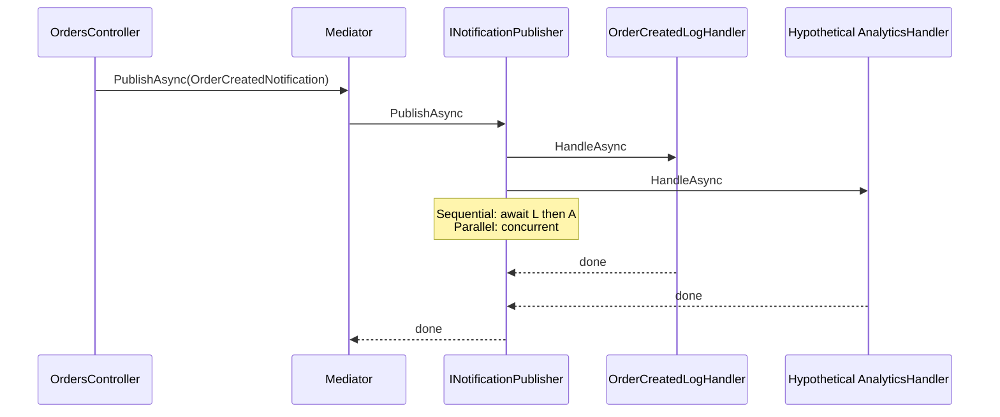
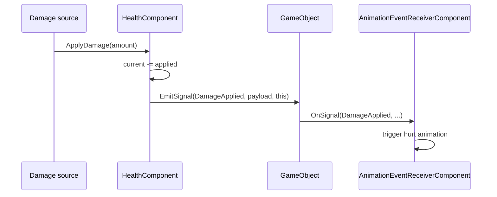

# Observer

**Intent:** Define a one-to-many dependency between objects so that when one object changes state, all its dependents are notified and updated automatically.

## The Behavioral Problem: Keeping Dependents in Sync

When object **A** changes, objects **B**, **C**, and **D** may need to react — refresh UI, write logs, update analytics, play sound. Embedding those calls inside A creates **notification coupling**: A must know every dependent, depend on their interfaces, and call them in the right order. Adding a new dependent edits A. Removing one risks stale references and memory leaks if unsubscribe is forgotten.

**Observer** inverts the dependency: the subject notifies abstract observers; observers subscribe (or register in DI). The subject publishes **what happened**; observers decide **how to react**.

Variations in this repo:

1. **Mediator-mediated Observer** — LightMediator `INotification` + handlers (central dispatch).
2. **Entity-local Observer** — Spark `GameObject::EmitSignal` / `OnSignal` among sibling components.
3. **Property Observer** — .NET `INotifyPropertyChanged` for MVVM data binding.
4. **Polling "observer"** — demos that read model state each frame (weaker form, still dependency on model).

---

## GoF Participants → LightMediator Notifications

| GoF role | LightMediator | State |
|----------|---------------|-------|
| **Subject** | Implicit: code calling `IMediator.PublishAsync` | — |
| **Observer** | `INotificationHandler<TNotification>` | Logger, external gateways |
| **ConcreteObserver** | `OrderCreatedLogHandler` | `ILogger` |
| **Notification** | `INotification` records | Immutable event payload |

```csharp
public interface INotification { }

public interface INotificationHandler<in TNotification>
    where TNotification : INotification
{
    Task HandleAsync(TNotification notification, CancellationToken cancellationToken);
}
```

Handlers are **not** registered on a list at runtime — DI container resolves `IEnumerable<INotificationHandler<T>>` when publish occurs. That is Observer with **Mediator hub** (chapter 5).

---

## Example 1: LightMediator — Notifications

### Contract

```csharp
public sealed record OrderCreatedNotification(int OrderId, string ProductId, int Quantity) : INotification;
```

### Concrete observer

```csharp
public sealed class OrderCreatedLogHandler(ILogger<OrderCreatedLogHandler> logger)
    : INotificationHandler<OrderCreatedNotification>
{
    public Task HandleAsync(OrderCreatedNotification notification, CancellationToken cancellationToken)
    {
        logger.LogInformation("Order created notification: {OrderId}", notification.OrderId);
        return Task.CompletedTask;
    }
}
```

**Who calls whom:** `OrdersController` publishes after successful command — not the handler that created the order. That avoids CreateOrderHandler knowing about logging handlers (separation of command side effects vs reactions).

### Publisher strategies (ordering and concurrency)

**SequentialNotificationPublisher:**

```csharp
foreach (var handler in handlers)
    await handler.HandleAsync(notification, cancellationToken);
```

**ParallelNotificationPublisher:** `Task.WhenAll` over all handlers.

| Strategy | Observer guarantee | Risk |
|----------|-------------------|------|
| Sequential | Deterministic order = DI registration order | Slow if one handler blocks |
| Parallel | Minimum latency | Handlers must tolerate reordering; thread-safe shared state |

### Sequence: publish after create



---

## Example 2: Spark — ECS Signals (Entity-Scoped Observer)

Spark components on the **same GameObject** communicate via signals without referencing each other by concrete type.

### GameObject as subject

From `GameObject.hpp`:

> Components on the same object exchange SignalId messages via EmitSignal / OnSignal (sender excluded).

```cpp
void EmitSignal(SignalId id, const SignalPayload& payload, GameComponent* sender = nullptr);
```

Each `GameComponent` may override `OnSignal(SignalId id, const SignalPayload& payload)`.

**Scope:** Not global pub/sub — **sibling components only**. Avoids whole-engine event bus noise for local concerns (damage → animation flash on same entity).

### HealthComponent as concrete subject behavior

When damage applies:

```cpp
owner->EmitSignal(SignalId::DamageApplied, signal, this);
if (current <= 0.0F) {
    owner->EmitSignal(SignalId::Died, death, this);
}
```

**State in HealthComponent:** `current`, `maximum` health floats.

**Observers:** Any other component on same `GameObject` implementing `OnSignal` — e.g. `AnimationEventReceiverComponent`, UI bridge components.

### Sequence: damage notification



**Sender excluded:** HealthComponent does not receive its own signal — prevents accidental recursion.

### Comparison to LightMediator Observer

| Spark signals | LightMediator notifications |
|---------------|----------------------------|
| Same entity, synchronous | Process-wide, async Task |
| No DI registration | Handlers in DI |
| Typed payload via `SignalPayload` | Typed `INotification` record |
| Gameplay coupling boundary | Application layer boundary |

---

## Example 3: Spark — HealthHud (View Mirrors Model)

Platformer demos include HUD that displays player health. Pattern documentation describes **Observer**: view reads or subscribes to model state and updates display when health changes.

Frame-based polling (`each frame read health and set label`) is a weak observer — simple but wasteful. Signal-driven HUD would react only on `DamageApplied` — stronger alignment with Observer intent.

---

## Example 4: SkyUI — INotifyPropertyChanged

Filter editor nodes inherit observable base:

```csharp
public abstract class FilterNodeBase : INotifyPropertyChanged
{
    public event PropertyChangedEventHandler? PropertyChanged;
    protected void OnPropertyChanged([CallerMemberName] string? propertyName = null) =>
        PropertyChanged?.Invoke(this, new PropertyChangedEventArgs(propertyName));
}
```

`FilterConditionNode` calls `OnPropertyChanged()` when `FieldPath`, `Operator`, or `ValueText` changes. Avalonia bindings are **observers** registered on the property grid and tree views.

**Subject:** each node instance. **Observers:** WPF/Avalonia binding engine + ViewModel listeners. **Notification:** property name string (fine-grained) or default all properties.

**State:** `_fieldPath`, `_operator`, `_valueText` on condition nodes; `_logicalKind`, `_children` on group nodes.

### Collaboration with Visitor and Command

- User edits bound property → node notifies → UI refreshes (Observer).
- User clicks export → `ICommand` executes → `BasicFilterSqlExporter` walks tree (Visitor — chapter 11).

---

## Observer vs Mediator Notifications

Both decouple publishers from subscribers. Mediator adds:

- Central `PublishAsync` entry (logging, future middleware on notifications)
- Scoped handler resolution via `IServiceProvider` (web request scope)
- Pluggable fan-out strategy

Raw C# events on a domain entity are Observer without mediator — fine inside one aggregate; LightMediator scales across assemblies.

---

## Observer vs Command (Revisited)

| Observer | Command |
|----------|---------|
| 0..N handlers | 1 handler |
| Past tense: "OrderCreated" | Imperative: "CreateOrder" |
| Reactions | Primary workflow |

Controllers often **Send** then **Publish** — command commits state; notification announces fact.

---

## Pitfalls

| Pitfall | Mitigation |
|---------|------------|
| **Memory leaks** | Unsubscribe in `Dispose` / `OnDetach`; weak events for long-lived subjects |
| **Reentrancy** | Handler modifies subject during notification — document re-entrancy policy; queue notifications |
| **Ordering** | Document sequential vs parallel publisher; do not rely on order in parallel mode |
| **Spaghetti reactions** | Keep handlers idempotent and small; avoid chains of notifications triggering notifications |

---

## Trade-offs

| Benefit | Cost |
|---------|------|
| Open for new subscribers (OCP) | Harder to trace causality |
| Subject stays focused | Notification storms if overused |
| DI discovery in LightMediator | Runtime registration errors |

**Alternatives:** Polling (simple, inefficient); reactive streams (Rx) with explicit subscription lifecycle; transactional outbox for cross-service events.

---

## Next

[State →](08-state.md)
