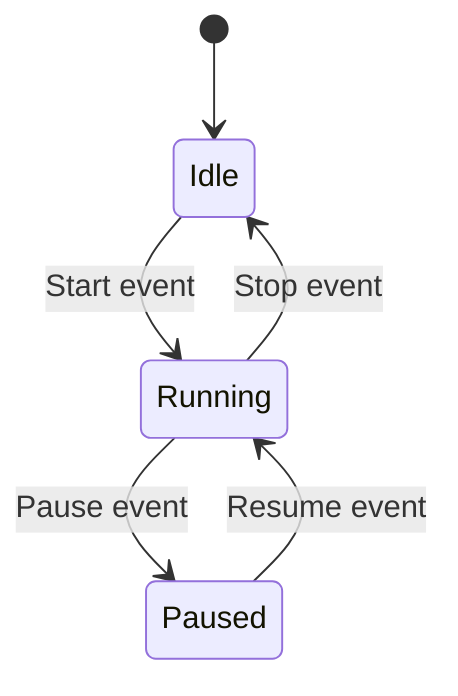
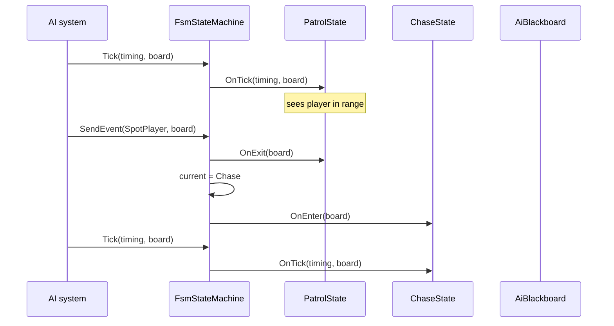

# State

**Intent:** Allow an object to alter its behavior when its internal state changes. The object will appear to change its class.

## The Behavioral Problem: State-Driven Behavior Without Switch Hell

Many objects behave differently depending on **mode**: AI agents patrol vs chase vs attack; UI controls disabled vs editing vs submitting; animation FSM idle vs run vs jump. The anti-pattern is a single class with an enum and a switch:

```cpp
switch (_state) {
    case Patrol:  /* 50 lines */ break;
    case Chase:   /* 50 lines */ break;
    case Attack:  /* 50 lines */ break;
}
```

Every new state edits the same class. Enter/exit side effects (play sound on enter attack) scatter across cases. Transition rules duplicate. Testing requires mocking the entire god object.

**State pattern** gives each mode its own class implementing a common interface. The **context** (`FsmStateMachine`) holds a pointer/index to the current state and delegates ticks/events. Transitions swap the active state object and call `OnExit` / `OnEnter`. Behavior polymorphism replaces conditional logic.

---

## GoF Participants → Spark FsmStateMachine

| GoF role | Spark class | State held |
|----------|-------------|------------|
| **Context** | `FsmStateMachine` | `current` state id, `initial`, `booted`, arrays of states and transitions |
| **State** | `IFsmState` | Usually none (behavior only); may read `AiBlackboard` |
| **ConcreteState** | `PatrolState`, `ChaseState`, … (gameplay subclasses) | Blackboard keys, timers |
| **Client** | AI system, `SpriteAnimationFsmComponent` | — |



Polymorphic state objects replace the enum switch; transition **table** replaces nested if chains for event routing.

---

## Example 1: Spark — FiniteStateMachine

### IFsmState (state interface)

```cpp
class IFsmState {
public:
    virtual ~IFsmState() = default;
    virtual void OnEnter(AiBlackboard& board) { }
    virtual void OnExit(AiBlackboard& board) { }
    virtual void OnTick(const FrameTiming& timing, AiBlackboard& board) = 0;
};
```

**Template Method flavor:** machine calls lifecycle hooks in fixed order; concrete states fill `OnTick` (and optionally enter/exit).

**AiBlackboard** shared memory: states read/write pursuit target, last seen position, timers — context outside the state object for data shared across transitions.

### FsmStateMachine (context)

Header responsibilities:

```cpp
class FsmStateMachine {
    void AddState(UniquePtr<IFsmState> state);
    void AddTransition(const FsmTransition& rule);
    void SetInitialState(std::uint32_t stateId);
    bool SendEvent(std::uint32_t eventId, AiBlackboard& board);
    void Tick(const FrameTiming& timing, AiBlackboard& board);
    std::uint32_t GetCurrentState() const;
};
```

**State held:**

- `Array<UniquePtr<IFsmState>> states` — index == state id
- `Array<FsmTransition> transitions` — `(fromState, eventId) → toState`
- `current`, `initial`, `booted`

**FsmTransition** is plain data — behavior is data-driven:

```cpp
struct FsmTransition {
    std::uint32_t fromState = 0;
    std::uint32_t eventId = 0;
    std::uint32_t toState = 0;
};
```

### Transition implementation

```cpp
bool FsmStateMachine::SendEvent(const std::uint32_t eventId, AiBlackboard& board) {
    for (const FsmTransition& t : transitions) {
        if (t.fromState == current && t.eventId == eventId) {
            EnterState_(t.toState, board);
            return true;
        }
    }
    return false;
}

void FsmStateMachine::EnterState_(const std::uint32_t next, AiBlackboard& board) {
    if (IFsmState* prev = StateAt_(current))
        prev->OnExit(board);
    current = next;
    if (IFsmState* s = StateAt_(current))
        s->OnEnter(board);
}
```

**Who calls whom:**

- Gameplay code calls `SendEvent` on damage, line-of-sight, timer elapsed.
- AI system calls `Tick` each frame.
- Machine calls current state's `OnTick`; never calls inactive states.

First `Tick` when `!booted` invokes `OnEnter` on initial state without transition — bootstraps enter logic.

### Sequence: event causes transition



### Uses in Spark

- **AI agents** — patrol → chase → attack → flee
- **SpriteAnimationFsmComponent** — animation states driven by gameplay events
- Documented in programming guide `4-ai/03-fsm.md`

Each new behavior = new `IFsmState` subclass + transition rows — **Open/Closed** on the machine class.

---

## State vs Strategy

| State | Strategy |
|-------|----------|
| Object **changes** active behavior over time | Client **selects** algorithm at a point |
| Transitions are domain rules (events) | Often fixed at construction / config |
| `SendEvent` mutates current state | `GetStrategy(name)` returns policy |
| FsmStateMachine | `IImageFilterStrategy`, `IMarkdownRenderer` |

Confusion arises because both use polymorphism. Ask: **Does the object move between modes on events?** If yes, State. **Does the caller pick an algorithm for one shot?** Strategy.

`SpriteAnimationFsmComponent` is State; `ApplyFilterHandler` picking blur vs sharpen is Strategy.

---

## Enums Named "State" That Are Not GoF State

Spark asset loading enums, UI pointer capture states — **flags or phases** without polymorphic state objects. A single method with two branches does not need State pattern. Apply State when:

- Multiple behaviors with enter/exit/tick lifecycle
- Transition table or rules grow
- Tests need isolated state classes

---

## Testing FSM

Unit tests without rendering:

1. Build machine with 2–3 dummy states recording `OnEnter`/`OnExit`/`OnTick` calls.
2. `SetInitialState(0)`; `Tick` → expect initial `OnEnter` once.
3. `SendEvent(valid)` → expect exit state 0, enter state 1, `GetCurrentState() == 1`.
4. `SendEvent(invalid)` → returns false; state unchanged.
5. Verify tick only hits active state.

Table-driven tests can load transitions from data files — same structure production uses.

---

## Trade-offs

| Benefit | Cost |
|---------|------|
| Eliminates giant switches | Many small classes |
| Explicit enter/exit | Transition table can duplicate if many events |
| Testable isolated states | Indirection when debugging |
| Data-driven transitions | Invalid tables fail at runtime |

**Alternatives:**

- **Enum + switch** — OK for 2 stable modes.
- **Behavior trees / GOAP** — richer AI, heavier tooling.
- **Statecharts (hierarchical state)** — nested FSM when states share substates.

Spark's FSM is deliberately minimal — table + polymorphic states — good teaching fit and sufficient for animation + moderate AI.

---

## Borderline: IFsmState and Template Method

`OnEnter` / `OnTick` / `OnExit` skeleton is defined by machine call order; subclasses override hooks. State and Template Method often coappear in lifecycle-driven domains.

---

## Next

[Strategy →](09-strategy.md)
