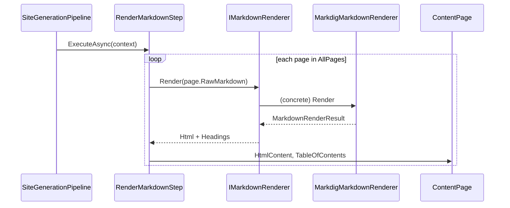
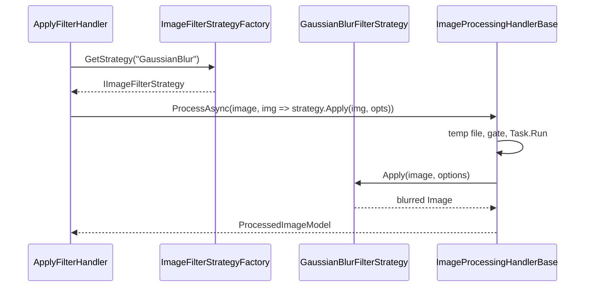

# Strategy

**Intent:** Define a family of algorithms, encapsulate each one, and make them interchangeable. Strategy lets the algorithm vary independently from clients that use it.

## The Behavioral Problem: Algorithm Variation Without Conditional Explosion

Applications constantly swap **policies**: render markdown for web vs WeChat; blur vs sharpen an image; bake a box collider vs polygon; export SQL vs JSON from a filter tree. The failure mode is a growing conditional — `if (mode == X) … else if (mode == Y) …` inside every caller, or one `ProcessImage` method thousands of lines long.

**Strategy** extracts each algorithm into its own class sharing a common interface. The **context** (handler, pipeline step, factory client) holds a reference to the interface and delegates without knowing concrete details. Selection happens at composition root (DI registration), from configuration (`PublishMode`), or at runtime (`filterFactory.GetStrategy(name)`).

Key distinction from **State** (chapter 8): Strategy usually picks an algorithm for an operation; State objects **transition** over time inside a long-lived context. Strategy answers "which policy now for this request?"; State answers "which lifecycle mode am I in?"

---

## GoF Participants → Repository Mapping

| GoF role | Generic meaning | Example in repo |
|----------|-----------------|-----------------|
| **Strategy** | Algorithm interface | `IMarkdownRenderer`, `IImageFilterStrategy`, `IColliderBakeStrategy2D` |
| **ConcreteStrategy** | One algorithm | `MarkdigMarkdownRenderer`, `BlurFilterStrategy`, `BoxColliderBakeStrategy2D` |
| **Context** | Uses strategy; may not create it | `RenderMarkdownStep`, `ApplyFilterHandler`, `ColliderBakePipeline2D` |
| **Client** | Configures context / injects strategy | DI host, `ImageFilterStrategyFactory`, physics world rebuild |

---

## Example 1: MDWeb — IMarkdownRenderer and Related Policies

Static site generation must convert markdown to HTML, apply templates, post-process HTML, and export PDFs. Each stage has **swappable policies** documented as Strategy in core abstractions.

### IMarkdownRenderer

```csharp
/// Strategy: converts markdown to HTML.
public interface IMarkdownRenderer
{
    MarkdownRenderResult Render(string markdown);
}
```

**Concrete strategies:**

| Class | Policy |
|-------|--------|
| `MarkdigMarkdownRenderer` | Standard site pipeline — syntax highlighting, heading IDs, Markdig extensions |
| `WeChatMarkdownRenderer` | WeChat-specific HTML constraints and formatting |

**Context:** `RenderMarkdownStep` (Chain of Responsibility link — chapter 2).

```csharp
public Task ExecuteAsync(SiteContext context, ...)
{
    foreach (var page in context.AllPages)
    {
        var result = markdownRenderer.Render(page.RawMarkdown);
        page.HtmlContent = result.Html;
        page.TableOfContents = result.Headings;
    }
}
```

**State in step:** `IMarkdownRenderer` reference (chosen at startup), logger. **No branch on renderer type** inside the loop.

**Who calls whom:** Host runs pipeline → `RenderMarkdownStep` → `markdownRenderer.Render` → concrete Markdig or WeChat implementation.

### Selection at composition root

`PublishMode` or host configuration registers one `IMarkdownRenderer` implementation in DI. Switching publish target changes **one registration**, not pipeline code.

### Parallel strategy families in MDWeb

Same pattern elsewhere:

- `ITemplateEngine` — layout rendering policy
- `IHtmlPostProcessor` — HTML cleanup/enrichment
- `IDocumentExporter` — PDF or other export backends

Each is a **strategy family** — one interface, multiple algorithms, injected into pipeline steps.

### Sequence: render all pages



### Trade-offs

| Benefit | Cost |
|---------|------|
| Test renderer without full pipeline | Must inject correct strategy in each environment |
| Add WeChat without touching Markdig | Interface proliferation if every tiny variant gets an interface |

---

## Example 2: ImgKit — Three Strategy Families (Deep Dive)

ImgKit separates pixel **policies** from I/O **workflow** (Template Method — chapter 10) and request **routing** (Command — chapter 3).

### Family A: IImageFilterStrategy

```csharp
public interface IImageFilterStrategy
{
    string Name { get; }
    PillowNet.Image Apply(PillowNet.Image image, FilterStrategyOptions options);
}
```

**Concrete strategies** (`ImageProcessingStrategies.cs`):

- `BlurFilterStrategy`, `SharpenFilterStrategy`
- `GaussianBlurFilterStrategy` — uses `options.Radius`
- `UnsharpMaskFilterStrategy` — radius, percent, threshold
- Additional named filters registered in DI

**Abstract base:** `NamedImageFilterStrategy` holds `Name` for factory dictionary key.

**Factory (context for selection):**

```csharp
internal sealed class ImageFilterStrategyFactory : IImageFilterStrategyFactory
{
    private readonly IReadOnlyDictionary<string, IImageFilterStrategy> _strategies;

    public ImageFilterStrategyFactory(IEnumerable<IImageFilterStrategy> strategies) =>
        _strategies = strategies.ToDictionary(s => s.Name, StringComparer.OrdinalIgnoreCase);

    public IImageFilterStrategy GetStrategy(string filterName) =>
        _strategies.TryGetValue(filterName, out var strategy)
            ? strategy
            : throw new ArgumentException($"Unsupported filter '{filterName}'.");
}
```

**State in factory:** immutable name → strategy map built at construction from all DI-registered strategies.

**Context handler:** `ApplyFilterHandler`:

```csharp
var strategy = filterFactory.GetStrategy(specification.FilterName);
var model = await ProcessAsync(
    request.Image,
    image => strategy.Apply(image, options),
    cancellationToken: cancellationToken);
```

Handler **does not switch** on filter name — factory throws if unknown.

### Family B: IImageEnhancementStrategy

Brightness, contrast, etc. Selected by `EnhanceImageHandler` via `IImageEnhancementStrategyFactory.GetStrategy(specification.Enhancement)`.

### Family C: IImageOpsStrategy

Bitwise/quantization-style ops. Selected by `ApplyImageOpsHandler`.

### Why three interfaces instead of one?

Algorithms share shape (`Apply(image, options)`) but **option types and semantics differ**. Splitting families keeps types honest and avoids a mega-options bag. All three plug into the same Template Method hook `Func<Image, Image>`.

### Sequence: apply Gaussian blur command



### Trade-offs

| Benefit | Cost |
|---------|------|
| Add filter = one class + DI line | Many small strategy classes |
| Unit test blur without HTTP | Factory registration must stay in sync with API docs |
| Handlers stay thin | Runtime error on typo in filter name |

**Alternatives:** Single `switch` in handler (OK for 2 filters); plugin assemblies loading strategies dynamically (heavier).

---

## Example 3: Spark — Collider Bake Strategies

Physics broad-phase rebuild walks ECS objects and **bakes** collider shapes into acceleration structures. Each collider component type has different bake logic.

### Strategy interface

```cpp
class IColliderBakeStrategy2D {
public:
    virtual bool Contributes(GameObject& object) const noexcept = 0;
    virtual void Bake(GameObject& object, ColliderBakeContext2D& context) const = 0;
};
```

**Concrete strategies** (registered in `ColliderBakeStrategies2D.cpp`):

- `TilemapColliderBakeStrategy2D`
- `PolygonColliderBakeStrategy2D`
- `BoxColliderBakeStrategy2D`
- `CircleColliderBakeStrategy2D`

3D pipeline mirrors with `IColliderBakeStrategy3D` (box, capsule, mesh).

### Context: ColliderBakePipeline2D

```cpp
class ColliderBakePipeline2D {
    void RegisterStrategy(UniquePtr<IColliderBakeStrategy2D> strategy);
    void Rebuild(GameWorld& world, float cellWorldSize,
                 Array<Collider2D>& colliders, BroadPhaseGrid2D& grid);
private:
    Array<UniquePtr<IColliderBakeStrategy2D>> strategies{};
};
```

**Rebuild behavior:** for each relevant object, iterate **all** strategies; if `Contributes(object)`, call `Bake`. Multiple strategies may coexist — unlike "pick one by name", this is **chain of strategies** each claiming compatible components.

**Who calls whom:** `PhysicsWorld2D`, `BroadPhase2D`, demos call `ColliderBakePipeline2D::GetDefault().Rebuild(...)`.

### Sequence: rebuild broad phase

```mermaid
sequenceDiagram
    participant PW as PhysicsWorld2D
    participant Pipe as ColliderBakePipeline2D
    participant Box as BoxColliderBakeStrategy2D
    participant GO as GameObject

    PW->>Pipe: Rebuild(world, cellSize, colliders, grid)
    loop each object
        loop each strategy
            Pipe->>Box: Contributes(object)?
            alt contributes
                Pipe->>Box: Bake(object, context)
            end
        end
    end
```

### Testing

`ColliderBakePipelineTest` registers `NeverContributesStrategy2D` — verifies pipeline extensibility without baking unwanted shapes.

---

## Example 4: Spark — Component Snapshot Handlers (Stateless Strategies)

`IComponentSnapshotHandler` (chapter 6) is labeled in source as **stateless strategy objects**:

- One handler per `ComponentKind`
- `TryCapture` / `TryRestore` algorithms vary by component
- `ComponentSnapshotRegistry` resolves handler — same factory pattern as ImgKit filters

Capture order array in `SceneSerializer.cpp` ensures deterministic mementos regardless of handler registration order.

---

## Example 5: LightMediator — Notification Publisher Strategy

`INotificationPublisher` with:

- `SequentialNotificationPublisher` — ordered await
- `ParallelNotificationPublisher` — `Task.WhenAll`

**Context:** `Mediator.PublishAsync`. **Selection:** DI singleton/scoped registration. Swaps fan-out **algorithm** without editing notification handlers.

---

## Example 6: SkyUI — Validators and SQL Exporters

`ISkyValidator`, `IFilterSqlExporter` (`BasicFilterSqlExporter`) allow swapping validation rules and SQL dialect logic without changing `FilterEditorViewModel` core. Exporter uses Visitor internally (chapter 11) — Strategy at module boundary, Visitor for tree walk.

---

## Example 7: RainDB — Implicit Strategy Dispatch

`DefaultQueryExecutor` switches on `IPhysicalPlan` runtime type to delegate to `VectorizedScanEngine`, `HashAggregateEngine`, `JoinExecutionEngine`. **Strategy-like** without shared `IExecutionStrategy` interface — pragmatic when plan types are closed and owned by the engine. Refactoring to explicit strategy interface would help if third-party plan nodes appear.

---

## Strategy vs if/else — Decision Guide

| Refactor to Strategy when | Keep if/else when |
|---------------------------|-------------------|
| Third variant appears | Two stable branches forever |
| Algorithms tested independently | Branch is one line |
| Selection from config/DI/runtime name | Compile-time constant |
| Multiple callers need same policies | Single caller, private logic |

---

## Strategy vs Template Method vs Factory

| Pattern | Varies | Fixed |
|---------|--------|-------|
| **Strategy** | Whole algorithm object | Context delegation call site |
| **Template Method** | One hook step | Skeleton in base class |
| **Factory** | Which strategy to create | Strategy interface |

ImgKit: Factory picks filter **Strategy**; **Template Method** runs I/O around `Apply`.

---

## Pitfalls

- **Leaky strategy interface** — options struct becomes 40 nullable fields → split families like ImgKit.
- **Strategy per line of code** — over-engineering two-line branches.
- **Wrong selection lifetime** — transient strategy with heavy state when singleton would suffice (usually strategies are stateless).

---

## Next

[Template Method →](10-template-method.md)
