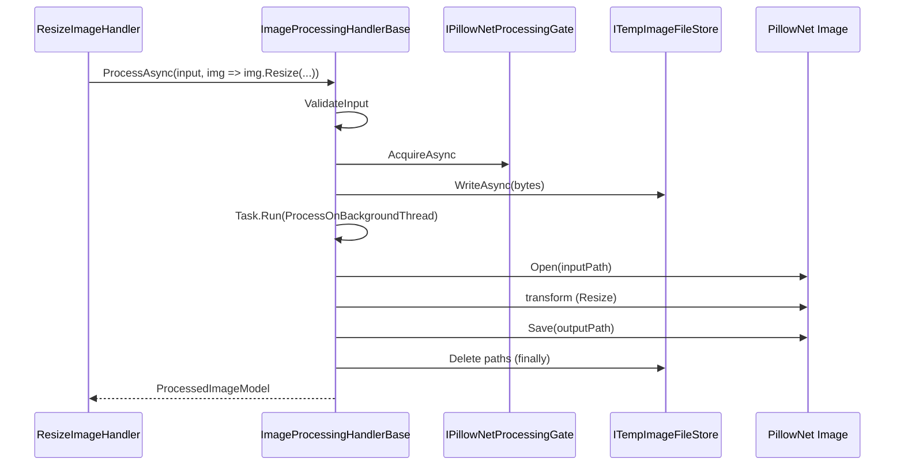

# Template Method

**Intent:** Define the skeleton of an algorithm in an operation, deferring some steps to subclasses or injected hooks.

## The Behavioral Problem: Fixed Workflow, Variable Steps

Many operations share the **same sequence** but differ in one phase:

- Load image → **transform** → save image
- Validate HTTP request → **append parameters** → send multipart
- Enter FSM state → **tick** → exit state

Copy-pasting the shared phases into every handler duplicates error-prone boilerplate (temp files, timeouts, gates, cleanup). Subclassing with empty overrides forces inheritance for every variant. **Template Method** defines the invariant steps in a base class (or base function) and calls **hooks** — virtual methods, abstract methods, or `Func<>` delegates — for the varying step.

Behaviorally, this assigns responsibility: **base knows order and invariants**; **subclasses/handlers know domain variation**.

---

## GoF Participants → ImgKit ImageProcessingHandlerBase

| GoF role | ImgKit mapping |
|----------|----------------|
| **AbstractClass** | `ImageProcessingHandlerBase` |
| **ConcreteClass** | Each `*ImageHandler` (via hook lambda, not override) |
| **Template methods** | `ProcessAsync`, `InspectAsync` |
| **Primitive operations (fixed)** | Validate, acquire gate, write temp, Task.Run, delete temps |
| **Hook operations (variant)** | `Func<Image, Image> transform` passed to `ProcessAsync` |

ImgKit uses **delegate hooks** instead of virtual `protected abstract Image Transform(Image)` — same Template Method semantics with less inheritance depth.

---

## Example 1: ImageProcessingHandlerBase (Primary)

Source documents intent explicitly:

```csharp
/// Template Method base for handlers that load an image, process it, and serialize output.
public abstract class ImageProcessingHandlerBase(
    ITempImageFileStore tempFiles,
    IPillowNetProcessingGate processingGate)
```

### State held by base

| Dependency | Role |
|------------|------|
| `ITempImageFileStore` | Write uploaded bytes to disk path; delete after processing |
| `IPillowNetProcessingGate` | Limit concurrent PillowNet work — acquire/release scope |

Concrete handlers inherit these via primary constructor — no duplicate fields.

### Template method: ProcessAsync

```csharp
protected async Task<ProcessedImageModel> ProcessAsync(
    ImageInput input,
    Func<Image, Image> transform,   // HOOK — variant step
    string? outputFormat = null,
    CancellationToken cancellationToken = default)
{
    ImageOperationValidator.ValidateInput(input);

    using var processingScope = await processingGate.AcquireAsync(cancellationToken);
    using var timeoutSource = CreateTimeoutSource(cancellationToken);

    var inputPath = await tempFiles.WriteAsync(input.Data, input.FileName, timeoutSource.Token);
    var (outputPath, format, contentType) = ImageOutputHelper.ResolveOutput(input.FileName, outputFormat);

    try
    {
        return await Task.Run(
            () => ProcessOnBackgroundThread(inputPath, outputPath, format, contentType, transform),
            timeoutSource.Token);
    }
    finally
    {
        tempFiles.Delete(inputPath);
        tempFiles.Delete(outputPath);
    }
}
```

### Fixed skeleton (invariant steps)

1. **Validate input** — reject empty or oversized uploads early.
2. **Acquire processing gate** — global concurrency cap across handlers.
3. **Create linked timeout token** — `MaxProcessingSeconds` bound.
4. **Write temp input file** — PillowNet works on paths.
5. **Resolve output path/format/content-type** — `ImageOutputHelper`.
6. **Run on thread pool** — `ProcessOnBackgroundThread` opens image, calls hook, saves, reads bytes into model.
7. **Finally delete temps** — always runs even on exception.

### Hook: transform

`ProcessOnBackgroundThread`:

```csharp
using var source = Image.Open(inputPath);
using var processed = transform(source);  // hook invocation
processed.Save(outputPath, format);
// build ProcessedImageModel from bytes + metadata
```

Each handler supplies hook at call site:

```csharp
// ResizeImageHandler
await ProcessAsync(request.Image, image => image.Resize((w, h), resampling), ...);

// ApplyFilterHandler — Strategy inside hook
await ProcessAsync(request.Image, image => strategy.Apply(image, options), ...);
```

**Who calls whom:** `IRequestHandler.HandleAsync` (concrete handler) → `ProcessAsync` (template) → handler's lambda → optional Strategy.

### Second template: InspectAsync

Same skeleton for read-only metadata — no output file transform save path variant; uses `InspectOnBackgroundThread`. `GetImageInfoHandler` uses this template without pixel mutation hook complexity.

### Sequence: resize request through template



### Collaboration with Command and Strategy

| Layer | Pattern | Responsibility |
|-------|---------|----------------|
| `ImagesController` | Command client | Build `ResizeImageCommand` |
| `ResizeImageHandler` | Command receiver | Map command → hook |
| `ImageProcessingHandlerBase` | Template Method | I/O + threading + cleanup |
| `IImageFilterStrategy` | Strategy | Pixel algorithm inside hook |

Without Template Method, every handler would duplicate gate, timeout, and temp file logic — nine handlers × ~40 lines = maintenance hazard.

---

## Example 2: ImageOperationRequestBuilderBase (Smaller Template)

API clients building multipart requests share structure:

```csharp
public abstract class ImageOperationRequestBuilderBase
{
    public abstract ImageOperationDescriptor Descriptor { get; }
    public abstract void AppendParameters(MultipartFormDataContent content, ImageOperationRequest request);
}
```

A shared `BuildRequest()` loop (if present on base) would:

1. Create multipart content
2. Append image stream
3. Call `AppendParameters` hook
4. Return request message

Subclasses supply descriptor metadata and form fields — Template Method at HTTP client boundary, symmetric to server-side `ProcessAsync`.

---

## Template Method vs Strategy (ImgKit)

| Template Method | Strategy |
|-----------------|----------|
| **Fixed:** validate, gate, temps, threading | **Swappable:** blur vs sharpen vs resize math |
| Inheritance + delegate hook on base | Interface + factory |
| One skeleton per family (`ProcessAsync`) | Many algorithms per family |
| Cross-cutting resource management | Domain pixel operations |

**Both** appear in one handler: Template Method wraps Strategy inside the hook.

Choosing between them:

- If **order and resource rules** must never be skipped → Template Method.
- If **algorithm** swaps at runtime by name → Strategy.
- If entire workflow differs (inspect vs mutate) → separate template methods (`InspectAsync` vs `ProcessAsync`), not one Strategy interface.

---

## Example 3: Spark — IFsmState Lifecycle (Borderline Template Method)

`FsmStateMachine::Tick` and `SendEvent` define invariant call order:

1. On first tick: `OnEnter` initial state
2. Each tick: current state's `OnTick`
3. On transition: `OnExit` old → `OnEnter` new

Concrete states implement hooks; machine owns skeleton. This blends **State** (chapter 8) and Template Method — common in lifecycle frameworks.

---

## Template Method vs Callback / Higher-Order Function

Modern C# often uses **Func<> hooks** (ImgKit) instead of `protected virtual` methods:

| Virtual override style | Func hook style |
|------------------------|-----------------|
| Subclass per variant | Lambda per handler class |
| Compiler enforces override | Flexible closure captures |
| Classic GoF | Idiomatic C# with records/handlers |

Behavioral pattern is the same: **don't call us, we'll call you** at the hook point.

---

## Trade-offs

| Benefit | Cost |
|---------|------|
| DRY for invariant steps | Base class can become god base if too many hooks |
| Consistent timeout/cleanup | Subclasses depend on inheritance (mitigated by protected helpers) |
| Easy to add handlers | Harder to compose multiple independent skeletons |

**Alternatives:**

- **Decorator** stack for each step (flexible, verbose).
- **Pipeline** of small functions (functional style).
- **Middleware only** — LightMediator wraps handler but does not replace per-domain I/O template inside ImgKit handlers.

ImgKit correctly uses **Middleware** for logging and **Template Method** for PillowNet resource rules — different invariant boundaries.

---

## Testing Template Method

Test base behavior once:

- Mock `ITempImageFileStore` / gate
- Pass hook that marks image or throws
- Assert temps deleted on success and failure
- Assert gate acquired/released

Test handlers with lightweight hook asserting domain args — no need to re-test timeout logic per handler.

---

## Next

[Visitor →](11-visitor.md)
