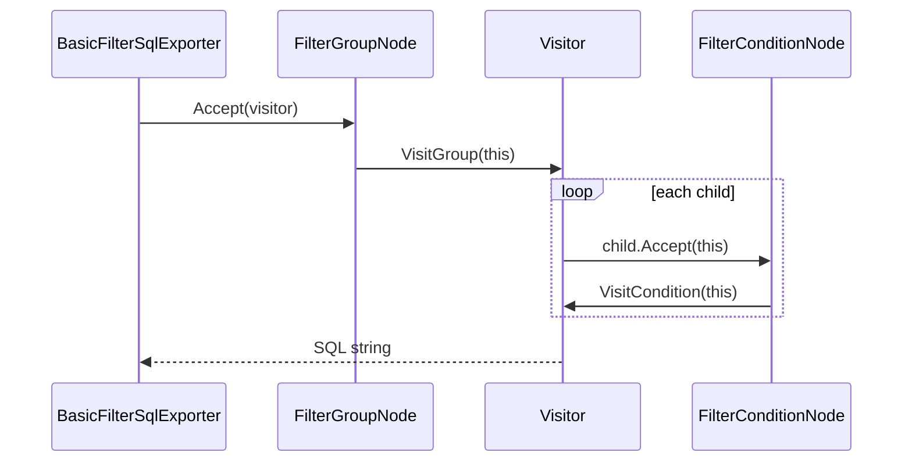

# Visitor

**Intent:** Represent an operation to be performed on the elements of an object structure. Visitor lets you define a new operation without changing the classes of the elements on which it operates.

## The Behavioral Problem: Operations vs Structure

Composite structures (filter trees, ASTs, scene graphs) stabilize **node types** more often than **operations** on them. The anti-pattern exports operations by adding methods to every node:

```csharp
class FilterGroupNode {
    public string ToSql() { ... }
    public string ToJson() { ... }
    public ValidationResult Validate() { ... }
}
```

Every new export format edits every node class — violates Open/Closed. Worse, node classes absorb unrelated concerns (UI state + SQL + JSON).

**Visitor** separates **structure** (nodes with `Accept`) from **operations** (visitor with `VisitGroup`, `VisitCondition`). Adding SQL dialect #2 means new visitor class; node classes unchanged.

Cost: adding a **new node type** requires updating **every** visitor interface method — Visitor favors stable structure, evolving operations.

---

## Double Dispatch Explained

Single dispatch: `node.Render()` — compile-time type of variable chooses method.

Visitor needs **runtime node type** + **runtime visitor operation**:

```csharp
// 1. Client calls Accept on node
document.Root.Accept(visitor);

// 2. Node calls visitor with concrete type — overload resolution
public override T Accept<T>(IFilterNodeVisitor<T> visitor) => visitor.VisitGroup(this);

// 3. Visitor method runs operation for that node type
public string VisitGroup(FilterGroupNode node) { ... }
```

This is **double dispatch**: `Accept` + `VisitGroup` together pick the correct operation implementation.



---

## GoF Participants → SkyUI Filter Editor

| GoF role | SkyUI class | State |
|----------|-------------|-------|
| **Visitor** | `IFilterNodeVisitor<T>` | Operation logic in concrete visitor |
| **ConcreteVisitor** | `BasicFilterSqlExporter.Visitor` | StringBuilder during walk |
| **Element** | `FilterNodeBase` | `Parent`, `Children`, INotifyPropertyChanged |
| **ConcreteElement** | `FilterGroupNode`, `FilterConditionNode` | Group: logical kind + children; Condition: field, operator, value |
| **ObjectStructure** | `FilterDocument` with root `FilterGroupNode` | Tree shape |
| **Client** | `BasicFilterSqlExporter.ToSql(document)` | Creates visitor, starts Accept on root |

---

## Example 1: SkyUI — Filter Tree → SQL (Primary)

Filter editor builds a **Composite** tree (Part 3): groups contain conditions and nested groups. Export to SQL is one **operation** over that tree — ideal Visitor.

### Element hierarchy

**FilterNodeBase** — abstract element:

```csharp
public abstract class FilterNodeBase : INotifyPropertyChanged
{
    public FilterGroupNode? Parent { get; internal set; }
    public abstract ObservableCollection<FilterNodeBase> Children { get; }
    public abstract T Accept<T>(IFilterNodeVisitor<T> visitor);
}
```

**State:** parent pointer, property change notifications for MVVM bindings (Observer — chapter 7).

**FilterGroupNode** — composite element:

- `_children` — `ObservableCollection<FilterNodeBase>`
- `_logicalKind` — `And` or `Or`
- `Accept` → `visitor.VisitGroup(this)`
- Mutators: `AddCondition`, `AddGroup` — UI/Command layer uses these; visitor read-only for export

**FilterConditionNode** — leaf element:

- `_fieldPath`, `_operator`, `_valueText`
- Empty `Children` collection (leaf marker)
- `Accept` → `visitor.VisitCondition(this)`

### Visitor interface

```csharp
public interface IFilterNodeVisitor<out T>
{
    T VisitGroup(FilterGroupNode node);
    T VisitCondition(FilterConditionNode node);
}
```

Generic `T` allows same walk to produce `string` (SQL), `ValidationResult`, AST, etc.

### Concrete visitor: BasicFilterSqlExporter

Public façade:

```csharp
public sealed class BasicFilterSqlExporter : IFilterSqlExporter
{
    public string ToSql(FilterDocument document) => document.Root.Accept(new Visitor());
```

Private `Visitor : IFilterNodeVisitor<string>`:

**VisitGroup:**

1. Empty group → `"(1 = 1)"` tautology (match-all SQL fragment).
2. Choose separator ` AND ` or ` OR ` from `node.LogicalKind`.
3. For each child: `child.Accept(this)` — recursive double dispatch.
4. Skip whitespace-only parts; wrap non-empty in parentheses.

**VisitCondition:**

- Map `FilterCompareOperator` to SQL: `=`, `<>`, `LIKE` patterns with `||` concatenation for ANSI-ish dialect.
- Quote identifiers: `"field.path"` with escaped quotes.
- Literals: `'value'` with `'` doubled.

**State during walk:** `StringBuilder` local to recursive calls — visitor instance is stack-local per `ToSql` invocation.

### Sequence walkthrough: (A AND B) OR C

Tree:

```
Root (OR)
├── Group (AND)
│   ├── Condition: Name Contains "foo"
│   └── Condition: Age >= 18
└── Condition: Status = Active
```

Walk in prose:

1. `ToSql` calls `Root.Accept(visitor)`.
2. `VisitGroup(Root OR)` allocates builder, opens `(`.
3. First child: nested group `Accept` → `VisitGroup(AND)`.
4. AND group visits Name Contains → `VisitCondition` → `"Name" LIKE '%' || 'foo' || '%'`.
5. AND appends ` AND ` then Age >= 18.
6. OR group appends first part, then ` OR `, then Status condition.
7. Closes parentheses; returns final string.

No `switch (node.GetType())` in exporter — compiler enforces overloads when visitor interface grows.

### Adding a new operation (OCP win)

| Task | Edit |
|------|------|
| JSON export | New `FilterJsonExporter` + `IFilterNodeVisitor<string or JsonNode>` |
| Validate fields | `FilterValidationVisitor : IFilterNodeVisitor<ValidationResult>` |
| Pretty-print | New visitor |

**Do not edit** `FilterGroupNode` or `FilterConditionNode` for new exports.

### Adding a new node type (Visitor cost)

If `FilterInConditionNode` added (SQL `IN (...)`):

1. New node class with `Accept`.
2. Add `VisitIn(...)` to **every** visitor interface implementation.
3. Update UI to create IN nodes.

Visitor trades **operation extensibility** for **structure stability**.

---

## Visitor + Composite + Observer in SkyUI

| Pattern | Role in filter editor |
|---------|----------------------|
| **Composite** | `FilterGroupNode` tree |
| **Visitor** | SQL export, future analyzers |
| **Observer** | `INotifyPropertyChanged` refreshes UI on edit |
| **Command** | `FilterEditorRelayCommand` for add/remove/export buttons |

Part 5 (`05-skyui-filter-editor.md`) combines these — Visitor chapter completes the behavioral layer.

---

## Visitor vs switch on Type

Anti-pattern:

```csharp
string Export(FilterNodeBase node) => node switch
{
    FilterGroupNode g => ExportGroup(g),
    FilterConditionNode c => ExportCondition(c),
    _ => throw new ...
};
```

Works for one operation. Third operation duplicates switch in another method. Visitor **colocates** all group logic in `VisitGroup`, all condition logic in `VisitCondition` — each visitor class is one cohesive operation module.

| Approach | New operation | New node type |
|----------|---------------|---------------|
| switch per operation | New switch method | Edit every switch |
| Visitor | New visitor class | Edit every visitor interface |

Choose Visitor when **operations multiply**; choose switch when **node types multiply** and one operation exists.

---

## When Visitor Hurts

- Structure changes every sprint — visitor interface churn.
- Only one simple operation — `Accept` ceremony adds indirection.
- Cross-cutting node behavior (validation on set) belongs in node, not visitor.

SkyUI filter editor: **stable** node kinds (group, condition), **multiple** export/analysis targets — Visitor fits.

---

## Iterator vs Visitor (Revisited)

| Iterator | Visitor |
|----------|---------|
| "Give me next node" | "Do something typed per node" |
| Same loop body for all elements | Different method per element type |
| Flatten list of conditions | Recursive SQL with grouping semantics |

Could iterate tree with Iterator and switch on types — loses compiler-enforced visitor overloads.

---

## Part 4 Summary

| Pattern | Top example | Behavioral focus |
|---------|-------------|------------------|
| Chain of Responsibility | MDWeb pipeline, LightMediator middleware | Decouple sender from handler chain |
| Command | LightMediator + ImgKit commands | Encapsulate requests as objects |
| Iterator | Spark `LinkedList::Iterator` | Traverse without exposing storage |
| Mediator | `LightMediator.Mediator` | Hub routing among colleagues |
| Memento | Spark scene serialization | Opaque snapshots + caretaker |
| Observer | Notifications, ECS signals, MVVM | One-to-many update propagation |
| State | Spark `FsmStateMachine` | Polymorphic lifecycle modes |
| Strategy | ImgKit filters, MDWeb renderers | Interchangeable algorithms |
| Template Method | `ImageProcessingHandlerBase` | Fixed skeleton, hook for variation |
| Visitor | SkyUI `IFilterNodeVisitor` | Operations over stable composite |

Behavioral patterns collectively answer: **who talks to whom, who owns which algorithm, and how variation stays extensible** without god classes.

---

## Next

[Part 5: Introduction to Pattern Composition →](../part05-combining/01-introduction.md)
