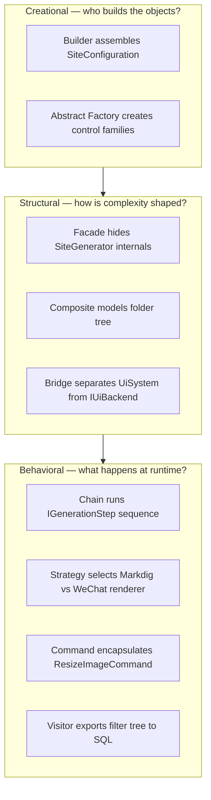

# Introduction to Pattern Composition

Real systems rarely use one pattern in isolation. Production code **layers** creational, structural, and behavioral patterns behind SOLID boundaries — and the patterns **talk to each other**. A Builder assembles the configuration object that a Facade passes into a Chain, whose steps mutate a Composite tree and delegate rendering to Strategy objects wrapped in Adapters.

Part 5 is about that cooperation: not "this file uses Visitor" in isolation, but how Visitor and Composite jointly solve a filter editor, or how Command + Mediator + Template Method + Strategy stack into a single HTTP request in ImgKit.

## Why Part 5 Exists

Parts 2–4 taught patterns **one at a time**, each with a minimal example. That is pedagogically necessary — you must see `Strategy` before you can recognize three strategy families inside ImgKit. But real subsystems combine patterns because **real forces arrive together**:

- MDWeb must accept many optional CLI flags **and** run nine ordered stages **and** treat the filesystem as navigation **and** swap markdown engines per publish mode.
- Spark must swap entire UI backends **and** serialize heterogeneous ECS components **and** drive AI without `switch` explosion.
- SkyUI must edit a nested filter tree **and** export SQL **and** keep Avalonia bindings live — three different operation families over one stable structure.

Part 5 walks those subsystems end-to-end. Each chapter traces a **user-visible feature** through every pattern layer and explains what breaks if you remove one layer.

## Composition Dimensions — How Patterns Chain

Patterns are not interchangeable tiles. They occupy different **roles** in a call graph:



**Creational** patterns answer setup questions: *How do we construct a valid `SiteConfiguration` from twelve optional CLI flags without a 12-parameter constructor?* **Structural** patterns answer shape questions: *How does the rest of the code talk to nine pipeline stages without knowing their names?* **Behavioral** patterns answer runtime questions: *Which markdown renderer runs for this theme, and in what order do link rewrites happen?*

The arrow `creation → structure → behavior` is typical: you build configuration, pass it through a facade into a pipeline, and each step applies strategies. ImgKit inverts slightly — HTTP arrives first, but the same layering appears inside the application core.

## Chapters in Part 5 — Systems, Not Pattern Lists

| Chapter | System | Primary patterns | What they solve together |
|---------|--------|------------------|--------------------------|
| MDWeb pipeline | Static site generation | Builder, Facade, Chain, Composite, Strategy, Adapter | One CLI command → validated config → ordered generation → folder-shaped navigation → swappable renderers |
| Spark engine | Game/editor runtime | Facade, Bridge, Abstract Factory, State, Memento, Strategy | Game code sees `IEngineContext`; editor swaps UI backends; scenes save/load without monolithic serializers |
| ImgKit stack | Image processing API | Command, Mediator, Chain, Template Method, Strategy | Thin controllers; cross-cutting logging; identical I/O shell; swappable pixel algorithms |
| SkyUI filter editor | Query filter UI | Composite, Visitor, Command, Strategy, Observer | One tree edited in UI, exported to SQL, validated in forms — without duplicating tree walks |
| RainDB engine | Columnar query execution | Facade, SRP split, Strategy-like dispatch, Prototype, DIP | Compile SQL separately from execute; inject test doubles via `IExecutionContext` |
| Choosing patterns | Decision guide | Heuristics across all projects | When to combine vs when YAGNI applies |

Each chapter includes:

1. An **end-to-end user journey** (author runs CLI, player saves scene, browser POSTs image, analyst runs SQL).
2. **Class-level explanations** — why `SiteBuilder.Build()` loads the theme manifest, why `FilterNodeBase.Accept()` exists, why `DefaultQueryExecutor` pattern-matches on plan type.
3. **Interaction analysis** — how removing the Facade affects the Chain, how Visitor depends on Composite's uniform `Accept`.
4. **"If we removed pattern X"** impact sections.

## A Worked Example: Patterns Hand Off State

Consider MDWeb's `SiteContext` — the shared mutable state passed through every pipeline step:

```csharp
public sealed class SiteContext
{
    public required SiteConfiguration Configuration { get; init; }
    public ContentFolder Root { get; set; } = null!;
    public List<MarkdownPage> AllPages { get; } = [];
    public MarkdownPage? HomePage { get; set; }
    public string? PdfOutputPath { get; set; }
}
```

This object is the **glue** between patterns:

| Step | Pattern role | What it reads/writes on `SiteContext` |
|------|--------------|---------------------------------------|
| `SiteBuilder.Build()` | Builder | Produces `Configuration` (immutable after build) |
| `SiteGenerator.GenerateAsync()` | Facade | Creates `SiteContext`, calls pipeline, reads `AllPages.Count` for result |
| `ReadContentStep` | Chain link + Composite | Sets `Root` (`ContentFolder` tree), fills `AllPages`, picks `HomePage` |
| `RenderMarkdownStep` | Chain link + Strategy | Iterates `AllPages`, calls `IMarkdownRenderer.Render()` per page |
| `GeneratePagesStep` | Chain link + Composite + Strategy | Walks `Root` via `NavigationBuilder.Build()`, renders via `ITemplateEngine` |

No single pattern owns the whole flow. The **Builder** never touches markdown. The **Composite** never knows about Markdig. The **Facade** never implements link rewriting. Each pattern owns one force; `SiteContext` is the shared contract between them.

## Design Heuristics Preview

These heuristics appear repeatedly across all seven projects:

### 1. Start with responsibilities (SRP)

Before naming a pattern, list responsibilities. MDWeb's generation has at least nine distinct responsibilities (read, normalize links, render, rewrite, post-process, load theme, generate pages, copy assets, export PDF). That list **is** a Chain of Responsibility — one `IGenerationStep` per responsibility. RainDB splits compile (`ISqlCompiler`) from execute (`IQueryExecutor`) for the same reason.

### 2. Identify variation axes

Each axis where behavior changes independently is a Strategy or Abstract Factory candidate:

- **Publish mode** (site vs WeChat) → `IMarkdownRenderer` + `IHtmlPostProcessor` strategies in MDWeb.
- **UI backend** (Spark native vs Dear ImGui) → `IUiBackend` Bridge + `IUiControlsFactory` Abstract Factory in Spark.
- **Filter name** (Blur vs GaussianBlur) → `IImageFilterStrategy` + `ImageFilterStrategyFactory` in ImgKit.

If two axes vary together (control type **and** rendering style), consider Abstract Factory over bare Strategy.

### 3. Identify tree structures

When your domain **is** a tree, Composite is often the first structural pattern:

- MDWeb: folders contain pages and subfolders.
- SkyUI: AND/OR groups contain conditions and nested groups.
- Spark (future): scene graphs, UI trees.

Once the tree is stable, **Visitor** adds operations (SQL export, validation, JSON export) without modifying node classes — see SkyUI's `IFilterNodeVisitor<T>`.

### 4. Identify request flows

HTTP endpoints, CLI commands, and UI button clicks share a shape: *encapsulate the request, route it, optionally wrap it in middleware*. ImgKit's `ResizeImageCommand` → `IMediator.SendAsync` → `ElapsedRequestLoggingMiddleware` → `ResizeImageHandler` is the canonical stack. LightMediator provides the Mediator + Command + Chain (middleware) infrastructure; ImgKit provides domain handlers.

### 5. Don't name-drop — patterns should emerge from forces

RainDB's `DefaultQueryExecutor` pattern-matches on `IPhysicalPlan` subtypes and delegates to specialized engines. That is Strategy-like dispatch, but there is no `IExecutionStrategy` interface — because only seven plan types exist and a plugin operator system is not yet a force. The chapter explains when that pragmatic choice is correct and when to refactor.

## Cross-Project Themes

Reading all seven codebases together reveals recurring composition tactics:

| Theme | Where it appears | Pattern stack |
|-------|------------------|---------------|
| Composition root / DI | `MDWeb.Cli/Program.cs`, `RainDbEngine.CreateDefault()`, ImgKit `Program.cs` | Facade + Factory Method (service registration) |
| Shared context object | `SiteContext`, `IExecutionContext`, `AiBlackboard` | Dependency bundle (DIP) |
| Registry of strategies | `ComponentSnapshotRegistry`, `ImageFilterStrategyFactory` | Strategy + OCP |
| Thin entry, fat pipeline | `SiteGenerator`, `ImagesController`, `FilterEditorViewModel` | Facade or MVVM + delegated work |
| Codegen as Adapter | LightMapper `ILightMapper<T,T>`, LightMediator handler dispatch | Generated glue replaces hand-written boilerplate |

## How to Read Part 5

Each chapter follows the same rhythm:

1. **User journey** — what the person at the keyboard experiences.
2. **Architecture diagram** — where patterns sit in the call graph.
3. **Pattern-by-pattern** — force, chosen class, interaction with neighbors.
4. **Impact analysis** — "If we removed X…"
5. **Lessons** — transferable heuristics.

Read one chapter, then open the corresponding source directory and trace the journey yourself. The book is intentionally tied to code you can run locally.

## Next

[MDWeb Pipeline Architecture →](02-mdweb-pipeline.md)
