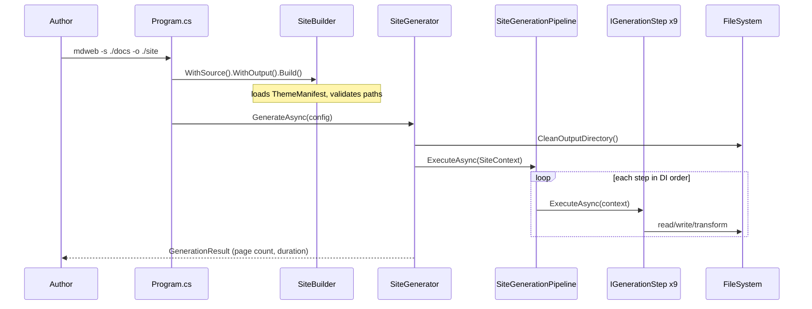
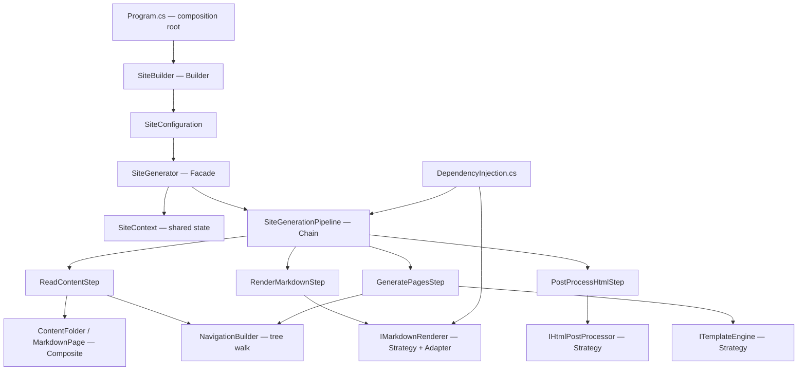

# MDWeb — Pipeline Architecture

MDWeb generates static sites from markdown folders. One CLI command hides a **composition** of patterns working together — not because the authors wanted pattern density, but because site generation naturally splits into configuration assembly, multi-step processing, tree-shaped content, and swappable rendering backends.

This chapter traces a full generation run from the author's keyboard through every pattern layer, explains why each class exists, and analyzes what breaks if you remove any one pattern.

## User-Facing Flow

An author maintaining documentation runs:

```bash
dotnet run --project MDWeb.Cli -- -s ./docs -o ./site -t ./themes/default --title "My Book"
```

From their perspective: markdown goes in, HTML comes out, navigation mirrors folder structure, syntax highlighting works, optional PDF export lands beside the site. Under the hood, `Program.cs` parses flags, `SiteBuilder` validates configuration, `SiteGenerator` orchestrates nine pipeline steps, and infrastructure adapters talk to Markdig, Scriban, and the filesystem.

**This book is built with MDWeb.** The `design-pattern-notes` repository you are reading is markdown processed by the same pipeline — a meta-example where `part05-combining/` becomes HTML via the patterns described here.

## End-to-End User Journey



**Step-by-step through the code:**

1. **`Program.Main`** parses `--source`, `--output`, `--theme`, etc. into a `CliOptions` object. It builds a generic host, registers `AddMDWebApplication()` and `AddMDWebInfrastructure(themeDir)`, resolves `ISiteBuilder`, and fluently configures it.

2. **`SiteBuilder.Build()`** is the gate. It throws if source, output, or theme is missing; resolves full paths; calls `IThemeManifestLoader.Load()` to read `theme.json`; resolves footer HTML via `SiteFooterResolver`. The output is an immutable-ready `SiteConfiguration` carrying everything downstream steps need.

3. **`SiteGenerator.GenerateAsync()`** creates `SiteContext { Configuration = config }`, optionally cleans the output directory, and awaits `pipeline.ExecuteAsync(context)`. On success it reads `context.AllPages.Count` and any `PdfOutputPath`.

4. **`SiteGenerationPipeline.ExecuteAsync()`** iterates `IEnumerable<IGenerationStep>` in registration order — no step knows its neighbors except through shared `SiteContext`.

5. Steps mutate `SiteContext` in sequence: build the composite tree, normalize links, render markdown to HTML, rewrite output links, post-process HTML, load Scriban templates, generate wrapped pages, copy assets, optionally export PDF.

The author sees one progress log line per step (`Running step: Read Content`, `Running step: Render Markdown`, …) and a final success message with page count.

## Pattern Map — Interactions, Not Isolation



The diagram's arrows show **data flow**, not just containment. `SiteConfiguration` (from Builder) flows into Facade, which creates `SiteContext`. The Chain reads/writes `SiteContext`. Composite structure in `ContentFolder` is built in step 1 and consumed in step 7 (`GeneratePagesStep` calls `NavigationBuilder.Build(context.Root, …)`). Strategy selection happens at DI registration time in `AddMDWebInfrastructure`, before any step runs.

## 1. Builder — Configuration Assembly

### Force

Site generation accepts many optional parameters: source/output paths, theme, title, description, PDF export mode, footer HTML or footer file, whether to fix markdown links on disk. A constructor with twelve parameters is brittle; a `SiteConfiguration` with a public setter invites half-initialized objects.

### Why Builder

`SiteBuilder` collects options fluently and validates atomically in `Build()`:

```csharp
public sealed class SiteBuilder(IThemeManifestLoader themeManifestLoader) : ISiteBuilder
{
    // private fields for each option…

    public ISiteBuilder WithSource(string sourceDirectory) { … return this; }
    public ISiteBuilder WithPdfExport(string? outputFilePath, bool pdfOnly = false) { … return this; }

    public SiteConfiguration Build()
    {
        if (string.IsNullOrWhiteSpace(_sourceDirectory))
            throw new InvalidOperationException("Source directory is required.");
        // …
        var themeManifest = themeManifestLoader.Load(themeDirectory);
        return new SiteConfiguration { … ThemeManifest = themeManifest, … };
    }
}
```

**Class-level detail:** `Build()` is the only place that touches `IThemeManifestLoader`. CLI code never loads themes directly — it calls `WithTheme()` and lets the builder resolve the manifest. That keeps theme parsing (filesystem layout, `PublishMode` enum) out of `Program.cs`. `SiteFooterResolver.Resolve()` merges inline footer HTML and footer file paths here, so pipeline steps receive a single `FooterHtml` string.

### Interaction with Facade and Chain

The Builder produces **`SiteConfiguration`**, which is **read-only input** to the entire pipeline. Steps never call back into the Builder. If you add a new CLI flag, you extend `ISiteBuilder`, `SiteBuilder`, and optionally a new step — you do not modify `SiteGenerator`.

### If we removed Builder

Without Builder, `Program.cs` would construct `SiteConfiguration` manually, duplicating validation and theme loading. Every new option spreads across CLI parsing **and** validation **and** any test that builds configs. The Builder centralizes "valid config" as a single concept.

## 2. Facade — SiteGenerator

### Force

Callers (CLI, watch service, tests) want "generate this site" — not "run ReadContent, then NormalizeMarkdownLinks, then …". The nine steps are an implementation detail.

### Why Facade

`SiteGenerator` implements `ISiteGenerator` with one meaningful method:

```csharp
public async Task<GenerationResult> GenerateAsync(SiteConfiguration configuration, …)
{
    outputWriter.SetOutputDirectory(configuration.OutputDirectory);
    // clean or create output directory based on PDF mode…
    var context = new SiteContext { Configuration = configuration };
    await pipeline.ExecuteAsync(context, cancellationToken);
    return GenerationResult.Ok(…, context.AllPages.Count, …, context.PdfOutputPath);
}
```

**Class-level detail:** The Facade owns **orchestration concerns** that no single step should own: output directory preparation (`CleanOutputDirectory` vs `CreateDirectory` depending on `PdfExportOptions`), stopwatch timing, exception-to-`GenerationResult.Fail` translation, and structured logging of page count. It injects `SiteGenerationPipeline`, `IOutputWriter`, and `ILogger<SiteGenerator>` — it does not inject individual steps.

### Interaction with Chain

The Facade creates `SiteContext` and delegates entirely to the pipeline. It never selects which renderer or template engine to use — that was decided at DI registration from `ThemeManifest.PublishMode`.

### If we removed Facade

CLI would call `SiteGenerationPipeline.ExecuteAsync` directly and duplicate output cleaning, error handling, and result packaging. Watch mode and tests would copy that logic. The Facade is the stable **application entry point** for "generate."

## 3. Composite — Content Tree

### Force

Documentation lives in nested folders. Sidebar navigation must mirror that hierarchy. Page discovery must find all `.md` files regardless of depth. The system should not maintain a separate `navigation.yaml` that drifts from the filesystem.

### Why Composite

```csharp
public abstract class ContentNode
{
    public required string Name { get; init; }
    public required string RelativePath { get; init; }
    public string? Title { get; set; }
    public int Order { get; set; }
}

public sealed class ContentFolder : ContentNode
{
    public List<ContentNode> Children { get; } = [];
}

public sealed class MarkdownPage : ContentNode
{
    public required string SourceFilePath { get; init; }
    public string RawMarkdown { get; set; } = string.Empty;
    public string HtmlContent { get; set; } = string.Empty;
    // …
}
```

**Class-level detail:** `ContentFolder` is the composite — it holds heterogeneous `ContentNode` children (folders or pages). `MarkdownPage` is the leaf — it carries mutable pipeline state (`RawMarkdown` → `HtmlContent`) as steps progress. Both share `Name`, `RelativePath`, `Title`, `Order` so navigation and sorting work uniformly.

`ReadContentStep` sets `context.Root` via `IContentReader.ReadAsync()` (infrastructure walks the filesystem) and calls `NavigationBuilder.CollectPages(context.Root, context.AllPages)` to flatten leaves into a list for steps that iterate all pages without tree recursion.

`NavigationBuilder.Build()` recursively maps the composite to `NavigationItem` — folders become group nodes (`Url = null`), pages become links (`Url = page.OutputRelativePath`). `GeneratePagesStep` calls this per page to highlight the active nav entry.

### Interaction with Chain

Composite structure is built in **step 1** and consumed in **step 7**. Intermediate steps (`RenderMarkdownStep`, `RewriteLinksStep`) iterate `context.AllPages` — the flat list — for efficiency. The tree shape matters for navigation, not for markdown rendering.

### If we removed Composite

You would maintain parallel structures: a file list **and** a nav config. Adding a folder would require updating two places. The composite makes **filesystem hierarchy the single source of truth** for structure.

## 4. Chain of Responsibility — Pipeline Steps

### Force

Generation has nine ordered stages with distinct responsibilities. Stages should be independently testable, registrable, and extendable (e.g., add a sitemap step) without editing the orchestrator.

### Why Chain

```csharp
public sealed class SiteGenerationPipeline(IEnumerable<IGenerationStep> steps, …)
{
    public async Task ExecuteAsync(SiteContext context, …)
    {
        foreach (var step in steps)
        {
            logger.LogInformation("Running step: {StepName}", step.Name);
            await step.ExecuteAsync(context, cancellationToken);
        }
    }
}
```

Each step implements `IGenerationStep` with `Name` and `ExecuteAsync(SiteContext, CancellationToken)`. Registration order in `DependencyInjection.AddMDWebApplication()` **is** execution order:

| Order | Class | Responsibility |
|-------|-------|----------------|
| 1 | `ReadContentStep` | Scan filesystem → composite tree, collect pages, detect home page |
| 2 | `NormalizeMarkdownLinksStep` | Fix `.md` link targets in source (optional disk write) |
| 3 | `RenderMarkdownStep` | Markdown → HTML via `IMarkdownRenderer` |
| 4 | `RewriteLinksStep` | `.md` → `.html` in rendered output |
| 5 | `PostProcessHtmlStep` | Publish-mode HTML transforms via `IHtmlPostProcessor` |
| 6 | `LoadThemeStep` | Load Scriban templates from theme directory |
| 7 | `GeneratePagesStep` | Wrap content in layout, write HTML files |
| 8 | `CopyAssetsStep` | Copy CSS, JS, fonts |
| 9 | `ExportPdfStep` | Optional Puppeteer PDF export |

**Class-level detail:** `SiteContext` is the **shared mutable accumulator**. `ReadContentStep` writes `Root` and `AllPages`. `RenderMarkdownStep` mutates each `MarkdownPage.HtmlContent`. `GeneratePagesStep` reads everything and writes via `IOutputWriter`. Steps communicate only through `SiteContext` — classic Chain shared-state variant (not the linked-list "handle or pass" variant, but the same force: sequential processing with single-responsibility handlers).

`SiteGenerationGuard.ShouldGenerateSite(context)` in `GeneratePagesStep` and other steps respects `PdfExportOptions.PdfOnly` — HTML generation skips when the user requested PDF-only export.

### Interaction with Strategy and Adapter

Individual steps **delegate variation** to injected strategies:

- `RenderMarkdownStep` loops pages, calls `markdownRenderer.Render(page.RawMarkdown)` — it does not know Markdig exists.
- `PostProcessHtmlStep` selects post-processor based on publish mode.
- `GeneratePagesStep` calls `templateEngine.RenderAsync(templateName, model)` — Scriban is hidden behind `ITemplateEngine`.

### If we removed Chain

All generation logic lands in `SiteGenerator` or one `GenerateEverything()` method — hundreds of lines, untestable in isolation, violating OCP. Adding a sitemap step means editing the monolith. The Chain makes **each stage a class you can unit test with a fake `SiteContext`**.

## 5. Strategy + Adapter — Rendering and Templating

### Force

Two publish modes exist: standard documentation sites and WeChat Official Account articles. They need different markdown pipelines (syntax highlighting vs inline styles), different HTML post-processing, and potentially different link behavior. Third-party libraries (Markdig, Scriban) must not leak into `MDWeb.Application`.

### Why Strategy

Core abstractions live in `MDWeb.Core`:

- `IMarkdownRenderer` — markdown string → HTML + heading list
- `IHtmlPostProcessor` — HTML string → transformed HTML
- `ITemplateEngine` — template name + model → final HTML

Infrastructure provides concrete strategies:

- `MarkdigMarkdownRenderer` — uses `MarkdownPipelineFactory.CreateSitePipeline()`, extracts headings for TOC
- `WeChatMarkdownRenderer` — alternate pipeline for paste-ready articles
- `PassThroughHtmlPostProcessor` vs `WeChatHtmlPostProcessor`
- `ScribanTemplateEngine` — wraps Scriban templating

**Adapter aspect:** `MarkdigMarkdownRenderer` adapts Markdig's `Markdown.Parse` / `Markdown.ToHtml` API to MDWeb's `MarkdownRenderResult`. Application code depends on `IMarkdownRenderer`, not on Markdig types.

### Why DI selects the strategy

```csharp
services.AddSingleton<IMarkdownRenderer>(sp =>
    manifest.PublishMode == PublishMode.WeChat
        ? sp.GetRequiredService<WeChatMarkdownRenderer>()
        : sp.GetRequiredService<MarkdigMarkdownRenderer>());
```

The composition root reads `ThemeManifest.PublishMode` **once at startup** and binds the correct renderer. Pipeline steps inject `IMarkdownRenderer` — they never branch on publish mode. This is **Strategy via DI** rather than runtime `switch`.

### Interaction with Builder and Chain

`SiteBuilder.Build()` loads `ThemeManifest` into `SiteConfiguration`. Infrastructure DI reads the same manifest when registering services. `RenderMarkdownStep` and `PostProcessHtmlStep` consume the bound strategy without knowing how it was chosen.

### If we removed Strategy/Adapter

`RenderMarkdownStep` would reference Markdig directly. Swapping WeChat mode requires `if (weChat)` branches in every step. Testing rendering means spinning up Markdig instead of injecting a fake `IMarkdownRenderer`. Third-party API changes ripple into application layer — violating DIP.

## 6. DIP — Layering

```
MDWeb.Core          → abstractions (IGenerationStep, IMarkdownRenderer), models (ContentNode, SiteContext)
MDWeb.Application   → pipeline steps, SiteGenerator, SiteBuilder, NavigationBuilder
MDWeb.Infrastructure → Markdig, Scriban, filesystem I/O, Puppeteer PDF
MDWeb.Cli           → composition root (Host + DI registration)
```

**Why this split matters for pattern composition:** Patterns live at different layers. Builder and Facade are application-layer coordination. Composite model is core. Adapters are infrastructure. The Chain interface is core; step implementations are application. This layering lets you test `RenderMarkdownStep` with a fake renderer defined in test code without referencing Infrastructure.

## Pattern Interaction Summary

| From | To | Handoff |
|------|-----|---------|
| Builder | Facade | `SiteConfiguration` |
| Facade | Chain | `SiteContext` with config |
| ReadContentStep | Composite | `context.Root`, `context.AllPages` |
| RenderMarkdownStep | Strategy | per-page `HtmlContent` |
| GeneratePagesStep | Composite + Strategy | nav from tree, layout from template |
| DI composition root | Strategy | binds renderer/post-processor at startup |

## Impact Analysis — Removing One Pattern

| Removed | Immediate effect | Downstream cascade |
|---------|------------------|-------------------|
| **Builder** | CLI constructs configs manually | Validation duplicated; theme loading scattered |
| **Facade** | CLI calls pipeline directly | Output prep and error handling duplicated in watch mode and tests |
| **Composite** | Flat file list only | Navigation config drifts from folders; no hierarchical TOC |
| **Chain** | Monolithic generator | OCP violated; cannot add/test steps independently |
| **Strategy** | Markdig types in Application | Publish mode becomes `if/else` in every step; tests couple to Markdig |
| **Adapter** | Same as Strategy removal | Third-party API leaks across layers |
| **DIP layers** | Core references Markdig | Cannot swap infrastructure or test application in isolation |

Removing **Chain** hurts most for day-to-day maintenance — it is the spine connecting all other patterns through `SiteContext`.

## Lessons

| Force | Pattern chosen | Key class |
|-------|----------------|-----------|
| Many optional config fields | Builder | `SiteBuilder` |
| Hide multi-step generation | Facade | `SiteGenerator` |
| Filesystem = navigation | Composite | `ContentFolder`, `MarkdownPage` |
| Independent generation stages | Chain of Responsibility | `SiteGenerationPipeline`, `IGenerationStep` |
| Multiple publish targets | Strategy | `IMarkdownRenderer`, `IHtmlPostProcessor` |
| Third-party markdown lib | Adapter | `MarkdigMarkdownRenderer` |
| Testable boundaries | DIP | four-project split |

## Next

[Spark Game Engine Layering →](03-spark-engine.md)
