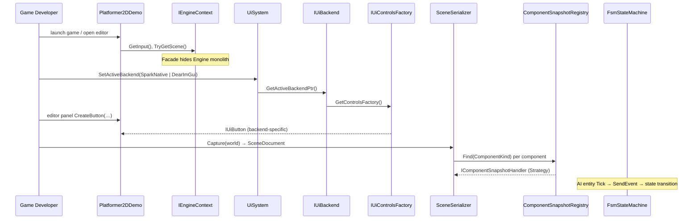
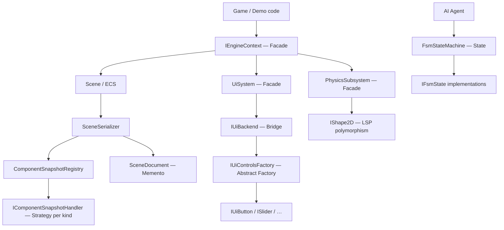

# Spark — Game Engine Layering

Spark is a C++ game engine with editor, physics, UI, audio, and scripting. Its architecture stacks patterns across subsystems because game engines face simultaneous forces: swap rendering/UI backends, serialize heterogeneous components, drive AI without `switch` explosion, and keep game code thin against a large runtime.

This chapter traces a developer's journey — boot a demo, swap UI backend, save a scene, watch AI patrol — through Spark's pattern layers.

## End-to-End User Journey



**What the developer experiences:**

1. **Boot:** Game code receives `IEngineContext&` — not a raw `Engine` pointer. Input, scene, audio, and framebuffer size come through small interface methods.

2. **Editor UI:** Developer or demo code calls `UiSystem::Get().SetActiveBackend(UiBackendKind::DearImGui)` and builds panels using `GetContext(frame).GetControlsFactory().CreateButton(…)`. Controls look and behave according to the active backend without `#ifdef IMGUI` in panel code.

3. **Save scene:** Editor invokes `SceneSerializer::Capture(world, ctx, includeFilter)` → `SceneDocument` (memento). Each component type is serialized by its registered handler. File writes go through `WriteToFile`.

4. **AI tick:** Enemy entities run `FsmStateMachine::Tick(timing, blackboard)`. Events like "player spotted" trigger transitions; current state's `OnEnter`/`OnExit` run polymorphically via `IFsmState`.

Each journey segment uses different patterns, but they share a theme: **stable abstractions at the boundary, pluggable implementations inside**.

## Layer Overview — Pattern Interactions



The vertical split matters: **game-facing facades** (`IEngineContext`, `UiSystem`) sit above **variation mechanisms** (Bridge, Abstract Factory, Strategy registry, State machine). Game code should depend on the top row; only engine internals touch the bottom row.

## Facade — IEngineContext and Subsystem Facades

### Force

The `Engine` class coordinates windowing, Vulkan presentation, ECS, audio, input, and optional ImGui. Game code that includes `Engine.hpp` and calls internal methods couples to everything and breaks when the engine refactors.

### Why Facade

`IEngineContext` exposes a minimal stable surface:

```cpp
class IEngineContext {
public:
    [[nodiscard]] virtual Window& GetWindow() = 0;
    [[nodiscard]] virtual IInput& GetInput() = 0;
    [[nodiscard]] virtual Scene* TryGetScene() noexcept = 0;
    [[nodiscard]] virtual SoundEngine* TryGetSoundEngine() noexcept = 0;
    virtual void GetFramebufferSize(int& outWidth, int& outHeight) const = 0;
    // …
};
```

**Class-level detail:** Methods return **small interface types** (`IInput&`, `Scene*`) rather than concrete classes — Interface Segregation applied inside the Facade. `TryGetScene()` returns nullable pointer because not every host binds an ECS scene (shell demos vs full games). `TryGetSoundEngine()` similarly optional.

`UiSystem`, `PhysicsSubsystem`, and `SoundEngine` are **nested facades** — each hides its subsystem's internal graph. `UiSystem::Get()` is the global entry for retained UI; games never touch `SparkUiBackend` or `DearImguiUiBackend` directly unless configuring backends.

### Interaction with Bridge

Game code calls `UiSystem` methods (`ProcessInput`, `Paint`, `GetContext`). `UiSystem` delegates to active `IUiBackend*`. The game never knows whether Spark native or ImGui renders the panel — Facade wraps Bridge.

### If we removed Facade

Every demo includes engine internals. Refactoring `Engine` breaks all games. Unit testing input handling requires constructing the full engine. The Facade is the **contract** between engine team and game team.

## Bridge + Abstract Factory — UI Stack

### Force

Spark ships two UI backends: **Spark native** (retained, game-styled controls) and **Dear ImGui** (immediate-mode, editor-friendly). Editor panels must create buttons, sliders, tree views, and dock workspaces. Control types are parallel across backends (every backend has *some* button) but implementations differ completely.

Two independent axes vary:

1. **Rendering/input backend** (Spark vs ImGui)
2. **Control product family** (button, slider, tree view, …)

### Why Bridge

`IUiBackend` separates the abstraction "UI toolkit" from implementations:

```cpp
class SparkUiBackend final : public IUiBackend {
    [[nodiscard]] UiBackendKind GetKind() const noexcept override;
    [[nodiscard]] IUiControlsFactory& GetControlsFactory() noexcept override;
    void ProcessInput(…);
    void Paint(…);
};
```

`UiSystem::SetActiveBackend(UiBackendKind kind)` swaps the active backend pointer. `ProcessInput` and `Paint` forward to `activeBackend` — classic Bridge structure: abstraction (`UiSystem` / `IUiBackend`) on one axis, implementation (`SparkUiBackend`, `DearImguiUiBackend`) on the other.

### Why Abstract Factory

`IUiControlsFactory` creates **families** of related controls for one backend:

```cpp
class IUiControlsFactory {
    virtual UniquePtr<IUiButton> CreateButton(const ButtonDesc& desc) = 0;
    virtual UniquePtr<ISlider> CreateSlider(const SliderDesc& desc) = 0;
    virtual UniquePtr<ITreeView> CreateTreeView(const TreeViewDesc& desc) = 0;
    // …
};
```

`SparkUiControlsFactory` returns Spark-native controls; `DearImguiControlsFactory` returns ImGui-backed controls. Editor code calls `GetControlsFactory().CreateButton(desc)` — it never mixes a Spark button with ImGui layout code.

**Class-level detail:** `ControlDesc` structs (e.g., `ButtonDesc`) carry layout and label data backend-agnostically. Each factory interprets descriptors into backend-specific widgets. `HierarchyPanel` and `InspectorPanel` depend on `IUiButton*`, not `SparkButton` or `ImGui::Button`.

### Interaction between Bridge and Factory

```
UiSystem.SetActiveBackend(DearImGui)
    → activeBackend = dearImguiBackend
    → GetContext(frame).GetControlsFactory()
        → dearImguiBackend.GetControlsFactory()
            → DearImguiControlsFactory.CreateTreeView(…)
```

Bridge selects **which factory family** is active. Abstract Factory ensures **all controls in one panel** come from the same family. Using Bridge without Factory would leave panel code choosing concrete control types. Using Factory without Bridge would require panel code to pick the factory manually on every call.

### If we removed Bridge

`#ifdef SPARK_UI_NATIVE` / `#elif IMGUI` scattered through editor panels. Adding a third backend (e.g., console UI) touches every panel file.

### If we removed Abstract Factory

Panel code calls `SparkUiBackend::CreateButton` or `ImguiControls::Button` directly — backend leakage. Mixing backends in one panel becomes possible and buggy.

## Memento + Strategy — Scene Save/Load

### Force

ECS scenes contain dozens of component kinds (`Transform`, `Mesh`, `RigidBody`, `Animator`, …). Save format must capture all present components and restore them on load. Adding a new component type must not require rewriting `SceneSerializer`.

### Why Memento

`SceneDocument` is the memento — a serializable snapshot detached from live `GameWorld` state:

```
SceneSerializer::Capture(world, ctx, includeEntity)
    → SceneDocument (entities, component records, hierarchy)
SceneSerializer::WriteToFile(document, path)
```

`SceneDeserializer::Apply(document, world, ctx)` restores into a live world. The live scene and saved document are independent representations — you can capture, edit the file, and apply later.

### Why Strategy (via registry)

Each component kind has an `IComponentSnapshotHandler`:

```cpp
class IComponentSnapshotHandler {
    [[nodiscard]] virtual ComponentKind GetKind() const noexcept = 0;
    [[nodiscard]] virtual bool TryCapture(const GameObject& owner, …, ComponentRecord& out) const = 0;
    [[nodiscard]] virtual bool TryRestore(GameObject& owner, const ComponentRecord& record, …) const = 0;
};
```

Handlers are **stateless strategy objects** — one strategy per component kind. `TransformSnapshotHandler` knows how to read/write transform data; `MeshSnapshotHandler` resolves asset paths via `SceneCaptureContext` callbacks.

`ComponentSnapshotRegistry` owns handlers and provides lookup:

```cpp
void Register(UniquePtr<IComponentSnapshotHandler> handler);
[[nodiscard]] const IComponentSnapshotHandler* Find(ComponentKind kind) const noexcept;
[[nodiscard]] static ComponentSnapshotRegistry& Default();
```

**Class-level detail:** `SceneSerializer` iterates entities, asks registry for handler by `ComponentKind`, calls `TryCapture`. Unknown kinds are skipped; new kinds register a handler without editing serializer code — **OCP via registry**.

`SceneCaptureContext` and `SceneApplyContext` carry optional hooks (mesh asset path resolution, deferred loading via `GameWorldAssetLoader`) so handlers stay stateless while still accessing engine services.

### Interaction

Memento defines **what** is stored (`SceneDocument`). Strategy defines **how** each component type converts between live ECS and records. Registry connects them at runtime. Without Memento, handlers would write directly to disk formats mixed with live object mutation. Without Strategy, `SceneSerializer` would contain a giant `switch(ComponentKind)`.

### If we removed Memento

Save/load directly mutates or reads live objects during capture — no undo, no inspect saved file before apply, no network replication of snapshots.

### If we removed Strategy registry

Every new component edits `SceneSerializer.cpp` — merge conflicts and regression risk grow with each component added.

## State — AI and Animation

### Force

AI behaviors (patrol → chase → attack) and animation states grow `if (state == Patrol) … else if (state == Chase)` blocks in `OnTick`. Transitions multiply; timing and entry/exit logic entangle.

### Why State

`FsmStateMachine` holds polymorphic states and a data-driven transition table:

```cpp
struct FsmTransition {
    std::uint32_t fromState = 0;
    std::uint32_t eventId = 0;
    std::uint32_t toState = 0;
};

class FsmStateMachine {
    void AddState(UniquePtr<IFsmState> state);
    void AddTransition(const FsmTransition& rule);
    bool SendEvent(std::uint32_t eventId, AiBlackboard& board);
    void Tick(const FrameTiming& timing, AiBlackboard& board);
};
```

**Class-level detail:** States implement `IFsmState` with `OnEnter`, `OnExit`, `OnTick`. The machine calls `EnterState_` on transitions — entry/exit logic lives in state objects, not in the machine. `AiBlackboard` shares data (last known player position, path waypoints) without states holding direct references to each other.

Transitions are `(fromState, eventId) → toState` triples — designers can data-drive AI graphs without recompiling. Animation FSMs reuse the same machinery for idle/walk/jump cycles.

### Interaction with Facade

Game AI code holds `FsmStateMachine` as a member; it calls `SendEvent` from collision callbacks and `Tick` from `GameObject::Update`. It does not interact with UI Bridge or scene serialization — State is an independent behavioral pattern for **modeful behavior**.

### If we removed State

One `EnemyAI::Update()` method accumulates modes, transition guards, and animation flags — untestable and fragile. Adding "flee" mode requires editing the central switch.

## Strategy — Physics and Colliders

### Force

2D physics supports multiple shape types (circle, box, polygon) with different bake and narrow-phase algorithms. Collision pair tests depend on both shapes.

### Why Strategy + Factory Method

- `ShapeFactory2D` — Factory Method creating `IShape2D` products from descriptors.
- `IColliderBakeStrategy2D` — Strategy per collider type in the bake pipeline (mesh → collision geometry).
- `NarrowPhase2D` — dispatch table over `(shapeA, shapeB)` pairs calling specialized overlap tests.

**Class-level detail:** Collision code uses `IShape2D&` polymorphically — **LSP**. Every shape honors overlap, raycast, and contact generation contracts so broad-phase code treats shapes uniformly.

### Interaction

Physics strategies are **lower-level** than AI State — they operate on data shapes, not entity behavior modes. Both are Strategy pattern but at different granularities. Shape strategies do not use a registry like component snapshots because shape count is small and fixed.

## Observer — ECS Signals

Components on one `GameObject` communicate via `EmitSignal` / `OnSignal` without direct references — entity-local Observer. A health component emits `Damaged`; UI and sound components subscribe. This avoids coupling `HealthComponent` to `HealthHud` and `SoundEngine`.

**Interaction with Facade:** HUD facades in demos (`HealthHud`) subscribe to signals and call `IEngineContext` for presentation — Observer decouples components; Facade decouples HUD from engine internals.

## Singleton — Coordinators

`UiSystem::Get()` and `RenderLayerRegistry::Instance()` provide process-wide coordinators. In C++ game loops, DI containers are less idiomatic than C# — Singleton (used carefully) gives global access to registries that must exist exactly once.

**Caution:** Singleton here is **coordinator access**, not "store all game state globally." Game state lives in ECS; Singletons own infrastructure registries.

## Cross-Language Adapter — ManagedGameBridge

`ManagedGameBridge` adapts C# script callbacks to native `Game` lifecycle — scripting layer without polluting engine core. This is **Adapter** across language boundaries: C# expects managed delegates; engine expects C function pointers or native vtables.

## Demo Facades — Platformer2DDemo

Tutorial demos wrap combat, HUD, and spawning behind small facades (`PlayerCombat`, `HealthHud`) — documented in headers as pattern examples. These are ** teaching facades** at game-logic granularity, distinct from engine-level `IEngineContext`.

## Impact Analysis

| Removed | Effect |
|---------|--------|
| **IEngineContext Facade** | Games couple to monolithic `Engine`; refactors break all demos |
| **Bridge (IUiBackend)** | Backend `#ifdef` in every editor panel; cannot swap UI at runtime |
| **Abstract Factory** | Mixed backend controls; panels know concrete widget classes |
| **Memento (SceneDocument)** | No inspectable save format; capture tied to live mutation |
| **Strategy registry** | Serializer monolith; each component type edit risks regressions |
| **State (FSM)** | AI/animation `switch` explosion in single Update method |
| **LSP on IShape2D** | Collision code type-checks shapes; new shapes break callers |

Removing **Bridge + Abstract Factory together** collapses the entire UI extensibility story — the strongest pattern combination in Spark's corpus.

## Lessons for Engine Authors

| Problem | Pattern stack | Anchor class |
|---------|---------------|--------------|
| Swap UI backends | Bridge + Abstract Factory | `UiSystem`, `IUiBackend`, `IUiControlsFactory` |
| Save arbitrary component sets | Memento + Strategy registry | `SceneSerializer`, `ComponentSnapshotRegistry` |
| AI behavior growth | State | `FsmStateMachine`, `IFsmState` |
| Keep game code thin | Facade | `IEngineContext` |
| Shape algorithm variation | Strategy + LSP | `IShape2D`, `ShapeFactory2D` |

## Next

[ImgKit Full-Stack CQRS →](04-imgkit-stack.md)
