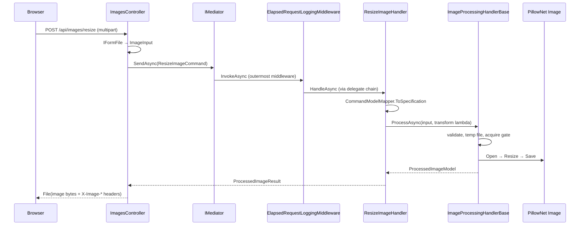
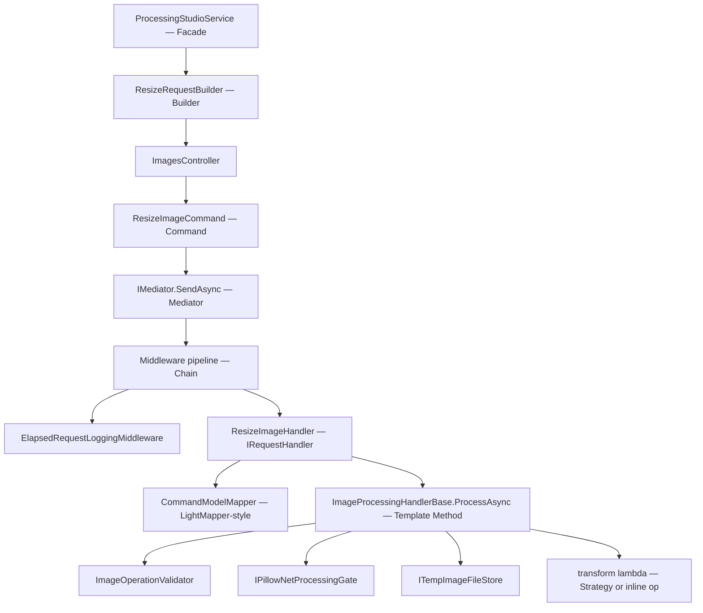

# ImgKit — Full-Stack CQRS

ImgKit is an image processing web API and studio UI. It combines **Command**, **Mediator**, **Chain**, **Template Method**, and **Strategy** across layers — not as a pattern checklist, but because HTTP image operations share identical I/O choreography while differing in pixel logic.

This chapter follows one resize request from browser click through middleware, handler shell, and PillowNet transform, and explains how LightMediator and LightMapper integrate at the boundaries.

## End-to-End User Journey

**API client path:**



**Studio UI path:** User picks operation in web studio → `ProcessingStudioService.ProcessAsync()` → `ImageProcessingApiClient` uses `IImageOperationRequestBuilder` (Builder) to assemble multipart form → same API endpoint → same mediator stack on server.

The user sees: upload image, set width/height, click Process, download result. The pattern stack ensures every operation gets logging, validation, temp-file hygiene, and native-library serialization — without duplicating that code in eleven handlers.

## Request Flow — Pattern Layers



Each layer solves one force. Removing any layer either duplicates code (Template Method removed) or couples HTTP to pixels (Mediator removed).

## Command + Mediator — Application Core

### Force

ImgKit exposes many endpoints (`/resize`, `/crop`, `/filter`, `/enhance`, …) with similar controller shape but different parameters and pixel operations. Controllers should not contain business logic. Cross-cutting concerns (logging, future auth/caching) should not require editing every handler.

### Why Command

Every operation is an immutable request record:

```csharp
public sealed record ApplyFilterCommand(ImageInput Input, string FilterName, string? Format)
    : IRequest<ProcessedImageResult>;
```

Commands carry **all input** needed for one use case. `ResizeImageCommand` includes `Image`, `Width`, `Height`, `Resampling`. Handlers receive a fully-formed intent — not seven loose parameters from controller method signatures.

**Class-level detail:** Records give value semantics and concise syntax. Commands live in `ImgKit.Contracts` — shared between API, Application, and tests without referencing handlers.

### Why Mediator

Controllers stay thin:

```csharp
var result = await mediator.SendAsync(new ResizeImageCommand { … }, cancellationToken);
return ToFileResult(result);
```

`IMediator.SendAsync` resolves `IRequestHandler<ResizeImageCommand, ProcessedImageResult>` from DI. The controller does not know `ResizeImageHandler` exists — **Dependency Inversion** between HTTP layer and application layer.

LightMediator's `Mediator.SendCore` builds a middleware onion:

```csharp
RequestHandlerDelegate<TResponse> next = ct => handler.HandleAsync(request, ct);
for (var i = middlewares.Length - 1; i >= 0; i--)
{
    var inner = next;
    next = ct => middlewares[i].InvokeAsync(request, inner, ct);
}
return await next(cancellationToken);
```

Handlers are the inner core; middleware wraps outward. Registration order determines wrap order.

### Interaction with Template Method

Mediator delivers the command to exactly one handler. Handler's `HandleAsync` is thin: map command → specification, call `ProcessAsync` with a transform. **Command identifies the use case; Template Method defines the processing shell; lambda/strategy defines the pixels.**

### If we removed Command

Controllers call `PillowNet.Image.Open` directly — untestable, no uniform request logging, fat controllers.

### If we removed Mediator

Controllers inject eleven handlers or a switch on operation name — controller knows all handlers; adding middleware means editing every controller action.

## Chain of Responsibility — Middleware

### Force

All image operations should log elapsed time. Future requirements may add validation middleware, rate limiting, or caching — without modifying `ResizeImageHandler`, `ApplyFilterHandler`, etc.

### Why Chain

```csharp
public sealed class ElapsedRequestLoggingMiddleware<TRequest, TResponse>(…)
    : IRequestMiddleware<TRequest, TResponse>
    where TRequest : IRequest<TResponse>
{
    public async Task<TResponse> InvokeAsync(
        TRequest request,
        RequestHandlerDelegate<TResponse> next,
        CancellationToken cancellationToken)
    {
        var sw = Stopwatch.StartNew();
        try { return await next(cancellationToken); }
        finally
        {
            logger.LogInformation("Handled {RequestType} in {ElapsedMs}ms", …);
        }
    }
}
```

Generic middleware applies to **all** `IRequest<TResponse>` pairs — one registration covers resize, crop, filter, and info query.

### Interaction with Mediator

Mediator constructs the delegate chain at dispatch time from `GetServices<IRequestMiddleware<TRequest,TResponse>>()`. Middleware and handler share the same generic type parameters — logging middleware for `ResizeImageCommand` does not run for unrelated requests unless registered broadly.

### If we removed Chain

Copy logging `try/finally` into every handler — eleven copies, inconsistent log formats, missed handlers when adding new operations.

## Template Method — Processing Shell

### Force

Every handler that mutates pixels must: validate input, acquire exclusive access to native PillowNet (not thread-safe), write temp input file, run transform on background thread with timeout, read output bytes, delete temp files. Only the transform differs.

### Why Template Method

`ImageProcessingHandlerBase.ProcessAsync` defines the invariant algorithm:

```csharp
protected async Task<ProcessedImageModel> ProcessAsync(
    ImageInput input,
    Func<Image, Image> transform,
    string? outputFormat = null,
    CancellationToken cancellationToken = default)
{
    ImageOperationValidator.ValidateInput(input);
    using var processingScope = await processingGate.AcquireAsync(cancellationToken);
    using var timeoutSource = CreateTimeoutSource(cancellationToken);

    var inputPath = await tempFiles.WriteAsync(input.Data, input.FileName, …);
    var (outputPath, format, contentType) = ImageOutputHelper.ResolveOutput(…);

    try
    {
        return await Task.Run(
            () => ProcessOnBackgroundThread(inputPath, outputPath, format, contentType, transform),
            timeoutSource.Token);
    }
    finally
    {
        tempFiles.Delete(inputPath);
        tempFiles.Delete(outputPath);
    }
}
```

**Class-level detail:**

- `ImageOperationValidator.ValidateInput` — shared guard for empty data, oversized files.
- `IPillowNetProcessingGate.AcquireAsync` — serializes native library access across concurrent HTTP requests (SemaphoreSlim-style).
- `CreateTimeoutSource` — links caller cancellation with `MaxProcessingSeconds` timeout.
- `ProcessOnBackgroundThread` — opens image, applies `transform` delegate, saves, reads bytes into `ProcessedImageModel`.
- `finally` — temp cleanup even on exceptions.

Handlers supply only the **`transform` hook**:

```csharp
// ResizeImageHandler
var model = await ProcessAsync(
    request.Image,
    image => image.Resize((specification.Width, specification.Height), resampling),
    cancellationToken: cancellationToken);
```

`InspectAsync` is a sibling template for read-only info queries — same gate and temp file pattern, different background work.

### Interaction with Strategy

When transform logic is non-trivial and swappable (filters, enhancements, ops), handlers pass `image => strategy.Apply(image, options)` as the transform. Template Method owns **when** strategy runs; Strategy owns **what** pixels change.

### If we removed Template Method

Each of eleven handlers duplicates validate/gate/temp/timeout/cleanup — bugs in one not fixed in others (historically common in image services).

## Strategy — Pixel Operations

### Force

Filters (Blur, GaussianBlur, Sharpen, …), enhancements (Brightness, Contrast, …), and ops (Grayscale, Posterize, Flip, …) must be addable without new handler classes or controller endpoints.

### Why Strategy + Factory

Three strategy families with DI-registered factories:

| Factory | Interface | Example strategies |
|---------|-----------|-------------------|
| `ImageFilterStrategyFactory` | `IImageFilterStrategy` | `BlurFilterStrategy`, `GaussianBlurFilterStrategy` |
| `ImageEnhancementStrategyFactory` | `IImageEnhancementStrategy` | `BrightnessEnhancementStrategy`, `ContrastEnhancementStrategy` |
| `ImageOpsStrategyFactory` | `IImageOpsStrategy` | `GrayscaleOpsStrategy`, `PosterizeOpsStrategy` |

Factory builds dictionary at startup:

```csharp
public ImageFilterStrategyFactory(IEnumerable<IImageFilterStrategy> strategies) =>
    _strategies = strategies.ToDictionary(s => s.Name, StringComparer.OrdinalIgnoreCase);

public IImageFilterStrategy GetStrategy(string filterName) =>
    _strategies.TryGetValue(filterName, out var strategy)
        ? strategy
        : throw new ArgumentException($"Unsupported filter '{filterName}'.");
```

**Class-level detail:** `ApplyFilterHandler` resolves strategy by name from command, builds `FilterStrategyOptions` from radius/percent/threshold/size parameters, passes to `ProcessAsync`. Adding `SepiaFilterStrategy` means: implement `IImageFilterStrategy`, register in DI — **OCP**. No handler edit.

Named base classes (`NamedImageFilterStrategy`) centralize the `Name` property for dictionary keys.

### Interaction with Command and Template Method

```
ApplyFilterCommand.FilterName
    → ApplyFilterHandler.HandleAsync
        → filterFactory.GetStrategy(name)
            → ProcessAsync(input, image => strategy.Apply(image, options))
```

Command carries **which** filter; factory selects **how**; template method handles **infrastructure**.

### If we removed Strategy

`ApplyFilterHandler` becomes `switch(filterName)` with PillowNet calls — grows with every filter, untestable in isolation.

## Adapter + DIP — Infrastructure

### Force

Application must not depend on temp file paths, disk layout, or PillowNet threading constraints. API DTOs differ from handler domain models.

### Why abstractions

- `ITempImageFileStore` — write/delete temp files (Infrastructure implements with safe paths).
- `IPillowNetProcessingGate` — `PillowNetProcessingGate` serializes native access.
- `CommandModelMapper` — maps commands ↔ specifications ↔ contract results (LightMapper-generated or hand-maintained mapping surface).

**LightMapper integration:** `[LightMap]` attributes on DTOs generate `ILightMapper<T,T>` implementations. Handlers call `CommandModelMapper.ToSpecification<ResizeImageCommand, ResizeImageSpecification>(request)` — no property-copy loops in handler bodies.

### Interaction

Infrastructure Adapters sit **below** Template Method. Handlers depend on abstractions injected via constructor — classic DIP from Part 1.

## Facade — Web Studio

`ProcessingStudioService` orchestrates upload UI, operation catalog lookup, and API calls:

```csharp
public async Task<ProcessingResult> ProcessAsync(
    ImageUpload upload, string operationId, IReadOnlyDictionary<string, string> parameters, …)
{
    var operation = catalog.GetById(operationId);
    return await apiClient.ProcessAsync(operation, upload, parameters, …);
}
```

**Class-level detail:** UI view models depend on `IProcessingStudioService`, not `HttpClient` or multipart construction. `ImageProcessingApiClient` hides HTTP details; `ImageOperationCatalog` aggregates `IImageOperationRequestBuilder` descriptors for the operation picker.

## Builder — Request Builders

`ResizeRequestBuilder`, `CropRequestBuilder`, etc. implement `IImageOperationRequestBuilder`:

- Expose `Descriptor` (id, display name, API endpoint, parameter schema).
- `AppendParameters(MultipartFormDataContent, parameters)` adds form fields.

**Why Builder variant here:** Multipart requests have required field order and naming conventions per operation. Builders assemble correct form shape — parallel to `SiteBuilder` assembling site config, but for HTTP client layer.

## LightMediator + LightMapper — Cross-Library Integration

```
HTTP DTO --LightMapper/CommandModelMapper--> Specification --Command--> Handler
                                                      ↓
                                              Template Method → Strategy
```

- **LightMediator** provides `IMediator`, `IRequest<T>`, `IRequestHandler<,>`, `IRequestMiddleware<,>`, and notification publishing.
- **LightMapper** provides compile-time generated mappers — Adapter-like translation between API contracts and application models.

ImgKit is a **consumer** of both libraries. The pattern story is incomplete without noting: Mediator replaces hand-rolled handler dispatch; LightMapper replaces hand-rolled mapping — both reduce boilerplate that would obscure the Command + Template Method + Strategy structure.

## Pattern Decision Log

| Force | Choice | Key class |
|-------|--------|-----------|
| Many HTTP endpoints, shared flow | Command + Mediator | `ImagesController`, `IMediator` |
| Logging all requests | Middleware chain | `ElapsedRequestLoggingMiddleware` |
| Identical I/O, different pixels | Template Method + Strategy | `ImageProcessingHandlerBase`, `IImageFilterStrategy` |
| New filters without handler edits | Strategy factory | `ImageFilterStrategyFactory` |
| Complex multipart from UI | Request builders | `IImageOperationRequestBuilder` |
| Hide HTTP from studio UI | Facade | `ProcessingStudioService` |
| Native library thread safety | Adapter/Gate | `IPillowNetProcessingGate` |

## Impact Analysis

| Removed | Effect |
|---------|--------|
| **Command** | Fat controllers; no uniform request object for tests |
| **Mediator** | Controller injects all handlers; middleware impossible |
| **Middleware Chain** | Duplicated logging; cross-cutting features touch every handler |
| **Template Method** | Eleven copies of temp/gate/timeout/cleanup logic |
| **Strategy + Factory** | Giant switch in filter handler; OCP violated |
| **Facade (studio)** | View models construct HttpClient multipart manually |
| **Builder (request)** | Wrong form fields per operation; UI/API coupling |

Removing **Template Method** causes the most bugs in production — native resource leaks and race conditions on PillowNet.

## Next

[SkyUI Filter Editor →](05-skyui-filter-editor.md)
