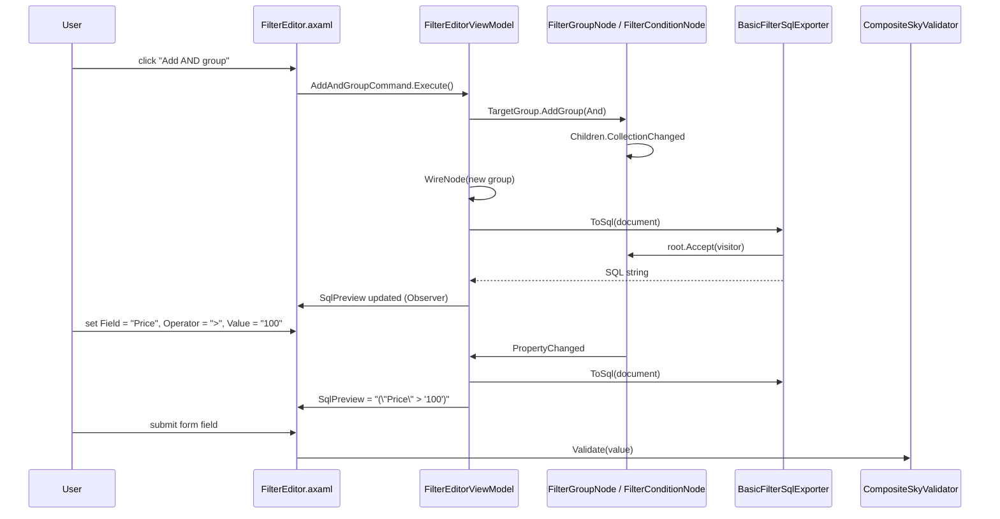
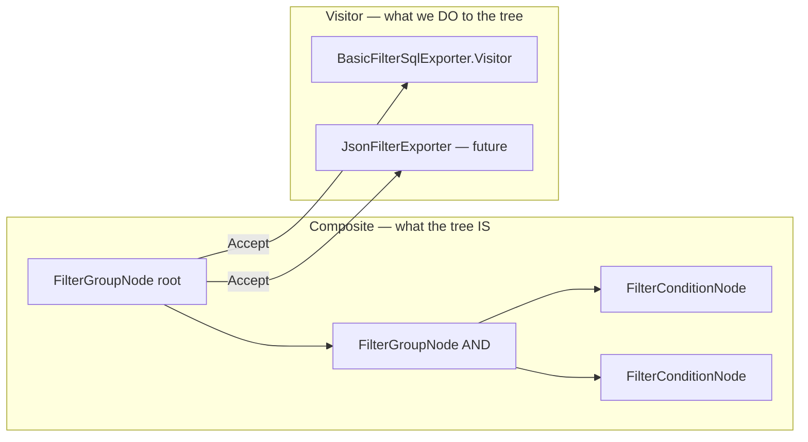
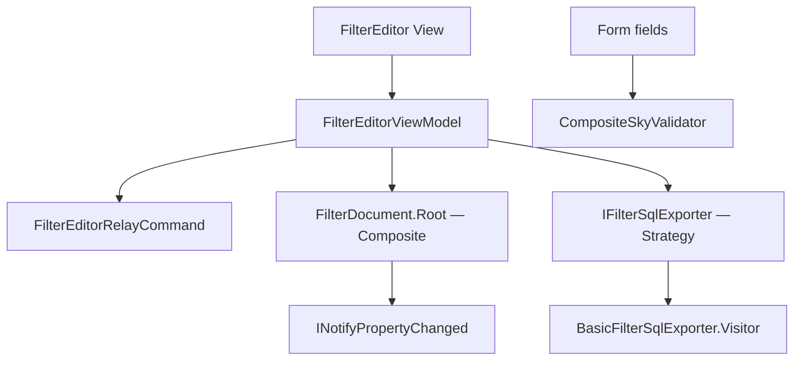

# SkyUI — Filter Editor (Composite + Visitor)

SkyUI's data-grid filter editor demonstrates how **Composite** and **Visitor** solve the same problem from two angles: **structure** vs **operations**. Users build nested AND/OR filter expressions; the UI edits them interactively, exports SQL, validates fields, and keeps Avalonia bindings synchronized — without one god class that knows everything.

This chapter traces a user building a filter, watching SQL update live, and explains why Composite and Visitor are inseparable here.

## End-to-End User Journey



**What the user experiences:**

1. Open filter editor on a data grid column set.
2. Click **Add condition** — a row appears with field picker, operator dropdown, value textbox.
3. Click **Add AND group** — a nested group container appears; conditions inside combine with AND.
4. **SQL preview** pane updates on every edit — no "Export" button needed.
5. Form fields elsewhere use validators (`Required`, `Range`) composed via `CompositeSkyValidator`.

Under the hood, the tree is a Composite; SQL generation is a Visitor; commands mutate the tree; Observer keeps UI in sync.

## Problem Forces

Users build nested filter expressions (AND/OR groups with field conditions). The UI must:

1. **Edit the tree interactively** — add/remove groups and conditions, select nodes.
2. **Export to SQL** (and potentially JSON, OData, etc.) — output formats change; node types should not.
3. **Validate nodes** — form fields use composable validation rules.
4. **Bind to MVVM views** — Avalonia bindings require `INotifyPropertyChanged`.

Force (1) suggests Composite. Force (2) suggests Visitor. Force (3) suggests Composite again (validator composition). Force (4) suggests Observer. These are **different forces on the same tree** — the chapter's central lesson.

## Composite — Expression Tree

### Force

Filter structure is inherently hierarchical: `(A AND B) OR (C AND (D OR E))`. Flat lists of conditions cannot represent precedence without lossy serialization.

### Why Composite

```csharp
public abstract class FilterNodeBase : INotifyPropertyChanged
{
    public FilterGroupNode? Parent { get; internal set; }
    public int Depth { get; }  // computed from parent chain
    public abstract ObservableCollection<FilterNodeBase> Children { get; }
    public abstract T Accept<T>(IFilterNodeVisitor<T> visitor);
    public void RemoveFromParent() { … }
}

public sealed class FilterGroupNode : FilterNodeBase
{
    public FilterLogicalKind LogicalKind { get; set; }  // And / Or
    public override ObservableCollection<FilterNodeBase> Children => _children;

    public FilterConditionNode AddCondition(string fieldPath, FilterCompareOperator op, string? valueText);
    public FilterGroupNode AddGroup(FilterLogicalKind kind);
}

public sealed class FilterConditionNode : FilterNodeBase
{
    public string FieldPath { get; set; }
    public FilterCompareOperator Operator { get; set; }
    public string? ValueText { get; set; }
    public override ObservableCollection<FilterNodeBase> Children => Empty;  // leaf
}
```

**Class-level detail:**

- **`FilterGroupNode`** is the composite — holds heterogeneous children (groups or conditions). `OnChildrenChanged` maintains parent pointers when children move between groups.
- **`FilterConditionNode`** is the leaf — `Children` returns empty collection so UI tree controls can bind uniformly without `if (is group)`.
- **`Accept<T>`** delegates to visitor — Composite provides structure; Visitor provides operations (see next section).
- **`Depth`** computed property supports indented UI rendering without separate view-model depth tracking.
- **`INotifyPropertyChanged`** on base — when `LogicalKind`, `FieldPath`, or `ValueText` changes, ViewModel refreshes SQL.

`FilterDocument` wraps root group + available field metadata:

```csharp
public sealed class FilterDocument
{
    public FilterGroupNode Root { get; }
    public ObservableCollection<FilterFieldDescriptor> Fields { get; }
}
```

### Interaction with ViewModel

`FilterEditorViewModel` wires the tree:

- Subscribes to `Children.CollectionChanged` on every group — new nodes get `PropertyChanged` handlers.
- `TargetGroup` property determines where Add commands insert nodes (selected group, parent of selected condition, or root).
- `RefreshSql()` called on any structural or property change.

The ViewModel **does not** contain SQL string building logic — it delegates to `IFilterSqlExporter`.

### If we removed Composite

Flat `List<FilterCondition>` with manual grouping flags loses precedence semantics. UI tree controls need special cases for "is this row a group header?" everywhere.

## Visitor — SQL Export

### Force

Multiple operations walk the same tree: SQL export today, JSON export tomorrow, "count conditions" analytics, validation passes. Adding operations by editing `FilterGroupNode` and `FilterConditionNode` violates Open/Closed Principle.

### Why Visitor

```csharp
public interface IFilterNodeVisitor<out T>
{
    T VisitGroup(FilterGroupNode node);
    T VisitCondition(FilterConditionNode node);
}
```

`BasicFilterSqlExporter` implements export via private nested visitor:

```csharp
public string ToSql(FilterDocument document) => document.Root.Accept(new Visitor());

private sealed class Visitor : IFilterNodeVisitor<string>
{
    public string VisitGroup(FilterGroupNode node)
    {
        if (node.Children.Count == 0) return "(1 = 1)";
        var sep = node.LogicalKind == FilterLogicalKind.And ? " AND " : " OR ";
        // parenthesize, join child.Accept(this) results
    }

    public string VisitCondition(FilterConditionNode node)
    {
        var col = QuoteIdentifier(node.FieldPath);
        return node.Operator switch
        {
            FilterCompareOperator.Equal => $"{col} = {SqlLiteral(node.ValueText)}",
            FilterCompareOperator.Contains => $"{col} LIKE '%' || {SqlLiteral(node.ValueText)} || '%'",
            FilterCompareOperator.IsNull => $"{col} IS NULL",
            // …
        };
    }
}
```

**Class-level detail:**

- **Double dispatch:** `node.Accept(visitor)` calls `visitor.VisitGroup(this)` or `VisitCondition(this)` — correct overload without `is` checks in exporter.
- **Empty group** returns `(1 = 1)` — valid SQL for "no constraints" instead of empty string breaking outer AND.
- **Operator switch** lives only in visitor — node classes stay data-only.
- **Dialect isolation:** `BasicFilterSqlExporter` uses double-quoted identifiers and `||` concatenation — a PostgreSQL-specific exporter implements same interface differently.

### Interaction with Composite

Composite **requires** uniform `Accept` on all nodes. Visitor **requires** stable node types. Together:

- New export format = new `IFilterNodeVisitor<string>` implementation (or new exporter class calling Accept).
- New node type (e.g., `FilterNotNode`) = add class + update **all** visitors — acceptable only when node types are stable (SkyUI's are).

`FilterEditorViewModel.SetSqlExporter(IFilterSqlExporter exporter)` swaps dialect at runtime — **Strategy on the exporter**, Visitor inside it.

### If we removed Visitor

```csharp
class FilterEditor {
    string ToSql(FilterNode node) {
        if (node is FilterGroupNode g) { /* recurse */ }
        else if (node is FilterConditionNode c) { /* emit */ }
    }
    string ToJson(FilterNode node) { /* duplicate structure walk */ }
}
```

Every new output format duplicates tree-walk and type-switch logic. Bug in SQL group parentheses does not fix JSON export.

## Composite + Visitor Interaction Diagram



**Structure is stable; operations vary.** This is the Gang of Four's intended Composite+Visitor collaboration.

## Command — UI Actions

### Force

XAML buttons ("Add group", "Remove", "Delete node") must not call code-behind methods that directly mutate UI-specific state. MVVM requires bindable `ICommand` objects.

### Why Command

```csharp
AddAndGroupCommand = new FilterEditorRelayCommand(() => AddGroup(FilterLogicalKind.And));
RemoveSelectedCommand = new FilterEditorRelayCommand(RemoveSelected, CanRemoveSelected);
RemoveNodeCommand = new FilterEditorNodeCommand(RemoveNode);
```

**Class-level detail:**

- `FilterEditorRelayCommand` — standard relay with `CanExecute` for remove (cannot delete root).
- `FilterEditorNodeCommand` — parameterized command carrying target node from tree view item template.
- Commands call ViewModel methods that mutate Composite tree — Command decouples **gesture** from **domain mutation**.

### Interaction

Command → ViewModel → Composite tree → CollectionChanged/PropertyChanged → Observer → View refresh + Visitor SQL refresh. Command does not call Visitor directly.

### If we removed Command

Code-behind in `FilterEditor.axaml.cs` — untestable, breaks MVVM binding conventions in SkyUI demos.

## Observer — Property Notifications

### Force

Avalonia bindings to `LogicalKind`, `FieldPath`, `ValueText`, `SqlPreview`, `SelectedNode` require change notification.

### Why Observer

`FilterNodeBase` implements `INotifyPropertyChanged`. `FilterEditorViewModel` implements it for `SqlPreview` and `SelectedNode`. ViewModel subscribes to:

- `node.PropertyChanged` — any condition edit triggers SQL refresh.
- `Children.CollectionChanged` — structural edits trigger SQL refresh and re-wiring.

**Class-level detail:** `WireFilterGroup` / `UnwireFilterGroup` prevent memory leaks when nodes are removed — handlers detach on removal. `Dispose()` on ViewModel unwires entire tree.

### Interaction with Visitor

Observer triggers **when** to re-export; Visitor defines **how** to export. Separation keeps SQL logic out of property setters.

## Strategy — SQL Dialect (Extension Point)

`IFilterSqlExporter` interface with `BasicFilterSqlExporter` default. Swapping exporter changes SQL dialect without touching UI tree or node classes:

```csharp
public void SetSqlExporter(IFilterSqlExporter exporter)
{
    _exporter = exporter;
    RefreshSql();
}
```

This is **Strategy** at the exporter level wrapping **Visitor** at the walk level — two patterns, two forces (dialect vs operation structure).

## Composite Validator — Form Fields

Separate from filter tree but same Composite pattern:

```csharp
public sealed class CompositeSkyValidator : ISkyValidator
{
    public SkyValidationResult Validate(object? value)
    {
        foreach (var validator in _validators)
        {
            var result = validator.Validate(value);
            if (!result.IsValid) return result;
        }
        return SkyValidationResult.Valid;
    }
}
```

`SkyValidators.Required()`, `SkyValidators.Range(min, max)` — Factory Method returning validator leaves composed in `new CompositeSkyValidator(required, range)`.

Filter editor **field pickers** and grid **form fields** share validation infrastructure. Filter **tree** uses Visitor; filter **form values** use Composite validator — same pattern name, different domain object.

## Architecture Diagram



## Why Not One Big Class?

Anti-pattern:

```csharp
class FilterEditor {
    string ToSql(FilterNode node) {
        if (node is FilterGroupNode g) { /* recurse */ }
        else if (node is FilterConditionNode c) { /* emit */ }
    }
    string ToJson(FilterNode node) { /* duplicate structure walk */ }
    void AddAndGroup() { /* UI + tree + sql */ }
}
```

Problems:

- SQL and JSON walks duplicate traversal logic — parenthesis bugs in one, fixed only in one.
- UI commands, validation, and export entangle — cannot unit test SQL without UI thread.
- New node type requires editing monolith class.

**Visitor** centralizes per-type **operations**. **Composite** centralizes **structure**. **Command** centralizes **gestures**. **Observer** centralizes **sync**.

## Tests

`CompositeSkyValidatorTests` verify validator composition order (first failure wins). Filter SQL tests build `FilterDocument` programmatically, call `BasicFilterSqlExporter.ToSql`, assert string — **no UI required**. Structure/operation separation enables unit tests:

```csharp
var doc = new FilterDocument(…);
doc.Root.AddCondition("Price", FilterCompareOperator.GreaterThan, "100");
var sql = new BasicFilterSqlExporter().ToSql(doc);
Assert.Contains("\"Price\" > '100'", sql);
```

## Impact Analysis

| Removed | Effect |
|---------|--------|
| **Composite** | Cannot represent nested AND/OR; UI hacks with indent levels |
| **Visitor** | Duplicated tree walks per export format; OCP violated |
| **Command** | Code-behind; untestable UI mutations |
| **Observer** | Manual view refresh; stale SQL preview |
| **Strategy (exporter)** | Dialect hard-coded in ViewModel |
| **Composite validator** | Monolithic validation functions per form |

Removing **Visitor** while keeping Composite hurts most when adding second output format — the exact scenario filter editors face in production (SQL + OData + Elasticsearch JSON).

## Lessons

| Force | Pattern | Key class |
|-------|---------|-----------|
| Nested boolean logic | Composite | `FilterGroupNode`, `FilterConditionNode` |
| Multiple tree operations | Visitor | `IFilterNodeVisitor<T>`, `BasicFilterSqlExporter` |
| MVVM button binding | Command | `FilterEditorRelayCommand` |
| Live UI sync | Observer | `INotifyPropertyChanged` on `FilterNodeBase` |
| SQL dialect variation | Strategy | `IFilterSqlExporter` |
| Composable field rules | Composite | `CompositeSkyValidator` |

## Next

[RainDB Query Engine →](06-raindb-engine.md)
