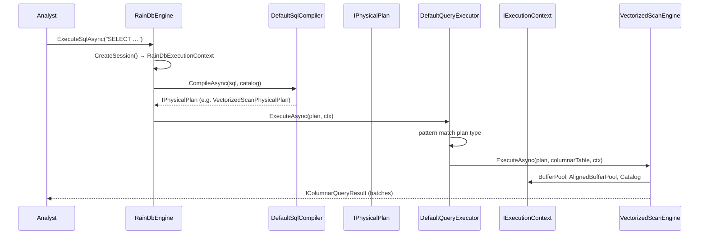
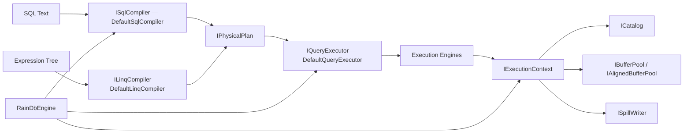

# RainDB — Query Engine Composition

RainDB is a columnar analytics database. Its architecture emphasizes **SOLID separation** and pragmatic pattern use over explicit GoF naming — yet the same forces appear: hide complexity behind a facade, compile separately from execute, dispatch algorithms by plan type, clone keys for hash tables, inject dependencies via context.

This chapter traces an analyst running SQL through RainDB, follows the compile/execute split, and explains when RainDB deliberately **does not** label a pattern.

## End-to-End User Journey



**What the analyst experiences:**

1. `RainDbEngine.CreateDefault()` or `OpenPersistent("./data")` — one call, no manual wiring of catalog, buffer pools, compilers, executor.
2. `await engine.ExecuteSqlAsync("SELECT sum(amount) FROM sales WHERE region = 'EU' GROUP BY product")`.
3. Results arrive as columnar batches — efficient for analytics, not row-by-row ORM objects.
4. Cancellation via `CancellationToken` propagates through `IExecutionContext`.

Under the hood: SQL text becomes logical plan becomes physical plan becomes engine-specific vectorized execution — each phase is a separate layer with explicit interfaces.

## Subsystem Map — How Layers Interact



**Compile path** never allocates query buffers. **Execute path** never parses SQL. **Facade** exposes both without leaking the graph. **Context** bundles per-query resources so engines don't construct their own catalog or pools.

## Facade — RainDbEngine

### Force

Embedding RainDB requires catalog, hybrid buffer pool, aligned SIMD buffers, SQL compiler, LINQ compiler, query executor, spill writer, and optional file database. Application code should not wire ten services manually or know construction order.

### Why Facade

```csharp
public sealed class RainDbEngine
{
    public static RainDbEngine CreateDefault() => CreateDefault(new InMemoryCatalog());
    public static RainDbEngine OpenPersistent(string directoryPath) { … }

    public IExecutionContext CreateSession(CancellationToken cancellationToken = default);
    public async ValueTask<IQueryResult> ExecuteSqlAsync(string sql, …);
    public async ValueTask<IQueryResult> ExecutePhysicalAsync(IPhysicalPlan plan, …);
}
```

**Class-level detail:**

- `CreateDefault()` constructs `HybridBufferPool` (implements both `IBufferPool` and `IAlignedBufferPool`), `DefaultQueryExecutor`, `DefaultSqlCompiler`, `DefaultLinqCompiler`, `NoOpSpillWriter.Instance`, and `InMemoryCatalog`.
- `OpenPersistent(path)` opens `RainDbFileDatabase`, uses its catalog, retains `FileDatabase` reference so GC does not collect backing store.
- `ExecuteSqlAsync` is the **convenience path**: `CreateSession` → `CompileAsync` → `ExecuteAsync` — three lines hiding the compile/execute boundary.
- `ExecutePhysicalAsync` bypasses SQL for tests and advanced callers that construct plans directly.

Constructor injection on `RainDbEngine` itself allows tests to substitute any collaborator — Facade does not hardcode `new` everywhere, factories do.

### Interaction with SRP split

Facade **coordinates** but does not compile or execute. `ExecuteSqlAsync` delegates to `SqlCompiler` and `Executor` — Facade is thin orchestration, not a god object containing parser code.

### If we removed Facade

Every sample and test repeats:

```csharp
var catalog = new InMemoryCatalog();
var buffers = new HybridBufferPool();
var executor = new DefaultQueryExecutor();
var sql = new DefaultSqlCompiler();
var ctx = new RainDbExecutionContext(catalog, buffers, buffers, NoOpSpillWriter.Instance, ct);
var plan = await sql.CompileAsync(…);
await executor.ExecuteAsync(plan, ctx);
```

Construction drift breaks samples when defaults change.

## SRP — Compile vs Execute

### Force

SQL parsing, name binding, logical planning, and physical planning change for different reasons than vectorized scan kernels, hash aggregation, and join probe/build logic. Mixing them prevents testing execution with handcrafted plans and prevents testing compilation without running kernels.

### Why strict split

| Layer | Project | Responsibility |
|-------|---------|----------------|
| Parse + bind + plan | `RainDB.Sql`, `RainDB.Linq` | Text/expression → `IPhysicalPlan` |
| Execute operators | `RainDB.Query` | `IPhysicalPlan` + `IExecutionContext` → `IQueryResult` |
| Storage + types | `RainDB.Core` | Catalog, column chunks, persistence |

`IQueryExecutor` documentation states execution-only scope — parsing lives elsewhere.

**Class-level detail:** `DefaultSqlCompiler.CompileAsync` runs lexer → parser → logical binders (`LogicalTableScanBinder`, `LogicalJoinBinder`) → physical plan builder producing `VectorizedScanPhysicalPlan`, `HashAggregatePhysicalPlan`, `JoinPhysicalPlan`, etc. Compiler reads `ICatalog` for schema but never allocates result batches.

`DefaultQueryExecutor.ExecuteAsync` receives ready physical plan — no SQL string, no re-parse on retry.

### Interaction with Facade and Context

```
ExecuteSqlAsync
    → SqlCompiler.CompileAsync(sql, Catalog)   // read-only catalog
    → Executor.ExecuteAsync(plan, session)     // session carries mutable pools
```

Catalog is shared; buffer pools are per-session via `IExecutionContext`.

### If we removed split

Optimizer experiments re-parse SQL on every execution iteration. Unit tests for hash aggregate require SQL strings instead of `HashAggregatePhysicalPlan` fixtures.

## Strategy-Like Dispatch — DefaultQueryExecutor

### Force

Each physical plan type runs a different algorithm: vectorized scan, hash aggregate, hash join, sort/top-N, grouped join (join then aggregate on ephemeral table). Execution code must route plan → engine.

### Why pattern-match dispatch (Strategy-like, not formal Strategy)

```csharp
public async ValueTask<IQueryResult> ExecuteAsync(IPhysicalPlan plan, IExecutionContext context)
{
    if (plan is VectorizedScanPhysicalPlan vs) { … return await VectorizedScanEngine.ExecuteAsync(vs, cols, context); }
    if (plan is HashAggregatePhysicalPlan ha) { … return await HashAggregateEngine.ExecuteAsync(ha, cols2, context); }
    if (plan is JoinPhysicalPlan join) { … return await JoinExecutionEngine.ExecuteAsync(…); }
    // SortTopNPhysicalPlan, JoinSortTopNPhysicalPlan, GroupedJoinPhysicalPlan …
}
```

Each `*Engine` class is a specialized algorithm — **Strategy object without shared `IExecutionStrategy` interface**.

**Class-level detail:**

- Executor resolves `IColumnarTableSource` from `context.Catalog` by table id — fail fast if table missing or not columnar.
- `GroupedJoinPhysicalPlan` runs join, wraps result in `EphemeralColumnarTableSource`, runs hash aggregate, disposes join result in `finally` — **composition of engines** inside executor for one plan type.
- Unknown plan returns `EmptyQueryResult(0)` — placeholder for future plan types.

### Why not formal Strategy interface (yet)

Forces satisfied today:

- Plan types are **closed set** (~7 variants), stable.
- Engines are static classes — no runtime plugin registration needed.
- Pattern-match is readable in one file for debugger stepping.

Forces that would trigger refactor to explicit Strategy + registry:

- Third-party pluggable operators (UDF aggregates, custom join algorithms).
- Plan nodes loaded from serialized plan files.

RainDB documents this as **pragmatic dispatch** — patterns are forces satisfied, not badges.

### Interaction with IExecutionContext

Every engine receives same `IExecutionContext` — swap spill writer or buffer pool without changing executor dispatch or engine signatures.

### If we removed dispatch layer

One `ExecuteEverything()` method with intertwined scan/join/agg logic — untestable, violates OCP when adding `SortTopNPhysicalPlan`.

## ISP — Interface Layering

### Force

Not every caller needs columnar batches or SIMD-aligned buffers. Catalog browsers need table metadata; vectorized kernels need aligned pools; persistence layer needs batch codec — different clients, different surface areas.

### Why layered interfaces

```csharp
ITableSource              // metadata only
IColumnarTableSource      // + columnar batches
IBufferPool               // general byte buffers
IAlignedBufferPool        // SIMD-aligned buffers (extends memory concerns)
```

**Class-level detail:** `VectorizedScanEngine` requests `IAlignedBufferPool` from context for SIMD kernels. Catalog listing in demos uses `ICatalog.TryGetTable` returning `ITableSource` — does not pull in columnar dependencies.

`HybridBufferPool` implements both pool interfaces — one object, multiple roles, but clients depend only on what they need.

### Interaction with DIP

`IExecutionContext` exposes all execution dependencies in one bundle for **operator convenience**, while interface segregation applies at **type definition** level — operators that only read catalog don't take `IAlignedBufferPool` as separate parameter if they don't need it; they simply don't use that property.

## DIP — IExecutionContext

### Force

Execution engines need catalog, memory pools, spill writer, cancellation — but should not `new InMemoryCatalog()` internally (tests couldn't substitute fakes).

### Why context bundle

```csharp
public interface IExecutionContext
{
    ICatalog Catalog { get; }
    IBufferPool BufferPool { get; }
    IAlignedBufferPool AlignedBufferPool { get; }
    ISpillWriter SpillWriter { get; }
    CancellationToken CancellationToken { get; }
}
```

`RainDbExecutionContext` is concrete implementation. `RainDbEngine.CreateSession()` manufactures one per query.

**Class-level detail:** Tests inject `NoOpSpillWriter.Instance` — **Null Object** singleton — so in-memory engines skip disk spill without null checks in every engine. Tests use `InMemoryCatalog` with preloaded `MemoryTable` data.

### Interaction with Facade

Facade creates session, passes to executor. Compiler does **not** receive context — compile phase has no spill/buffer needs. Clean phase separation.

### If we removed context bundle

Each engine method grows `(catalog, bufferPool, alignedPool, spill, ct)` parameter list — signature churn when adding tracing or memory limits.

## Prototype — Join Aggregation Keys

### Force

Hash aggregate and join build phases use composite keys mixing fixed-width numerics and UTF-8 string payloads. When merging partial aggregates or inserting into hash tables, keys must be **independent copies** — mutating one must not affect dictionary buckets.

### Why Prototype (DeepClone)

```csharp
public CompositeJoinKey DeepClone()
{
    var nums = (ulong[])NumericParts.Clone();
    byte[]?[] utf = new byte[Utf8Payloads.Length][];
    for (var i = 0; i < Utf8Payloads.Length; i++)
        utf[i] = Utf8Payloads[i] is { } u ? (byte[])u.Clone() : null;
    return new CompositeJoinKey(NullMask, nums, utf);
}
```

**Class-level detail:** `CompositeJoinKeyBuilder.Build` constructs keys from columnar batch rows — reads null bitmap, copies UTF-8 payload spans into owned byte arrays. `CompositeJoinKeyComparer` compares keys for sort-merge operations. `DeepClone` ensures hash table stability when keys are stored after batch memory is recycled.

This is Prototype in the **minimal GoF sense** — clone expensive composite state — not a public `IPrototype` interface.

### Interaction with execution engines

`HashAggregateEngine` and `JoinExecutionEngine` use keys internally — Prototype is a **value-object concern** inside execution, invisible to SQL caller.

### If we removed DeepClone

Subtle hash corruption when batch memory reused — keys share mutable byte[] backing arrays.

## Singleton — Null Object

```csharp
NoOpSpillWriter.Instance
```

In-memory default engines disable spill-to-disk without `if (spillWriter != null)` in every operator. **Singleton** for single shared no-op; **Null Object** for behavior.

## LSP — Query Results

`IColumnarQueryResult` and `IAggregateQueryResult` extend `IQueryResult`. Callers using only `RowCount` or `DisposeAsync` work with any result type — substitutability for generic result handling in tests and demos.

## What RainDB Teaches About Pattern Composition

Not every subsystem needs labeled patterns. RainDB prioritizes:

1. **Clear compile/execute boundary** (SRP) — stronger than any single GoF pattern here.
2. **Execution context bundle** (DIP) — operators depend on abstraction bundle, not concretes.
3. **Layered table/memory interfaces** (ISP) — clients take minimum surface.
4. **Pragmatic dispatch** over ceremony — Strategy-like without interface until plugins are a real force.

Patterns are **forces satisfied**. The Facade and Context bundle are the clearest pattern contributions; dispatch is Strategy **thinking** without Strategy **typing**.

## Comparison to Other Part 5 Systems

| Aspect | MDWeb | RainDB |
|--------|-------|--------|
| Pipeline | Explicit Chain (`IGenerationStep`) | Implicit compile → execute phases |
| Shared state | `SiteContext` mutable accumulator | `IExecutionContext` dependency bundle |
| Variation | Strategy via DI (renderer) | Pattern-match engines (plan type) |
| Extension | Register new DI step | Would need Strategy registry for plugins |

Both use Facade as entry point. MDWeb's Chain is explicit because stage count is high and order is user-visible. RainDB's phases are two stable gates — compiler and executor — so Chain would be over-engineering.

## Extension Roadmap (Pattern Opportunities)

| Future feature | Likely pattern | Why |
|----------------|----------------|-----|
| Pluggable storage backends | Strategy + Factory | Multiple `ITableSource` implementations |
| Query optimizer rules | Chain of Responsibility | Rule pipeline rewriting logical plan |
| Plan node plugins | Visitor over plan tree | Operations on stable plan IR |
| Custom aggregate functions | Strategy registry | Like Spark's `ComponentSnapshotRegistry` |

## Impact Analysis

| Removed | Effect |
|---------|--------|
| **RainDbEngine Facade** | Construction boilerplate; samples break on default changes |
| **Compile/execute split** | Cannot test engines with physical plans; optimizer coupled to I/O |
| **IExecutionContext** | Engine signatures explode; testing requires real file spill |
| **ISP on table interfaces** | Metadata callers link columnar/SIMD dependencies |
| **DeepClone on keys** | Intermittent wrong aggregate results — worst kind of bug |
| **NoOpSpillWriter** | Null checks or accidental disk spill in memory mode |

Removing **compile/execute split** causes the deepest architectural damage — harder to detect than a missing Facade but more expensive to fix later.

## Next

[Choosing Patterns for Real Problems →](07-choosing-patterns.md)
