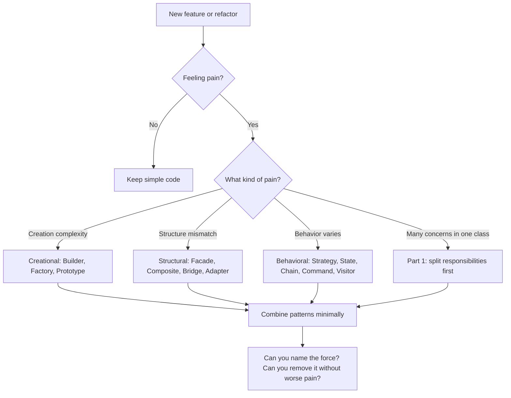

# Choosing Patterns for Real Problems

This final chapter synthesizes Parts 1–5 into a practical decision framework — grounded in the seven projects you can open locally. It explains **when to combine patterns**, **when one pattern hands off to another**, and **when not to apply a pattern at all**.

Design patterns are not goals. **Maintainable systems** are. The projects in this book show patterns emerging from variation that must not break existing code (OCP), boundaries that must stay testable (DIP, SRP), and structures that must support new operations (Visitor, Composite).

## Decision Flowchart



The flowchart ends with **review questions**, not automatic pattern selection. If you cannot name the force, you may be name-dropping.

## Symptom → Pattern Cheat Sheet

| Symptom | Consider | Example in corpus | Key class |
|---------|----------|-------------------|-----------|
| Telescoping constructors / many optional params | Builder | MDWeb CLI config | `SiteBuilder.Build()` |
| Families of related products | Abstract Factory | Spark UI controls | `IUiControlsFactory` |
| One product, many creators | Factory Method | Spark 2D shapes | `ShapeFactory2D` |
| Copy expensive mutable state | Prototype | RainDB join keys | `CompositeJoinKey.DeepClone()` |
| Global coordinator (use sparingly) | Singleton | Spark UI runtime | `UiSystem::Get()` |
| Third-party API mismatch | Adapter | MDWeb markdown | `MarkdigMarkdownRenderer` |
| Two independent variation axes | Bridge | Spark UI backend | `IUiBackend` |
| Tree structures in domain | Composite | MDWeb folders, SkyUI filters | `ContentFolder`, `FilterGroupNode` |
| Simplify subsystem entry | Facade | MDWeb, RainDB, ImgKit studio | `SiteGenerator`, `RainDbEngine` |
| Ordered processing stages | Chain of Responsibility | MDWeb pipeline, ImgKit middleware | `SiteGenerationPipeline`, `IRequestMiddleware` |
| Encapsulate user/HTTP actions | Command | ImgKit operations | `ResizeImageCommand` |
| Decouple request routing | Mediator | ImgKit + LightMediator | `IMediator.SendAsync` |
| Save/restore snapshots | Memento | Spark scenes | `SceneDocument` |
| Notify dependents of changes | Observer | SkyUI bindings, Spark signals | `INotifyPropertyChanged` |
| Behavior modes with transitions | State | Spark AI FSM | `FsmStateMachine` |
| Swappable algorithms | Strategy | ImgKit filters, MDWeb renderers | `IImageFilterStrategy`, `IMarkdownRenderer` |
| Fixed shell, variable step | Template Method | ImgKit processing | `ImageProcessingHandlerBase.ProcessAsync` |
| Operations on stable tree | Visitor | SkyUI SQL export | `IFilterNodeVisitor<T>` |
| DTO mapping boilerplate | Generated Adapter | LightMapper | `ILightMapper<TSource,TDest>` |

Use the cheat sheet as **hypothesis generator**, not checklist. RainDB's executor dispatch is Strategy-like but intentionally not `IExecutionStrategy` — symptom "swappable algorithms" applies only when algorithms are truly pluggable.

## How Patterns Combine — Interaction Patterns

Real systems repeat a few **composition recipes**. Recognizing the recipe helps you design without starting from zero.

### Recipe 1: Build → Facade → Chain → Strategy

**MDWeb** is the reference implementation:

```
SiteBuilder → SiteConfiguration
SiteGenerator (Facade) → SiteGenerationPipeline (Chain)
Each IGenerationStep → IMarkdownRenderer / ITemplateEngine (Strategy)
```

**Forces:** many config options, many ordered stages, swappable rendering.

**Handoff objects:** `SiteConfiguration` (immutable input), `SiteContext` (mutable pipeline state).

**If you skip a layer:** Builder skipped → validation scattered. Facade skipped → CLI duplicates orchestration. Chain skipped → monolithic generator. Strategy skipped → Markdig types in application layer.

### Recipe 2: Command → Mediator → Chain (middleware) → Template Method → Strategy

**ImgKit**:

```
ImagesController → ResizeImageCommand
IMediator → ElapsedRequestLoggingMiddleware → ResizeImageHandler
ImageProcessingHandlerBase.ProcessAsync → transform lambda or IImageFilterStrategy
```

**Forces:** many HTTP endpoints, cross-cutting logging, identical I/O with different pixels.

**Handoff objects:** Command records (input), `ProcessedImageModel` (output), `Func<Image,Image>` or strategy (variation point).

**LightMediator** supplies Mediator + middleware Chain infrastructure so ImgKit focuses on domain Template Method and Strategy.

### Recipe 3: Bridge → Abstract Factory

**Spark UI**:

```
UiSystem.SetActiveBackend → IUiBackend → IUiControlsFactory → IUiButton*, ISlider*, …
```

**Forces:** two variation axes — backend technology and control product family.

**Rule:** If only one axis varies, use Strategy alone. If **both** backend and product family vary together, Bridge + Abstract Factory prevents mixed concrete types.

### Recipe 4: Composite → Visitor (+ Observer for UI)

**SkyUI filter editor**:

```
FilterGroupNode tree (Composite)
BasicFilterSqlExporter visits via Accept (Visitor)
FilterEditorViewModel wires PropertyChanged (Observer)
```

**Forces:** stable tree structure, multiple operations on tree, live UI binding.

**Rule:** Composite without Visitor leads to duplicated tree walks. Visitor without Composite leads to `is` checks on non-uniform structure.

### Recipe 5: Memento → Strategy registry

**Spark scene serialization**:

```
SceneSerializer.Capture → SceneDocument (Memento)
Per component: ComponentSnapshotRegistry.Find(kind) → IComponentSnapshotHandler (Strategy)
```

**Forces:** heterogeneous parts in snapshot, extensible component types.

**Handoff object:** `SceneDocument` between capture and file I/O / restore.

### Recipe 6: Facade → SRP phases → Context bundle (DIP)

**RainDB**:

```
RainDbEngine.ExecuteSqlAsync
DefaultSqlCompiler → IPhysicalPlan
DefaultQueryExecutor → engines
IExecutionContext → catalog, pools, spill
```

**Forces:** compile vs execute change independently; operators need injected resources.

**Rule:** Not every system needs explicit Chain — two stable phases may suffice.

## Cross-Library Integration

### LightMediator + ImgKit

ImgKit is a **consumer** of LightMediator:

```
HTTP → Command → Mediator → Middleware → Handler → Template Method → Strategy
```

LightMediator provides:

| Capability | Pattern | Mechanism |
|------------|---------|-----------|
| Request dispatch | Mediator | `Mediator.SendCore` resolves handler |
| Request encapsulation | Command | `IRequest<TResponse>` records |
| Cross-cutting wrap | Chain | `IRequestMiddleware<,>` onion |
| Side-effect broadcast | Observer | `INotification` + `INotificationHandler` |

**Class-level detail:** `Mediator` caches compiled invokers per `(RequestType, ResponseType)` pair in `ConcurrentDictionary` — dispatch performance without hand-written switch on all command types.

Middleware registration in ImgKit DI:

```csharp
services.AddTransient(typeof(IRequestMiddleware<,>), typeof(ElapsedRequestLoggingMiddleware<,>));
```

One registration applies logging to all requests implementing `IRequest<T>`.

### LightMapper + ImgKit

```
API DTO / Command record --ILightMapper--> Specification / Result model
```

- **LightMapper** — source generator emits `ILightMapper<TSource,TDestination>` (Adapter-like mapping, DIP through interface).
- `[LightMap]` on DTOs triggers compile-time codegen — no reflection at runtime for mapped pairs.
- Handlers call `CommandModelMapper.ToSpecification<ResizeImageCommand, ResizeImageSpecification>(request)` — mapping stays out of `HandleAsync` body.

**Why codegen Adapter:** Hand-written mapping loops obscure Command + Template Method structure and drift when properties rename. Generated mappers fail at compile time when shapes mismatch.

### MDWeb — Self-Hosting

This ebook's markdown is processed by MDWeb:

- **Builder** — CLI assembles `SiteConfiguration`
- **Facade** — `SiteGenerator.GenerateAsync`
- **Chain** — nine `IGenerationStep` implementations
- **Composite** — folder navigation from `ContentFolder` tree

Reading Part 5 while browsing `site/part05-combining/*.html` is a live composition example.

### LightMapper + LightMediator Together

Full ImgKit vertical slice:

```
Browser multipart
  → ImagesController (HTTP Adapter)
  → ResizeImageCommand (Command)
  → IMediator (Mediator)
  → ElapsedRequestLoggingMiddleware (Chain)
  → ResizeImageHandler (Handler)
      → CommandModelMapper (LightMapper)
      → ImageProcessingHandlerBase (Template Method)
          → PillowNet resize (inline Strategy)
  → ProcessedImageResult (Command)
  → File HTTP response
```

Each library owns one concern. Removing LightMediator returns fat controllers; removing LightMapper returns property-copy noise in every handler.

## Anti-Patterns in Pattern Application

| Anti-pattern | Symptom | Fix | Corpus counter-example |
|--------------|---------|-----|------------------------|
| Pattern every class | Interfaces with one impl, no variation | YAGNI — wait for second force | RainDB executor dispatch without `IExecutionStrategy` |
| Singleton for all shared services | Global hidden state, untestable | DI singleton lifetime in C# | Spark uses Singleton only for C++ coordinators |
| God Mediator (all logic in one handler) | 500-line `HandleAsync` | SRP — split handlers per command | ImgKit: one handler per operation |
| Visitor on unstable structure | New node type weekly | Wait until node types stabilize | SkyUI filter nodes are stable AND/OR/condition |
| Abstract Factory for one product | Factory creates only buttons | Factory Method or `new` | Use Abstract Factory when **family** varies |
| Decorator chains without shared interface | Unrelated wrappers | Middleware/pipeline with common delegate | LightMediator `RequestHandlerDelegate` |
| Builder for two fields | `new Config(a, b)` suffices | Plain constructor | MDWeb Builder justified by 10+ optional fields |
| Strategy interface with one impl | Indirection without OCP benefit | Concrete class until second algorithm | Refactor when second filter family appears |

## Code Review Questions

Use these when reviewing PRs in any of the seven projects:

1. **Can I name the force this pattern solves?** — "We use Mediator" is insufficient. "Controllers must not reference eleven handlers" is sufficient.

2. **Can I remove the pattern without increasing complexity elsewhere?** — If removing `SiteBuilder` pushes validation into three callers, Builder earns its keep.

3. **Would a junior understand the pattern from the type names?** — `IGenerationStep`, `IFilterNodeVisitor`, `IImageFilterStrategy` are self-describing. `IHelper`, `IManager` are not.

4. **Do tests cover extension points?** — New MDWeb step: register in DI, test in isolation. New ImgKit filter: register strategy, factory resolves by name. New Spark component: register snapshot handler.

5. **Where does state hand off between patterns?** — `SiteContext`, `IExecutionContext`, `SceneDocument`, `FilterDocument` — if unclear, boundaries need documentation or refactoring.

6. **Are two patterns solving the same force?** — Redundant Facade inside Facade, or Strategy wrapping Strategy with no variation axis.

## Project Pattern Density Ranking

| Rank | Project | Why | Best study file |
|------|---------|-----|-----------------|
| 1 | Spark | Widest variety: UI Bridge+Factory, Memento+registry, State, physics Strategy, ECS Observer | `include/spark/ui/runtime/UiSystem.hpp` |
| 2 | ImgKit + LightMediator | Full application stack: Command through Strategy | `ImageProcessingHandlerBase.cs`, `Mediator.cs` |
| 3 | MDWeb | Clean pipeline + content tree; self-hosting book | `SiteGenerationPipeline.cs`, `NavigationBuilder.cs` |
| 4 | SkyUI | Composite + Visitor showcase; MVVM Command + Observer | `FilterNodeBase.cs`, `BasicFilterSqlExporter.cs` |
| 5 | RainDB | SOLID architecture; pragmatic over ceremonial | `RainDbEngine.cs`, `DefaultQueryExecutor.cs` |
| 6 | LightMapper | Focused codegen: generated Adapter, DI registration | `ILightMapper.cs`, generated mappers in consumer projects |
| 7 | LightMediator | Mediator + middleware + notifications infrastructure | `Mediator.cs`, `IRequestMiddleware.cs` |

Density rank ≠ importance. RainDB ranks lower on labeled pattern count but higher on **architectural lessons** about when not to add interfaces.

## Choosing Between Similar Patterns

### Facade vs Mediator

| | Facade | Mediator |
|---|--------|----------|
| **Intent** | Simplify one subsystem | Route many requests to colleagues |
| **Coupling** | Client → Facade → internals | Colleagues don't reference each other |
| **Example** | `SiteGenerator` hides pipeline | `IMediator` hides handler list from controller |

MDWeb uses Facade (one entry `GenerateAsync`). ImgKit uses Mediator (many commands, many handlers). A site generator could use Mediator for steps — MDWeb chose Chain instead because steps share `SiteContext` sequentially, not request/response dispatch.

### Strategy vs State

| | Strategy | State |
|---|----------|-------|
| **Intent** | Swap algorithm | Mode owns behavior; transitions explicit |
| **Who switches** | Client/config selects | Machine transitions on events |
| **Example** | `IImageFilterStrategy` selected by name | `FsmStateMachine.SendEvent` |

ImgKit filter is Strategy — handler picks algorithm once per request. Spark AI is State — entity stays in chase mode until event transitions to attack.

### Chain of Responsibility vs Mediator middleware

Both chain handlers. **Chain (MDWeb pipeline):** each step always runs in order; shared accumulator. **Middleware (ImgKit):** wraps one handler; optional short-circuit; onion delegation. Choose pipeline Chain for **batch stages**; choose middleware Chain for **request wrap**.

### Composite vs nested DTO lists

If UI renders hierarchy and operations recurse, use Composite with `Accept`. If JSON flattens to list with `parentId`, you will reinvent Composite poorly — consider proper tree model upfront (SkyUI lesson).

## Suggested Study Path

Work through in order — each step builds recognition of composition recipes:

1. **MDWeb pipeline** (`MDWeb.Application/Pipeline/`) — trace `SiteContext` through all nine steps. Identify where Composite ends and flat `AllPages` iteration begins.

2. **One ImgKit command end-to-end** — start at `ImagesController.Filter`, follow through middleware to `ApplyFilterHandler`, into `ImageFilterStrategyFactory.GetStrategy`. Time: one hour.

3. **Spark UI Bridge + Factory** — open `IUiControlsFactory.hpp`, `SparkUiControlsFactory`, `DearImguiControlsFactory`. Find one editor panel calling `CreateTreeView`.

4. **SkyUI filter tree** — build tree in demo, set breakpoint in `BasicFilterSqlExporter.Visitor.VisitGroup`, watch double dispatch.

5. **RainDB execute path** — run analytics demo SQL, breakpoint in `DefaultQueryExecutor.ExecuteAsync`, follow one plan type into engine.

6. **LightMediator source** — read `SendCore` middleware loop; compare to ASP.NET Core middleware (same force, different domain).

7. **LightMapper generated code** — inspect generated `ILightMapper` implementation in ImgKit build output; see compile-time mapping.

## Impact Analysis Template

When evaluating a proposed pattern in code review, fill this table:

| Pattern proposed | Force claimed | Classes affected | If removed instead? |
|------------------|---------------|------------------|---------------------|
| e.g. Builder | 12 optional CLI flags | `SiteBuilder`, `ISiteBuilder` | Validation in CLI + tests + watch service |

If "if removed" column is empty or mild, reject the pattern.

## Closing Principles

From the seven projects together:

1. **Variation** that must not break existing code → Strategy, Abstract Factory, registry (OCP).
2. **Boundaries** that must stay testable → DIP, Facade, interface layering (SRP, ISP).
3. **Structures** that need new operations → Visitor + Composite.
4. **Requests** that need routing and cross-cutting → Command + Mediator + middleware.
5. **Phases** that change independently → split compile/execute, read/transform/write (RainDB, MDWeb Chain).
6. **Ceremony** must earn its cost → RainDB dispatch, LightMapper codegen, Spark Singleton coordinators — each justified by a listed force.

Use this book as a map back to real code. When you face a design problem:

1. Name the pain (symptom table).
2. Pick a composition recipe (or YAGNI).
3. Open the matching chapter and read the corresponding source file in your local project copy.
4. Run the impact analysis — if removing the pattern hurts, it belongs.

Part 6 continues with **application architecture**: MVVM, Clean Architecture, and CQRS — how presentation, layering, and read/write separation work in SkyUI, Spark Studio, MDWeb, ImgKit, LightMediator, and RainDB.

## Next

[Part 6: Introduction to Application Architecture →](../part06-architecture/01-introduction.md)
