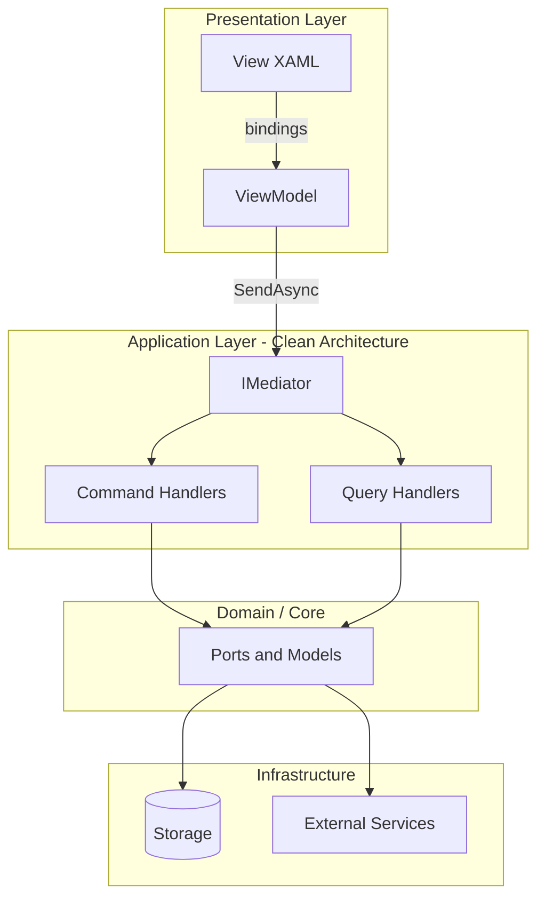

# Introduction to Application Architecture

Parts 1–5 of this book focused on **class-level** design: SOLID principles and GoF patterns that shape individual types and small collaborations. Part 6 steps up to **application architecture** — how entire systems organize layers, separate concerns across UI and backend, and route user intent through the codebase.

Three patterns dominate modern .NET and cross-platform application design:

| Pattern | Primary question | Best examples in this book |
|---------|------------------|----------------------------|
| **MVVM** | How does UI stay testable and decoupled from business logic? | SkyUI, Spark Studio |
| **Clean Architecture** | How do dependencies point inward toward stable domain code? | MDWeb, ImgKit, RainDB |
| **CQRS** | How do we separate reads from writes at the application boundary? | LightMediator, ImgKit, RainDB |

These are not competitors. A real product often uses **all three**:

**Spark Studio** (Avalonia editor for the Spark engine) illustrates this stack: `MainWindowViewModel` binds to XAML, calls `IMediator` for use cases, and depends on services registered at the composition root — MVVM on top of Clean Architecture with CQRS-style messaging via LightMediator.

## How Part 6 Relates to Earlier Parts

| Earlier concept | Application architecture connection |
|-----------------|-------------------------------------|
| **Command** (Part 4) | CQRS commands are application-level Command pattern |
| **Mediator** (Part 4) | CQRS dispatch hub — `IMediator.SendAsync` |
| **Observer** (Part 4) | MVVM `INotifyPropertyChanged` + CQRS `INotification` |
| **Facade** (Part 3) | Clean Architecture composition roots (`SiteGenerator`, `RainDbEngine`) |
| **DIP** (Part 1) | The dependency rule *is* Clean Architecture's core constraint |
| **Strategy** (Part 4) | Swappable renderers, image filters, SQL exporters at layer boundaries |

## What Is NOT Covered Here

- **Microservices** — these projects are in-process libraries and apps
- **Event sourcing** — CQRS here uses handlers and stores, not event logs
- **Full DDD** — no aggregate roots or bounded-context mapping exercises

The focus is **practical layering and messaging** you can open in your local repos today.

## Chapters in Part 6

1. [MVVM Fundamentals](02-mvvm-fundamentals.md) — Model, View, ViewModel roles and data binding
2. [MVVM in SkyUI](03-mvvm-skyui.md) — Filter editor, forms, row models in a control library
3. [MVVM at Application Scale](04-mvvm-spark-studio.md) — Spark Studio shell, DI, mediator integration
4. [Clean Architecture Fundamentals](05-clean-architecture.md) — Rings, dependency rule, ports and adapters
5. [Clean Architecture in Practice](06-clean-architecture-projects.md) — MDWeb, ImgKit, RainDB, Spark
6. [CQRS Fundamentals](07-cqrs-fundamentals.md) — Commands, queries, notifications, read/write separation
7. [CQRS with LightMediator and ImgKit](08-cqrs-practice.md) — End-to-end handler flows
8. [Storage-Layer CQRS in RainDB](09-cqrs-raindb.md) — Append vs execute without a mediator
9. [Combining MVVM, Clean Architecture, and CQRS](10-combining-architecture.md) — Full-stack recipe

## Next

[MVVM Fundamentals →](02-mvvm-fundamentals.md)
