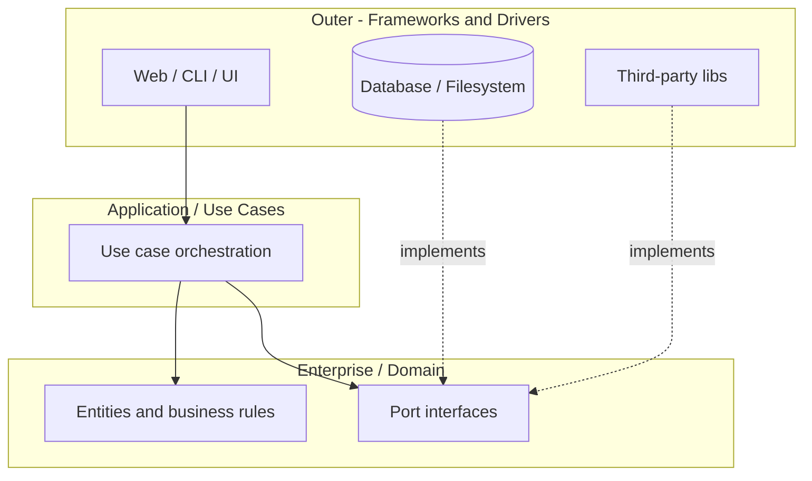

# Clean Architecture Fundamentals

**Clean Architecture** (Robert C. Martin) organizes code into **concentric rings** with a single rule: **source code dependencies point inward**. Inner rings know nothing about outer rings.

## The Problem It Solves

Applications rot when:

- Business rules import Entity Framework, HTTP, or UI frameworks
- Tests require databases and file systems for every case
- Swapping Markdig for another markdown engine rewrites use cases
- "Quick" `using` statements leak infrastructure into domain logic

Clean Architecture draws a boundary: **domain and use cases at the center**, **details at the edge**.

## The Dependency Rule



**Arrows are compile-time dependencies.** `MDWeb.Application` references `MDWeb.Core` interfaces — never Markdig types.

## Rings Explained

| Ring | Contains | Examples in MDWeb |
|------|----------|-------------------|
| **Entities** | Enterprise-wide business objects | `SiteConfiguration`, `MarkdownPage`, `ContentFolder` |
| **Use cases** | Application-specific rules | `SiteGenerator`, `RenderMarkdownStep`, pipeline |
| **Interface adapters** | Controllers, presenters, gateways | `MarkdigMarkdownRenderer` implements `IMarkdownRenderer` |
| **Frameworks & drivers** | DB, web framework, filesystem | Markdig, Scriban, PuppeteerSharp, `FileSystemContentReader` |

In practice, .NET projects often map to:

```
MyApp.Core           → entities + port interfaces (innermost)
MyApp.Application    → use cases
MyApp.Infrastructure → adapters
MyApp.Web / .Cli     → composition root + presentation
```

## Ports and Adapters (Hexagonal View)

Clean Architecture aligns with **Ports and Adapters** (Alistair Cockburn):

- **Port** — interface the application needs (`IContentReader`, `IQueryExecutor`)
- **Adapter** — technology-specific implementation (`FileSystemContentReader`, `DefaultQueryExecutor`)

The application shouts: *"I need content read from somewhere"* — not *"read files with `Directory.GetFiles`"*.

## Composition Root

Outer shell **wires** interfaces to implementations:

```csharp
services.AddMDWebApplication();
services.AddMDWebInfrastructure(themeDir);
```

Only `Program.cs` (or `DependencyInjection.cs` called from it) should choose `MarkdigMarkdownRenderer` vs `WeChatMarkdownRenderer`. Inner layers receive `IMarkdownRenderer` via constructor injection.

**RainDbEngine.CreateDefault()** is another composition root — factory method assembling catalog, pools, compilers, executor.

## What Belongs in Core vs Application vs Infrastructure

| Question | If yes → |
|----------|----------|
| Is it a business rule independent of UI/DB? | Core (entities) or Application (use case) |
| Is it an interface the use case needs? | Core abstractions |
| Does it call Markdig, SQL, HTTP, Avalonia? | Infrastructure or presentation |
| Does it orchestrate steps but not know Markdig? | Application |

### MDWeb Example

**Core** — `IGenerationStep`, `IMarkdownRenderer`, `ContentNode` tree models

**Application** — `SiteGenerationPipeline`, `RenderMarkdownStep` (calls `IMarkdownRenderer`, not Markdig)

**Infrastructure** — `MarkdigMarkdownRenderer`, `FileSystemContentReader`

**Cli** — parses args, builds `SiteConfiguration`, runs generator

## Sibling Layers Pattern

Strict Clean Architecture often makes **Application** and **Infrastructure** siblings:

```
Cli → Application → Core
Cli → Infrastructure → Core
```

Neither Application nor Infrastructure references the other. Both implement/use Core ports. Wiring happens in Cli.

MDWeb follows this exactly — `MDWeb.Infrastructure.csproj` references only `MDWeb.Core`, not `MDWeb.Application`.

## Pragmatic Variations in This Book's Projects

| Project | Variation |
|---------|-----------|
| **MDWeb** | Textbook four-project split |
| **ImgKit** | Abstractions inside `Application`; thin `Infrastructure` |
| **RainDB** | `Abstractions` ring + feature assemblies (`Query`, `Sql`, `Linq`) |
| **Spark (C++)** | `include/spark/` public API vs `src/spark/` implementations |
| **SkyUI** | Package layering (UI framework), not domain CA |

Not every repo needs four .csproj files. The **dependency rule** matters more than folder names.

## Clean Architecture vs Layered Architecture

| Layered (traditional) | Clean |
|-----------------------|-------|
| UI → Business → Data (top-down) | All depend inward on abstractions |
| Business often references Data | Business defines `IRepository`; Data implements |
| Database schema drives design | Use cases drive ports |

## Common Mistakes

| Mistake | Consequence |
|---------|-------------|
| Core references Infrastructure | Dependency rule broken; tests need DB |
| Anemic Core — only DTOs, logic in controllers | Use cases scattered in presentation |
| Interface on every class | Ceremony without variation points |
| God `Application` service | SRP violation inside the ring |

## Connection to SOLID (Part 1)

| Principle | Clean Architecture expression |
|-----------|------------------------------|
| **DIP** | The dependency rule *is* DIP at system scale |
| **SRP** | Each ring has one reason to change |
| **OCP** | New adapters, not edited use cases |
| **ISP** | Small port interfaces (`ITableSource` vs `IColumnarTableSource`) |

## Next

[Clean Architecture in Practice →](06-clean-architecture-projects.md)
