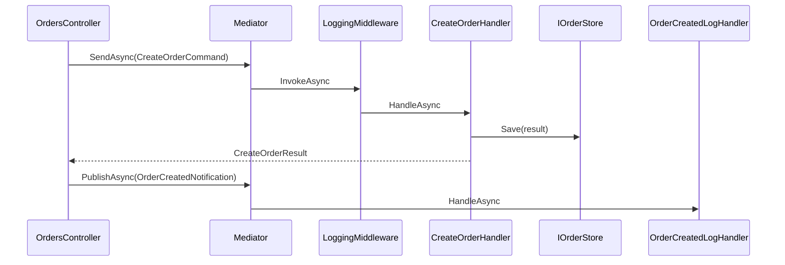

# CQRS with LightMediator and ImgKit

This chapter traces **complete request flows** through LightMediator's sample API and ImgKit's production image service — from HTTP/controller to handler and back.

---

## LightMediator Sample — Teaching CQRS End-to-End

The `lightmediator/samples/` solution is a minimal API demonstrating commands, queries, notifications, and middleware.

### Project Layers

| Project | Clean Architecture role |
|---------|------------------------|
| `LightMediator.Samples.Contracts` | DTOs: commands, queries, notifications, results |
| `LightMediator.Samples.Application` | Handlers, `IOrderStore` port, middleware |
| `LightMediator.Samples.Api` | Controllers, DI composition root |

Contracts have **no** handler logic. Application has **no** ASP.NET references.

### Write Side — CreateOrderCommand

**Contract:**

```csharp
public sealed record CreateOrderCommand(string ProductId, int Quantity) : IRequest<CreateOrderResult>;
public sealed record CreateOrderResult(int OrderId, string ProductId, int Quantity);
public sealed record OrderCreatedNotification(int OrderId, string ProductId, int Quantity) : INotification;
```

**Handler** (`CreateOrderHandler`):

```csharp
public sealed class CreateOrderHandler(ILogger<CreateOrderHandler> logger, IOrderStore orders)
    : IRequestHandler<CreateOrderCommand, CreateOrderResult>
{
    public Task<CreateOrderResult> HandleAsync(CreateOrderCommand request, CancellationToken cancellationToken)
    {
        var result = new CreateOrderResult(1, request.ProductId, request.Quantity);
        orders.Save(result);
        logger.LogInformation("Created order {OrderId}", result.OrderId);
        return Task.FromResult(result);
    }
}
```

**What the handler does:**

1. Constructs `CreateOrderResult` from command data
2. Persists via `IOrderStore` port (DIP — not `Dictionary` directly in handler if store is injected)
3. Logs creation
4. Returns result to mediator

**What it deliberately does NOT do:** send analytics, invalidate cache, email customer — those belong in notification handlers.

### Read Side — GetOrderSummaryQuery

**Contract** (XML comment: *"read-side query for CQRS-style GET flows"*):

```csharp
public sealed record GetOrderSummaryQuery(int OrderId) : IRequest<GetOrderSummaryResponse>;
public sealed record GetOrderSummaryResponse(bool Found, CreateOrderResult? Order);
```

**Handler** (`GetOrderSummaryHandler`):

```csharp
public Task<GetOrderSummaryResponse> HandleAsync(GetOrderSummaryQuery request, CancellationToken cancellationToken)
{
    var order = orders.Get(request.OrderId);
    return Task.FromResult(new GetOrderSummaryResponse(order != null, order));
}
```

**Read-only** — no `Save`, no notifications. Same `IOrderStore`, different handler, different message type.

### Unit Command — DeleteOrderCommand

```csharp
public sealed record DeleteOrderCommand(int OrderId) : IRequest;
```

Returns `Unit` — success is absence of exception. `DeleteOrderHandler` throws `KeyNotFoundException` if order missing.

### Notifications — Side Effects After Success

**Controller** publishes after command succeeds:

```csharp
var result = await mediator.SendAsync(command, cancellationToken);

await mediator.PublishAsync(
    new OrderCreatedNotification(result.OrderId, result.ProductId, result.Quantity),
    cancellationToken);
```

`OrderCreatedLogHandler` implements `INotificationHandler<OrderCreatedNotification>` — logs separately from create logic.

**Why publish from controller, not handler?** Sample choice — keeps handler pure. Alternative: handler publishes; controller stays thinner. Both valid; team should pick one convention.

### Middleware — ElapsedRequestLoggingMiddleware

Wraps every request:

```csharp
public async Task<TResponse> InvokeAsync(TRequest request, RequestHandlerDelegate<TResponse> next, CancellationToken ct)
{
    var sw = Stopwatch.StartNew();
    try { return await next(ct); }
    finally { logger.LogInformation("Handled {Request} in {Elapsed}ms", typeof(TRequest).Name, sw.ElapsedMilliseconds); }
}
```

Registered as open generic: `AddOpenRequestMiddleware(typeof(ElapsedRequestLoggingMiddleware<,>))`.

### Sequence — Create Order



### DI Registration

```csharp
builder.Services.AddSingleton<IOrderStore, InMemoryOrderStore>();
builder.Services.AddLightMediator(registration =>
{
    registration
        .RegisterHandlersFromAssemblies(typeof(CreateOrderHandler).Assembly)
        .AddOpenRequestMiddleware(typeof(ElapsedRequestLoggingMiddleware<,>))
        .Validate();
});
```

`.Validate()` fails fast if a command has no handler — catches wiring mistakes at startup.

---

## ImgKit — Production CQRS Consumer

ImgKit processes images via HTTP API using LightMediator for all use cases.

### Command Catalog

`ImageCommands.cs` defines nine **commands** (mutate or transform image) and one **query** (read metadata):

| Message | Type | Returns |
|---------|------|---------|
| `ResizeImageCommand` | Command | `ProcessedImageResult` |
| `CropImageCommand` | Command | `ProcessedImageResult` |
| `ApplyFilterCommand` | Command | `ProcessedImageResult` |
| … (6 more) | Command | `ProcessedImageResult` |
| **`GetImageInfoQuery`** | **Query** | **`ImageInfoResult`** |

Only `GetImageInfoQuery` is read-only — inspects dimensions/format without pixel mutation.

### Handler — ResizeImageHandler Walkthrough

```csharp
public sealed class ResizeImageHandler(...)
    : ImageProcessingHandlerBase(...), IRequestHandler<ResizeImageCommand, ProcessedImageResult>
{
    public async Task<ProcessedImageResult> HandleAsync(ResizeImageCommand request, CancellationToken ct)
    {
        var spec = CommandModelMapper.ToSpecification<ResizeImageCommand, ResizeImageSpecification>(request);
        var model = await ProcessAsync(request.Image, img => PillowNetResize(img, spec), request.OutputFormat, ct);
        return CommandModelMapper.ToContract(model);
    }
}
```

**Steps explained:**

1. **Map command → specification** — LightMapper-generated mapping; handler does not manually copy `Width`/`Height` fields
2. **ProcessAsync** (Template Method base) — validate, acquire `IPillowNetProcessingGate`, write temp file, run transform on background thread, read output, cleanup temps
3. **Transform lambda** — Strategy-specific resize via PillowNet
4. **Map model → contract result** — boundary DTO for API layer

### Query Handler — GetImageInfoHandler

```csharp
public async Task<ImageInfoResult> HandleAsync(GetImageInfoQuery request, CancellationToken ct)
{
    var model = await InspectAsync(request.Image, ct);
    return CommandModelMapper.ToContract(model);
}
```

No `ProcessAsync` transform — `InspectAsync` reads metadata only. **Query path is simpler** because no output image bytes are produced.

### Controller — Thin HTTP Adapter

```csharp
[HttpPost("resize")]
public async Task<IActionResult> Resize(IFormFile image, [FromForm] ResizeImageRequest request, ...)
{
    var input = await image.ToImageInputAsync(ct);
    var command = new ResizeImageCommand { Image = input, Width = request.Width, Height = request.Height, ... };
    var result = await mediator.SendAsync(command, ct);
    return ToFileResult(result);
}

[HttpPost("info")]
public async Task<ActionResult<ImageInfoApiResponse>> Info(IFormFile image, ...)
{
    var input = await image.ToImageInputAsync(ct);
    var result = await mediator.SendAsync(new GetImageInfoQuery(input), ct);
    return Ok(CommandModelMapper.ToResponse(result));
}
```

**Presentation** converts `IFormFile` → `ImageInput`. **Application** never references `IFormFile`.

### Why No Notifications in ImgKit?

Image processing is **stateless** — no domain events after resize. No order created, no cache to invalidate. CQRS here is **command/query handler separation**, not event-driven architecture.

### Three-Layer Model Mapping

`CommandModelMapper` bridges:

- **Contract** — API-stable records (`ResizeImageCommand`, `ProcessedImageResult`)
- **Domain specification** — `ResizeImageSpecification` with validated dimensions
- **Internal model** — `ProcessedImageModel` with byte arrays and content types

Queries skip specification when no transform parameters exist.

---

## Comparing Sample vs ImgKit

| Aspect | LightMediator sample | ImgKit |
|--------|---------------------|--------|
| Store | Shared `IOrderStore` | Stateless (no store) |
| Notifications | Yes | No |
| Commands vs queries | 2 commands + 1 query | 9 commands + 1 query |
| Middleware | Logging | Logging (same middleware type) |
| Mapping | Manual in handler | LightMapper `CommandModelMapper` |
| Presentation | REST JSON | Multipart file upload |

## Next

[Storage-Layer CQRS in RainDB →](09-cqrs-raindb.md)
