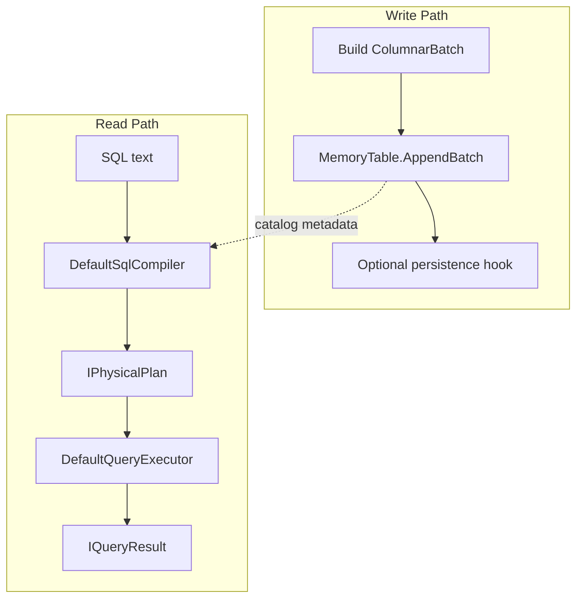

# Storage-Layer CQRS in RainDB

RainDB does not use `IMediator` or `IRequestHandler`. Instead, it applies **CQRS at the storage engine level**: **append-only writes** vs **compiled read queries**. Understanding this variant prevents the mistake of thinking CQRS requires a C# mediator library.

## The Problem at Database Layer

An embedded analytics engine must:

- **Ingest** columnar batches quickly (write path — append, minimal locking)
- **Analyze** with SQL or LINQ (read path — scan, aggregate, join — never mutates stored batches in place)
- Keep compile logic separate from execution (SRP, Part 1)

Mixing "parse SQL" and "append bytes to segment file" in one class creates the same entanglement CQRS solves at the application layer.

## Write Path — Commands Without a Mediator

### MemoryTable.AppendBatch

The write model is **columnar batches** — `IColumnarBatch` containing typed column chunks.

```csharp
// Conceptual write API
table.AppendBatch(batch);
catalog.Register(table);
```

`MemoryTable` appends batches to an in-memory segment list. Optional `IRainDbBatchPersistence.OnBatchAppended` hook serializes to disk — **side effect on write**, analogous to notification after command.

### Write Characteristics

| Property | Behavior |
|----------|----------|
| Mutability | Append-only; batches are not updated in place |
| Model | `IColumnarBatch`, `IColumnChunk` |
| Concurrency | Engine-specific; append is the narrow write surface |
| Persistence | `RainDbFileDatabase`, `RainDbBatchBinaryCodec` |

**No SQL UPDATE** in the pedagogical model — analytics workloads favor inserts and scans over row-by-row mutation.

### Analytics Demo Write Flow

From `RainDB.AnalyticsDemo`:

1. Build `ColumnarBatch` with event data
2. `table.AppendBatch(batch)`
3. `engine.Catalog.Register(table)`

Data is now visible to the read path via catalog metadata.

## Read Path — Queries Without Touching Write API

### Entry Point — RainDbEngine.ExecuteSqlAsync

```csharp
public async ValueTask<IQueryResult> ExecuteSqlAsync(string sql, CancellationToken ct = default)
{
    var plan = await SqlCompiler.CompileAsync(sql, Catalog, ct);
    return await Executor.ExecuteAsync(plan, CreateContext(ct));
}
```

**Two phases:**

1. **Compile** — `ISqlCompiler` parses SQL, binds to catalog schema, lowers to `IPhysicalPlan`
2. **Execute** — `IQueryExecutor` runs plan operators, returns `IQueryResult`

Read path never calls `AppendBatch`.

### LINQ Alternative

`ILinqCompiler` accepts expression trees — same physical plan output, different front-end. **ISP** — SQL users and LINQ users get separate compiler surfaces; both feed the same executor.

### DefaultQueryExecutor — Operator Dispatch

```csharp
public ValueTask<IQueryResult> ExecuteAsync(IPhysicalPlan plan, IExecutionContext context)
{
    return plan switch
    {
        VectorizedScanPhysicalPlan scan => _scanEngine.ExecuteAsync(scan, context),
        HashAggregatePhysicalPlan agg => _hashEngine.ExecuteAsync(agg, context),
        JoinPhysicalPlan join => _joinEngine.ExecuteAsync(join, context),
        // ...
    };
}
```

Each engine reads columnar data, produces `IColumnarQueryResult` or `IAggregateQueryResult`. **Read models** are projections — not the same objects as write batches.

### Read Result Hierarchy

```csharp
public interface IQueryResult : IAsyncDisposable
{
    long RowCount { get; }
}

public interface IColumnarQueryResult : IQueryResult
{
    IReadOnlyList<IColumnarBatch> Batches { get; }
}
```

Callers consuming only `RowCount` work with any result type (LSP, Part 1).

## CQRS Mapping — Application vs Storage

| CQRS concept | LightMediator (app) | RainDB (storage) |
|--------------|---------------------|------------------|
| Command | `CreateOrderCommand` | `AppendBatch` |
| Query | `GetOrderSummaryQuery` | `ExecuteSqlAsync` |
| Handler | `CreateOrderHandler` | `VectorizedScanEngine`, etc. |
| Bus | `IMediator` | `RainDbEngine` facade |
| Read model | `GetOrderSummaryResponse` | `IColumnarQueryResult` |
| Write model | `CreateOrderResult` in store | Stored `IColumnarBatch` segments |

## End-to-End — Write Then Read



1. **Write:** append events batch to `events` table
2. **Read:** `SELECT region, COUNT(*) FROM events GROUP BY region`
3. Compiler resolves `events` → `MemoryTable` metadata → scan plan
4. `HashAggregateEngine` reads batches, never writes back

Tests in `Phase1ReadPathTests` validate scan/filter/project over appended data.

## Why Not Mediator Inside RainDB?

RainDB is a **library**, not an HTTP API. Callers embed the engine:

```csharp
var engine = RainDbEngine.CreateDefault(catalog);
await engine.ExecuteSqlAsync("SELECT ...");
```

Message dispatch would add ceremony without HTTP controllers or UI ViewModels. The **facade + compiler + executor** split achieves the same separation of concerns.

## Prototype on Read Path

`CompositeJoinKey.DeepClone()` during hash aggregation (Part 2) — join keys copied when merging partial aggregates. Write path appends raw batches; read path allocates independent key copies during computation. Different lifecycles for write vs read data structures.

## Lessons for System Designers

| Lesson | Detail |
|--------|--------|
| CQRS is a **separation principle**, not a NuGet package | RainDB proves storage-level split |
| Read/write **asymmetry** is normal | Analytics: heavy reads, append-only writes |
| Compilers are **query** concern | Never mixed into `AppendBatch` |
| Facade unifies entry points | `RainDbEngine` without exposing every internal type |

## Next

[Combining MVVM, Clean Architecture, and CQRS →](10-combining-architecture.md)
