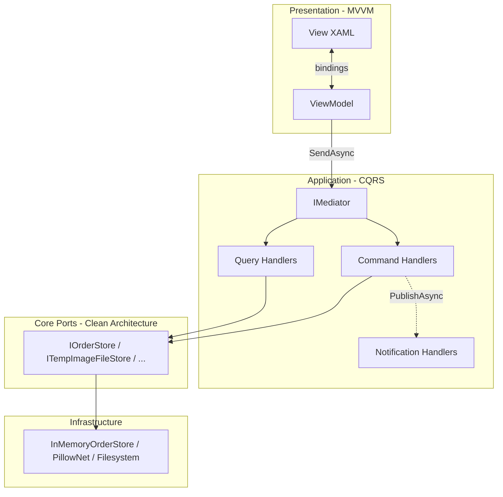

# Combining MVVM, Clean Architecture, and CQRS

Individual patterns are easier to learn in isolation. Production systems **stack** them. This chapter shows how MVVM (presentation), Clean Architecture (dependency rule), and CQRS (messaging) cooperate in **ImgKit**, **Spark Studio**, and **LightMediator samples** — and how they differ from **MDWeb** (pipeline, not CQRS) and **SkyUI** (MVVM without backend CQRS).

## The Full Stack Diagram



**Dependency rule:** arrows point inward. ViewModel does not reference `PillowNet` or `InMemoryOrderStore`.

---

## Recipe 1: ImgKit — REST API Stack

ImgKit has no MVVM (API only), but shows **Clean Architecture + CQRS** completely.

| Layer | Technology | Role |
|-------|------------|------|
| Presentation | `ImagesController` | HTTP → command/query |
| Application | Handlers, `ImageProcessingHandlerBase` | Use cases |
| Ports | `ITempImageFileStore`, strategy factories | Abstractions |
| Infrastructure | PillowNet gate, temp files | Adapters |

**Blazor Web studio** (`ImgKit.Web`) adds a thin UI that calls the API — could adopt MVVM in future; today it uses service classes.

### Request Journey — Resize Image

1. Browser POSTs multipart form to `/api/images/resize`
2. Controller builds `ResizeImageCommand` from form fields
3. `IMediator.SendAsync(command)` runs middleware → `ResizeImageHandler`
4. Handler uses Template Method base + filter/resize strategies
5. `ProcessedImageResult` returns to controller → `File()` response

**If we removed CQRS:** controller would inject `ResizeService`, `CropService`, … — constructor explosion. **If we removed Clean Architecture:** handler would call PillowNet directly — untestable without native runtime.

---

## Recipe 2: LightMediator Sample — API-Only CQRS

Minimal teaching stack:

```
OrdersController → IMediator → Handlers → IOrderStore
```

No MVVM. Ideal for learning command/query/notification before adding UI.

**Extension:** add Avalonia client with ViewModel calling same mediator via shared application layer — Spark Studio direction.

---

## Recipe 3: Spark Studio — MVVM + Services (+ Future CQRS)

Current state:

| Layer | Implementation |
|-------|----------------|
| View | `MainWindow.axaml` |
| ViewModel | `MainWindowViewModel` with `HierarchyNodes`, `SelectedEntityId` |
| Application | `HierarchyService`, `IMediator` injected |
| Engine | `ISparkEngineSession` adapter to native Spark |

ViewModel selection change triggers engine calls — presentation driving infrastructure through ports.

**Growth path:** replace fat async methods with:

```csharp
await _mediator.SendAsync(new SelectEntityCommand(entityId), ct);
await _mediator.SendAsync(new LoadHierarchyQuery(projectId), ct);
```

Handlers move logic out of ViewModel into testable application layer. ViewModel keeps bindable state only.

---

## Recipe 4: SkyUI — MVVM Without Backend CQRS

SkyUI demos are **presentation-only**:

- `FilterEditorViewModel` + `FilterDocument` model
- No `IMediator`, no separate API layer
- SQL export runs in-process via `IFilterSqlExporter`

**Appropriate scope:** control library shipped to apps that bring their own backend. MVVM keeps controls reusable; host app adds CQRS if needed.

### Hypothetical Integration

Host app ViewModel:

```csharp
public async Task ApplyFilterAsync()
{
    var sql = _filterViewModel.SqlPreview;
    var rows = await _mediator.SendAsync(new ExecuteReportQuery(sql), ct);
    ReportRows = new ObservableCollection<RowDto>(rows);
}
```

SkyUI control stays unchanged — host wires MVVM to CQRS at app boundary.

---

## Recipe 5: MDWeb — Clean Architecture Without CQRS or MVVM

MDWeb uses **pipeline** (Chain of Responsibility), not CQRS:

- Shared `SiteContext` mutated by sequential steps
- No `IRequest` per step
- CLI presentation, not MVVM

Still **Clean Architecture** — Core ports, Application use cases, Infrastructure adapters.

**Lesson:** not every app needs CQRS. Pipelines suit batch workflows with shared accumulation state.

---

## Recipe 6: RainDB — Storage CQRS Without MVVM or Mediator

Embeddable engine — consumers bring their own UI and application layer:

```csharp
table.AppendBatch(batch);           // write
await engine.ExecuteSqlAsync(sql);  // read
```

RainDB + ImgKit-style API could expose SQL analytics over HTTP; RainDB + Spark Studio could show query results in a grid ViewModel.

---

## Decision Matrix — Which Pattern Where?

| User-facing surface | Typical patterns |
|--------------------|------------------|
| Desktop UI (Avalonia) | MVVM + Clean Architecture + CQRS (optional) |
| REST API | Clean Architecture + CQRS |
| CLI batch tool | Clean Architecture + Pipeline |
| Embeddable library | Clean Architecture ports; CQRS at storage if engine |
| UI control library | MVVM inside controls; host adds rest |

## Anti-Pattern: MVVM ViewModel Calling Database Directly

```csharp
// Wrong — ViewModel bypasses application layer
public async Task SaveAsync()
{
    await _dbContext.Orders.AddAsync(...);
    await _dbContext.SaveChangesAsync();
}
```

**Right:**

```csharp
await _mediator.SendAsync(new CreateOrderCommand(...), ct);
```

ViewModel stays presentation logic; handler owns transaction and validation.

## Anti-Pattern: CQRS Commands That Return Views

```csharp
public sealed record GetDashboardQuery : IRequest<DashboardViewModel>;
```

Blurs query with presentation. Return DTOs; ViewModel maps to bindable properties.

## Testing the Combined Stack

| Layer | Test type |
|-------|-----------|
| Handler | Unit test with fake ports |
| ViewModel | Unit test with fake `IMediator` |
| Mediator wiring | Integration test — `Validate()` at startup |
| View | UI automation (sparse); prefer ViewModel tests |

## Part 6 Summary

| Pattern | Core idea | Primary projects |
|---------|-----------|----------------|
| **MVVM** | Bindable ViewModel separates UI from logic | SkyUI, Spark Studio |
| **Clean Architecture** | Dependencies point inward | MDWeb, ImgKit, RainDB, Spark |
| **CQRS** | Separate read and write concerns | LightMediator, ImgKit, RainDB (storage) |

Together they answer:

- **MVVM:** How does the user interact without logic in XAML?
- **Clean Architecture:** How do we swap databases and frameworks?
- **CQRS:** How do we keep reads and writes from entangling?

Study them in your local repos in this order: MDWeb (Clean Architecture) → LightMediator sample (CQRS) → ImgKit (both) → SkyUI FilterEditor (MVVM) → Spark Studio (combined direction) → RainDB (storage CQRS).

---

*End of Part 6 — Application Architecture.*

[← Back to Table of Contents](../index.md)
